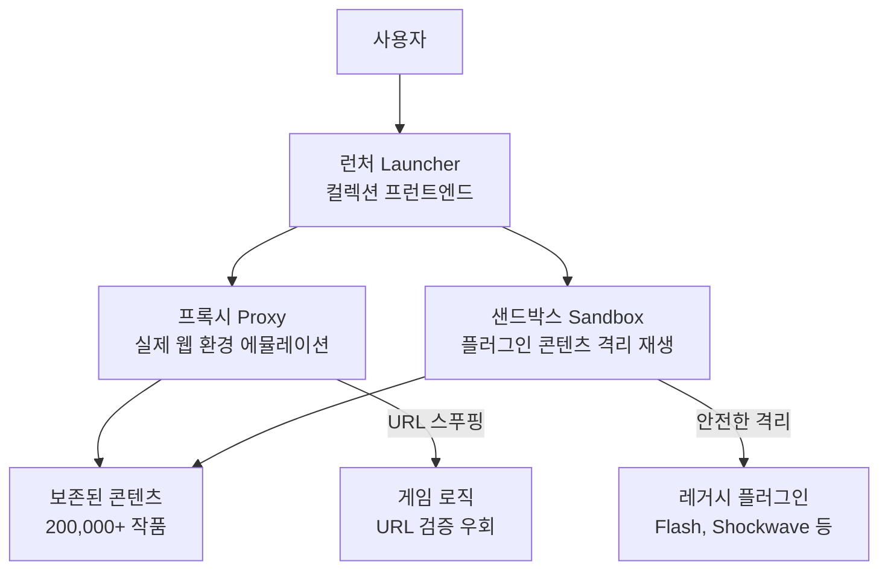
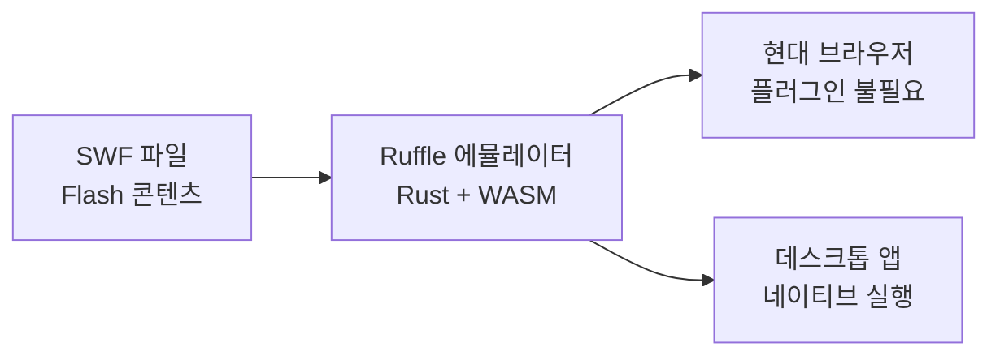

2020년 12월 31일, Adobe는 **Flash Player**에 대한 공식 지원을 종료했다. 이 날짜는 단순한 소프트웨어 하나의 종료가 아니었다. 1990년대 말부터 2010년대 초까지 인터넷 문화를 수놓았던 수십만 개의 웹 게임과 애니메이션이 함께 사라질 위기에 처했다. Newgrounds에서 즐기던 괴작 애니메이션, Miniclip에서 밤을 새웠던 플래시 게임들, Kongregate나 Armor Games의 무수한 명작들이 말이다. 그러나 이 콘텐츠들이 영원히 사라지지 않도록 수백 명의 자원봉사자가 수년 전부터 조용히 싸워왔고, 그 결과물이 **Flashpoint Archive**다.



---

## Flashpoint Archive란?

**Flashpoint Archive**는 웹에서 만들어진 게임과 애니메이션을 장기 보존하기 위한 **커뮤니티 기반 비영리 프로젝트**다. 인터넷 역사와 문화를 지키는 것이 목적이며, 빠르게 변화하는 웹 환경에서 “오늘 흔했던 것이 내일은 사라질 수 있다”는 문제 인식에서 출발했다.

프로젝트는 2017년 12월 26일 **BlueMaxima**라는 한 개인이 Flash 종료 이전에 웹 게임의 소멸을 막기 위해 시작했다. 이후 전 세계 수백 명의 커뮤니티 기여자가 참여하는 대규모 사업으로 성장했고, Flash뿐 아니라 수십 종의 인터넷 플러그인·프레임워크·웹 표준 기반 콘텐츠를 포괄하게 되었다. BlueMaxima는 2023년 1월 프로젝트에서 은퇴했으며, 현재는 커뮤니티가 독립적으로 운영 중이다.

---

## 보존 규모와 기술 범위

2026년 현재 Flashpoint Archive가 보존한 규모는 다음과 같다.

| 구분 | 수량 |
|------|------|
| 게임(Games) | 170,000개 이상 |
| 애니메이션(Animations) | 30,000개 이상 |
| 지원 브라우저·웹 기술 | 100종 이상 |
| 프로젝트 시작일 | 2017년 12월 26일 |
| 최신 릴리스 | Flashpoint 14 "Kingfisher" (2025-02-15) |

보존 대상은 Flash에 국한되지 않는다. Shockwave, Unity Web Player, Java Applet, Microsoft Silverlight, HTML5 게임 등 브라우저 플러그인 시대를 대표하는 거의 모든 기술을 망라한다.

---

## 왜 웹 게임 보존이 어렵고 중요한가

단순히 파일을 복사해 두면 되는 것처럼 보이지만, 웹 게임 보존은 훨씬 복잡하다. 대부분의 플래시 게임은 **특정 URL에서만 동작**하도록 제작되었다. 스폰서십 계약에 의해 특정 사이트에서만 게임이 실행되도록 URL 검증 로직이 삽입된 경우가 많기 때문이다. 대형 플래시 게임 사이트들은 독점권을 위해 게임 개발자에게 수백~수천 달러를 지불하고, 그 대가로 자신들의 로고나 URL을 SWF 파일에 고정시켰다.

또한 서버와 통신하는 멀티플레이어 게임이나 리더보드 기능이 있는 게임은 서버가 사라지면 완전히 동작하지 않는다. 이런 게임들을 “완전히” 복원하는 것은 지금도 진행 중인 도전이다. 그럼에도 20만 개가 넘는 작품을 한곳에서 탐색·재생할 수 있게 한 Flashpoint의 접근은 디지털 보존 사례 중에서도 손꼽힌다.

---

## Flashpoint 소프트웨어 아키텍처

Flashpoint는 위와 같은 문제를 해결하기 위해 **런처(Launcher)·프록시(Proxy)·샌드박스(Sandbox)** 세 가지 핵심 컴포넌트로 구성된 소프트웨어 패키지를 제공한다. 모든 구성 요소는 오픈소스로 공개되어 있다.

### 런처 (Launcher)

컬렉션 전체의 **프런트엔드** 역할을 한다. 사용자는 런처를 통해 17만 개 이상의 게임과 3만 개 이상의 애니메이션을 검색하고 실행할 수 있다. [GitHub에서 런처 소스코드](https://github.com/FlashpointProject/launcher)가 공개되어 있다.

### 프록시 (Proxy)

Flashpoint 보존의 **핵심**이라 할 수 있다. 게임이 실제 원래의 웹 서버에서 실행되는 것처럼 인식하도록 URL을 속인다. 덕분에 URL 기반 DRM이나 스폰서십 제한을 우회하여 로컬 환경에서도 게임이 정상 동작한다. [GitHub에서 FlashpointProxy 소스코드](https://github.com/FlashpointProject/FlashpointProxy)를 확인할 수 있다.

### 샌드박스 (Sandbox)

Flash, Shockwave 등 **레거시 플러그인** 콘텐츠를 안전하게 실행하기 위한 격리 환경이다. 게임이 닫히면 레지스트리 변경 사항이 자동으로 제거되며, 모든 큐레이션 파일은 최신 백신 소프트웨어를 통해 검증된다. [GitHub에서 Flashpoint Secure Tools 소스코드](https://github.com/FlashpointProject/FlashpointSecureTools)가 공개되어 있다.

---

## 지원 플랫폼과 기술

Flashpoint가 보존하는 기술 스펙트럼은 브라우저 플러그인의 역사 그 자체다.

| 기술 | 시대 | 특징 |
|------|------|------|
| Adobe Flash (SWF) | 1996~2020 | 웹 게임의 대명사, ActionScript 기반 |
| Shockwave | 1995~2019 | Director 기반 3D·멀티미디어 |
| Java Applet | 1995~2018 | JVM 기반, 범용 브라우저 실행 |
| Microsoft Silverlight | 2007~2021 | .NET 기반 RIA |
| Unity Web Player | 2010~2016 | 3D 웹 게임 |
| HTML5 Canvas | 2010~ | 현재 표준 |
| Macromedia Authorware | 1987~2007 | 교육용 멀티미디어 |

---

## Ruffle: Flash의 오픈소스 계승자

Flashpoint와 별개로, 플래시 게임을 **현대 환경**에서 재생하기 위한 또 다른 시도가 있다. [Ruffle](https://ruffle.rs/)이다. Ruffle은 **WebAssembly(WASM)** 기반의 오픈소스 Flash 에뮬레이터로, 브라우저 플러그인 없이도 SWF 파일을 실행할 수 있다.

ActionScript 2(AS2) 지원은 상당히 성숙했으며, ActionScript 3(AS3) 역시 대부분 지원된다. 한계도 있다. 멀티플레이어 게임이나 `amfphp` 기반 서버 통신이 필요한 게임은 여전히 제한적이다. 브라우저 환경에서는 직접 소켓 연결이 불가능하기 때문인데, [WebSockify](https://github.com/novnc/websockify) 프록시를 통한 WebSocket 에뮬레이션으로 일부 우회할 수 있다. F-Droid를 통해 안드로이드용 Ruffle 앱도 제공되어, 모바일에서도 과거 플래시 게임을 즐길 수 있다.

---

## 플래시 게임 생태계의 역사

1990년대 말 Macromedia(이후 Adobe가 인수)가 만든 Flash는 웹의 멀티미디어 표준이 되었다. 전성기에는 인터넷의 창의적 표현 수단이었다.

### 주요 플래시 플랫폼

- **Newgrounds** (1995~): Tom Fulp이 만든 성인·일반 애니메이션·게임 커뮤니티. "Pico's School", "Madness Combat" 같은 독창적 콘텐츠의 산실.
- **Miniclip** (2001~): 캐주얼 웹 게임의 대명사. "8 Ball Pool", "Raft Wars" 등.
- **Kongregate** (2006~): 인디 게임 개발자와 플레이어를 연결한 플랫폼. 배지 시스템으로 유명.
- **Armor Games** (2004~): 전략·RPG 장르 플래시 게임의 중심지.
- **Addicting Games**: Nickelodeon 계열의 캐주얼 게임 사이트.

이 플랫폼들은 스폰서십 모델로 운영되었다. 개발자가 게임을 만들면 사이트가 수백~수천 달러를 지불하고 독점적으로 배포하는 방식이었다. Adobe Flash는 단순한 기술이 아니라 하나의 **경제 생태계**였다.

### 플래시의 몰락

2010년 Steve Jobs는 [Thoughts on Flash](https://www.apple.com/hotnews/thoughts-on-flash/)를 발표하며 iPhone에서 Flash를 배제했다. 스마트폰 시대의 도래와 함께 HTML5·CSS3·JavaScript가 Flash의 역할을 대체하기 시작했고, 보안 취약점이 누적되면서 Flash의 입지는 좁아졌다. 2017년 Adobe는 2020년 말 Flash 지원 종료를 공식 발표했다.

---

## Flashpoint 14 "Kingfisher"

2025년 2월 15일, Flashpoint의 최신 버전인 **14.0 "Kingfisher"**가 출시되었다. 프로젝트는 2017년 첫 버전 이후 지속적으로 발전해왔다.

| 버전 | 코드명 | 출시일 |
|------|--------|--------|
| Flashpoint 1.0 | — | 2018년 초 |
| Flashpoint 8.0 | 301 | 2020-04-30 |
| Flashpoint 9.0 | Glorious Sunset | 2020-11-17 |
| Flashpoint 10 | Absence | 2021-05-10 |
| Flashpoint 11 | Oops, All Plugins! | 2022-08-20 |
| Flashpoint 12 | Axolotl | 2023-07-10 |
| Flashpoint 13 | Dart Frog | 2024-03-28 |
| **Flashpoint 14** | **Kingfisher** | **2025-02-15** |

---

## 운영 체제 지원

- **Windows**: 8.1 이상(기본 Windows 8 제외).
- **macOS**: 설치 추가 단계 필요, 일부 주요 기술만 지원.
- **Linux**: 설치 추가 단계 필요, 일부 주요 기술만 지원.

전체 컬렉션을 다운로드하지 않고도 [온라인으로 검색](https://flashpointproject.github.io/flashpoint-database/search/)할 수 있다.

---

## 보안 고려사항

레거시 플러그인을 다루는 프로젝트인 만큼 보안이 우려될 수 있다. Flashpoint 팀은 다음과 같이 설명한다.

- 애플리케이션 전체(Infinity의 게임 다운로드 기능 제외)는 **인터넷에 연결되지 않음**.
- Flashpoint Secure Player가 만든 **레지스트리 변경은 게임 종료 시 자동 삭제**.
- 모든 **신규 큐레이션은 최신 백신 소프트웨어로 검증**.
- 런처와 모든 내부 구성 요소는 **오픈소스**로 공개.

단, Avast·AVG 같은 일부 백신이 오탐지를 일으킬 수 있다.

---

## 참여 방법

Flashpoint Archive는 **커뮤니티 기여**로 운영된다.

### 게임 큐레이션

[큐레이션 튜토리얼](https://flashpointarchive.org/datahub/Curation_Tutorial)을 따라 큐레이터 오디션을 통과하면, 이후 원하는 만큼 게임을 보존에 기여할 수 있다.

### 보존 요청

[보존 요청 페이지](https://flashpointarchive.org/datahub/Requesting_Content_For_Archival)를 통해 특정 게임이나 애니메이션의 보존을 요청할 수 있다.

### Discord 참여

프로젝트의 대부분 소통은 [Discord 서버](https://flashpointarchive.org/discord)에서 이루어진다. 코딩, 테스트 등 다양한 방식으로 기여할 수 있다.

### 기부

Flashpoint Archive는 [Open Collective](https://opencollective.com/flashpointarchive)를 통해 재정 투명성을 유지하며 후원을 받고 있다.

---

## 디지털 보존의 의의

“그냥 유튜브에서 플레이 영상 보면 되지 않나?”라고 생각할 수 있다. 그러나 플래시 게임의 본질은 **인터랙션**에 있다. 스스로 조작하고, 선택하고, 실패하고, 다시 도전하는 경험은 영상으로 대체할 수 없다. SimCity나 Colonization 초기작처럼, 단순한 그래픽에도 불구하고 플레이성 자체가 뛰어났던 게임들은 더욱 그렇다.

HTML5가 Flash를 대체한다고 했지만, 실제로는 많은 Flash 게임이 그냥 사라졌다. 수익성 없는 콘텐츠를 HTML5로 이식할 이유가 없었고, 검색 품질 저하와 오래된 사이트의 폐쇄로 찾기도 점점 어려워졌다.

Flashpoint Archive는 단순히 파일을 모아 두는 것이 아니다. **특정 세대가 인터넷에서 경험한 창의적 표현과 문화를 기록하는 역사 사업**이다. 13살에 만든 Flash 애니메이션이 이 아카이브에 보존되어 있다는 사실을 발견하고 감격하는 사람들이 있다. 그것이 이 프로젝트의 진정한 가치다. 오늘날의 광고 범벅 모바일 게임과 달리, 플래시 게임 시대는 독립 개발자들이 순수한 창의성으로 만든 콘텐츠가 넘쳐났다. Flashpoint Archive는 그 시대의 인터넷이 얼마나 독특하고 풍요로웠는지를 미래 세대에 전달하는 창구다.

---

## 한눈에 보기

| 항목 | 내용 |
|------|------|
| **목적** | 웹 게임·애니메이션 장기 보존, 인터넷 문화·역사 보전 |
| **규모** | 게임 17만 개 이상, 애니메이션 3만 개 이상, 100종 이상 기술 |
| **핵심 구성** | 런처(프런트엔드), 프록시(URL 에뮬레이션), 샌드박스(격리 재생) |
| **시작** | 2017년 12월 BlueMaxima, 현재 커뮤니티 독립 운영 |
| **최신 버전** | Flashpoint 14 "Kingfisher" (2025-02-15) |
| **보완 도구** | Ruffle(WASM 기반 Flash 에뮬레이터) |

---

## 참고 문헌

1. Flashpoint Archive 공식 사이트. [https://flashpointarchive.org/](https://flashpointarchive.org/)
2. Flashpoint Database — 컬렉션 검색. [https://flashpointproject.github.io/flashpoint-database/search/](https://flashpointproject.github.io/flashpoint-database/search/)
3. Ruffle — 오픈소스 Flash 에뮬레이터. [https://ruffle.rs/](https://ruffle.rs/)
4. WIRED. "The Ragtag Squad That Saved 38,000 Flash Games From Internet Oblivion." [https://www.wired.com/story/flash-games-digital-preservation-flashpoint/](https://www.wired.com/story/flash-games-digital-preservation-flashpoint/)
5. GeekNews. "웹 게임과 애니메이션 20만여 개를 보존한 Flashpoint Archive." [https://news.hada.io/topic?id=26726](https://news.hada.io/topic?id=26726)
6. Open Collective — Flashpoint Archive 후원. [https://opencollective.com/flashpointarchive](https://opencollective.com/flashpointarchive)
