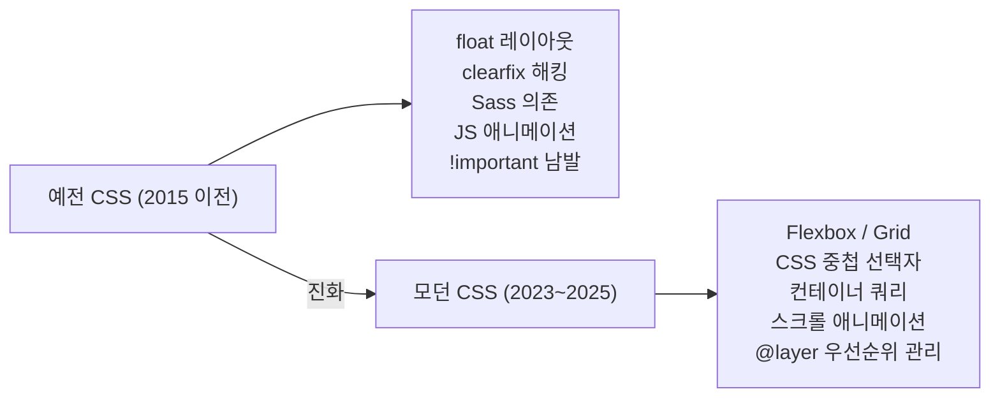
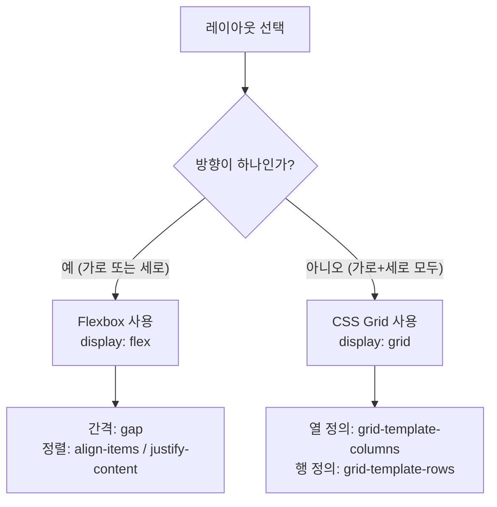
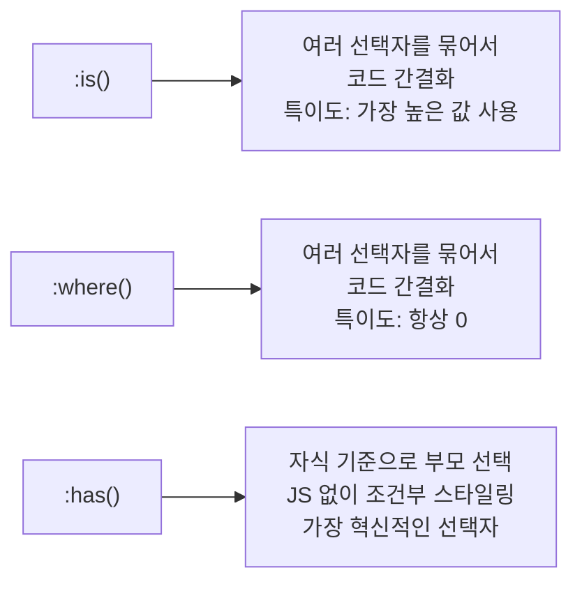
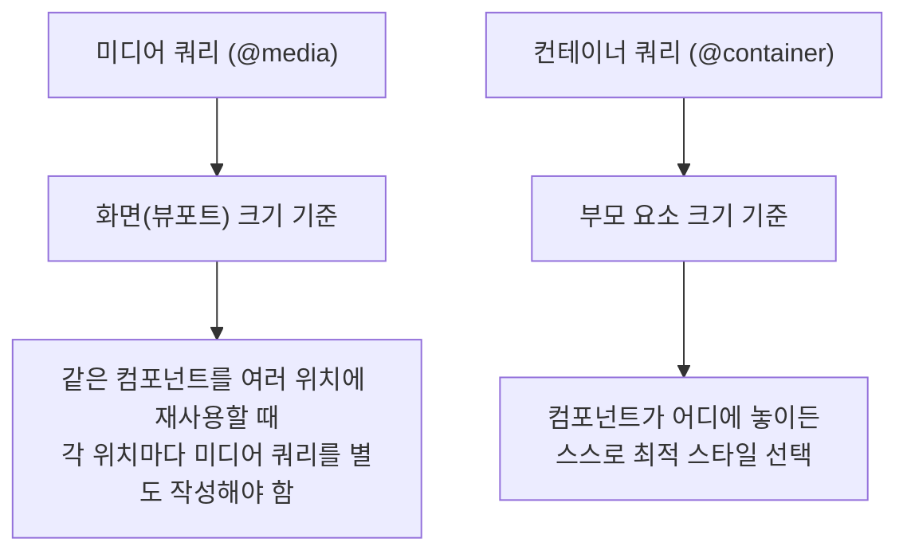

CSS는 겉보기엔 단순한 스타일 언어처럼 보이지만, 오랫동안 개발자들이 "우회적인 방식"으로 문제를 해결해 온 역사가 있다. 가운데 정렬 하나를 위해 `position: absolute`와 `transform: translate(-50%, -50%)`를 써야 했고, 요소를 가로로 나열하려면 `float`을 쓰고 그 뒤를 **clearfix**로 정리해야 했던 시절이 있었다. 2025년을 기준으로 CSS는 그런 시대와 결별했다. JavaScript 의존도를 줄이고, Sass 같은 전처리기 없이도 읽기 좋은 코드를 작성할 수 있는 수준까지 왔다. 이 글에서는 **"예전에는 이렇게 했지만, 이제는 이렇게 한다"**는 대비 방식으로, 현대 CSS의 핵심 기능을 초보자도 따라 할 수 있도록 정리한다.

## 왜 CSS 지식을 업데이트해야 할까?

웹 개발 커뮤니티에서는 [GeekNews를 통해 소개된 "모던 CSS 코드 스니펫" 아티클](https://news.hada.io/topic?id=26731)이 큰 반향을 일으켰다. 핵심 메시지는 한 줄로 요약된다. **2015년 방식으로 CSS를 쓰는 것을 멈추라.** Hacker News 댓글에서도 비슷한 목소리가 이어졌다. 한 개발자는 최근 CSS의 주요 개선으로 중첩 선택자, `:has()`, `:is()`, `:where()`를 꼽았고, 다른 이는 "웹 개발을 오래 하다 보니 '옛날 방식'이라 불리는 예시들조차 처음 보는 기능이 많다"고 했다.

CSS는 매년 꾸준히 스펙이 확장되어 왔지만, 많은 개발자가 예전 방식에 익숙한 나머지 새 기능을 쓰지 못하는 경우가 많다. 아래에서 다루는 기능 중 하나라도 낯설다면, 이 글이 실무에 바로 쓸 수 있는 참고가 될 것이다.



---

## 1. 레이아웃의 혁명: Flexbox와 CSS Grid

### 예전 방식: float과 clearfix의 한계

레이아웃부터 살펴보자. 과거에는 요소를 가로로 나란히 배치하기 위해 **float** 속성을 썼다. float을 쓰면 부모 요소가 자식의 높이를 인식하지 못해 레이아웃이 "무너지는(collapse)" 현상이 생겼다. 그래서 **clearfix**라는 CSS 트릭으로 부모 높이를 되살려야 했다.

아래 코드는 그 시절 전형적인 패턴이다. `::after` 가상 요소로 clearfix를 적용하고, 자식은 `float: left`와 퍼센트 너비로 열을 나눴다. 간격은 `margin`으로 맞추느라 마지막 요소의 여백을 따로 처리해야 하는 문제가 있었다.

```css
/* 예전 방식: float 레이아웃 */
.container::after {
  content: "";
  display: table;
  clear: both;
}

.item {
  float: left;
  width: 33.33%;
  margin-right: 10px; /* 간격 조정이 복잡함 */
}
```

세로 가운데 정렬도 별도 트릭이 필요했다. 부모에 `position: relative`를 두고, 자식에 `position: absolute`와 `top: 50%; left: 50%`, `transform: translate(-50%, -50%)`를 조합하는 방식이다. 의도만으로는 한 줄이면 될 것을, 여러 속성 조합으로 해결해야 했다.

```css
/* 예전 방식: 세로 가운데 정렬 트릭 */
.parent {
  position: relative;
}
.child {
  position: absolute;
  top: 50%;
  left: 50%;
  transform: translate(-50%, -50%);
}
```

### 지금 방식: Flexbox로 한 방향 레이아웃

**Flexbox**는 한 방향(가로 또는 세로) 레이아웃을 위한 도구다. 부모에 `display: flex`만 선언해도 자식이 한 줄로 정렬되고, `gap`으로 간격을, `align-items`·`justify-content`로 정렬을 제어할 수 있다.

다음 예는 Flexbox로 같은 레이아웃을 만든다. `gap: 10px`로 아이템 사이 간격을 통일하고, `align-items: center`로 세로 가운데, `justify-content: space-between`으로 가로 배분을 한다. float과 clearfix, margin 계산이 모두 필요 없다.

```css
/* 모던 방식: Flexbox 레이아웃 */
.container {
  display: flex;
  gap: 10px; /* 간격을 한 줄로 설정 */
  align-items: center; /* 세로 가운데 정렬 */
  justify-content: space-between; /* 가로 배분 */
}
```

세로·가로 모두 가운데 정렬도 두 줄이면 충분하다.

```css
/* 모던 방식: 가운데 정렬 */
.parent {
  display: flex;
  align-items: center;
  justify-content: center;
}
```

### CSS Grid: 2차원 레이아웃

Flexbox가 **한 방향** 레이아웃이라면, **CSS Grid**는 행과 열을 동시에 다루는 2차원 레이아웃이다. 페이지 전체 구조나 카드 그리드처럼 행·열이 모두 중요한 경우에 적합하다.

아래 코드는 `grid-template-columns: repeat(auto-fill, minmax(250px, 1fr))`와 `gap`만으로, 화면 너비에 따라 열 개수가 바뀌는 반응형 그리드를 만든다. `auto-fill`은 가능한 한 많은 열을 채우고, `minmax(250px, 1fr)`는 열이 최소 250px, 나머지는 균등 분배되게 한다.

```css
/* 모던 방식: CSS Grid로 카드 레이아웃 */
.card-grid {
  display: grid;
  grid-template-columns: repeat(auto-fill, minmax(250px, 1fr));
  gap: 20px;
}
```



**gap 속성**: 예전에는 아이템 사이 간격을 `margin`으로 맞췄지만, Flexbox와 Grid 모두 **gap** 하나로 통일할 수 있다. 마지막 요소의 불필요한 margin을 제거하는 번거로움도 사라진다.

---

## 2. CSS 중첩 선택자 (Nesting): Sass 없이 구조화된 코드

### 예전 방식: 반복 선택자와 Sass 의존

CSS에서 부모·자식 관계를 표현하려면 선택자를 반복해서 길게 나열해야 했다. 그래서 많은 팀이 **Sass/SCSS** 같은 전처리기로 중첩 문법을 썼고, 빌드 파이프라인이 필수가 됐다.

아래는 중첩 없이 쓴 예시다. `.card`와 그 자손을 스타일할 때마다 `.card .title`, `.card .content`처럼 앞부분을 반복해야 했다.

```css
/* 예전 방식: 반복적인 선택자 */
.card { background: white; }
.card .title { font-size: 1.5rem; }
.card .title:hover { color: blue; }
.card .content { line-height: 1.6; }
.card .content a { color: blue; }
.card .content a:hover { text-decoration: underline; }
```

### 지금 방식: 순수 CSS 중첩

2023년 말부터 주요 브라우저가 **CSS 중첩(Nesting)**을 네이티브로 지원한다. `&`로 부모 선택자를 참조할 수 있어, Sass처럼 한 블록 안에 관련 스타일을 모을 수 있다.

아래는 같은 구조를 순수 CSS 중첩으로 옮긴 예다. `.card` 안에 `.title`, `.content`와 그 하위 링크·hover를 한곳에 두었다. `&`는 부모 선택자 자체를 가리키므로 `&:hover`는 `.card .title:hover`와 같다.

```css
/* 모던 방식: CSS 중첩 선택자 */
.card {
  background: white;
  border-radius: 8px;

  & .title {
    font-size: 1.5rem;

    &:hover {
      color: blue;
    }
  }

  & .content {
    line-height: 1.6;

    & a {
      color: blue;

      &:hover {
        text-decoration: underline;
      }
    }
  }
}
```

> **초보자 팁**: `&` 없이 선택자만 쓰면 부모 뒤에 공백(자손 결합자)이 붙는다. `.card { .title { ... } }`는 `.card .title { ... }`과 같다. `:hover` 같은 의사 클래스에는 반드시 `&`를 붙여야 한다.

---

## 3. 강력해진 선택자: :is(), :where(), :has()

선택자 영역에도 큰 변화가 있었다. **:is()**, **:where()**, **:has()** 세 의사 클래스로 반복을 줄이고, 예전에는 불가능했던 "자식 기준 부모 선택"까지 할 수 있게 됐다.

### :is() — 선택자 묶기

여러 조합에 같은 스타일을 줄 때 예전에는 쉼표로 길게 나열했다. `:is()`를 쓰면 훨씬 짧아진다.

```css
/* 예전 방식 */
main h1, main h2, main h3,
header h1, header h2, header h3,
footer h1, footer h2, footer h3 {
  font-weight: bold;
}

/* 모던 방식: :is() */
:is(main, header, footer) :is(h1, h2, h3) {
  font-weight: bold;
}
```

**:is()의 특이도(Specificity)**: 괄호 안 선택자 중 **가장 높은** 특이도를 따른다. 예를 들어 `:is(#id, .class)`는 `#id`의 특이도를 가진다.

### :where() — 특이도 0으로 묶기

**:where()**는 문법은 `:is()`와 같지만, **특이도가 항상 0**이다. 리셋이나 기본 스타일처럼 나중에 쉽게 덮어쓸 수 있는 규칙을 만들 때 유리하다.

```css
/* :where()는 특이도 0 — 나중에 어떤 선택자로도 덮어쓸 수 있음 */
:where(h1, h2, h3, h4, h5, h6) {
  margin: 0;
  line-height: 1.2;
}

/* 특이도가 낮아서 이 간단한 선택자로도 덮어쓸 수 있음 */
.article h2 {
  margin-bottom: 1rem;
}
```

### :has() — 자식 기준으로 부모 선택

CSS의 오랜 한계는 **부모를 자식 조건으로 선택할 수 없다**는 점이었다. "이미지가 있는 카드"와 "이미지가 없는 카드"를 다르게 스타일하려면 JavaScript가 필요했는데, **:has()**로 CSS만으로 처리할 수 있다.

```css
/* 이미지가 있는 카드는 다르게 스타일링 */
.card:has(img) {
  display: grid;
  grid-template-columns: 200px 1fr;
}

/* 이미지가 없는 카드 */
.card:not(:has(img)) {
  padding: 2rem;
}

/* 체크박스가 체크된 경우 라벨 스타일 변경 */
.form-group:has(input:checked) label {
  color: green;
  font-weight: bold;
}

/* 다음 형제 요소 선택 (예전엔 JS가 필요했음) */
h2:has(+ p) {
  margin-bottom: 0.5rem;
}
```

2023년부터 주요 브라우저에서 지원되며, "부모 선택자"라는 별칭으로 많이 소개된다.



---

## 4. 컨테이너 쿼리 (Container Queries): 컴포넌트 단위 반응형

### 예전 방식: 미디어 쿼리의 한계

반응형 디자인에서는 **미디어 쿼리(@media)**로 뷰포트 너비에 따라 스타일을 바꿨다. 문제는 미디어 쿼리가 **화면 크기**만 기준으로 한다는 점이다. 같은 카드 컴포넌트를 사이드바(좁은 영역)와 메인(넓은 영역)에 둘 때, 화면 크기는 같으므로 미디어 쿼리만으로는 "컴포넌트가 놓인 공간 크기"에 따라 다르게 보이게 하기 어렵다.

### 지금 방식: 컨테이너 쿼리

**컨테이너 쿼리(@container)**는 **부모(컨테이너)의 크기**를 기준으로 스타일을 적용한다. 컴포넌트가 어디에 있든, 자신이 차지한 공간에 맞춰 레이아웃을 바꿀 수 있다.

먼저 부모를 `container-type: inline-size`와 `container-name`으로 컨테이너로 지정한다. 그다음 `@container 이름 (조건)` 안에서 해당 컨테이너 너비에 따라 스타일을 바꾼다. 아래 예는 카드가 좁을 때는 세로 배치, 400px 이상일 때 가로 배치, 600px 이상일 때 이미지 크기를 고정하는 패턴이다.

```css
/* 모던 방식: 컨테이너 쿼리 */

/* 1단계: 부모를 컨테이너로 지정 */
.card-wrapper {
  container-type: inline-size;
  container-name: card;
}

/* 2단계: 컨테이너 크기에 따라 카드 스타일 변경 */
.card {
  display: block; /* 기본: 좁은 공간에서는 세로 배치 */
  padding: 1rem;
}

@container card (min-width: 400px) {
  .card {
    display: flex; /* 넓은 공간에서는 가로 배치 */
    gap: 1.5rem;
  }
}

@container card (min-width: 600px) {
  .card img {
    width: 200px;
    flex-shrink: 0;
  }
}
```



같은 HTML·CSS로 사이드바에서는 좁게, 메인에서는 넓게 보이는 **재사용 가능한 컴포넌트**를 만들 수 있다. 2023년부터 Chrome, Firefox, Safari에서 지원된다.

---

## 5. OKLCH 색상: 지각적으로 균일한 색 공간

### 예전 방식: hex, rgb, hsl의 한계

버튼의 기본색과 hover색을 각각 지정하거나, Sass의 `darken()`·`lighten()`에 의존하는 경우가 많았다. **HSL**은 밝기(L) 값을 바꿔도 색조에 따라 실제로 느껴지는 밝기가 달라져, 같은 숫자로는 균일한 느낌을 주기 어렵다.

### 지금 방식: OKLCH와 상대 색상 문법

**OKLCH**는 사람의 시각에 가깝게 설계된 색 공간이다. `oklch(밝기 채도 색조)` 형식이며, **상대 색상 문법(Relative Color Syntax)**으로 기준 색에서 밝기·채도만 바꾼 파생색을 만들 수 있다.

- **밝기(L)**: 0(검정) ~ 1(흰색) 또는 0% ~ 100%
- **채도(C)**: 0(무채색) ~ 약 0.4(매우 선명)
- **색조(H)**: 0 ~ 360 (색상환)

```css
/* 모던 방식: OKLCH 색상 */
:root {
  --color-brand: oklch(55% 0.22 250); /* 파란 계열 */
}

.button {
  background-color: var(--color-brand);
}

/* 상대 색상 문법으로 hover 상태 자동 생성 */
.button:hover {
  background-color: oklch(from var(--color-brand) calc(l - 0.1) c h);
}

.button:disabled {
  background-color: oklch(from var(--color-brand) l 0 h); /* 채도를 0으로 = 회색 */
}
```

OKLCH에서는 밝기 값을 맞추면 색조가 달라도 눈에 보이는 밝기가 비슷해진다. Sass 함수 없이도 테마·상태별 색을 체계적으로 관리할 수 있다.

---

## 6. CSS 변수 (Custom Properties): 동적 스타일의 기반

**CSS 변수(Custom Properties)**는 2018년 전후로 지원됐지만 아직 활용하지 않는 개발자가 많다. Sass 변수와 달리 **런타임에 동작**하므로 JavaScript로 값을 바꾸거나, `:hover`·미디어 쿼리·다크 모드에 따라 같은 변수명으로 다른 값을 줄 수 있다.

아래처럼 `:root`에 변수를 두고, `prefers-color-scheme: dark`에서 값만 바꾸면 다크 모드를 적용할 수 있다. 컴포넌트는 `var(--color-primary)`처럼 참조만 하면 된다. 변수는 **스코프**를 가지므로, 특정 요소에 다시 정의하면 그 요소와 자손에만 적용된다.

```css
/* CSS 변수 정의 */
:root {
  --color-primary: oklch(55% 0.22 250);
  --spacing-base: 1rem;
  --border-radius: 8px;
}

/* 다크 모드: 변수 값만 바꾸면 됨 */
@media (prefers-color-scheme: dark) {
  :root {
    --color-primary: oklch(70% 0.22 250);
  }
}

/* 컴포넌트에서 사용 */
.card {
  padding: var(--spacing-base);
  border-radius: var(--border-radius);
  background: white;
}

.card--highlighted {
  --color-primary: oklch(60% 0.25 30); /* 이 카드 안에서만 다른 색 사용 */
}
```

---

## 7. 스크롤 기반 애니메이션 (Scroll Timeline): JS 없이 스크롤 연동

### 예전 방식: JavaScript IntersectionObserver

스크롤에 따라 요소가 나타나거나 진행 바가 채워지는 효과는 예전에는 **IntersectionObserver**나 스크롤 이벤트로 구현했다.

### 지금 방식: animation-timeline

**animation-timeline: scroll()**은 애니메이션을 스크롤 위치에, **animation-timeline: view()**는 요소가 뷰포트에 들어오는 구간에 연결한다. **animation-range**로 애니메이션이 재생되는 구간을 지정할 수 있다.

```css
/* 모던 방식: 스크롤 기반 애니메이션 */

@keyframes grow-progress {
  from { width: 0%; }
  to   { width: 100%; }
}

.progress-bar {
  animation: grow-progress linear;
  animation-timeline: scroll(root); /* 페이지 스크롤에 연결 */
}

@keyframes fade-in-up {
  from {
    opacity: 0;
    transform: translateY(30px);
  }
  to {
    opacity: 1;
    transform: translateY(0);
  }
}

.card {
  animation: fade-in-up linear both;
  animation-timeline: view(); /* 요소가 뷰포트에 들어올 때 */
  animation-range: entry 0% entry 30%;
}
```

2026년 기준 Chrome, Firefox, Safari에서 Baseline으로 지원된다.

---

## 8. CSS 레이어 (@layer): 명시도 전쟁 정리

### 예전 방식: !important 남용

**명시도(Specificity)** 때문에 `#id`가 `.class`를 이기고, 인라인 스타일이 거의 모든 것을 이기는 구조다. 덮어쓰려다 `!important`를 쓰고, 그다음 또 `!important`를 쓰는 악순환이 생기기 쉽다.

### 지금 방식: @layer로 우선순위 고정

**@layer**는 규칙을 **레이어**로 나누고, 레이어 **선언 순서**로 우선순위를 정한다. 한 번 순서를 정해 두면, 레이어 안의 선택자 명시도와 관계없이 나중에 선언한 레이어가 항상 위에 올라온다.

```css
/* 레이어 순서 선언: 나중에 나오는 레이어가 더 강함 */
@layer reset, base, components, utilities;

@layer reset {
  * {
    margin: 0;
    padding: 0;
    box-sizing: border-box;
  }
}

@layer base {
  body {
    font-family: system-ui, sans-serif;
    line-height: 1.5;
  }
  h1, h2, h3 { line-height: 1.2; }
}

@layer components {
  .button {
    padding: 0.5rem 1rem;
    background: oklch(55% 0.22 250);
    color: white;
    border-radius: 4px;
  }
}

@layer utilities {
  .mt-4 { margin-top: 1rem; }
  .text-center { text-align: center; }
}
```

`utilities` 레이어의 단순 클래스가 `components`의 복잡한 선택자를 `!important` 없이 이길 수 있어, 유틸리티 우선 디자인을 예측 가능하게 쓸 수 있다.

---

## 9. field-sizing: 폼 요소 자동 크기 조절

`<textarea>`를 내용에 맞게 자동으로 늘리려면 예전에는 JavaScript로 높이를 계산해야 했다. **field-sizing: content**로 CSS만 처리할 수 있다.

```css
textarea {
  field-sizing: content; /* 내용에 맞게 자동 크기 조절 */
  min-height: 3rem;
  max-height: 20rem;
}
```

---

## 10. 요약 비교표: 예전 방식 vs 모던 방식

| 문제 상황 | 예전 방식 | 모던 방식 |
|-----------|----------|----------|
| 요소 가로 나열 | `float: left` + clearfix | `display: flex` |
| 그리드 레이아웃 | Bootstrap 등 프레임워크 | `display: grid` |
| 아이템 간격 | `margin`으로 계산 | `gap` |
| 요소 가운데 정렬 | `position: absolute` + `transform` | Flexbox `align-items`·`justify-content` |
| 반응형 디자인 | 미디어 쿼리(`@media`) | 컨테이너 쿼리(`@container`) |
| CSS 중첩 구조 | Sass/SCSS 전처리기 | 순수 CSS 중첩(`&`) |
| 여러 선택자 묶기 | 쉼표로 길게 나열 | `:is()`, `:where()` |
| 부모를 자식으로 선택 | JavaScript DOM 조작 | `:has()` |
| 색상 밝기·채도 조절 | Sass `darken()`/`lighten()` | OKLCH 상대 색상 |
| CSS 우선순위 관리 | `!important` 남용 | `@layer` |
| 스크롤 애니메이션 | JavaScript IntersectionObserver | `animation-timeline` |
| textarea 자동 크기 | JavaScript 이벤트 리스너 | `field-sizing: content` |
| 다크 모드 | 별도 스타일 시트 또는 클래스 | CSS 변수 + `prefers-color-scheme` |

---

## 학습 성과: 이 글을 읽은 후 할 수 있는 것

- **Flexbox와 Grid**를 구분하고, 한 방향 레이아웃에는 Flexbox, 2차원 레이아웃에는 Grid를 선택할 수 있다.
- **float·clearfix** 대신 Flexbox/Grid와 **gap**으로 레이아웃과 간격을 구성할 수 있다.
- **CSS 중첩**으로 Sass 없이 선택자를 구조화하고, `&`로 부모·상태를 참조할 수 있다.
- **:is()**, **:where()**, **:has()**의 차이(특이도·용도)를 설명하고, 반복 제거·조건부 스타일링에 적용할 수 있다.
- **미디어 쿼리**와 **컨테이너 쿼리**의 차이를 설명하고, 컴포넌트 재사용 시 컨테이너 쿼리를 선택할 수 있다.
- **OKLCH**와 상대 색상 문법으로 테마·상태별 색을 관리하고, **CSS 변수**로 다크 모드나 테마 전환을 구현할 수 있다.
- **@layer**로 reset·base·components·utilities 순서를 정해 `!important` 없이 우선순위를 관리할 수 있다.

---

## 판단 기준: 언제 쓸지, 언제 피할지

| 기능 | 쓰기 좋은 경우 | 피하거나 보완할 경우 |
|------|----------------|----------------------|
| Flexbox | 한 줄/한 열 정렬, 간격·정렬 제어 | 2차원 그리드가 필요하면 Grid |
| Grid | 카드 그리드, 페이지 레이아웃 | 단순한 한 방향 나열은 Flexbox |
| CSS 중첩 | 컴포넌트 단위 스타일 묶기 | 과도한 깊이(3단계 이상)는 가독성 저하 |
| :has() | 자식 유무·상태에 따른 부모 스타일 | 매우 오래된 브라우저 지원 필요 시 fallback |
| 컨테이너 쿼리 | 재사용 컴포넌트가 여러 레이아웃에 들어갈 때 | 화면 전체만 구분하면 미디어 쿼리로 충분 |
| @layer | 대규모 CSS, 유틸리티 우선 설계 | 소규모 단일 파일에서는 선택 사항 |
| 스크롤 애니메이션 | 스크롤 진행·등장 효과 | 필수 UX가 아니면 점진적 향상으로 적용 |

---

## 결론: 지금 당장 시작하는 법

모던 CSS 기능 대부분은 현재 Chrome, Firefox, Safari 최신 버전에서 지원된다. [web.dev의 CSS Baseline](https://web.dev/baseline)에서 기능별 지원 여부를 확인할 수 있다.

추천 학습 순서는 다음과 같다.

1. **Flexbox와 Grid** — 레이아웃의 기본. float은 레이아웃 용도로 더 이상 쓰지 않는다.
2. **CSS 변수** — 테마·반복 값 관리와 다크 모드의 기초.
3. **CSS 중첩** — Sass 없이 읽기 좋은 스타일 구조.
4. **컨테이너 쿼리** — 재사용 가능한 컴포넌트 설계.
5. **:has(), :is(), :where()** — 선택자 단순화와 조건부 스타일링.

오래된 방식(float 레이아웃, Sass 의존, 부모 선택 불가능하다는 가정)에 머물러 있다면, 한 번 코드베이스를 돌아보는 것이 좋다. 브라우저는 이미 그보다 앞서 있다.

---

## 참고 자료

- [GeekNews: 모던 CSS 코드 스니펫 — 더 이상 2015년처럼 CSS를 작성하지 말자](https://news.hada.io/topic?id=26731)
- [What You Need to Know about Modern CSS (2025 Edition) — Frontend Masters](https://frontendmasters.com/blog/what-you-need-to-know-about-modern-css-2025-edition/)
- [MDN Web Docs — CSS](https://developer.mozilla.org/ko/docs/Web/CSS)
- [web.dev Learn CSS](https://web.dev/learn/css)
- [web.dev — Baseline (브라우저 지원 확인)](https://web.dev/baseline)
