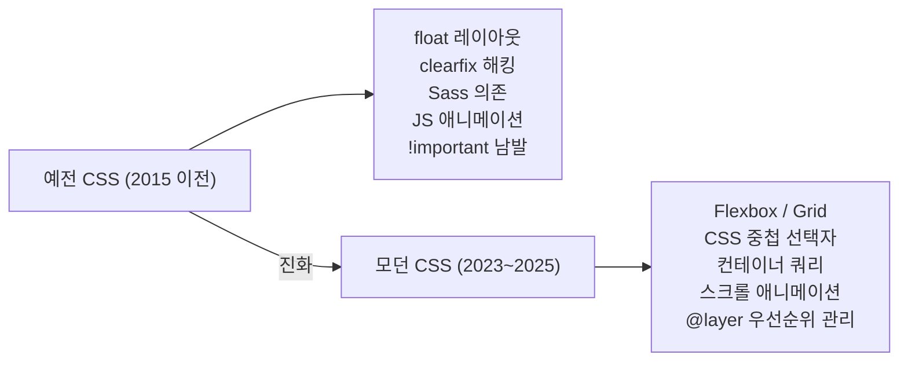
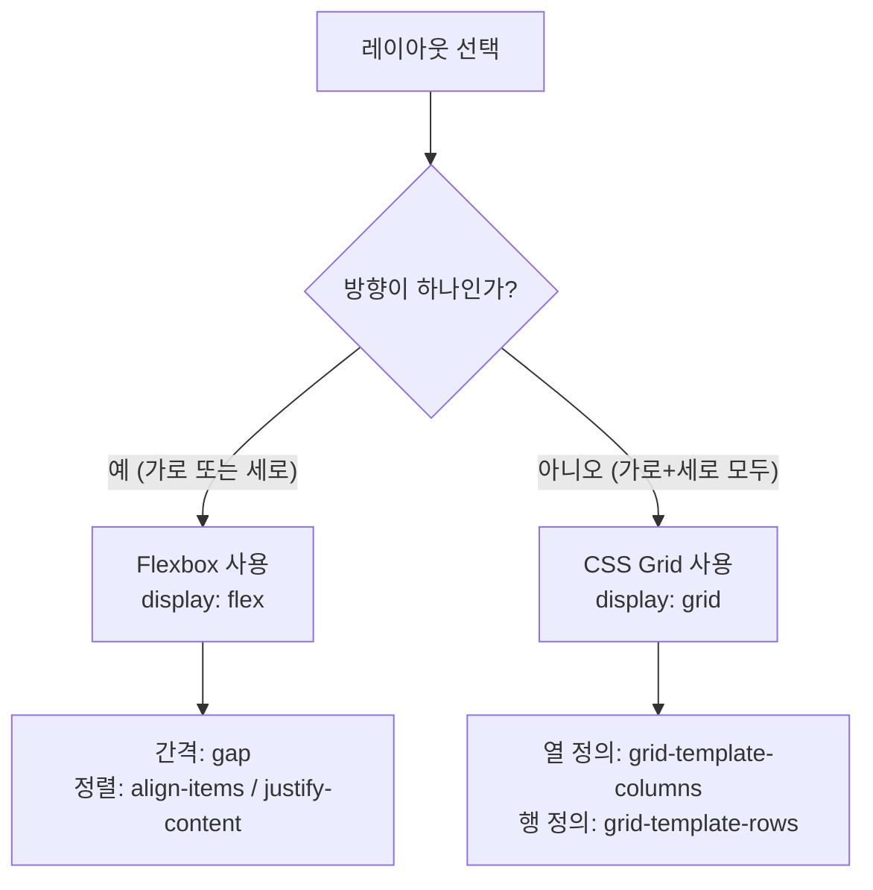
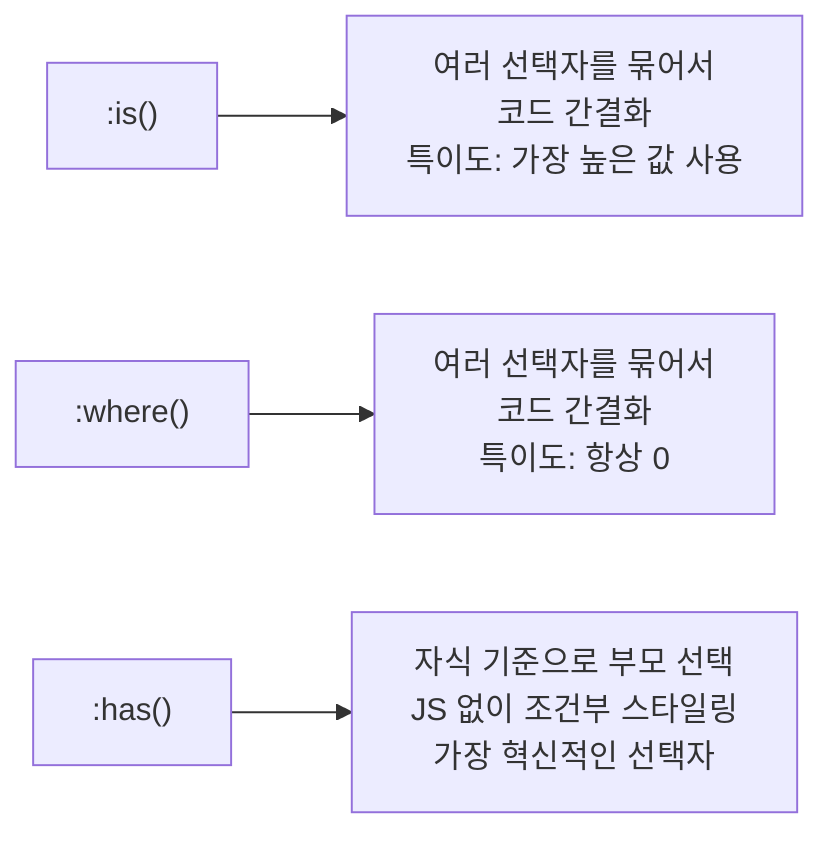
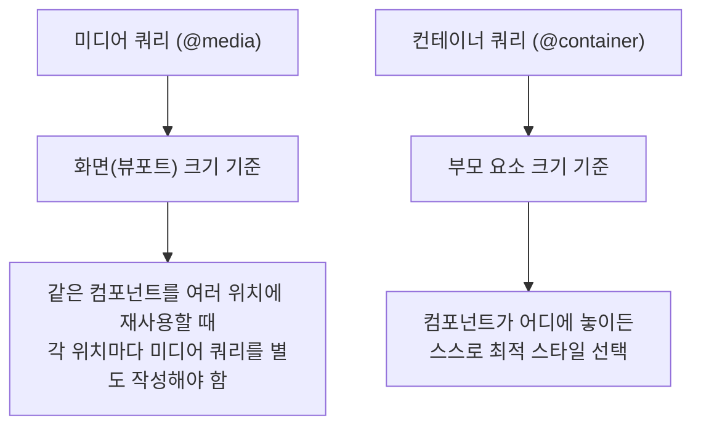

CSS는 어떻게 보면 단순해 보이지만, 오랫동안 "이상한 방식"으로 무언가를 해결해야 했던 언어이기도 하다. 가운데 정렬 하나를 위해 `position: absolute`와 `transform: translate(-50%, -50%)`를 쓰거나, 요소를 나란히 배치하기 위해 `float`을 쓰고 그 뒤를 `clearfix`로 청소해야 했던 시절이 있었다. 그러나 2025년을 기준으로 CSS는 완전히 달라졌다. JavaScript 의존도를 줄이고, Sass 같은 전처리기 없이도 깔끔한 코드를 작성할 수 있는 수준으로 발전했다. 이 글에서는 "예전에는 이렇게 했지만, 이제는 이렇게 한다"는 방식으로 현대 CSS의 핵심 기능들을 초보자도 이해할 수 있도록 설명한다.

## 왜 CSS 지식을 업데이트해야 할까?

웹 개발 커뮤니티에서는 최근 [GeekNews를 통해 소개된 "모던 CSS 코드 스니펫" 아티클](https://news.hada.io/topic?id=26731)이 큰 화제가 됐다. 핵심 메시지는 간단하다: **2015년 방식으로 CSS를 쓰는 것을 멈춰라.** 이 글에 달린 Hacker News 댓글들도 흥미롭다. 한 개발자는 "최근 CSS의 주요 개선점"으로 중첩 선택자, `:has()`, `:is()`, `:where()`를 꼽았고, 또 다른 개발자는 "웹 개발을 너무 오래 하다 보니, '옛날 방식'이라 불리는 예시들조차 처음 보는 기능이 많다"고 털어놓았다.

CSS는 매년 꾸준히 발전해 왔지만, 많은 개발자들이 오래된 방식에 익숙해진 나머지 새 기능을 놓치는 경우가 많다. 아래 기능들 중 하나라도 모른다면, 이 글이 도움이 될 것이다.



---

## 1. 레이아웃의 혁명: Flexbox와 CSS Grid

### 예전 방식: float과 clearfix의 지옥

가장 먼저, 레이아웃부터 살펴보자. 과거에는 요소들을 가로로 나란히 배치하기 위해 `float` 속성을 썼다. 문제는 `float`을 쓰면 부모 요소가 자식의 높이를 인식하지 못해서, 부모가 "무너지는(collapse)" 현상이 발생했다. 이를 해결하기 위해 `clearfix`라는 일종의 CSS 트릭을 써야 했다.

```css
/* 예전 방식: float 레이아웃 */
.container::after {
  content: "";
  display: table;
  clear: both;
}

.item {
  float: left;
  width: 33.33%;
  margin-right: 10px; /* 간격 조정이 복잡함 */
}
```

이 방식은 계산이 복잡하고, 요소를 세로 가운데 정렬하는 것도 별도의 트릭이 필요했다. 세로 가운데 정렬 하나를 위해 다음처럼 코드를 써야 했다.

```css
/* 예전 방식: 세로 가운데 정렬 트릭 */
.parent {
  position: relative;
}
.child {
  position: absolute;
  top: 50%;
  left: 50%;
  transform: translate(-50%, -50%);
}
```

### 지금 방식: Flexbox로 간단하게

Flexbox는 한 방향(가로 또는 세로)의 레이아웃을 쉽게 만들어 준다. 부모에 `display: flex`를 선언하는 것만으로 자식 요소들이 자동으로 나란히 배치된다.

```css
/* 모던 방식: Flexbox 레이아웃 */
.container {
  display: flex;
  gap: 10px; /* 간격을 한 줄로 설정 */
  align-items: center; /* 세로 가운데 정렬 */
  justify-content: space-between; /* 가로 배분 */
}
```

세로 가운데 정렬도 이제 두 줄이면 충분하다.

```css
/* 모던 방식: 가운데 정렬 */
.parent {
  display: flex;
  align-items: center;
  justify-content: center;
}
```

### CSS Grid: 2차원 레이아웃의 완성

Flexbox가 한 방향 레이아웃이라면, CSS Grid는 가로와 세로를 동시에 제어하는 2차원 레이아웃 도구다. 복잡한 페이지 전체 레이아웃이나 카드 그리드를 만들 때 최적이다.

```css
/* 모던 방식: CSS Grid로 카드 레이아웃 */
.card-grid {
  display: grid;
  grid-template-columns: repeat(auto-fill, minmax(250px, 1fr));
  gap: 20px;
}
```

위 코드 한 줄로 화면 크기에 따라 카드 개수가 자동으로 조절되는 반응형 그리드가 완성된다. `auto-fill`은 가능한 한 많은 열을 채우고, `minmax(250px, 1fr)`은 각 열이 최소 250px, 최대 가능한 공간을 차지하도록 한다.



**`gap` 속성**: 예전에는 `margin`으로 간격을 줬지만, 이제는 `gap` 속성 하나로 Flexbox와 Grid 모두에서 아이템 사이 간격을 설정할 수 있다. 마지막 요소에 불필요한 margin이 생기는 문제도 없다.

---

## 2. CSS 중첩 선택자 (Nesting): Sass 없이 깔끔한 코드 작성

### 예전 방식: 반복적인 선택자와 Sass 의존

예전에는 CSS에서 중첩 구조를 표현하려면 매번 전체 선택자를 반복해야 했다. 이를 해결하기 위해 많은 개발자들이 Sass나 SCSS 같은 CSS 전처리기를 사용했다.

```css
/* 예전 방식: 반복적인 선택자 */
.card { background: white; }
.card .title { font-size: 1.5rem; }
.card .title:hover { color: blue; }
.card .content { line-height: 1.6; }
.card .content a { color: blue; }
.card .content a:hover { text-decoration: underline; }
```

Sass를 쓰면 중첩이 가능했지만, 빌드 도구가 필요했다.

### 지금 방식: 순수 CSS에서 중첩 지원

2023년 말부터 주요 브라우저에서 CSS 중첩(Nesting)을 기본 지원한다. `&` 기호를 사용해 부모 선택자를 참조하며, Sass처럼 직관적으로 코드를 작성할 수 있다.

```css
/* 모던 방식: CSS 중첩 선택자 */
.card {
  background: white;
  border-radius: 8px;

  & .title {
    font-size: 1.5rem;

    &:hover {
      color: blue;
    }
  }

  & .content {
    line-height: 1.6;

    & a {
      color: blue;

      &:hover {
        text-decoration: underline;
      }
    }
  }
}
```

중첩 선택자의 장점은 명확하다. 관련된 스타일이 한 곳에 모여 있어 코드를 수정하거나 읽기가 훨씬 쉽다. `&`는 부모 선택자 자체를 의미하므로, `&:hover`는 `.card:hover`와 같다.

> **초보자 팁**: `&` 없이 그냥 선택자를 쓰면 자동으로 부모 뒤에 공백(자손 결합자)이 붙는다. `.card { .title { ... } }`은 `.card .title { ... }`과 같다. 그러나 `:hover` 같은 의사 클래스에는 반드시 `&`를 써야 한다.

---

## 3. 강력해진 선택자: :is(), :where(), :has()

CSS 선택자에도 큰 변화가 있었다. 세 가지 새로운 의사 클래스(pseudo-class)가 반복적인 코드를 없애고, 기존에 불가능했던 것들을 가능하게 만들었다.

### :is() — 선택자 묶기

여러 요소에 동일한 스타일을 줄 때, 예전에는 쉼표로 나열해야 했다.

```css
/* 예전 방식 */
main h1, main h2, main h3,
header h1, header h2, header h3,
footer h1, footer h2, footer h3 {
  font-weight: bold;
}
```

`:is()`를 쓰면 훨씬 간결해진다.

```css
/* 모던 방식: :is() */
:is(main, header, footer) :is(h1, h2, h3) {
  font-weight: bold;
}
```

**특이도(Specificity)**: `:is()`는 괄호 안 선택자 중 가장 높은 특이도를 사용한다. 예를 들어 `:is(#id, .class)`의 특이도는 `#id`의 특이도를 따른다.

### :where() — 특이도 없는 선택자 묶기

`:where()`는 `:is()`와 문법이 동일하지만, **특이도가 항상 0**이다. 기본 스타일이나 리셋 CSS처럼, 나중에 쉽게 덮어쓸 수 있는 스타일을 만들 때 유용하다.

```css
/* :where()는 특이도 0 — 나중에 어떤 선택자로도 덮어쓸 수 있음 */
:where(h1, h2, h3, h4, h5, h6) {
  margin: 0;
  line-height: 1.2;
}

/* 특이도가 낮아서 이 간단한 선택자로도 덮어씌울 수 있음 */
.article h2 {
  margin-bottom: 1rem;
}
```

### :has() — 부모를 자식으로 선택하는 혁명

CSS의 오랜 한계 중 하나는 **부모를 자식 기준으로 선택할 수 없다**는 점이었다. JavaScript 없이는 "이미지를 포함한 카드"와 "이미지가 없는 카드"를 다르게 스타일링할 수 없었다. `:has()`가 이 문제를 해결한다.

```css
/* 이미지가 있는 카드는 다르게 스타일링 */
.card:has(img) {
  display: grid;
  grid-template-columns: 200px 1fr;
}

/* 이미지가 없는 카드 */
.card:not(:has(img)) {
  padding: 2rem;
}

/* 체크박스가 체크된 경우 라벨 스타일 변경 */
.form-group:has(input:checked) label {
  color: green;
  font-weight: bold;
}

/* 다음 형제 요소 선택 (예전엔 JS가 필요했음) */
h2:has(+ p) {
  margin-bottom: 0.5rem;
}
```

`:has()`는 "부모 선택자"라고도 불리며, 웹 개발자들이 오랫동안 기다려온 기능이다. 2023년부터 주요 브라우저 모두에서 지원된다.



---

## 4. 컨테이너 쿼리 (Container Queries): 반응형의 새로운 패러다임

### 예전 방식: 미디어 쿼리의 한계

반응형 디자인에서 가장 많이 쓰이는 도구는 미디어 쿼리(`@media`)다. 화면(뷰포트) 크기에 따라 스타일을 바꾸는 방식이다.

```css
/* 예전 방식: 미디어 쿼리 */
.card { display: block; }

@media (min-width: 768px) {
  .card {
    display: flex;
    gap: 1rem;
  }
}
```

문제는 미디어 쿼리가 **화면 크기**만 알 수 있다는 점이다. 같은 카드 컴포넌트를 사이드바(좁은 공간)에도 놓고, 메인 콘텐츠 영역(넓은 공간)에도 놓는다면, 두 경우 모두 화면 크기는 같기 때문에 미디어 쿼리로는 다르게 스타일링하기 어렵다.

### 지금 방식: 컨테이너 쿼리로 컴포넌트 기반 반응형

컨테이너 쿼리는 **부모 요소의 크기**를 기준으로 스타일을 바꿀 수 있게 해준다. 컴포넌트가 어디에 놓이든, 자신이 얼마나 큰 공간을 갖고 있는지에 따라 스스로 스타일을 결정한다.

```css
/* 모던 방식: 컨테이너 쿼리 */

/* 1단계: 부모를 컨테이너로 지정 */
.card-wrapper {
  container-type: inline-size;
  container-name: card;
}

/* 2단계: 컨테이너 크기에 따라 카드 스타일 변경 */
.card {
  display: block; /* 기본: 좁은 공간에서는 세로 배치 */
  padding: 1rem;
}

@container card (min-width: 400px) {
  .card {
    display: flex; /* 넓은 공간에서는 가로 배치 */
    gap: 1.5rem;
  }
}

@container card (min-width: 600px) {
  .card img {
    width: 200px;
    flex-shrink: 0;
  }
}
```



이 방식의 가장 큰 장점은 **재사용성**이다. 카드 컴포넌트를 사이드바에 놓으면 자동으로 좁게, 메인 영역에 놓으면 자동으로 넓게 표시된다. 같은 HTML과 CSS로 어디서든 올바르게 동작하는 진정한 의미의 컴포넌트가 가능해진다.

> **브라우저 지원**: 컨테이너 쿼리는 2023년부터 Chrome, Firefox, Safari 모두에서 지원된다.

---

## 5. OKLCH 색상: 더 자연스럽고 균일한 색상 시스템

### 예전 방식: hex, rgb, hsl의 한계

```css
/* 예전 방식 */
.button { background-color: #3498db; }
.button:hover { background-color: #2980b9; } /* 더 어두운 색... 직접 골라야 했음 */
```

예전에는 버튼의 기본 색과 hover 색을 각각 직접 지정해야 했다. `hsl()`을 쓰면 밝기 조절이 쉬워지지만, HSL 색상 공간은 사람 눈이 느끼는 밝기와 일치하지 않아 같은 밝기 값이라도 색조에 따라 실제로는 다르게 보이는 문제가 있었다.

### 지금 방식: OKLCH로 지각적으로 균일한 색상

OKLCH는 사람의 눈이 색을 인식하는 방식에 맞게 설계된 색상 공간이다. `oklch(밝기 채도 색조)` 형식으로 사용한다.

- **밝기(L)**: 0(검정) ~ 1(흰색) 또는 0% ~ 100%
- **채도(C)**: 0(무채색) ~ 약 0.4(매우 선명)
- **색조(H)**: 0 ~ 360 (색상환)

```css
/* 모던 방식: OKLCH 색상 */
:root {
  --color-brand: oklch(55% 0.22 250); /* 파란 계열 */
}

.button {
  background-color: var(--color-brand);
}

/* 상대 색상 문법으로 hover 상태 자동 생성 */
.button:hover {
  background-color: oklch(from var(--color-brand) calc(l - 0.1) c h);
}

.button:disabled {
  background-color: oklch(from var(--color-brand) l 0 h); /* 채도를 0으로 = 회색 */
}
```

**상대 색상 문법(Relative Color Syntax)**이 특히 강력하다. 기준 색상으로부터 밝기만 조금 낮춘 색, 채도를 제거한 색 등을 동적으로 만들 수 있다. Sass의 `darken()`, `lighten()` 함수가 필요 없어진다.

OKLCH의 장점은 **밝기가 균일**하다는 점이다. 예를 들어, 파란색과 노란색의 밝기를 50%로 설정하면 눈으로 봐도 비슷하게 보인다. HSL에서는 같은 밝기 값이라도 색조에 따라 실제 느껴지는 밝기가 크게 달라진다.

---

## 6. CSS 변수 (Custom Properties): 동적인 스타일의 핵심

CSS 변수(공식 명칭: CSS Custom Properties)는 2018년부터 지원됐지만, 아직도 모르는 개발자가 많다. Sass 변수와 달리 CSS 변수는 **런타임에도 동작**하여 JavaScript로 값을 바꾸거나, `:hover` 같은 상태에 따라 변수 값을 바꿀 수 있다.

```css
/* CSS 변수 정의 */
:root {
  --color-primary: oklch(55% 0.22 250);
  --spacing-base: 1rem;
  --border-radius: 8px;
}

/* 다크 모드: 변수 값만 바꾸면 됨 */
@media (prefers-color-scheme: dark) {
  :root {
    --color-primary: oklch(70% 0.22 250);
  }
}

/* 컴포넌트에서 사용 */
.card {
  padding: var(--spacing-base);
  border-radius: var(--border-radius);
  background: white;
}

/* 컴포넌트 내부에서 변수 재정의 */
.card--highlighted {
  --color-primary: oklch(60% 0.25 30); /* 이 카드 안에서만 다른 색 사용 */
}
```

CSS 변수는 **스코프(범위)**를 가진다는 점이 Sass 변수와 다른 핵심 차이다. 특정 요소에 변수를 정의하면 그 요소와 자손 요소에서만 해당 값이 적용된다. 이를 활용하면 다크 모드, 테마 변경 등을 아주 간결하게 구현할 수 있다.

---

## 7. 스크롤 기반 애니메이션 (Scroll Timeline): JavaScript 없이 스크롤 효과

### 예전 방식: JavaScript IntersectionObserver

스크롤에 따라 요소가 나타나거나 변하는 애니메이션은 예전에는 반드시 JavaScript가 필요했다.

```javascript
// 예전 방식: JS로 스크롤 감지
const observer = new IntersectionObserver((entries) => {
  entries.forEach(entry => {
    if (entry.isIntersecting) {
      entry.target.classList.add('visible');
    }
  });
});

document.querySelectorAll('.animate-on-scroll').forEach(el => {
  observer.observe(el);
});
```

### 지금 방식: CSS만으로 스크롤 애니메이션

```css
/* 모던 방식: 스크롤 기반 애니메이션 */

/* 페이지 스크롤에 따라 진행 바 늘어나기 */
@keyframes grow-progress {
  from { width: 0%; }
  to   { width: 100%; }
}

.progress-bar {
  animation: grow-progress linear;
  animation-timeline: scroll(root); /* 페이지 스크롤에 연결 */
}

/* 스크롤하면서 요소 페이드인 */
@keyframes fade-in-up {
  from {
    opacity: 0;
    transform: translateY(30px);
  }
  to {
    opacity: 1;
    transform: translateY(0);
  }
}

.card {
  animation: fade-in-up linear both;
  animation-timeline: view(); /* 요소가 뷰포트에 들어올 때 */
  animation-range: entry 0% entry 30%;
}
```

`animation-timeline: scroll()`은 애니메이션을 페이지 스크롤 위치에 연결한다. `animation-timeline: view()`는 요소가 화면에 들어오고 나가는 것에 연결된다. `animation-range`로 애니메이션이 적용될 스크롤 범위를 지정할 수 있다.

> **브라우저 지원**: 스크롤 기반 애니메이션은 2026년을 기준으로 Chrome, Firefox, Safari 전체에서 Baseline으로 지원된다.

---

## 8. CSS 레이어 (@layer): 명시도 전쟁 종식

### 예전 방식: !important 남용과 명시도 싸움

CSS에서 가장 악명 높은 것 중 하나가 **명시도(Specificity)** 문제다. `#id` 선택자가 `.class` 선택자보다 강하고, 인라인 스타일이 모든 것보다 강하다. 그래서 다른 스타일을 덮어쓰려다 `!important`를 쓰게 되고, 그러면 또 `!important`를 써야 하는 악순환이 생겼다.

```css
/* 예전의 혼란스러운 상황 */
.button { color: blue; }
#main .button { color: red; }    /* ID 선택자가 더 강함 */
.button.active { color: green !important; } /* !important로 강제 덮어쓰기 */
```

### 지금 방식: @layer로 우선순위 명확하게 관리

`@layer`는 CSS 규칙을 **레이어**로 나누어 우선순위를 명확하게 지정한다. 레이어 순서를 먼저 선언하면, 나중에 선언된 레이어가 더 높은 우선순위를 가진다.

```css
/* 레이어 순서 선언: 나중에 나오는 레이어가 더 강함 */
@layer reset, base, components, utilities;

/* 리셋 스타일 (가장 약함) */
@layer reset {
  * {
    margin: 0;
    padding: 0;
    box-sizing: border-box;
  }
}

/* 기본 스타일 */
@layer base {
  body {
    font-family: system-ui, sans-serif;
    line-height: 1.5;
  }
  h1, h2, h3 { line-height: 1.2; }
}

/* 컴포넌트 스타일 */
@layer components {
  .button {
    padding: 0.5rem 1rem;
    background: oklch(55% 0.22 250);
    color: white;
    border-radius: 4px;
  }
}

/* 유틸리티 스타일 (가장 강함, !important 없이) */
@layer utilities {
  .mt-4 { margin-top: 1rem; }
  .text-center { text-align: center; }
}
```

`@layer`의 가장 큰 장점은 **레이어 내부의 명시도와 관계없이, 레이어 순서가 우선**된다는 점이다. `utilities` 레이어의 단순한 클래스가 `components` 레이어의 복잡한 선택자를 항상 이긴다. `!important` 없이도 우선순위를 확실하게 관리할 수 있다.

---

## 9. 자동으로 크기 조절되는 폼 요소: field-sizing

이것은 잘 알려지지 않았지만 실용적인 새 기능이다. `<textarea>` 요소를 내용에 따라 자동으로 키우고 싶을 때, 예전에는 JavaScript 이벤트 리스너가 필요했다.

```css
/* 모던 방식: field-sizing */
textarea {
  field-sizing: content; /* 내용에 맞게 자동 크기 조절 */
  min-height: 3rem;
  max-height: 20rem;
}
```

단 한 줄로 자동 크기 조절 textarea가 완성된다.

---

## 10. 요약 비교표: 예전 방식 vs 모던 방식

| 문제 상황 | 예전 방식 | 모던 방식 |
|-----------|----------|----------|
| 요소 가로 나열 | `float: left` + `clearfix` | `display: flex` |
| 그리드 레이아웃 | CSS 프레임워크 (Bootstrap 등) | `display: grid` |
| 아이템 간격 | `margin`으로 계산 | `gap` |
| 요소 가운데 정렬 | `position: absolute` + `transform` | Flexbox `align-items: center` |
| 반응형 디자인 | 미디어 쿼리 (`@media`) | 컨테이너 쿼리 (`@container`) |
| CSS 중첩 구조 | Sass/SCSS 전처리기 | 순수 CSS 중첩 (`&`) |
| 여러 선택자 묶기 | 쉼표로 길게 나열 | `:is()`, `:where()` |
| 부모를 자식으로 선택 | JavaScript DOM 조작 | `:has()` |
| 색상 밝기 조절 | Sass `darken()`/`lighten()` | OKLCH 상대 색상 |
| CSS 우선순위 관리 | `!important` 남용 | `@layer` |
| 스크롤 애니메이션 | JavaScript `IntersectionObserver` | `animation-timeline` |
| textarea 자동 크기 | JavaScript 이벤트 리스너 | `field-sizing: content` |
| 다크 모드 | 별도 스타일 시트 또는 클래스 | CSS 변수 + `prefers-color-scheme` |

---

## 결론: 지금 당장 시작하는 법

모던 CSS의 기능들은 대부분 현재 Chrome, Firefox, Safari의 최신 버전에서 모두 지원된다. [web.dev의 CSS Baseline](https://web.dev/baseline)에서 어떤 기능이 어느 브라우저에서 지원되는지 확인할 수 있다.

처음 시작한다면 다음 순서를 추천한다.

1. **Flexbox와 Grid** — 가장 먼저 익혀야 할 레이아웃 도구. `float`은 더 이상 레이아웃에 쓰지 않는다.
2. **CSS 변수** — 테마와 반복 값을 관리하는 기초. 다크 모드 구현에 필수.
3. **CSS 중첩** — Sass 없이 깔끔한 코드 작성 가능.
4. **컨테이너 쿼리** — 재사용 가능한 컴포넌트를 만드는 새로운 방법.
5. **:has(), :is(), :where()** — 선택자를 더 강력하고 간결하게.

웹 개발을 오래 했다면 한 번쯤 자신의 CSS 코드를 돌아보는 것이 좋다. 아직 `float`으로 레이아웃을 만들거나, Sass 없이는 CSS 중첩을 못 한다고 생각하거나, 부모 선택이 불가능하다고 믿고 있다면, 이제 그 생각을 바꿀 때다. 브라우저는 이미 우리보다 훨씬 앞서 있다.

## 참고 자료

- [GeekNews: 모던 CSS 코드 스니펫](https://news.hada.io/topic?id=26731)
- [modern-css.com](https://modern-css.com)
- [What You Need to Know about Modern CSS (2025 Edition) — Frontend Masters](https://frontendmasters.com/blog/what-you-need-to-know-about-modern-css-2025-edition/)
- [MDN Web Docs — CSS](https://developer.mozilla.org/ko/docs/Web/CSS)
- [web.dev Learn CSS](https://web.dev/learn/css)
