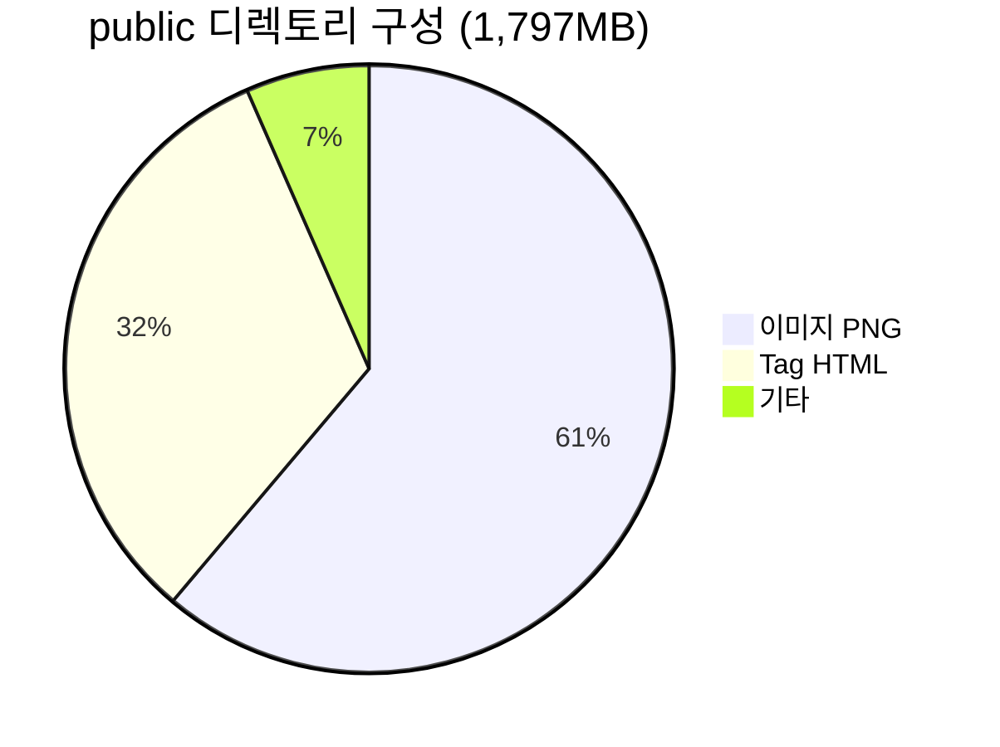
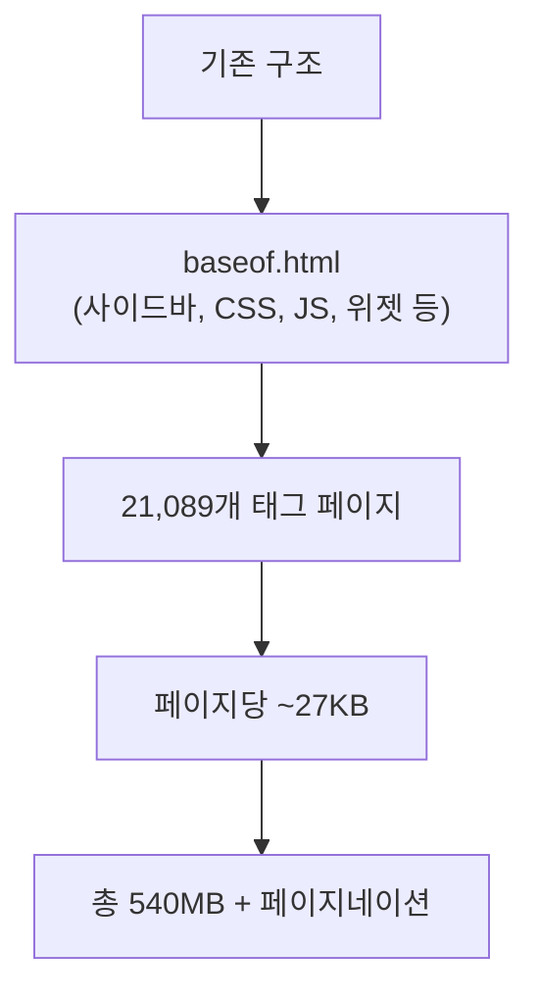
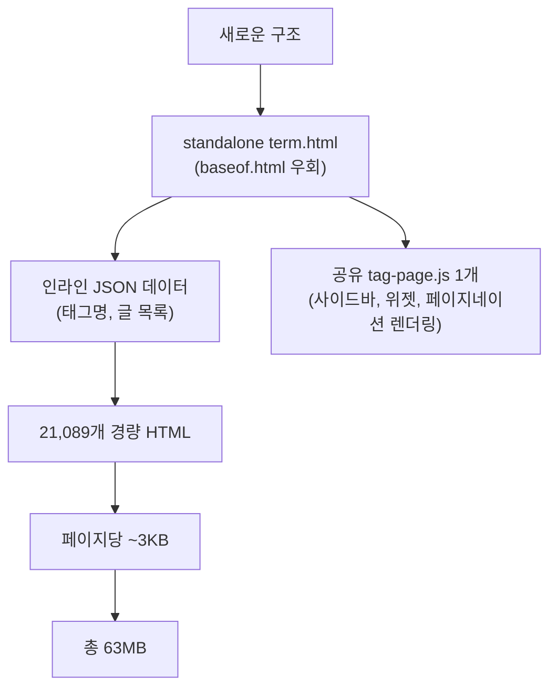
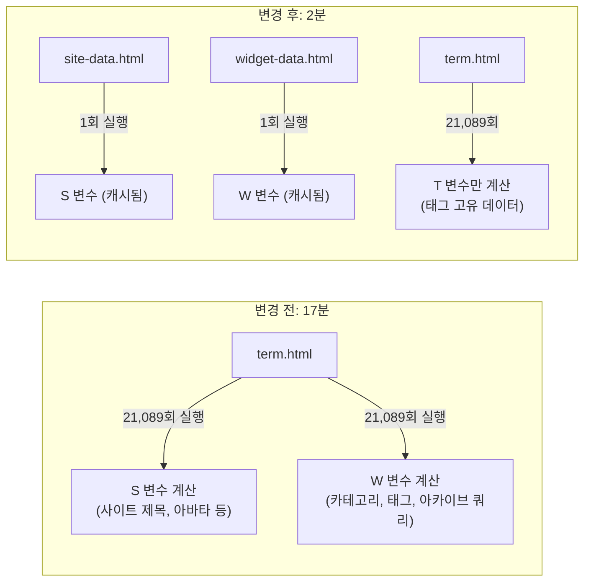
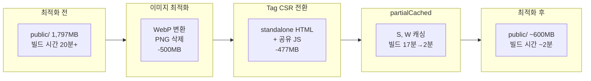

블로그의 콘텐츠가 800개를 넘어서면서 `public` 디렉토리 크기가 1.8GB에 달했다. GitHub Pages의 저장소 용량 권장 한도는 1GB이고, 빌드 artifact 크기 제한도 존재한다. 이 글에서는 Hugo 정적 사이트의 빌드 산출물 크기를 1,797MB에서 600MB 이하로 줄이고, 태그 페이지 빌드 시간을 17분에서 2분으로 단축한 전체 과정을 정리한다.

## 문제 인식: public 디렉토리 1.8GB 분석

빌드 후 `public/` 디렉토리의 용량을 분석한 결과, 두 가지 주범이 드러났다.

| 구분 | 크기 | 비율 |
|------|------|------|
| 이미지 (PNG 원본) | 1,099 MB | 61% |
| Tag HTML 페이지 | 580 MB | 32% |
| 기타 (JS, CSS, 본문 등) | 118 MB | 7% |
| **합계** | **1,797 MB** | 100% |

태그 수가 21,089개에 달했고, 각 태그 페이지가 `baseof.html` 기반으로 풀 렌더링되어 약 27KB씩 차지했다. 여기에 페이지네이션까지 포함하면 Tag 디렉토리만 580MB였다.



---

## 1단계: 이미지 최적화 - WebP 변환

### Hugo imaging 설정

`config/_default/config.toml`에 이미지 처리 설정을 추가했다.

```toml
[imaging]
quality = 80
resampleFilter = "Box"

[imaging.exif]
disableDate = true
disableLatLong = true
```

`resampleFilter`는 처음에 `Lanczos`(고품질)로 설정했다가, 빌드 속도를 우선하여 `Box`(고속)로 변경했다. EXIF 데이터 제거로 파일 크기를 추가 절감했다.

### 레이아웃 파일에 WebP 적용

14개 레이아웃 파일에서 `.Resize`와 `.Fill` 호출에 `webp` 포맷을 추가했다.

```go-html-template
{{/* 변경 전 */}}
{{ $avatarResized := $avatar.Resize "300x" }}

{{/* 변경 후 */}}
{{ $avatarResized := $avatar.Resize "300x webp" }}
```

### CI/CD에서 원본 PNG 삭제

Hugo는 WebP 변환 시 원본 PNG도 `public/`에 함께 출력한다. GitHub Actions에서 빌드 후 원본을 삭제하는 스텝을 추가했다.

```yaml
- name: Remove original PNG files (keep WebP-converted versions)
  run: |
    echo "=== Before cleanup ==="
    du -sh public/
    find public/post -type f -name '*.png' ! -name '*_hu_*' -delete
    find public/tags -type d -name 'page' -exec rm -rf {} + 2>/dev/null || true
    find public/categories -type d -name 'page' -exec rm -rf {} + 2>/dev/null || true
    echo "=== After cleanup ==="
    du -sh public/
```

Hugo가 생성한 WebP 파일명에는 `_hu_` 접두사가 포함되므로, 이를 기준으로 원본과 변환본을 구분할 수 있다.

### 결과

이미지 최적화만으로 약 **500MB 이상** 절감했다. 하지만 여전히 Tag HTML이 580MB를 차지하고 있었다.

---

## 2단계: Tag 페이지 경량화 - 클라이언트 사이드 렌더링(CSR) 전환

### 기존 구조의 문제

기존 `term.html`은 Hugo의 `baseof.html`을 상속받아 풀 렌더링했다.



21,089개의 태그 페이지 각각이 사이드바, 위젯, 전체 CSS/JS를 포함한 완전한 HTML을 생성했다. 대부분의 콘텐츠는 페이지마다 동일한 보일러플레이트였다.

### CSR 전환 전략

핵심 아이디어는 **공통 부분은 공유 JS 1개 파일로, 가변 부분은 최소한의 인라인 JSON으로** 분리하는 것이다.



### 새로운 term.html

`baseof.html`을 완전히 우회하는 standalone HTML을 작성했다.

```go-html-template
<!DOCTYPE html>
<html lang="{{ .Site.LanguageCode }}">
<head>
  <meta charset="utf-8">
  <meta name="viewport" content="width=device-width,initial-scale=1">
  <title>{{ .Title }} - {{ .Site.Title }}</title>
  <link rel="canonical" href="{{ .Permalink }}">
  {{- partialCached "head/style.html" . -}}
</head>
<body>
{{- partialCached "head/colorScheme" . "global" -}}

<!-- SEO 폴백: 검색엔진 크롤러용 -->
<noscript>
  <h1>{{ .Title }}</h1>
  <p>{{ len .Pages }} posts</p>
  <ul>
    {{- range .Pages -}}
      <li><a href="{{ .RelPermalink }}">{{ .Title }}</a></li>
    {{- end -}}
  </ul>
</noscript>

<!-- 페이지 고유 데이터: 인라인 JSON -->
<script>
var T = {
  t: {{ .Title | jsonify | safeJS }},
  c: {{ len .Pages }},
  p: [
    {{- range .Pages -}}
      [{{ .Title | jsonify | safeJS }},
       {{ .RelPermalink | jsonify | safeJS }},
       "{{ .Date.Format "2006-01-02" }}"],
    {{- end -}}
  ]
};
</script>

<!-- 공유 렌더링 엔진 -->
<script src="/js/tag-page.js"></script>
</body>
</html>
```

핵심 설계 결정:

- **`baseof.html` 우회**: `{{ define "main" }}` 블록을 사용하지 않고 완전한 HTML을 직접 출력하여, `baseof.html`의 사이드바/위젯/footer 보일러플레이트를 제거
- **인라인 JSON**: 각 태그의 글 목록(제목, URL, 날짜)만 최소한의 JSON으로 인라인
- **`<noscript>` SEO 폴백**: JavaScript 비활성화 환경(검색엔진 크롤러 포함)을 위한 기본 콘텐츠 제공
- **`safeJS` 파이프**: Hugo의 컨텍스트 자동 이스케이핑이 `<script>` 태그 내부에서 JSON을 깨뜨리는 문제 방지

### tag-page.js: 클라이언트에서 전체 UI 렌더링

228줄의 JavaScript 파일 하나가 사이드바, 메인 콘텐츠, 오른쪽 위젯, 페이지네이션, 다크 모드, 푸터를 모두 렌더링한다.

```javascript
(function(){
  var d = window.T, s = window.S, w = window.W;
  if (!d || !s) return;

  // SVG 아이콘, 메뉴 데이터 정의
  var I = { home: '<svg ...>', search: '<svg ...>', /* ... */ };

  function buildSidebar() { /* 왼쪽 사이드바 HTML 생성 */ }
  function buildMain()    { /* 글 목록 + 페이지네이션 + 푸터 */ }
  function buildRightSidebar() { /* 검색, 카테고리, 태그 클라우드, 아카이브 */ }

  // DOM에 삽입
  var wrap = document.createElement('div');
  wrap.className = 'container main-container flex on-phone--column extended';
  wrap.innerHTML = buildSidebar() + buildRightSidebar() + buildMain();
  document.body.appendChild(wrap);

  // 이벤트: 햄버거 메뉴, 다크 모드, 페이지네이션 클릭
  // ...
})();
```

### 결과

| 지표 | 변경 전 | 변경 후 | 절감 |
|------|---------|---------|------|
| Tag HTML 총 크기 | 540 MB | 63 MB | **88%** |
| 페이지당 평균 크기 | ~27 KB | ~3 KB | 89% |
| 공유 JS 파일 | 0 | 1개 (7KB) | - |

---

## 3단계: 빌드 성능 튜닝

### Windows Defender 제외

Hugo 공식 문서에 따르면 Windows Defender의 실시간 검사가 빌드 시간을 **400% 이상** 증가시킬 수 있다. 빌드 스크립트에 자동 감지 로직을 추가했다.

```powershell
$defenderExclusions = @((Get-MpPreference).ExclusionProcess)
if ("hugo.exe" -notin $defenderExclusions) {
    Write-Host "[성능 경고] hugo.exe가 Windows Defender 제외 목록에 없습니다."
    Write-Host "  Add-MpPreference -ExclusionProcess 'hugo.exe'"
}
```

### 병렬 워커 수 증가

Hugo의 Go 루틴 기반 병렬 처리를 활용하여 워커 수를 늘렸다.

```powershell
$env:HUGO_NUMWORKERMULTIPLIER = 4
```

### Resample Filter 변경

이미지 리샘플링 필터를 고품질(`Lanczos`)에서 고속(`Box`)으로 변경했다.

```toml
[imaging]
resampleFilter = "Box"    # Lanczos → Box (빌드 속도 우선)
```

### 세그먼트 빌드

개발 중에는 전체 사이트가 아닌 특정 섹션만 빌드할 수 있도록 세그먼트를 정의했다.

```toml
[segments.posts]
  [[segments.posts.includes]]
    kind = '{home,section,taxonomy,term}'
  [[segments.posts.includes]]
    path = '{/post,/post/**}'
```

```powershell
# 전체 빌드
.\build-and-serve.ps1

# post 섹션만 빌드 (빠른 개발)
.\build-and-serve.ps1 -Segment posts
```

### templateMetrics로 병목 식별

Hugo의 `--templateMetrics` 플래그를 사용하면 각 템플릿의 실행 횟수와 소요 시간을 확인할 수 있다.

```
Template                          | Count  | Avg (ms) | Cache %
term.html                        | 21089  | 49.58    | 0%
partials/sidebar/left.html        | 853    | 2.10     | 100%
partials/head/colorScheme.html    | 21942  | 0.15     | 100%
```

`cache potential: 100%`인 partial은 `partialCached`로 전환할 수 있는 후보다.

---

## 4단계: partialCached로 빌드 시간 17분 → 2분

### 문제: 21,089회 반복 계산

`term.html`에서 사이트 데이터(S)와 위젯 데이터(W)를 인라인으로 생성하고 있었다. 이 데이터는 모든 태그 페이지에서 동일한 값이지만, 21,089번 반복 계산되고 있었다.

특히 위젯 데이터(W)는 `.Site.Taxonomies.categories.ByCount`, `.Site.Taxonomies.tags.ByCount`, `.Site.RegularPages` 등 비용이 큰 쿼리를 포함하고 있었다.



### 해결: partialCached로 분리

공통 데이터를 별도 partial로 추출하고 `partialCached`를 적용했다.

**`layouts/partials/tag-page/site-data.html`**:
```go-html-template
<script>var S={
  n:{{ .Site.Title | jsonify | safeJS }},
  d:{{ .Site.Params.sidebar.subtitle | jsonify | safeJS }},
  a:{{- $avatar := resources.Get (.Site.Params.sidebar.avatar.src) -}}
    {{- $avatarResized := $avatar.Resize "300x webp" -}}
    {{ $avatarResized.RelPermalink | jsonify | safeJS }},
  fs:{{ .Site.Params.footer.since }}
};</script>
```

**`layouts/partials/tag-page/widget-data.html`**:
```go-html-template
<script>var W={
  su: /* 검색 페이지 URL */,
  au: /* 아카이브 페이지 URL */,
  c:  /* 상위 10개 카테고리 */,
  tg: /* 상위 20개 태그 */,
  ar: /* 최근 6개 연도별 아카이브 */
};</script>
```

**`term.html`에서의 호출**:
```go-html-template
{{- partialCached "tag-page/site-data.html" . "global" -}}
<script>
var T={t:{{ .Title | jsonify | safeJS }}, /* ... 태그 고유 데이터 */ };
</script>
{{- partialCached "tag-page/widget-data.html" . "global" -}}
```

`partialCached`에 `"global"` 캐시 키를 전달하면, 모든 태그 페이지에서 동일한 캐시된 결과를 재사용한다. 21,089번의 반복 계산이 **1번**으로 줄어든다.

### Hugo 컨텍스트 Auto-Escaping 함정

`partialCached`의 출력을 `<script>` 태그 내부에 넣으면, Hugo의 컨텍스트 자동 이스케이핑이 JavaScript 문맥에서 HTML 엔티티로 변환해버리는 문제가 있었다.

```html
<!-- 문제: partialCached 출력이 JS 컨텍스트에서 이스케이핑됨 -->
<script>
  "var S={n:\u0026#34;42JerryKim\u0026#34;,...}"
</script>
```

해결책은 각 partial이 자체적으로 `<script>` 태그를 포함하도록 하여, partial의 출력이 HTML 컨텍스트에서 렌더링되게 하는 것이다.

```go-html-template
<!-- site-data.html: <script> 태그를 partial 내부에 포함 -->
<script>var S={...};</script>

<!-- term.html: partialCached를 <script> 외부에서 호출 -->
{{- partialCached "tag-page/site-data.html" . "global" -}}
<script>var T={...};</script>
{{- partialCached "tag-page/widget-data.html" . "global" -}}
```

### 결과

| 지표 | 변경 전 | 변경 후 |
|------|---------|---------|
| term.html 빌드 시간 | 17분 25초 | ~2분 |
| term.html 평균 실행 시간 | 49.58ms/페이지 | ~5ms/페이지 |
| S, W 변수 계산 횟수 | 21,089회 | 1회 |

---

## 5단계: 폰트 FOUT 해결

### 문제: Flash of Unstyled Text

Hugo Theme Stack은 Google Fonts의 Lato 폰트를 JavaScript로 동적 로딩한다.

```html
<!-- 테마 기본: footer/components/custom-font.html -->
<script>
  (function () {
    const customFont = document.createElement('link');
    customFont.href = "https://fonts.googleapis.com/css2?family=Lato:wght@300;400;700&display=swap";
    customFont.type = "text/css";
    customFont.rel = "stylesheet";
    document.head.appendChild(customFont);
  }());
</script>
```

이 방식은 페이지가 먼저 시스템 폰트로 렌더링된 후 Lato로 전환되면서 FOUT(Flash of Unstyled Text)가 발생한다.

### 해결: head에서 직접 로딩

`<head>`에서 `<link>` 태그로 직접 로딩하면 브라우저가 렌더링 전에 폰트 다운로드를 시작한다.

**`layouts/partials/head/custom.html`**:
```html
<link rel="preconnect" href="https://fonts.googleapis.com">
<link rel="preconnect" href="https://fonts.gstatic.com" crossorigin>
<link rel="stylesheet"
      href="https://fonts.googleapis.com/css2?family=Lato:wght@300;400;700&display=swap">
```

**`layouts/partials/footer/components/custom-font.html`** (빈 오버라이드):
```go-html-template
{{/* Font is loaded in head/custom.html via <link> to avoid FOUT */}}
```

테마의 원본 파일을 수정하지 않고, Hugo의 레이아웃 오버라이드 메커니즘을 활용하여 로컬 `layouts/` 디렉토리에 동일 경로의 파일을 배치했다.

---

## 6단계: 기타 최적화

### RSS 피드 제한

```toml
[services.rss]
limit = 50

# params.toml
rssFullContent = false
```

800개 이상의 글 전체를 포함하던 RSS 피드를 최근 50개로 제한하고, 전문 대신 요약만 포함하도록 변경했다.

### Pagefind 검색 인덱스 캐싱

클라이언트 검색 엔진 Pagefind의 인덱스 생성을 조건부로 실행하여, 이미 캐시된 인덱스가 있으면 빌드를 건너뛰도록 했다.

```powershell
$pagefindIndex = "static/_pagefind/pagefind.js"
$needPagefind = $Pagefind -or !(Test-Path $pagefindIndex)

if ($needPagefind) {
    # Hugo 빌드 + Pagefind 인덱싱
} else {
    Write-Host "Pagefind 인덱스가 캐시되어 있습니다. 빌드를 건너뜁니다."
}
```

---

## 최종 결과 요약



| 최적화 항목 | 크기 절감 | 시간 절감 |
|------------|----------|----------|
| 이미지 WebP 변환 + PNG 삭제 | -500 MB | - |
| Tag 페이지 CSR 전환 | -477 MB | - |
| partialCached 적용 | - | -15분 |
| 빌드 스크립트 튜닝 | - | 체감 30%+ |
| 폰트 FOUT 수정 | - | UX 개선 |
| RSS 제한 | -수 MB | - |
| **합계** | **~1,200 MB 절감** | **빌드 20분+ → 2분** |

## 적용 시 주의사항

1. **WebP 호환성**: Hugo Extended 버전이 필요하다. 일반 Hugo에서는 WebP 변환이 동작하지 않는다.
2. **SEO 폴백**: CSR 전환 시 `<noscript>` 태그로 검색엔진 크롤러를 위한 폴백을 반드시 제공해야 한다.
3. **Hugo 컨텍스트 이스케이핑**: `<script>` 태그 내에서 `jsonify`를 사용할 때 `| safeJS` 파이프를 빠뜨리면 HTML 엔티티로 변환되어 JavaScript가 깨진다.
4. **partialCached 캐시 키**: `"global"` 같은 고정 키를 사용하면 모든 페이지에서 동일한 결과를 공유한다. 페이지별로 다른 결과가 필요하면 `.RelPermalink` 등을 키로 사용해야 한다.
5. **Windows Defender**: Windows 환경에서 Hugo를 사용한다면 `hugo.exe`를 Defender 제외 목록에 추가하는 것만으로 빌드 시간이 극적으로 줄어든다.

---

## 참고 링크

- [GitHub Pages Limits](https://docs.github.com/en/pages/getting-started-with-github-pages/github-pages-limits) - GitHub Pages 용량(1GB), 대역폭(100GB/월) 등 공식 제한 사항
- [Hugo Image Processing](https://gohugo.io/content-management/image-processing/) - Hugo 내장 이미지 처리 기능 (Resize, Fill, Fit, WebP 변환 등)
- [Hugo partialCached](https://gohugo.io/functions/partials/includecached/) - `partialCached` 함수로 partial 출력을 캐싱하여 빌드 성능을 개선하는 방법
- [Hugo Build Performance](https://gohugo.io/troubleshooting/performance/) - `--templateMetrics` 플래그를 활용한 빌드 병목 식별 및 최적화 가이드
- [Hugo Theme Stack](https://github.com/CaiJimmy/hugo-theme-stack) - 이 블로그에서 사용하는 Hugo 테마
- [WebP - An image format for the Web](https://developers.google.com/speed/webp) - Google의 WebP 포맷 공식 문서 (PNG 대비 26% 감소, JPEG 대비 25-34% 감소)
- [Google Fonts CSS API](https://developers.google.com/fonts/docs/css2) - `display=swap` 파라미터와 `preconnect`를 활용한 폰트 로딩 최적화
- [Pagefind](https://pagefind.app/) - Hugo 등 정적 사이트를 위한 클라이언트 사이드 검색 엔진
