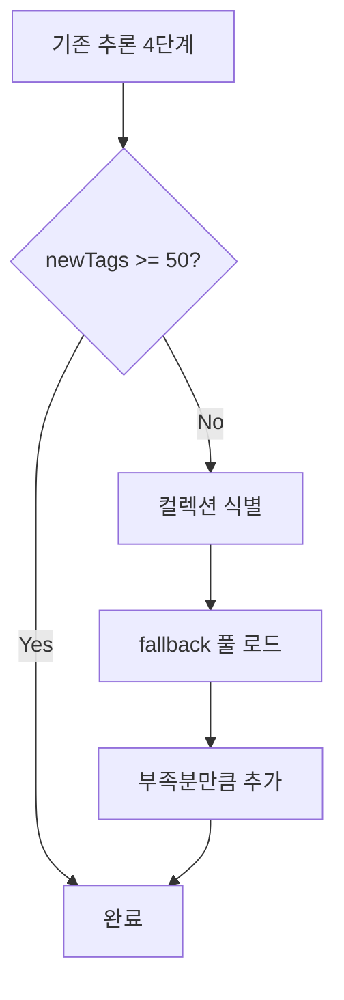

블로그의 **모든 게시물(draft 제외)**이 최소 50개 이상의 태그를 갖도록 통일한 개선 작업의 배경, 구현 전략, 변경 사항, 실행 결과, 사용 방법을 정리한다. 경로·카테고리·키워드 기반 추론만으로는 50개에 미달하는 글이 많았기 때문에, **컬렉션별 fallback 태그 풀**을 도입해 부족분을 자동으로 채우는 방식으로 849개 파일에 총 20,460개 태그를 추가했다.

## 배경 및 목표

기존 워크스페이스 규칙에서는 tags를 10~20개로 작성하도록 권장했으나, Algorithm·Vocabulary·Movies 등 일부 컬렉션은 50개 이상을 요구했다. 이를 통일하여 **모든 게시물이 최소 50개 이상의 태그**를 갖도록 하는 것이 목표였다.

path-tag-map과 keyword-tag-map만으로는 많은 게시물이 50개에 미달했다. python-cheatsheet·designpattern·일반 post 등에서는 25~45개 수준에 머무르는 경우가 많았고, 컬렉션별로 권장 태그 분포가 달라 수동 보강만으로는 일관성을 유지하기 어려웠다. 따라서 **추론 4단계 이후 부족분만 자동으로 채우는 fallback 메커니즘**을 도입하기로 했다.

## 구현 전략: Fallback 태그 풀

추론 4단계(경로 기반, 카테고리, 제목 접두어, 키워드 매칭)를 거친 뒤에도 `newTags.Count -lt 50`인 경우, **컬렉션별 fallback 태그 풀**에서 부족분만큼 순서대로 추가하는 방식을 도입했다. 풀에 있는 태그 중 이미 존재하는 것은 건너뛰고, 50개에 도달할 때까지 추가한다. 경로에 매칭되는 풀이 없으면 `post\` 풀을 사용하고, 여전히 부족하면 `default` 풀을 사용한다.

아래 흐름도는 기존 4단계 추론 완료 후 태그 수가 50개 미만일 때만 fallback 단계가 실행됨을 보여 준다.



노드 설명은 다음과 같다. **기존 추론 4단계**에서 경로·카테고리·제목 접두어·키워드 매칭으로 태그를 수집한 뒤, **newTags >= 50?** 조건으로 50개 미만이면 **컬렉션 식별** → **fallback 풀 로드** → **부족분만큼 추가**를 거쳐 **완료**된다.

## 변경 사항 상세

### data/tags.yaml 확장

승인 태그 수를 529개에서 600개 이상으로 확장했다.

- **헤더 주석**: `pick 10~20 tags` → `pick 50 or more tags`
- **algorithm_topics**: Sweep-Line, Convex-Hull, Suffix-Array, Heavy-Light-Decomposition, Offline-Query, Mo-Algorithm, Persistent-Structure
- **code_quality**: Type-Safety, Readability, Maintainability, Modularity
- **movie_and_tv**: Blockbuster, Indie, Adaptation, Sequel, Prequel
- **general_topics**: How-To, Tips, Comparison, Reference, Beginner, Advanced, Case-Study, Deep-Dive, 실습, 비교, 참고
- **python_specific** (신규 섹션): asyncio, type-hints, pytest, unittest, venv, pip

모든 fallback 풀에 사용되는 태그는 이 목록에 등록된 **승인 태그만** 사용하므로, 사이트 전역에서 태그 분류가 일관되게 유지된다.

### fallback-tag-pool.tsv 신규 생성

경로 패턴별로 50개 미달 시 추가할 태그 풀을 정의한 TSV 파일을 새로 만들었다. 17개 풀(Algorithm, Movies, Vocabulary, python-cheatsheet, design-patterns, designpattern, software-architecture, bashshell, computerterms, testing, unittesting, TV-Show, redux, cleanarchitecture, cmd, post, default)을 두었으며, 각 풀은 30~50개 이상의 태그로 구성되어 부족분을 채울 수 있도록 했다.

경로에 매칭되는 풀이 없으면 `post\` 풀을, 그래도 부족하면 `default` 풀을 사용한다. 따라서 신규 컬렉션을 추가할 때는 해당 경로 패턴과 풀을 fallback-tag-pool.tsv에 등록해 두면 자동으로 적용된다.

### infer-tags.ps1 수정

- **MinTags 기본값**: 20 → 50
- **fallback-tag-pool.tsv 로드**: 스크립트 시작 시 fallback 풀을 읽어 `$fallbackTagMap`에 저장
- **Source 5 (Fallback) 추가**: 추론 4단계 완료 후 `newTags.Count -lt MinTags`이면 경로에 맞는 fallback 풀을 찾아 부족분만큼 태그를 추가. 경로 매칭이 없으면 `post\` 풀, 여전히 부족하면 `default` 풀을 사용

MinTags를 다르게 쓰고 싶다면 `-MinTags 20`처럼 인자로 넘기면 되며, 기존처럼 20개만 유지하고 싶은 환경에서는 이렇게 호출하면 fallback 단계는 50개 미만일 때만 동작하므로 20개 목표로 실행할 경우 fallback이 계속 적용된다.

### 규칙 문서 업데이트

- **.cursor/rules/rules-that-must-be-followed.mdc**: `tags는 영어와 한글을 포함해서 10~20개 작성` → `tags는 영어와 한글을 포함해서 50개 이상 작성`
- Algorithm, Vocabulary, Movies, TV-Show 컬렉션 규칙은 이미 50개 이상을 명시하고 있어 변경하지 않았다.

## 실행 결과

- **849개 파일**에 태그가 추가되었다.
- **총 20,460개** 태그가 추가되었다.
- 재실행 시 `Files augmented: 0`으로, 모든 게시물이 50개 이상의 태그를 갖는 상태가 되었다.

이 결과는 draft가 아닌 모든 포스트에 대해 한 번에 적용한 수치이며, 이후 새 글을 작성할 때는 frontmatter에 50개 이상 태그를 직접 넣거나, 동일 스크립트를 실행해 부족한 글만 자동 보강할 수 있다.

## 사용 방법

태그가 부족한 게시물을 자동으로 보강하려면 다음 명령을 실행한다.

```powershell
# Dry-run (변경 없이 결과만 확인)
.\script\infer-tags.ps1 -DryRun -MinTags 50

# 실제 적용
.\script\infer-tags.ps1 -MinTags 50
```

MinTags를 다르게 지정하려면 `-MinTags 20`처럼 파라미터로 전달하면 된다. 50개를 목표로 할 때는 기본값이 50이므로 `-MinTags 50`은 생략 가능하다.

## 관련 파일

| 파일 | 역할 |
|------|------|
| `data/tags.yaml` | 승인 태그 목록 (모든 태그는 여기에 등록되어 있어야 함) |
| `script/path-tag-map.tsv` | 경로별 기본 태그 (경로 매칭 시 자동 추가) |
| `script/keyword-tag-map.tsv` | 키워드→태그 매핑 (제목·본문 키워드 매칭) |
| `script/fallback-tag-pool.tsv` | 50개 미달 시 추가할 태그 풀 (경로별) |
| `script/infer-tags.ps1` | 태그 추론 및 frontmatter 수정 스크립트 |

스크립트와 TSV 파일은 모두 `script/` 디렉터리 아래에 두고, 실행 시 작업 디렉터리를 저장소 루트로 맞추면 된다.

## 적용 시 유의사항 및 판단 기준

- **언제 사용할지**: 게시물이 50개 미만의 태그를 가질 때, 또는 규칙을 50개 이상으로 통일한 뒤 기존 글을 일괄 보강할 때 사용한다. 새 글 작성 시에는 frontmatter에 50개 이상 태그를 직접 넣어도 되고, 넣지 않았다면 배치 실행 시 fallback으로 채워진다.
- **언제 주의할지**: fallback 풀은 **승인 태그**만 사용하므로 주제와 무관한 태그가 일부 포함될 수 있다. 풀 구성 시 컬렉션 성격에 맞는 태그를 앞쪽에 두면, 부족분이 적을수록 더 관련성 높은 태그만 추가된다. 풀 내용을 수정한 뒤에는 `infer-tags.ps1`을 다시 실행해 반영할 수 있다.
- **트레이드오프**: 태그 수를 통일하면 검색·필터·SEO 측면에서 일관성이 좋아지지만, 개별 글에 대해 “의미적으로 가장 적합한” 태그만 골라 쓰는 것보다는 풀에서 순서대로 채우기 때문에 관련도가 다소 떨어질 수 있다. 이는 풀 설계(순서·컬렉션별 풀)로 완화할 수 있다.

## 핵심 요약

| 항목 | 내용 |
|------|------|
| 목표 | 모든 게시물(draft 제외) 태그 50개 이상 통일 |
| 방식 | 경로·카테고리·제목·키워드 추론 4단계 + 부족분 fallback 풀 추가 |
| 주요 변경 | data/tags.yaml 확장, fallback-tag-pool.tsv 신규, infer-tags.ps1에 Source 5 추가 |
| 결과 | 849개 파일, 20,460개 태그 추가, 재실행 시 0건(이미 50개 이상) |
| 실행 | `.\script\infer-tags.ps1 -MinTags 50` (기본값 50이면 생략 가능) |

이 요약표만으로도 배경·전략·결과·사용법을 한눈에 확인할 수 있다. 세부 단계와 파일 역할은 위 섹션을 참고하면 된다.
