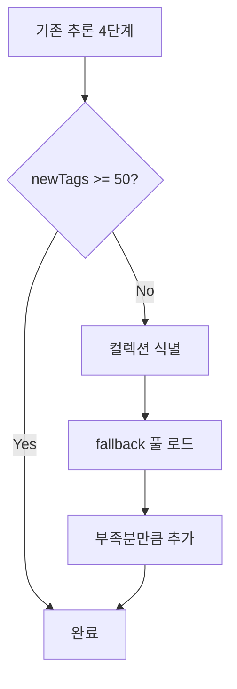

블로그의 모든 게시물에 태그를 50개 이상으로 확장한 개선 작업의 배경, 구현 전략, 변경 사항, 실행 결과를 정리한다.

## 배경 및 목표

기존 워크스페이스 규칙에서는 tags를 10~20개로 작성하도록 권장했으나, Algorithm·Vocabulary·Movies 등 일부 컬렉션은 50개 이상을 요구했다. 이를 통일하여 **모든 게시물(draft 제외)이 최소 50개 이상의 태그**를 갖도록 하는 것이 목표였다.

path-tag-map과 keyword-tag-map만으로는 많은 게시물이 50개에 미달했으며, python-cheatsheet·designpattern·일반 post 등에서 25~45개 수준에 머무르는 경우가 많았다.

## 구현 전략: Fallback 태그 풀

추론 4단계(경로 기반, 카테고리, 제목 접두어, 키워드 매칭)를 거친 뒤에도 `newTags.Count < 50`인 경우, **컬렉션별 fallback 태그 풀**에서 부족분만큼 순서대로 추가하는 방식을 도입했다. 풀에 있는 태그 중 이미 존재하는 것은 건너뛰고, 50개에 도달할 때까지 추가한다. 경로에 매칭되는 풀이 없으면 `post\` 풀을 사용하고, 여전히 부족하면 `default` 풀을 사용한다.



## 변경 사항 상세

### data/tags.yaml 확장

승인 태그 수를 529개에서 600개 이상으로 확장했다.

- **헤더 주석**: `pick 10~20 tags` → `pick 50 or more tags`
- **algorithm_topics**: Sweep-Line, Convex-Hull, Suffix-Array, Heavy-Light-Decomposition, Offline-Query, Mo-Algorithm, Persistent-Structure
- **code_quality**: Type-Safety, Readability, Maintainability, Modularity
- **movie_and_tv**: Blockbuster, Indie, Adaptation, Sequel, Prequel
- **general_topics**: How-To, Tips, Comparison, Reference, Beginner, Advanced, Case-Study, Deep-Dive, 실습, 비교, 참고
- **python_specific** (신규 섹션): asyncio, type-hints, pytest, unittest, venv, pip

### fallback-tag-pool.tsv 신규 생성

경로 패턴별로 50개 미달 시 추가할 태그 풀을 정의한 TSV 파일을 새로 만들었다. 17개 풀(Algorithm, Movies, Vocabulary, python-cheatsheet, design-patterns, designpattern, software-architecture, bashshell, computerterms, testing, unittesting, TV-Show, redux, cleanarchitecture, cmd, post, default)을 두었으며, 각 풀은 30~50개 이상의 태그로 구성되어 부족분을 채울 수 있도록 했다. 모든 태그는 data/tags.yaml에 등록된 승인 태그만 사용한다.

### infer-tags.ps1 수정

- **MinTags 기본값**: 20 → 50
- **fallback-tag-pool.tsv 로드**: 스크립트 시작 시 fallback 풀을 읽어 `$fallbackTagMap`에 저장
- **Source 5 (Fallback) 추가**: 추론 4단계 완료 후 `newTags.Count -lt MinTags`이면 경로에 맞는 fallback 풀을 찾아 부족분만큼 태그를 추가. 경로 매칭이 없으면 `post\` 풀, 여전히 부족하면 `default` 풀을 사용

### 규칙 문서 업데이트

- **.cursor/rules/rules-that-must-be-followed.mdc**: `tags는 영어와 한글을 포함해서 10~20개 작성` → `tags는 영어와 한글을 포함해서 50개 이상 작성`
- Algorithm, Vocabulary, Movies, TV-Show 컬렉션 규칙은 이미 50개 이상을 명시하고 있어 변경하지 않았다.

## 실행 결과

- **849개 파일**에 태그가 추가되었다.
- **총 20,460개** 태그가 추가되었다.
- 재실행 시 `Files augmented: 0`으로, 모든 게시물이 50개 이상의 태그를 갖는 상태가 되었다.

## 사용 방법

태그가 부족한 게시물을 자동으로 보강하려면 다음 명령을 실행한다.

```powershell
# Dry-run (변경 없이 결과만 확인)
.\script\infer-tags.ps1 -DryRun -MinTags 50

# 실제 적용
.\script\infer-tags.ps1 -MinTags 50
```

MinTags를 다르게 지정하려면 `-MinTags 20`처럼 파라미터로 전달하면 된다.

## 관련 파일

| 파일 | 역할 |
|------|------|
| `data/tags.yaml` | 승인 태그 목록 (모든 태그는 여기에 등록되어 있어야 함) |
| `script/path-tag-map.tsv` | 경로별 기본 태그 (경로 매칭 시 자동 추가) |
| `script/keyword-tag-map.tsv` | 키워드→태그 매핑 (제목·본문 키워드 매칭) |
| `script/fallback-tag-pool.tsv` | 50개 미달 시 추가할 태그 풀 (경로별) |
| `script/infer-tags.ps1` | 태그 추론 및 frontmatter 수정 스크립트 |
| `script/TAG-IMPROVEMENT-SUMMARY.md` | 본 작업의 상세 요약 문서 |
