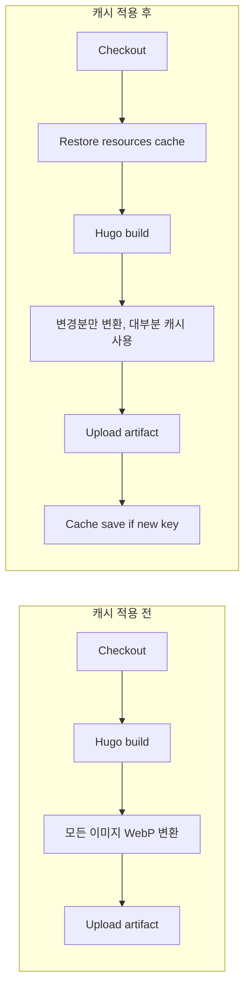

GitHub Actions에서 Hugo 사이트를 빌드·배포할 때, 레이아웃에서 `Resize "… webp"`나 `Fill "… webp"`를 쓰면 **매 실행마다** 콘텐츠·커버 이미지가 WebP로 다시 변환된다. 이미지가 많을수록 빌드 시간이 길어지고, runner는 매번 새 환경이라 이전 빌드의 캐시를 쓰지 못한다. 이 글에서는 **Hugo의 resources 캐시와 HUGO_CACHEDIR을 GitHub Actions cache로 저장·복원**해, 변경된 소스만 다시 처리하도록 바꾼 방법을 정리한다. 실제로 적용한 변경은 [커밋 e703f33](https://github.com/42jerrykim/42jerrykim.github.io/commit/e703f334e384ab2f38e6a5a52132cb09d9b2e630)(`.gitignore`에 `.hugo_cache` 추가, `deploy.yml`에 캐시 단계 및 `HUGO_CACHEDIR` 수정)에서 diff로 확인할 수 있다.

## 문제: 매번 끝도 없이 도는 WebP 변환

Hugo는 이미지 리소스를 `resources/_gen`(기본 `resourceDir/_gen`)에 캐시한다. 한 번 변환한 결과는 같은 빌드 안에서뿐 아니라, 다음 빌드에서도 **같은 경로에 캐시가 있으면** 재사용한다. 그런데 CI에서는:

- 워크플로가 끝날 때마다 runner가 정리되므로 `resources` 디렉터리가 사라진다.
- `HUGO_CACHEDIR`를 `runner.temp`로 두면, 그 경로도 runner와 함께 날아간다.

그래서 두 번째, 세 번째 푸시부터도 “첫 빌드”처럼 모든 이미지를 다시 WebP로 변환하게 되고, 빌드 시간이 계속 길게 나온다.

## 해결: actions/cache로 resources와 .hugo_cache 복원

해결책은 **캐시할 경로를 워크스페이스 안에 두고**, `actions/cache`로 그 경로를 저장·복원하는 것이다. 그러면:

1. **첫 실행**: 캐시 없음 → 전체 빌드 → job 끝에 `resources`와 `.hugo_cache`가 캐시로 저장된다.
2. **이후 실행**: 캐시 복원 → Hugo가 기존 `resources/_gen`과 캐시 디렉터리를 보고 **변경된 이미지만** 다시 처리한다.

다른 Hugo 사이트에서는 이 방식으로 빌드 시간이 7초대에서 약 450ms 수준으로 줄어든 사례가 있다.

### 캐시 키 전략

캐시는 **입력(콘텐츠·레이아웃·설정)이 바뀔 때만** 갱신되면 된다. 그래서 키에 `hashFiles()`로 다음 디렉터리를 넣었다.

- `content/**`
- `layouts/**`
- `config/**`
- `assets/**`

이렇게 하면 이 중 하나라도 수정되면 새 키가 되어 새 캐시가 저장되고, 아무것도 안 바꾸면 이전 캐시가 그대로 복원된다. `restore-keys`에 `hugo-resources-${{ runner.os }}-`처럼 접두사만 두어, 정확한 키가 없어도 최근 캐시를 쓸 수 있게 했다.

## 구현: deploy.yml에 넣은 내용

Checkout 직후, Hugo/Node 설치 전에 **Restore Hugo resources cache** 단계를 넣었다.

```yaml
- name: Restore Hugo resources cache
  uses: actions/cache@v4
  with:
    path: |
      ./resources
      .hugo_cache
    key: hugo-resources-${{ runner.os }}-${{ hashFiles('content/**', 'layouts/**', 'config/**', 'assets/**') }}
    restore-keys: |
      hugo-resources-${{ runner.os }}-
```

그리고 **Build with Hugo** 단계에서 `HUGO_CACHEDIR`를 runner 임시 디렉터리가 아니라 워크스페이스 안으로 바꿨다.

```yaml
- name: Build with Hugo
  env:
    HUGO_CACHEDIR: ${{ github.workspace }}/.hugo_cache
    HUGO_ENVIRONMENT: production
    TZ: America/Los_Angeles
  run: |
    hugo \
      --gc \
      --minify \
      --baseURL "${{ steps.pages.outputs.base_url }}/"
```

이렇게 하면:

- **resources**: Hugo가 이미지 등 에셋 파이프라인 결과를 쓰는 `resources/_gen`이 워크스페이스에 생기고, 이 전체를 캐시 대상으로 둔다.
- **.hugo_cache**: 모듈·기타 파일 캐시를 워크스페이스의 `.hugo_cache`에 두고, 역시 캐시에 포함해 두 번째 실행부터는 다운로드·처리를 줄인다.

`.hugo_cache`는 로컬에서 생성돼도 커밋되지 않도록 `.gitignore`에 추가해 두는 것이 좋다.

위에서 정리한 내용은 다음 커밋 한 번에 반영했다.

- **[chore: Update .gitignore to include .hugo_cache and modify deploy workflow to cache Hugo resources](https://github.com/42jerrykim/42jerrykim.github.io/commit/e703f334e384ab2f38e6a5a52132cb09d9b2e630)**  
  - `.gitignore`: `.hugo_cache` 한 줄 추가.  
  - `.github/workflows/deploy.yml`: Checkout 직후 `Restore Hugo resources cache` 단계 추가(path: `./resources`, `.hugo_cache` / key: `hashFiles('content/**', 'layouts/**', 'config/**', 'assets/**')` / `restore-keys`), `Build with Hugo`의 `HUGO_CACHEDIR`를 `${{ github.workspace }}/.hugo_cache`로 변경.  
  커밋 메시지처럼 배포 시 캐시를 복원해 빌드 성능을 최적화하는 변경이다.

## 흐름 정리

캐시를 쓰기 전과 후의 차이는 아래와 같다.



- **캐시 적용 전**: 매번 Checkout → Hugo 빌드 → 전체 이미지 변환 → 아티팩트 업로드.
- **캐시 적용 후**: Checkout → **캐시 복원** → Hugo 빌드(대부분 캐시 사용) → 아티팩트 업로드 → 필요 시 새 키로 캐시 저장.

`actions/cache`는 job 종료 시 **같은 키가 없을 때만** 자동으로 저장하므로, 별도 save 단계는 넣지 않았다.

## 대안: repo에 캐시를 커밋하는 방식

캐시를 GitHub Actions가 아니라 **repo 안에 두고 싶다면**, `resources`(또는 `resources/_gen`)를 `.gitignore`에서 빼고, 로컬이나 별도 CI에서 한 번 빌드한 뒤 그 디렉터리를 커밋하는 방법도 있다. 그러면 Actions cache 용량·만료와 무관하게 항상 같은 캐시가 repo에 있게 된다. 대신 repo 용량이 늘고, 이미지·레이아웃·설정이 바뀔 때마다 그 캐시를 다시 빌드해 커밋해야 하며, 머지 시 충돌 가능성도 있다. 일반적으로는 **Actions cache만으로 충분**하고, “캐시를 반드시 repo에 두고 싶을 때”만 repo 커밋 방식을 고려하면 된다.

## 요약

- GitHub Actions에서 Hugo 빌드 시 **WebP 변환 시간**이 길어지는 이유는, runner가 매번 새로 올라와 `resources`와 `HUGO_CACHEDIR`가 비어 있기 때문이다.
- **actions/cache**로 `./resources`와 `.hugo_cache`를 저장·복원하고, 캐시 키를 `content/**`, `layouts/**`, `config/**`, `assets/**` 기준 해시로 두면, 입력이 안 바뀐 실행에서는 캐시 히트로 빌드가 크게 짧아진다.
- `HUGO_CACHEDIR`를 `${{ github.workspace }}/.hugo_cache`로 두고 이 경로도 캐시에 넣으면, 이미지뿐 아니라 모듈·기타 캐시까지 재사용해 빌드 시간을 더 줄일 수 있다.

이 구성을 적용한 뒤부터는 푸시할 때마다 전체 WebP 변환이 반복되지 않고, 변경된 부분만 처리되므로 GitHub Actions 수행 시간이 눈에 띄게 짧아질 것이다.
