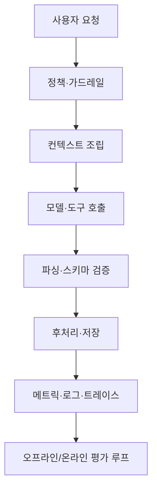

생성형 AI를 제품에 넣을 때 팀은 종종 **모델 선택**과 **프롬프트 문구**에만 시간을 쓴다. 그러나 실서비스에서 품질·안전·비용을 좌우하는 것은 종종 **모델 주변을 감싼 소프트웨어**—즉 **하네스(harness)**—다. 이 글에서는 **AI 하네스 엔지니어링**이 무엇인지, 어떤 층으로 나누어 설계하는지, 실무에서 무엇을 우선 검증해야 하는지를 정리하고, **Cursor IDE**에서 규칙·스킬·`AGENTS.md`로 같은 원리를 적용하는 방법을 덧붙인다. 에이전트형 코딩 도구에 적용한 설정 예는 [Everything Claude Code: 강력한 AI 코딩 에이전트 설정 가이드](/post/2026/2026-01-28-everything-claude-code/)에서도 **에이전트 하네스**라는 표현으로 다룬 바 있다.

---

## 하네스가 가리키는 것

전통적 소프트웨어에서 **테스트 하네스(test harness)**는 테스트 대상 모듈을 고립시키고, 입력을 주입하고, 결과를 검증하는 **실행·검증 골격**을 뜻한다. AI 쪽으로 옮기면 범위가 넓어진다.

- **추론 하네스(inference harness)**: API 호출, 컨텍스트 조립, 스트리밍 파싱, 재시도·백오프, 타임아웃, 비용·토큰 제한.
- **평가 하네스(evaluation harness)**: 고정된 입력 집합, 채점 기준(규칙 기반·LLM-as-judge·사람 평가), 버전별 회귀 비교, 리포트·대시보드.
- **에이전트 하네스(agent harness)**: 도구 호출 루프, 샌드박스·권한, 세션 상태, 훅·스킬 로딩, 멀티스텝 트레이스 수집.

**AI 하네스 엔지니어링**은 위 골격을 **제품 요구사항에 맞게 설계·구현·운영**하는 일이다. 모델 가중치를 만드는 일과는 구분되지만, 사용자가 체감하는 **안정성과 재현성**은 대부분 여기서 결정된다.

## 구성 요소를 한 번에 보기

하나의 서비스에 여러 층이 동시에 존재할 수 있다. 아래는 요청이 들어온 뒤 **관측 가능한 산출물**까지 이어지는 흐름을 단순화한 그림이다.

- **정책·가드레일**: PII 마스킹, 허용 도메인, 출력 필터.
- **컨텍스트 조립**: RAG 청크, 메모리 요약, 시스템·개발자 메시지 템플릿.
- **파싱·스키마 검증**: JSON 모드, 구조화 출력, 실패 시 재질문.
- **평가 루프**: 배포 전 회귀 세트와 배포 후 샘플링 품질 모니터링.

## 평가 하네스: 회귀를 제품처럼 다루기

프롬프트나 모델 버전이 바뀔 때마다 **이전에 통과하던 케이스가 깨지는 현상**은 흔하다. 평가 하네스의 목표는 이를 **코드 변경과 동일한 수준의 회귀 의식**으로 끌어올리는 것이다.

실무에서 유효한 패턴은 다음과 같다.

- **고정 스위트**: 대표 사용자 의도·엣지 케이스·실패 사례를 카탈로그화하고, 버전마다 동일 조건으로 실행한다.
- **다층 채점**: 정답 문자열 일치만으로는 부족한 영역은 규칙·임베딩 유사도·별도 평가 모델을 병행한다.
- **비용·지연 포함**: 품질뿐 아니라 토큰·호출 횟수·p95 지연을 메트릭으로 남긴다.

연구 쪽에서는 에이전트를 에이전트로 최적화하는 평가틀을 제안한 **VeRO** 같은 작업이 하네스를 명시적으로 다룬다([arXiv:2602.22480](https://arxiv.org/abs/2602.22480)). 코딩 에이전트 벤치마크를 위한 **AgentBench**는 저장소·데이터셋·실행 파이프라인을 묶은 **오픈소스 하네스**에 가깝다([eth-sri/agentbench](https://github.com/eth-sri/agentbench)). 반복 실행·스코어링·리포트를 빠르게 갖추고 싶다면 **promptfoo**처럼 평가 워크플로에 특화된 도구를 붙이는 선택도 있다([promptfoo/promptfoo](https://github.com/promptfoo/promptfoo)).

## 에이전트 하네스: 도구와 샌드박스

에이전트는 **한 번의 완결 응답**이 아니라 **다단계 행동**을 전제로 한다. 하네스는 여기서 **환경을 통제**한다.

- **도구 스키마**: 이름·인자·반환 형식을 엄격히 정하고, 잘못된 호출은 하네스가 거절한다.
- **샌드박스**: 파일 시스템·쉘·네트워크 권한을 최소화하고, 세션 단위로 격리한다.
- **트레이스**: 각 스텝의 도구 입출력·모델 사고(노출 정책에 맞게)·에러를 묶어 저장해 사후 분석 가능하게 한다.

이때 **하네스 없이** 모델에게만 “조심해”라고 요구하는 것은 운영 한계가 빠르게 드러난다. 제어는 **인터페이스와 런타임**에 두는 편이 낫다.

## 추론 하네스: 운영 안정성

추론 경로에서는 다음이 반복적으로 이슈가 된다.

- **부분 응답·스트림 중단**: 클라이언트 타임아웃과 서버 타임아웃을 분리하고, idempotency 키나 세이프 재시도 정책을 둔다.
- **구조화 출력 실패**: 스키마 검증 실패 시 자동 재시도 횟수 상한과 폴백(단순 텍스트 모드 등)을 정한다.
- **캐시·중복 호출**: 동일 입력에 대한 캐시 키 설계는 비용 절감과 동시에 **오래된 답변** 위험이 있으므로 TTL·무효화 정책을 명시한다.

## Cursor IDE로 하네스 엔지니어링하기

**Cursor**는 별도의 런타임 서버가 아니라, 저장소 안에서 에이전트가 **무엇을 읽고·어떤 순서로 따를지**를 고정하는 **개발 환경 층의 하네스**에 가깝다. 앞서 말한 **컨텍스트 조립**과 **정책·가드레일**을 코드베이스에 버전 관리된 파일로 두는 패턴이 핵심이다. 공식 개요는 [Cursor 문서](https://cursor.com/docs)에서 확인할 수 있다.

### 1. 저장소 루트의 `AGENTS.md`

프로젝트 루트에 **`AGENTS.md`**를 두면, Cursor 에이전트에게 **항상 참고할 저장소 지침**을 한곳에 모을 수 있다. 이 저장소에서는 예를 들어 **`.cursor/rules/`** 아래 규칙과 **`.cursor/skills/`** 스킬을 먼저 읽도록 안내하고, 콘텐츠 경로·태그·링크 검증 같은 **비협상(non-negotiable) 요구**를 명시한다. 이는 에이전트 하네스에서 말하는 **세션 전역 시스템 메시지**에 해당하는 층이다.

### 2. `.cursor/rules/` — 경로·주제별 가드레일

**Project Rules**(`.cursor/rules/*.mdc`)는 **globs**로 특정 파일 패턴을 편집할 때만 붙거나, **alwaysApply**로 모든 요청에 걸리게 할 수 있다. “이 폴더의 마크다운을 고칠 때는 이 규칙을 따른다”처럼 **도구 스키마와 권한 범위**를 코드베이스에 선언하는 형태다. 평가 하네스와 연결하면, **규칙 위반(태그 개수·draft·Mermaid 문법 등)을 CI나 에이전트 QA 단계에서 다시 짚게** 만들기 쉽다.

### 3. `.cursor/skills/` — 절차형 워크플로(미니 하네스)

**Agent Skills**는 `SKILL.md`에 **언제 쓰는지·어떤 순서로 할 일인지**를 적어 두고, 에이전트가 해당 작업을 할 때 그 절차를 따르게 한다. 예를 들어 이 저장소의 **`.cursor/skills/blog-agent-pipeline/SKILL.md`**는 Research → Draft → QA → PublishPrep처럼 **단계형 파이프라인**을 강제한다. 이는 제품의 **평가·배포 전 검증 루프**를 문서화한 것과 같은 역할을 한다.

### 4. 컨텍스트 주입: `@` 멘션과 MCP

채팅에서 **`@`로 규칙·파일·폴더**를 붙이면, 그 순간의 **컨텍스트 조립**이 명시적으로 이루어진다. “매번 같은 설명을 반복하지 않게 하려면” 규칙·스킬에 올려 두고, 일회성 배경만 `@`로 넘기면 된다. **MCP**(Model Context Protocol)로 브라우저·추가 도구를 붙이면 **에이전트 하네스의 도구 레이어**를 확장할 수 있지만, 권한·로그·비밀 노출 범위를 **추론 하네스**와 동일한 기준으로 다시 점검해야 한다.

### 5. 실무 적용 순서 제안

1. **`AGENTS.md`로 저장소 전역 원칙**을 정리한다.  
2. **반복되는 실패(링크 미검증·메타 누락 등)**를 `.cursor/rules`로 고정한다.  
3. **같은 작업을 여러 번 시키는 경우**만 스킬로 파이프라인화한다.  
4. **Claude Code 등 다른 에이전트 하네스**와 병행할 때는 역할을 나눈다(예: Cursor는 저장소 규칙·리뷰, 별도 CLI는 실행 샌드박스). [Everything Claude Code…](/post/2026/2026-01-28-everything-claude-code/) 글의 `.claude` 설정은 **다른 제품의 에이전트 하네스**로, Cursor의 `.cursor/`와 **같은 문제를 다른 층에서** 보완하는 관계로 이해하면 된다.

## 설계 시 체크리스트

| 영역 | 점검 질문 |
|------|-----------|
| 재현성 | 동일 입력·동일 시드(가능한 범위)·동일 도구 버전에서 결과가 얼마나 재현되는가? |
| 관측성 | 요청 ID별로 모델·도구·채점 단계를 추적할 수 있는가? |
| 안전 | 비밀·키·개인정보가 로그·트레이스에 남지 않도록 마스킹되는가? |
| 회귀 | 프롬프트·모델·RAG 인덱스 변경 시 자동으로 돌리는 평가 스위트가 있는가? |
| 비용 | 호출당·사용자당 한도와 알림이 있는가? |

## 마무리

**AI 하네스 엔지니어링**은 “모델을 감싼 코드”를 **제품 품질의 일급 시민**으로 취급하는 일이다. 추론·평가·에이전트 세 층을 나누어 보면, 팀이 어디에 기술 부채를 쌓고 있는지(예: 평가 없이 프롬프트만 수정)도 분명해진다. Cursor처럼 **에이전트 친화 IDE**를 쓸 때는 `.cursor/`와 `AGENTS.md`로 그 하네스를 저장소에 박아 두면, 개인 채팅 습관에 덜 의존하고 팀 단위로 품질을 맞추기 쉽다. 배포 전에는 평가 하네스로 회귀를 잡고, 배포 후에는 메트릭·샘플링으로 드리프트를 감시하는 이중 루프를 갖추는 것을 권장한다.

## 참고 및 출처

- Cursor IDE 문서 ([https://cursor.com/docs](https://cursor.com/docs))
- VeRO: agents optimizing agents에 대한 평가 하네스 ([arXiv:2602.22480](https://arxiv.org/abs/2602.22480))
- AgentBench: 코딩 에이전트 등 평가를 위한 오픈소스 프로젝트 ([https://github.com/eth-sri/agentbench](https://github.com/eth-sri/agentbench))
- promptfoo: LLM·에이전트 프롬프트 평가 도구 ([https://github.com/promptfoo/promptfoo](https://github.com/promptfoo/promptfoo))
