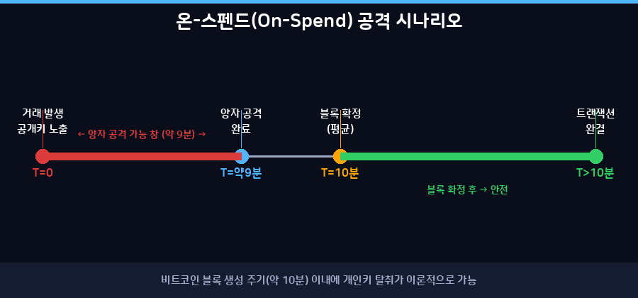
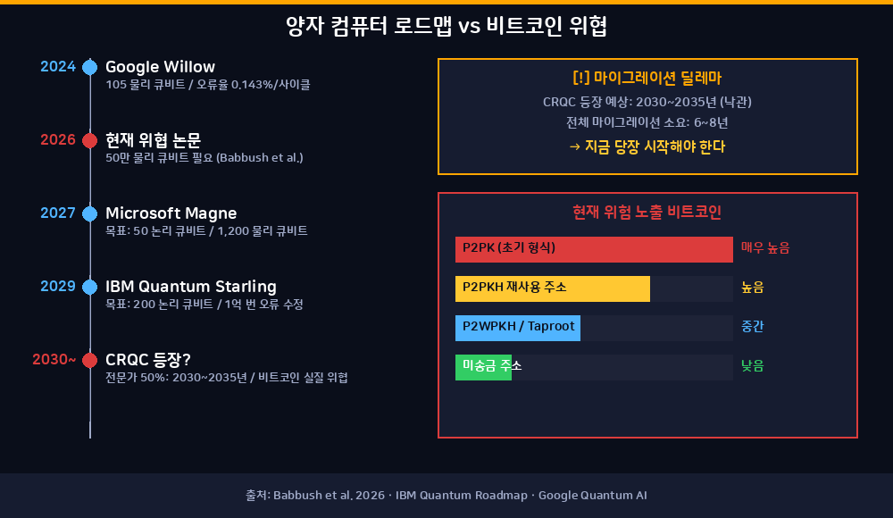

## "9분 해킹"의 진실

2026년 3월, Google Quantum AI 연구팀이 조용히 한 편의 논문을 공개했다. 제목은 **"Securing Elliptic Curve Cryptocurrencies against Quantum Vulnerabilities"**. Ryan Babbush, Craig Gidney, Hartmut Neven 등이 저자로 이름을 올린 이 논문은 블록체인 커뮤니티에 충격을 줬다.

언론은 "양자 컴퓨터가 비트코인을 **9분 만에 해킹**할 수 있다"고 보도했다. 하지만 이 문장만으로는 맥락이 빠진다. 정확히 어떤 상황에서, 어떤 조건이 갖춰졌을 때의 이야기인지 이해해야 한다.

---

## 비트코인은 어떤 암호를 쓰나

비트코인은 **ECDSA(Elliptic Curve Digital Signature Algorithm)** 를 사용한다. 구체적으로는 `secp256k1` 타원곡선 위에서 256비트 개인키로 공개키를 생성한다.

핵심 원리는 **단방향 함수**다.

- 개인키 → 공개키: 쉽다 (타원곡선 곱셈)
- 공개키 → 개인키: 현재 고전 컴퓨터로는 사실상 불가능 (수조 년 소요)

비트코인 지갑 주소는 공개키의 해시다. 거래를 보낼 때 공개키가 처음으로 블록체인에 노출된다. 한 번도 송금하지 않은 주소는 공개키 자체가 숨겨져 있다.

---

## 왜 양자 컴퓨터가 위협인가

1994년 수학자 Peter Shor가 발표한 **쇼어 알고리즘(Shor's Algorithm)** 이 문제의 핵심이다.

고전 컴퓨터가 이산로그 문제(ECDLP)를 푸는 데 지수함수 시간이 걸리는 반면, 양자 컴퓨터는 **다항식 시간**에 풀 수 있다. 즉, 충분한 성능의 양자 컴퓨터가 존재한다면 공개키에서 개인키를 역산할 수 있다.

이것이 가능해지는 조건이 바로 **CRQC(Cryptanalytically Relevant Quantum Computer)** 의 등장이다.

---

## Google 논문이 말하는 것

Babbush et al.의 2026년 논문은 이전 추정치보다 **20배** 적은 물리 큐비트로 공격이 가능하다는 것을 보였다.

| 항목 | 추정치 |
|------|--------|
| 필요 논리 큐비트 | 1,200~1,450개 |
| 필요 물리 큐비트 | 50만 개 미만 |
| Toffoli 게이트 수 | 7,000만~9,000만 개 |
| 공격 실행 시간 | **수 분** |

그리고 여기서 **"9분"** 이 등장한다.

비트코인의 블록 생성 주기는 평균 **10분**이다. 누군가 거래를 발생시키는 순간 공개키가 메모리풀(mempool)에 노출된다. 이 거래가 블록에 포함되기 전 10분의 창 안에, 양자 컴퓨터가 공개키에서 개인키를 역산해 먼저 자금을 탈취하는 **"온-스펜드(on-spend) 공격"** 이 이론적으로 가능하다.

9분은 그 공격 시나리오에서의 실행 시간 추정치다.

---

## 지금 당장 가능한가

**아니다.** 현재로서는 불가능하다.

Google의 최신 양자 칩 **Willow(2024년 말 공개)** 는 105개의 물리 큐비트를 탑재했다. 이 논문이 요구하는 50만 개와는 수천 배 차이가 난다. IBM의 2029년 로드맵도 200개 논리 큐비트 수준이다.

전문가들의 CRQC 등장 시점 예측:

| 시기 | 가능성 |
|------|--------|
| 2030년 | 낮음 (전문가 설문 기준 10~34%) |
| 2030~2035년 | 중간 (약 50%의 전문가 동의) |
| 2040~2045년 | 비교적 현실적 |
| 2055년 이후 | 보수적 추정 |

하지만 "아직 안 됐으니 안전하다"는 논리도 위험하다. 블록체인 공급망 전체를 마이그레이션하는 데 걸리는 시간이 **6~8년**으로 추산되기 때문이다. 지금 대비하지 않으면 나중에 시간이 부족할 수 있다.

---

## 비트코인의 30%가 위험에 처해 있다

현재 비트코인 공급량 중 **약 30%(690만 BTC, 2026년 4월 기준 약 483조 원)** 가 양자 공격에 노출된 상태로 추산된다.

### 주소 유형별 위험도

| 주소 유형 | 공개키 노출 시점 | 위험도 |
|-----------|----------------|--------|
| P2PK (초기 형식) | 주소 생성 시 | 매우 높음 |
| P2PKH (Legacy) | 첫 송금 시 | 높음 (재사용 주소) |
| P2WPKH (SegWit) | 첫 송금 시 | 중간 |
| P2TR (Taproot) | 첫 송금 시 | 중간 |

특히 **P2PK 형식**은 2009~2010년 초기 비트코인에서 사용됐다. 이 주소들은 공개키가 이미 블록체인에 영구적으로 기록되어 있다. 사토시 나카모토 추정 보유분 약 100만 BTC도 대부분 이 형식이다(단, 한 번도 송금하지 않아 공개키 자체는 노출되지 않은 경우도 있다).

---

## 업계의 대응 전략

### BIP 360
비트코인 커뮤니티에서 논의 중인 **BIP 360(Pay-to-Merkle-Root)** 은 현재의 Taproot 형식에서 양자 취약 키패스 지출을 제거하는 소프트포크 제안이다. NIST가 권고하는 세 가지 양자 내성 서명 알고리즘을 지원한다.

### 단계적 마이그레이션
업계에서 제안 중인 로드맵:

- **활성화 후 3년**: 취약 주소 형식으로의 신규 예치 차단
- **활성화 후 5년**: 취약 주소 형식의 합의 레벨 무효화
- 전체 마이그레이션 예상 기간: 최소 4~8년

### "지금 수집, 나중에 복호화(Harvest Now, Decrypt Later)"
이미 블록체인에 기록된 공개키 데이터는 누군가 지금 수집해두었다가, 훗날 CRQC가 등장했을 때 복호화하는 시나리오도 이론적으로 가능하다. 미국 연방준비제도도 이 위협에 대한 보고서를 발표했다.

---

## 2025~2026년 양자 컴퓨팅 주요 동향

- **Google Willow**: 105 물리 큐비트, 오류율 0.143%/사이클. 이전 대비 지수적 오류 감소 달성
- **IBM**: 2029년까지 200 논리 큐비트 목표, 1억 번 오류 수정 연산 가능
- **Microsoft + Atom Computing**: 2027년 초 50 논리 큐비트 "Magne" 머신 가동 예정
- **Oxford Ionics**: 2큐비트 게이트 충실도 99.99% 달성
- **BTQ**: 2026년 2분기 비트코인 양자 전환 마이그레이션 도구 메인넷 출시 예정

양자 오류 수정(QEC)이 업계 전반의 최우선 과제로 부상한 한 해였다.

---

## 결론: 9분은 경고다

"양자 컴퓨터가 비트코인을 9분에 해킹한다"는 문장은 정확하지 않다. 정확히는 이렇다:

> "충분한 성능의 내결함성 양자 컴퓨터가 존재한다면, 비트코인 거래가 메모리풀에 노출된 후 블록 확정 이전 10분 창 안에 개인키를 탈취하는 공격이 이론적으로 약 9분에 완료될 수 있다."

아직 그런 컴퓨터는 없다. 하지만 Google, IBM, Microsoft가 경쟁적으로 달려가는 방향은 명확하다. 비트코인 커뮤니티가 지금 이 위협을 진지하게 논의하는 이유는 대비에 걸리는 시간이 위협 실현보다 더 오래 걸릴 수 있기 때문이다.

양자 컴퓨팅의 위협은 내일의 문제가 아니라, 오늘부터 준비해야 할 문제다.

---

## 참고 자료

- Babbush et al. (2026). *Securing Elliptic Curve Cryptocurrencies against Quantum Vulnerabilities*. arXiv:2603.28846
- Google Research Blog: *Safeguarding Cryptocurrency by Disclosing Quantum Vulnerabilities Responsibly*
- Google Quantum AI Cryptocurrency Whitepaper
- Bitcoin Optech: Quantum Resistance
- CoinDesk: *Bitcoin's $1.3 Trillion Security Race* (April 2026)
- BIP 360 Official Repository (bip360.org)
- Federal Reserve: *Harvest Now, Decrypt Later* (2025)
