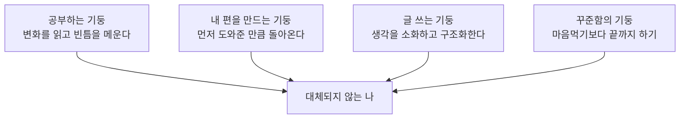

"사주팔자"는 태어난 순간 정해져서 바꿀 수 없는 운명처럼 여겨진다. 그런데 관점디자이너 박용후는 정반대 이야기를 한다. 정해진 사주에 끌려다니지 말고, **스스로 새로운 사주를 설계하라**는 것이다. AI가 지식과 정보를 순식간에 대체하는 시대에, 무엇이 사람을 대체 불가능하게 만드는지를 그는 네 개의 기둥으로 정리한다. 이 글은 그 강연 내용을 정리하고, 각 기둥이 실제로 왜 작동하는지를 풀어본다.



**이 글을 추천하는 대상**
- AI 시대에 자신의 경쟁력이 무엇인지 고민하는 사람
- 인간관계, 글쓰기, 꾸준함 같은 "오래된 능력"의 가치를 다시 보고 싶은 사람
- 정해진 틀이 아니라 자기만의 기준으로 인생을 설계하고 싶은 사람

---

## 핵심 개념: 정해진 사주가 아니라 설계하는 사주

박용후가 말하는 "새로운 사주"는 운명론에 대한 반박이다. 사주팔자가 가정하는 것은 "이미 정해진 그릇"이고, 그 그릇 안에서 운을 기다리는 태도다. 반면 그가 제안하는 사주는 **스스로 그릇을 만드는 행위**에 가깝다. 공부, 인간관계, 글쓰기, 꾸준함이라는 네 개의 기둥을 의식적으로 세우면, 타고난 조건과 무관하게 자신만의 무기를 갖출 수 있다는 논리다.

이 틀이 흥미로운 이유는, 네 기둥이 전부 **AI가 대신해주기 어려운 영역**에 몰려 있다는 점이다. 정보 검색과 단순 요약은 AI가 압도적으로 빠르지만, 생각의 빈틈을 찾는 판단력, 사람 사이의 신뢰, 자기 생각을 구조화하는 글쓰기, 그리고 무엇보다 끝까지 해내는 꾸준함은 여전히 사람의 영역이다.

---

## 성공하는 사람들의 네 가지 기둥

### 1. 공부하는 기둥 (01:32–04:33)

박용후가 말하는 "공부"는 시험을 위한 암기가 아니다. 세상이 어떻게 바뀌고 있는지를 읽어내고, **내 생각의 빈틈**을 찾아 메우는 과정이다. 그는 이 과정에서 AI를 적극적으로 쓰라고 권한다. AI는 답을 그냥 주는 도구가 아니라, "내가 놓친 전제는 무엇인가", "내 논리가 어디서 허술한가"를 되묻는 상대로 쓸 때 가장 값어치가 크다.

이 관점은 흔한 "AI 때문에 공부가 필요 없다"는 주장과 정반대다. 오히려 AI가 빈틈을 빠르게 드러내 줄수록, 그 빈틈을 스스로 채울 판단력과 기초 지식이 더 중요해진다. 도구가 좋아질수록 도구를 제대로 쓰는 사람과 그렇지 못한 사람의 격차는 줄어들지 않고 벌어진다.

### 2. 내 편을 만드는 기둥 (04:36–06:44)

두 번째 기둥은 인간관계의 작동 원리에 관한 것이다. 핵심 문장은 단순하다. **나를 도와줄 사람의 숫자는, 내가 먼저 도와준 사람의 숫자와 같다.** 도움을 받기 전에 먼저 베푸는 행동이 누적되면, 상대에게는 일종의 부채 의식(빚진 마음)이 쌓이고, 이것이 결국 나를 지지하는 관계망으로 돌아온다는 것이다.

이 법칙이 인간관계를 계산적으로 만들라는 뜻은 아니다. 오히려 "받을 생각보다 먼저 줄 생각"을 습관으로 만들라는 제안에 가깝다. 인맥을 넓히려고 애쓰는 것보다, 주변 사람을 실제로 도와준 경험의 총량을 늘리는 쪽이 훨씬 확실한 관계 자산이 된다.

### 3. 글 쓰는 기둥 (06:45–08:55)

세 번째 기둥은 글쓰기다. 박용후는 글쓰기를 "생각의 소화 과정"이라고 표현한다. 머릿속에 뒤섞여 있는 생각은 그 자체로는 활용하기 어렵다. 글로 옮기는 과정에서 비로소 인과관계가 정리되고, 모순이 드러나고, 핵심이 추려진다. 즉 글쓰기는 생각을 "기록"하는 행위가 아니라 생각을 "완성"하는 행위다.

AI 시대에 이 능력이 더 중요해지는 이유도 같은 맥락이다. AI에게 좋은 질문을 던지고 결과를 판단하려면, 자기 생각을 먼저 명확한 언어로 표현할 수 있어야 한다. 생각이 구조화되지 않은 사람은 AI를 써도 모호한 답만 얻고, 생각이 구조화된 사람은 같은 도구로 훨씬 정교한 결과를 끌어낸다.

### 4. 꾸준함의 기둥 (13:35–14:54)

마지막 기둥은 꾸준함이다. 마음먹는 것 자체는 누구나 할 수 있다. 새해 결심, 다이어트 계획, 새로운 습관은 누구나 한 번쯤 시작해 본다. 차이를 만드는 것은 "끝까지 해내는 행동"이다. 박용후는 약 6개월간의 꾸준한 노력이 두 가지를 만든다고 말한다. 하나는 스스로에 대한 성취감이고, 다른 하나는 그 모습을 지켜본 타인의 신뢰다.

이 기둥이 앞의 세 기둥을 떠받치는 구조라는 점도 짚을 만하다. 공부, 인간관계, 글쓰기 모두 단발성 이벤트가 아니라 누적되는 행위다. 꾸준함이 없으면 나머지 세 기둥은 한두 번의 시도로 끝나고, 쌓이지 않는다.

---

## 핵심 조언 1: 사전적 정의대로 살지 마세요 (08:22–10:42)

강연에서 가장 도발적인 제안은 이것이다. 성공한 사람들은 단어를 **사전적 정의가 아니라 자신만의 철학으로 재정의**한다는 것이다. 예를 들어 "성공"이라는 단어를 사전 그대로 받아들이면 누군가의 기준(보통은 사회적으로 합의된 기준)을 그대로 따르게 된다. 반대로 "성공이란 나에게 무엇인가"를 스스로 정의하면, 비교와 박탈감에서 한 발 떨어져 자기만의 기준으로 판단할 수 있다.

박용후가 제안하는 실천은 구체적이다. 인생에서 중요한 단어 5개를 정하고, 그 단어를 자신의 언어로 다시 정의해 보는 것이다. "성공", "행복", "노력", "관계", "시간" 같은 단어가 후보가 될 수 있다. 같은 단어라도 사람마다 다르게 정의하면, 같은 상황에서도 전혀 다른 반응과 선택이 나온다.

| 단어 | 사전적 정의 (예시) | 재정의 방향 (예시) |
|------|---------------------|----------------------|
| 성공 | 목적한 바를 이룸 | 어제의 나보다 한 걸음 나아간 상태 |
| 행복 | 만족스럽고 즐거운 상태 | 내가 정한 기준에 가까워지는 과정 자체 |
| 노력 | 힘을 들여 애를 씀 | 꾸준함으로 전환되기 전 단계의 시도 |

이 표는 강연의 취지를 보여주기 위한 예시이며, 정답이 아니라 "스스로 정의해 보라"는 제안의 출발점으로 보는 것이 맞다.

---

## 핵심 조언 2: 태도의 선택 (15:14–15:47)

마지막 조언은 환경과 반응을 구분하는 것이다. 박용후는 삶의 환경(어떤 조건에 놓이는가)은 선택할 수 없지만, **그 자극에 어떻게 반응할지, 어떤 태도를 취할지는 언제나 선택할 수 있다**고 말한다. "자극과 반응 사이에는 빈 공간이 있고, 그 공간에서의 선택이 결과를 바꾼다"는 심리학의 오래된 통찰과 같은 방향을 가리킨다.

실천적으로는 "내 마음을 읽는 감각"을 키우는 것이 핵심이다. 화가 나거나 불안할 때 즉시 반응하기 전에, 지금 내 마음 상태가 무엇인지 한 번 짚어보는 습관이다. 이 습관이 쌓이면, 같은 상황에서도 끌려가는 대신 스스로 인생을 끌고 가는 쪽에 가까워진다.

---

## 마무리

네 개의 기둥은 서로 독립적이지 않다. 공부로 빈틈을 메우고, 그 생각을 글로 정리하고, 그 과정에서 만들어진 신뢰로 내 편을 늘리고, 이 모든 것을 꾸준히 반복하는 구조다. AI가 정보와 속도를 대체하는 시대일수록, 판단력·관계·표현력·지속력처럼 시간이 누적되어야만 만들어지는 능력의 가치는 오히려 올라간다.

| 기둥 | 핵심 메시지 | 한 줄 실천 |
|------|-------------|------------|
| 공부 | 변화를 읽고 빈틈을 메운다 | AI에게 내 논리의 허점을 되묻기 |
| 내 편 | 도움은 먼저 베푼 만큼 돌아온다 | 받기 전에 먼저 도와줄 한 사람 찾기 |
| 글쓰기 | 생각은 글로 써야 완성된다 | 하루 한 단락, 생각을 문장으로 정리하기 |
| 꾸준함 | 마음먹기보다 끝까지 하기 | 6개월짜리 작은 약속 하나 지키기 |

여기에 더해, 인생에서 중요한 단어 5개를 직접 정의해 보는 것, 그리고 자극에 대한 반응을 스스로 선택하는 감각을 키우는 것이 강연 전체를 관통하는 태도다.

## 참고 및 출처

- 박용후, "AI 시대에 대체되지 않는 나만의 무기 갖추기" — <https://youtu.be/VuDmehbjdhA>
