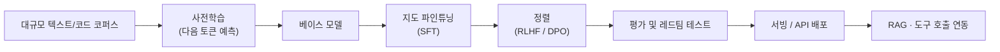

"LLM"이라는 단어는 이제 개발자뿐 아니라 일반 사용자에게도 익숙하다. 그런데 막상 "LLM이 정확히 무엇이고, GPT·Claude·Gemini·Llama는 서로 무엇이 다른가?"라고 물으면 명확히 답하기 어려운 경우가 많다. 이 글은 **LLM(Large Language Model, 거대 언어 모델)**을 처음 정리하거나 다시 점검하려는 독자를 위한 위키형 레퍼런스다. 핵심 개념, 등장부터 현재까지의 역사, 대표 모델 비교, 실전 활용 사례, 그리고 한계까지 한 곳에 모았다.

---

## LLM이란 무엇인가: 핵심 개념

**LLM(Large Language Model, 거대 언어 모델)**은 방대한 텍스트 데이터를 학습해 다음에 올 단어(또는 토큰)를 확률적으로 예측하도록 훈련된 신경망 모델이다. 수십억~수조 개의 **파라미터(Parameter)**(모델이 학습 과정에서 조정하는 가중치 값)를 가지며, 파라미터 수가 클수록 더 복잡한 패턴을 표현할 수 있지만 그만큼 학습·추론 비용도 커진다.

### Transformer와 어텐션

현대 LLM은 거의 예외 없이 2017년 구글이 발표한 **Transformer** 아키텍처를 기반으로 한다. Transformer의 핵심은 **셀프 어텐션(Self-Attention)**으로, 입력 문장의 각 토큰이 다른 모든 토큰과의 관련도를 계산해 문맥을 반영한다. RNN·LSTM처럼 순차적으로 처리하지 않고 병렬 계산이 가능해, 대규모 데이터와 GPU 클러스터를 활용한 학습이 현실적으로 가능해졌다.

### 토큰화와 컨텍스트 윈도우

모델은 텍스트를 그대로 읽지 않는다. **토큰화(Tokenization)** 과정에서 텍스트를 서브워드 단위의 **토큰(Token)**으로 쪼개고, 각 토큰을 숫자 벡터로 변환한 뒤 처리한다. 영어는 단어 1개가 대략 1.3토큰, 한국어는 음절·형태소 단위로 더 잘게 쪼개지는 경향이 있어 같은 분량이라도 한국어가 토큰을 더 많이 소비한다. 모델이 한 번에 참조할 수 있는 토큰 수의 상한이 **컨텍스트 윈도우(Context Window)**이며, 2026년 기준 상용 모델은 수십만 토큰까지 지원한다.

### 학습 단계: 사전학습 → 파인튜닝 → 정렬

LLM은 보통 세 단계를 거쳐 만들어진다.

1. **사전학습(Pre-training)**: 인터넷 텍스트, 코드, 책 등 대규모 코퍼스로 "다음 토큰 예측"을 반복 학습. 가장 많은 연산 자원이 소비되는 단계다.
2. **지도 파인튜닝(Supervised Fine-Tuning, SFT)**: 사람이 작성하거나 검수한 질의응답 예시로 모델이 지시를 따르도록 추가 학습.
3. **정렬(Alignment)**: **RLHF(Reinforcement Learning from Human Feedback)** 또는 **DPO(Direct Preference Optimization)** 등으로 사람의 선호에 맞춰 응답을 조정. 유해하거나 부정확한 출력을 줄이고 지시 순응도를 높이는 단계다.

### 임베딩과 RAG

**임베딩(Embedding)**은 텍스트의 의미를 고차원 벡터 공간의 한 점으로 표현한 것이다. 의미가 비슷한 문장은 벡터 공간에서 가까운 위치에 놓이므로, 벡터 유사도 검색으로 의미 기반 검색이 가능해진다. 이 성질을 활용한 것이 **RAG(Retrieval-Augmented Generation, 검색 증강 생성)**로, 모델이 답변하기 전에 외부 문서·데이터베이스에서 관련 정보를 검색해 프롬프트에 추가한 뒤 생성하게 만든다. 모델의 사전학습 지식만으로는 다룰 수 없는 최신 정보나 사내 비공개 데이터를 답변에 반영할 때 핵심적으로 쓰인다.

### 환각과 양자화

**환각(Hallucination)**은 모델이 사실이 아닌 내용을 그럴듯하게 생성하는 현상이다. LLM은 확률적으로 가장 그럴듯한 다음 토큰을 생성할 뿐 사실 검증 절차가 내장되어 있지 않기 때문에 구조적으로 발생한다. **양자화(Quantization)**는 모델 가중치의 정밀도(예: 16비트 → 4비트)를 낮춰 메모리 사용량과 추론 속도를 개선하는 기법으로, 정확도와 자원 효율 사이의 트레이드오프를 가진다.

---

## LLM의 역사: 주요 이정표

| 연도 | 사건 | 의미 |
|------|------|------|
| 2017 | "Attention Is All You Need" 논문 발표 | Transformer 아키텍처 등장, 이후 모든 LLM의 기반이 됨 |
| 2018 | BERT, GPT-1 공개 | 사전학습-파인튜닝 패러다임이 NLP 표준으로 자리잡음 |
| 2020 | GPT-3 공개 (1750억 파라미터) | "Few-Shot Learning"으로 별도 파인튜닝 없이 지시만으로 다양한 작업 수행 가능성 입증 |
| 2022 | InstructGPT(RLHF) 연구 발표, ChatGPT 공개 | 정렬 기법으로 일반 사용자 친화적 대화형 AI 대중화 |
| 2023 | GPT-4, Claude 2, Llama 2, Gemini(구 Bard) 등장 | 멀티모달 입력, 오픈소스 가중치 공개 모델 경쟁 본격화 |
| 2024 | Claude 3 시리즈, Llama 3, Mistral·Qwen·DeepSeek 등 오픈 웨이트 모델 확산 | 비용 대비 성능 경쟁, 100만 토큰급 컨텍스트 윈도우 등장 |
| 2025 | 에이전트형 LLM·MCP(Model Context Protocol) 도구 연동 확산 | 단순 응답 생성을 넘어 도구 호출·코드 실행·컴퓨터 조작까지 위임하는 "에이전트" 활용 확대 |

학습부터 배포까지의 표준 파이프라인을 도식화하면 다음과 같다.

---

## 대표 모델 비교

| 모델 패밀리 | 개발사 | 공개 정책 | 특징 |
|------------|--------|-----------|------|
| GPT (GPT-4, GPT-5 등) | OpenAI | 비공개(가중치 비공개, API 제공) | 가장 먼저 대중화된 대화형 LLM 계열, 광범위한 생태계와 플러그인 |
| Claude | Anthropic | 비공개(가중치 비공개, API 제공) | 안전성·정렬 연구에 집중, 긴 컨텍스트와 코딩 작업에 강점 |
| Gemini | Google DeepMind | 비공개(가중치 비공개, API 제공) | 멀티모달(텍스트·이미지·오디오·동영상) 통합 처리, 구글 생태계 연동 |
| Llama | Meta | 오픈 웨이트(라이선스 조건부 무료 사용) | 가중치 공개로 자체 호스팅·파인튜닝 가능, 연구·상업 생태계 확장 |
| Mistral | Mistral AI | 일부 오픈 웨이트 + 상용 API | 적은 파라미터로 높은 효율을 추구하는 유럽계 모델 |

각 모델의 정확한 파라미터 수·컨텍스트 윈도우·가격은 공급사가 자주 갱신하므로, 의사결정 시점에는 아래 "참고 및 출처"의 공식 문서를 직접 확인하는 것을 권장한다.

---

## 실전 활용 사례

### 코드 어시스턴트

Claude Code, GitHub Copilot, Cursor 등은 LLM이 코드베이스를 읽고 수정·테스트·커밋까지 수행하도록 돕는다. 단순 자동완성을 넘어 멀티파일 리팩토링, 테스트 작성, 디버깅까지 위임하는 흐름이 2025년 이후 빠르게 확산되었다.

### RAG 기반 사내 지식 검색

사내 문서, 위키, 코드 저장소를 임베딩해 벡터 데이터베이스에 저장하고, 질의 시 관련 문서를 검색해 LLM 프롬프트에 포함시키는 방식이다. 모델을 재학습하지 않고도 최신·비공개 정보를 답변에 반영할 수 있어 기업 도입 사례가 많다.

### 고객 지원 챗봇

FAQ·매뉴얼을 RAG로 연결한 챗봇이 1차 응대를 처리하고, 복잡한 사안만 사람에게 에스컬레이션하는 구조가 일반화되었다.

### 콘텐츠 생성·요약·번역

긴 문서를 요약하거나, 초안을 생성하거나, 다국어로 번역하는 작업에서 LLM은 작업 시간을 크게 단축시킨다. 다만 사실 검증과 최종 편집은 여전히 사람이 책임져야 한다.

### 에이전트 자동화

**MCP(Model Context Protocol)** 같은 표준을 통해 LLM이 외부 도구(브라우저, 터미널, API)를 직접 호출하도록 연결하면, 단순 응답 생성을 넘어 작업을 "대신 실행"하는 에이전트로 확장된다. 일정 조율, 데이터 수집, 반복 업무 자동화 등에 활용된다.

### 데이터 분석·리포팅

자연어 질의를 SQL이나 분석 코드로 변환해 데이터를 조회하고, 결과를 요약 리포트로 정리하는 워크플로우에도 LLM이 활용된다.

---

## 한계와 고려사항

| 항목 | 설명 |
|------|------|
| 환각 | 그럴듯하지만 사실이 아닌 내용을 생성할 수 있다. 중요한 결정에는 출처 검증이 필요하다 |
| 비용과 지연 | 모델이 클수록 추론 비용과 응답 지연이 커진다. 작업 난이도에 맞는 모델 크기 선택이 중요하다 |
| 데이터 프라이버시 | 외부 API로 민감 정보를 전송할 때는 데이터 보관·학습 활용 정책을 확인해야 한다 |
| 편향 | 학습 데이터에 내재된 편향이 출력에 반영될 수 있다 |
| 지식 컷오프 | 사전학습 시점 이후의 정보는 RAG나 도구 호출 없이는 알 수 없다 |
| 평가의 어려움 | 정량적 벤치마크 점수와 실제 업무 적합성이 항상 일치하지는 않는다 |

---

## 마무리

LLM은 Transformer라는 단일 아키텍처에서 출발해, 사전학습·파인튜닝·정렬이라는 표준 파이프라인을 거쳐 GPT·Claude·Gemini·Llama 같은 대표 모델로 갈라져 나갔다. 실무에서는 모델 자체보다 **RAG, 에이전트 도구 연동, 평가 체계**를 어떻게 설계하느냐가 품질을 좌우하는 경우가 많다. 에이전트 하네스 설계를 더 깊이 보고 싶다면 [AI 하네스 엔지니어링](/post/2026/2026-04-01-ai-harness-engineering/) 글을, RAG 전처리에 쓸 수 있는 도구를 보고 싶다면 [Jina AI Reader](/post/2025/2025-09-17-jina-ai-reader-url-to-llm-friendly-input/) 글을 참고하면 좋다.

## 참고 및 출처

- Attention Is All You Need (Transformer 원 논문) ([arXiv:1706.03762](https://arxiv.org/abs/1706.03762))
- Language Models are Few-Shot Learners (GPT-3 논문) ([arXiv:2005.14165](https://arxiv.org/abs/2005.14165))
- Training language models to follow instructions with human feedback (InstructGPT/RLHF 논문) ([arXiv:2203.02155](https://arxiv.org/abs/2203.02155))
- OpenAI ChatGPT 개요 ([https://openai.com/chatgpt/overview/](https://openai.com/chatgpt/overview/))
- Anthropic Claude ([https://www.anthropic.com/claude](https://www.anthropic.com/claude))
- Google Gemini API 문서 ([https://ai.google.dev/gemini-api/docs](https://ai.google.dev/gemini-api/docs))
- Meta Llama ([https://www.llama.com/](https://www.llama.com/))
- Mistral AI ([https://mistral.ai/](https://mistral.ai/))
- Hugging Face 모델 허브 ([https://huggingface.co/models](https://huggingface.co/models))
- Wikipedia: Large language model ([https://en.wikipedia.org/wiki/Large_language_model](https://en.wikipedia.org/wiki/Large_language_model))
