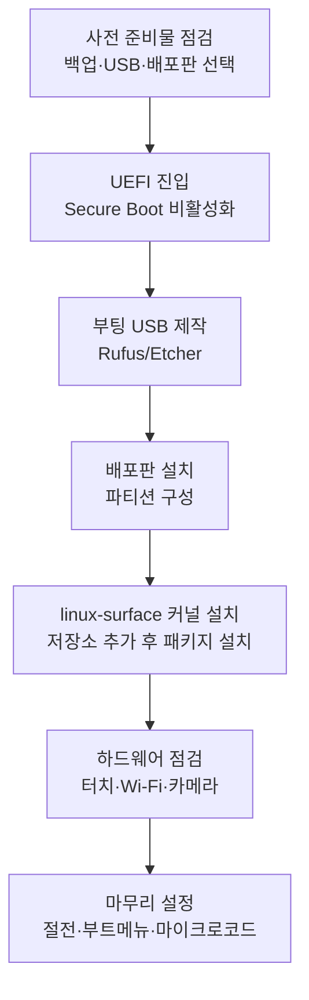

오래된 **Surface Go 1세대**(2018년 출시)는 Windows 11 공식 지원이 끝나가는 저전력 2-in-1 기기지만, Pentium Gold 4415Y/Core m3-8100Y와 4~8GB RAM이라는 한정된 자원으로도 가벼운 Linux 데스크톱을 돌리기에는 충분하다. 문제는 Surface 시리즈가 표준 PC와 다른 임베디드 컨트롤러(SAM)·터치스크린·카메라 구조를 쓰기 때문에, 메인라인 커널만으로는 키보드 커버·터치·Wi-Fi가 제대로 동작하지 않는다는 점이다. 이를 해결하는 것이 커뮤니티 프로젝트 **[linux-surface](https://github.com/linux-surface/linux-surface)**다.

이 글에서는 Surface Go 1세대에 Linux를 설치하는 전체 과정을 사전 준비물 → UEFI/Secure Boot 설정 → 부팅 USB 제작 → 설치 → linux-surface 커널 패치 적용 → 하드웨어 호환성 점검 → 설치 후 마무리 설정 순서로 정리한다. 모델·배포판·커널 버전에 따라 세부 동작이 달라질 수 있으므로, 명령어를 실행하기 전 [linux-surface 공식 위키](https://github.com/linux-surface/linux-surface/wiki/Installation-and-Setup)의 최신 안내를 함께 확인하는 것을 권장한다.

---

## 사전 준비물

### 하드웨어 사양 확인

Surface Go 1세대는 모델에 따라 사양이 다르므로, 설치 전 본인 기기의 구성을 먼저 확인한다.

| 구성 | 사양 |
|------|------|
| **프로세서** | Intel Pentium Gold 4415Y 또는 Core m3-8100Y |
| **메모리** | 4GB 또는 8GB LPDDR3 |
| **저장장치** | 64GB eMMC 또는 128GB SSD |
| **디스플레이** | 10인치 PixelSense, 1800×1200, 10점 멀티터치 |
| **무선** | Qualcomm Atheros QCA6174 (Wi-Fi + Bluetooth) |
| **카메라** | 전면 OV5693, 후면 OV8865, IR(Windows Hello) OV7251 |
| **확장** | USB Type-C, microSDXC 슬롯, Surface Connect |

4GB eMMC 모델은 저장 공간과 메모리가 빠듯하므로 가벼운 배포판(Xfce·LXQt 데스크톱)을 권장한다. 8GB/128GB SSD 모델은 GNOME·KDE Plasma 같은 일반 데스크톱도 무리 없이 돌아간다.

### 백업과 복구 매체

Linux 설치는 디스크 파티션을 재구성하는 작업이므로 진행 전 반드시 다음을 준비한다.

- **데이터 백업**: OneDrive, 외장 SSD 등에 중요 파일을 백업한다.
- **Windows 복구 USB**: 설치가 실패하거나 Windows로 되돌리고 싶을 때를 위해 [미디어 만들기 도구](https://www.microsoft.com/software-download/windows11)로 Windows 복구 USB를 별도로 준비해 둔다.
- **펌웨어 업데이트**: Windows에서 Windows Update를 통해 Surface 펌웨어를 최신 버전으로 올려둔다. 단, eMMC 모델(4GB RAM/64GB)에서는 펌웨어 1.0.34.0이 부팅 디스크를 인식하지 못해 "No Bootable Device" 오류를 일으키는 결함이 보고되었으므로, 해당 버전이 설치돼 있다면 다음 업데이트로 넘어가기 전 [linux-surface Surface Go 위키](https://github.com/linux-surface/linux-surface/wiki/Surface-Go)에서 현재 상태를 확인한다.

### 준비물 체크리스트

- USB 8GB 이상 (FAT32 포맷 권장 — 일부 펌웨어가 ISO9660 포맷 USB를 부팅 매체로 인식하지 못하는 사례가 보고됨)
- USB 허브 또는 멀티포트 어댑터 (Surface Go는 USB Type-C 포트가 하나뿐이라 USB 부팅 매체와 외부 키보드·마우스를 동시에 연결하려면 허브가 필요)
- 외부 USB 키보드·마우스 (Type Cover가 설치 초반 BIOS·부트로더 단계에서 인식되지 않는 경우 대비)
- 유선 또는 안정적인 Wi-Fi 환경 (linux-surface 커널 설치 시 패키지 다운로드 필요)

### 배포판 선택

linux-surface 프로젝트는 자체 커널과 패키지를 **Arch Linux, Fedora, Ubuntu/Debian** 계열용 공식 저장소로 배포한다. 이 세 계열 중 하나를 선택하면 설치 직후 공식 가이드를 그대로 따라갈 수 있어 가장 수월하다.

| 배포판 | 장점 | 비고 |
|--------|------|------|
| **Fedora** | linux-surface 공식 COPR 저장소 제공, 최신 커널 추적 | 안정성과 최신성의 균형 |
| **Ubuntu/Debian** | 자료·커뮤니티가 가장 많음, apt 기반으로 익숙함 | 초보자에게 추천 |
| **Arch Linux / Manjaro** | 최신 패키지·세밀한 커스터마이징 | 설치 난이도는 가장 높음 |

이 글은 절차를 배포판 중립적으로 설명하고, linux-surface 커널 적용 단계에서만 배포판별 차이를 다룬다.

---

## UEFI/Secure Boot 설정

1. Surface Go의 전원이 꺼진 상태에서 **볼륨 업(+) 버튼을 누른 채로 전원 버튼**을 누르고, Surface 로고가 나타나면 볼륨 업 버튼을 뗀다. 그러면 UEFI 펌웨어 설정 화면으로 진입한다.
2. **Security** 메뉴에서 **Secure Boot**를 찾는다.
   - 가장 단순한 방법은 Secure Boot를 **Disabled**로 변경하는 것이다. 대부분의 배포판 설치 USB가 이 상태에서 바로 부팅된다.
   - Secure Boot를 유지하고 싶다면, linux-surface가 제공하는 `linux-surface-secureboot-mok` 패키지로 자체 서명 키를 MOK(Machine Owner Key)에 등록하는 방법도 있다. 다만 절차가 복잡하므로 처음 설치할 때는 비활성화를 권장한다.
3. **Boot Configuration** 메뉴에서 USB 부팅이 허용되어 있는지 확인한다. 기본값으로 USB 부팅은 대부분 활성화되어 있다.
4. 변경 사항을 저장하고 종료한다(보통 화면 안내에 따라 **Exit** 또는 단축키 사용).

> Surface UEFI는 일반 데스크톱 메인보드와 메뉴 구성이 달라 "Boot Order"를 직접 바꾸는 항목이 없다. 대신 USB가 연결된 상태로 재부팅하면 자동으로 부팅 매체 선택 화면이 나타나거나, 위와 동일하게 볼륨 업 버튼을 누른 채 전원을 켜면 부팅 메뉴로 진입한다.

---

## 부팅 USB 만들기

### ISO 다운로드

선택한 배포판의 공식 사이트에서 최신 ISO를 내려받는다. 예: [Ubuntu Desktop](https://ubuntu.com/download/desktop), [Fedora Workstation](https://fedoraproject.org/workstation/download).

### USB 굽기

Windows에서는 [Rufus](https://rufus.ie/)를 사용한다.

1. Rufus를 실행하고 **Device**에서 준비한 USB를 선택한다.
2. **Boot selection**에서 다운로드한 ISO 파일을 지정한다.
3. **Partition scheme**을 **GPT**, **Target system**을 **UEFI (non CSM)**로 설정한다.
4. Surface Go에서 USB 인식 문제가 발생한다면, **File system**을 **FAT32**로 지정해 다시 시도한다. ISO가 4GB를 넘는 경우 Rufus가 자동으로 FAT32 호환 분할 모드를 제안하므로 그대로 따른다.
5. **START**를 눌러 굽기를 진행한다.

macOS·Linux에서는 [balenaEtcher](https://etcher.balena.io/)를 사용하거나, 다음과 같이 `dd`로 직접 쓸 수 있다.

```bash
# /dev/sdX는 실제 USB 장치 경로로 교체한다 (lsblk로 확인)
sudo dd if=ubuntu-24.04-desktop-amd64.iso of=/dev/sdX bs=4M status=progress oflag=sync
```

`dd`는 대상 장치를 잘못 지정하면 기존 데이터를 모두 덮어쓰므로, 실행 전 `lsblk`나 `diskutil list`로 장치 경로를 반드시 다시 확인한다.

---

## 설치 단계별 절차

### 1. Windows 파티션 정리

Windows를 함께 남겨 듀얼부팅할 계획이라면, Windows의 **디스크 관리**에서 시스템 파티션을 축소해 Linux용 빈 공간을 만든다. linux-surface 위키는 **최소 50GB** 이상을 Linux에 할당하도록 권장한다. 64GB eMMC 모델처럼 저장 공간이 작다면 Windows를 완전히 지우고 Linux만 설치하는 편이 현실적이다.

### 2. USB로 부팅해 설치 시작

1. USB를 Surface Go에 연결하고 재부팅한다. 부팅 매체 선택 화면이 나타나지 않으면 볼륨 업 버튼을 누른 채 전원을 켜 UEFI로 진입한 뒤, **Boot Configuration**에서 USB를 우선 부팅 장치로 선택한다.
2. 배포판 설치 마법사(예: Ubuntu의 Ubiquity/Subiquity, Fedora의 Anaconda)가 뜨면 언어·키보드·시간대를 설정한다.
3. 설치 중 Wi-Fi 연결을 시도하면, 메인라인 커널 상태에서는 Surface Go의 QCA6174 칩이 인식되지 않거나 펌웨어 오류로 연결되지 않을 수 있다. 이 경우 USB 테더링·이더넷 어댑터로 유선 연결을 사용하거나, Wi-Fi 설정은 건너뛰고 설치 후 linux-surface 커널을 올린 다음 다시 시도한다.

### 3. 파티션 구성

수동 파티션을 선택했다면 다음과 같이 구성한다.

| 파티션 | 권장 크기 | 파일시스템 | 마운트 포인트 |
|--------|-----------|-----------|----------------|
| EFI 시스템 파티션 | 기존 파티션 재사용 (보통 100~260MB) | FAT32 | `/boot/efi` |
| 루트 | 남은 공간 대부분 | ext4 / btrfs | `/` |
| 스왑 | RAM 4GB → 4~8GB, RAM 8GB → 2~4GB (또는 swapfile) | swap | - |

4GB RAM 모델은 메모리가 부족해지기 쉬우므로 스왑을 충분히 확보하거나 zram을 함께 사용하는 것이 좋다. 기존 EFI 파티션이 있다면 새로 만들지 않고 그대로 재사용해야 Windows 부팅 항목이 유지된다.

### 4. 설치 완료 및 재부팅

설치가 끝나면 USB를 제거하고 재부팅한다. 이 시점에는 메인라인 배포판 커널로 부팅되며, 터치스크린·Wi-Fi·일부 키보드 기능이 아직 동작하지 않는 것이 정상이다. 다음 단계에서 linux-surface 커널을 설치해 해결한다.



---

## linux-surface 커널 패치 적용 방법

메인라인 Linux 커널은 Surface 시리즈의 임베디드 컨트롤러(SAM), IPTS 터치스크린, 일부 ACPI 전원 관리 기능을 아직 완전히 지원하지 않는다. **linux-surface**는 이런 기능을 추가한 패치 커널과 `iptsd`(터치 데몬), `libwacom-surface`(펜·터치 디바이스 식별) 같은 부속 유틸리티를 배포판별 패키지 저장소로 제공한다.

> 아래는 패키지 구성의 일반적인 흐름이다. 저장소 등록에 필요한 정확한 URL·서명 키는 배포판 버전에 따라 바뀌므로, 실제 명령어는 항상 [linux-surface 설치 가이드](https://github.com/linux-surface/linux-surface/wiki/Installation-and-Setup)에서 그대로 복사해 사용한다.

### Ubuntu / Debian 계열

1. linux-surface 저장소의 서명 키를 시스템에 등록한다.
2. APT 소스 목록에 linux-surface 저장소를 추가하고 `apt update`를 실행한다.
3. 다음 패키지를 설치한다.
   ```bash
   sudo apt install linux-image-surface linux-headers-surface libwacom-surface iptsd
   ```
4. Secure Boot를 유지하고 있다면 `linux-surface-secureboot-mok`도 함께 설치해 키를 등록한다.
5. `sudo update-grub`로 GRUB 설정을 갱신하고 재부팅한다.

### Fedora 계열

1. `dnf copr enable` 명령으로 linux-surface COPR 저장소를 활성화한다.
2. 다음 패키지를 설치한다.
   ```bash
   sudo dnf install kernel-surface iptsd libwacom-surface
   ```
3. `linux-surface-default-watchdog` 서비스가 부팅 시 Surface 커널을 기본값으로 선택하도록 보장하므로 별도 설정 없이도 정상 부팅된다.

### Arch Linux

1. `/etc/pacman.conf`에 linux-surface 저장소와 서명 키 정책(`SigLevel`)을 추가한다.
2. 패키지 데이터베이스를 갱신한 뒤 설치한다.
   ```bash
   sudo pacman -Syu linux-surface linux-surface-headers iptsd
   ```
3. `libwacom-surface`는 AUR을 통해 설치한다.
4. 일부 구형 모델은 Wi-Fi 펌웨어 패키지(`linux-firmware-marvell` 등)를 추가로 요구하므로, Surface Go처럼 Qualcomm Atheros 칩을 쓰는 기기는 다음 절의 Wi-Fi 항목을 함께 확인한다.

### 설치 확인

재부팅 후 다음 명령으로 Surface 커널로 부팅되었는지 확인한다.

```bash
uname -a
# 출력에 "surface"가 포함되어 있으면 정상적으로 패치 커널로 부팅된 것이다
```

CPU 마이크로코드 패키지(`intel-microcode` 또는 배포판별 동일 패키지)도 함께 설치해 두면 보안 패치와 안정성이 개선된다.

---

## Surface Go 1세대 하드웨어 호환성

linux-surface 커널을 올린 뒤에도 구성 요소별로 별도 확인·설정이 필요한 부분이 있다. 아래는 Surface Go 1세대 기준으로 확인된 상태다.

| 구성 요소 | 상태 | 비고 |
|-----------|------|------|
| 터치스크린 | 동작 (IPTS) | `iptsd` 서비스가 실행 중이어야 함 |
| Type Cover 키보드 | 동작 | 일부 배포판에서 일부 펑션키 매핑 차이 |
| 트랙패드 | 동작 | libinput 기반, 추가 설정 불필요 |
| Wi-Fi (QCA6174) | 동작 (펌웨어 보정 필요할 수 있음) | `ath10k_pci` 드라이버, board.bin 이슈 존재 |
| Bluetooth | 동작 | Wi-Fi와 동일 칩 |
| 카메라(전면 OV5693) | 동작 | IPU3 + libcamera 필요 |
| 카메라(후면 OV8865) | 동작 | IPU3 + libcamera 필요 |
| IR 카메라(OV7251) | **미지원** | Windows Hello 얼굴 인식 용도, Linux 드라이버 없음 |
| SD카드 리더 | 동작 (절전에 영향) | 사용하지 않으면 UEFI에서 비활성화 권장 |
| 절전(S0ix/suspend) | 부분 동작 | SD카드 리더·구형 커널이 원인일 수 있음 |

### 터치스크린 (IPTS)

Surface Go 1세대는 Surface Pro 4~7 세대와 동일한 **IPTS(Intel Precise Touch & Stylus)** 방식을 사용한다. (더 최신 모델인 Surface Pro 8/9 이후는 ITHC라는 후속 방식을 쓰므로 설정이 다르다.) IPTS는 Intel MEI(Management Engine Interface)를 통해 터치 데이터를 전달하는데, 이를 사용자 공간에서 해석해 입력 이벤트로 변환하는 것이 `iptsd` 데몬이다. 위 단계에서 `iptsd`를 설치했다면 보통 자동으로 활성화되며, 동작하지 않을 때는 서비스 상태를 확인한다.

```bash
systemctl status iptsd
```

### Wi-Fi (Qualcomm Atheros QCA6174)

Surface Go 1세대의 Wi-Fi/Bluetooth 칩은 **QCA6174**이며 Linux에서는 `ath10k_pci` 드라이버로 처리된다. 이 칩은 외부 EEPROM 없이 PCI 서브시스템 ID(`168c:3370`)로 보드 설정값(board.bin)을 조회하는데, 표준 `linux-firmware` 패키지의 `board-2.bin`에는 이 ID에 대한 항목이 빠져 있어 일반 보드 설정으로 폴백되면서 Wi-Fi가 불안정하거나 전혀 잡히지 않는 사례가 보고되어 있다. 해결 방법은 다음 중 하나다.

- linux-surface에서 제공하는 `surface-ath10k-firmware-override` 패키지(또는 동급 보정 패키지)를 설치한다.
- 커뮤니티가 별도로 배포하는 Surface Go 전용 board.bin 패키지를 사용한다(자세한 배경은 [linux-surface 이슈 #542](https://github.com/linux-surface/linux-surface/issues/542) 참고).

설치 후 `dmesg | grep ath10k`로 보드 데이터 로드 오류가 사라졌는지 확인한다.

### 카메라

Surface Go 1세대는 인텔 IPU3 이미지 처리 장치(ISP)를 사용하며, 전면 **OV5693**과 후면 **OV8865** 센서는 **libcamera**를 통해 동작이 확인되어 있다. 다만 IR 카메라(**OV7251**, Windows Hello 얼굴 인식용)는 Linux에서 지원하는 드라이버가 없어 동작하지 않는다.

```bash
# Ubuntu 기준 libcamera 관련 패키지 설치 예시
sudo apt install libcamera0.2 libcamera-ipa libcamera-tools gstreamer1.0-libcamera

# IPU3 펌웨어 파일 존재 확인
ls /lib/firmware/intel/ipu3-fw.bin

# 카메라 목록 확인
cam --list
```

video 그룹에 사용자를 추가해야 권한 문제 없이 카메라에 접근할 수 있다.

```bash
sudo usermod -aG video $USER
```

Cheese나 Firefox 116 이상처럼 libcamera를 직접 지원하는 애플리케이션이 가장 안정적으로 동작하며, 레거시 V4L2 기반 앱은 GStreamer 루프백 장치를 거쳐야 인식되는 경우가 있다. 화질은 Windows 드라이버 대비 아직 떨어질 수 있다는 점도 감안한다.

### SD카드 리더와 절전

Surface Go 1세대의 SD카드 리더는 시스템이 **S0ix(모던 스탠바이) 저전력 상태**에 진입하는 것을 방해해 대기 중 배터리 소모가 늘어난다는 점이 보고되어 있다. SD카드를 자주 쓰지 않는다면 UEFI 설정에서 SD카드 리더를 비활성화해 절전 효율을 개선할 수 있다.

### 커널 버전 관련 주의사항

5.1x대의 일부 linux-surface 커널 버전에서는 SGX가 비활성화되거나 종료(shutdown) 시 멈추는 문제가 보고된 바 있다. 이후 6.13 이상 커널에서 해당 문제가 해소되었다는 보고가 있으므로, 패키지 관리자가 제공하는 최신 linux-surface 커널을 유지하는 것이 가장 간단한 대응이다.

---

## 설치 후 마무리 설정

### 펌웨어 버전 재확인

eMMC 모델에서 펌웨어 1.0.34.0이 "No Bootable Device" 오류를 일으킨다는 보고가 있었으므로, Linux 설치 후에도 가능하면 Windows를 남겨 펌웨어 업데이트를 주기적으로 점검하거나, 해당 버전을 건너뛰고 다음 버전으로 갱신하는 것이 안전하다.

### 듀얼부팅 부트 메뉴 문제 대응

Windows와 나란히 설치한 뒤 GRUB이나 rEFInd가 자동으로 부트 메뉴에 나타나지 않거나, 전원 시 볼륨 업 버튼으로 진입하는 부팅 메뉴에 Linux 항목이 보이지 않는 경우가 보고되어 있다. 이런 경우 `efibootmgr`로 현재 등록된 부팅 항목을 확인하고, 필요하면 Linux 부트로더 항목을 명시적으로 추가·우선순위 조정한다.

```bash
# 현재 등록된 UEFI 부팅 항목 확인
efibootmgr -v
```

정확한 항목 추가 절차는 배포판·부트로더(GRUB/systemd-boot 등)에 따라 달라지므로, 메뉴에 Linux가 보이지 않을 때는 [linux-surface 위키](https://github.com/linux-surface/linux-surface/wiki/Surface-Go)의 듀얼부팅 관련 안내를 함께 참고한다.

### 배터리·전원 관리 점검

`powertop`이나 `tlp` 같은 전원 관리 도구를 설치해 절전 상태와 배터리 소모를 점검한다. SD카드 리더 비활성화, 최신 커널 유지와 함께 적용하면 대기 전력 소모를 줄이는 데 도움이 된다.

### 정기 업데이트

linux-surface 커널과 `iptsd`, 펌웨어 보정 패키지는 정기적으로 업데이트되며, 새 커널 버전에서 위에서 언급한 문제들이 수정되는 경우가 많다. 시스템 업데이트 시 일반 패키지와 함께 linux-surface 저장소도 항상 최신 상태로 유지한다.

---

## 마무리 체크리스트

- [ ] 데이터 백업과 Windows 복구 USB를 준비했는가
- [ ] eMMC 모델이라면 펌웨어 1.0.34.0 관련 이슈를 확인했는가
- [ ] Secure Boot를 비활성화했거나 MOK 등록 절차를 이해했는가
- [ ] USB를 FAT32로 포맷해 부팅 매체 인식 문제를 예방했는가
- [ ] Windows 파티션을 최소 50GB 이상 확보했는가(듀얼부팅 시)
- [ ] linux-surface 저장소를 추가하고 패치 커널·`iptsd`·`libwacom-surface`를 설치했는가
- [ ] `uname -a`로 Surface 커널 부팅을 확인했는가
- [ ] 터치스크린(`iptsd`), Wi-Fi(`ath10k`), 카메라(`libcamera`) 동작을 각각 점검했는가
- [ ] SD카드 리더 비활성화 등 절전 설정을 적용했는가
- [ ] 듀얼부팅 부트 메뉴에 Linux 항목이 보이는지 확인했는가

## 참고 문헌

1. [linux-surface/linux-surface](https://github.com/linux-surface/linux-surface) — Surface 기기용 패치 커널·유틸리티 프로젝트 메인 저장소.
2. [linux-surface 설치 및 설정 가이드](https://github.com/linux-surface/linux-surface/wiki/Installation-and-Setup) — 배포판별 저장소 등록·패키지 설치 절차.
3. [linux-surface Surface Go 위키](https://github.com/linux-surface/linux-surface/wiki/Surface-Go) — Surface Go 1세대 펌웨어·SD카드·듀얼부팅 관련 알려진 이슈.
4. [linux-surface 카메라 지원 위키](https://github.com/linux-surface/linux-surface/wiki/Camera-Support) — 모델별 카메라 센서 지원 현황과 libcamera 설정 방법.
5. [linux-surface/iptsd](https://github.com/linux-surface/iptsd) — IPTS 터치스크린·스타일러스 입력을 처리하는 사용자 공간 데몬.
6. [linux-surface 이슈 #542 — Surface Go Wi-Fi board.bin 문제](https://github.com/linux-surface/linux-surface/issues/542) — QCA6174 보드 설정 누락으로 인한 Wi-Fi 불안정 현상과 해결 논의.
7. [Ubuntu Desktop 다운로드](https://ubuntu.com/download/desktop) — 설치 ISO 다운로드.
8. [Fedora Workstation 다운로드](https://fedoraproject.org/workstation/download) — 설치 ISO 다운로드.
9. [Rufus](https://rufus.ie/) — Windows용 부팅 USB 제작 도구.
10. [balenaEtcher](https://etcher.balena.io/) — 크로스 플랫폼 부팅 USB 제작 도구.
