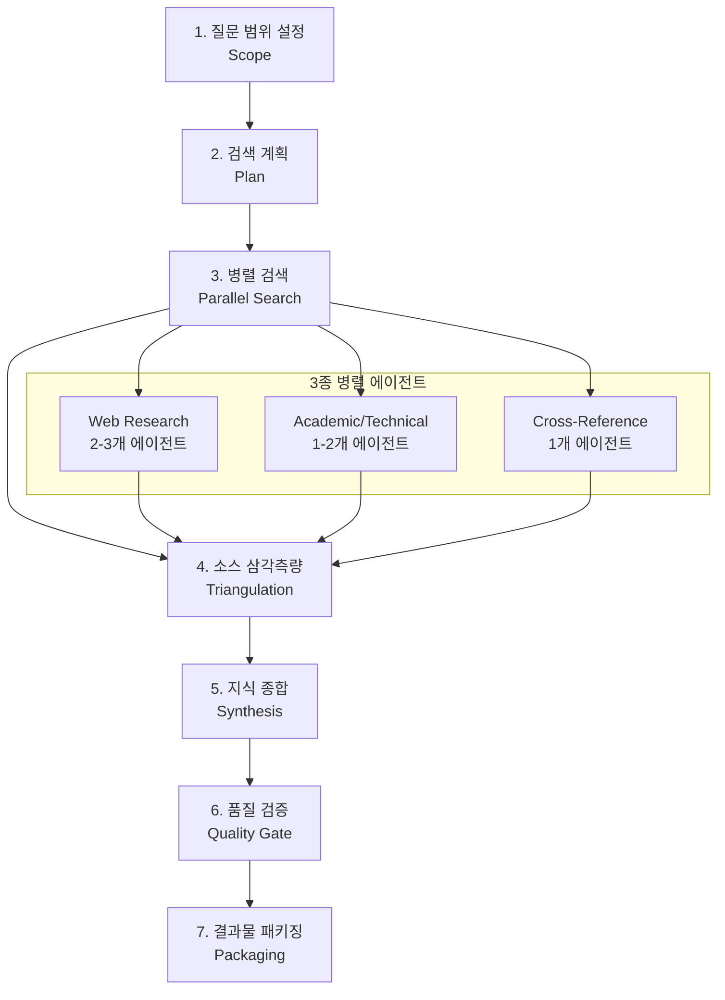

리서치를 대신 해 달라고 AI에게 맡길 때 가장 아쉬운 부분은 **출처의 신뢰도**와 **작업 재현성**이다. 답은 그럴듯한데 근거가 어디서 왔는지 알기 어렵고, 세션이 끊기면 처음부터 다시 물어봐야 하는 경우가 많다. <strong>[insane-research](https://github.com/fivetaku/insane-research)</strong>는 Claude Code 위에서 동작하는 플러그인으로, 리서치 과정을 7단계 파이프라인으로 쪼개고 소스마다 A~E 등급을 매겨 이 문제를 정면으로 다룬다. 이 글에서는 insane-research의 구조와 동작 방식을 정리하고, 비슷한 목적의 Claude Code 플러그인 및 Perplexity·ChatGPT·Gemini의 딥 리서치 기능과 비교한다.

## 개요: 도구 정보와 추천 대상

**insane-research**는 [fivetaku](https://github.com/fivetaku)가 공개한 Claude Code용 멀티 에이전트 딥 리서치 플러그인이다. `gptaku_plugins` 마켓플레이스로 배포되며, 질문 하나를 받아 검색 계획 수립 → 병렬 검색 → 소스 교차 검증 → 종합 → 품질 검증 → 결과물 패키징까지 자동으로 처리한다. 결과물은 경영진 요약, 전체 보고서, 참고문헌, 선택적으로 인터랙티브 웹사이트까지 포함한다.

**추천 대상:** Claude Code CLI를 이미 사용 중이며 별도 웹 서비스 없이 터미널 안에서 리서치를 완결하고 싶은 개발자, 리서치 결과의 출처 신뢰도를 등급으로 확인하고 싶은 실무자, 장시간 리서치 세션을 중간에 저장했다가 이어서 진행하고 싶은 사용자에게 적합하다.

## 7단계 파이프라인 구조

insane-research의 핵심은 단일 프롬프트로 끝내지 않고 리서치 과정을 명시적인 7단계로 분리한 점이다.



1. **질문 범위 설정(Scope):** 사용자의 질문을 리서치 가능한 범위로 좁히고, 답해야 할 하위 질문을 정의한다.
2. **검색 계획(Plan):** 하위 질문별로 어떤 종류의 소스(학술 논문, 공식 문서, 커뮤니티 토론 등)를 얼마나 찾아야 하는지 계획한다.
3. **병렬 검색(Parallel Search):** Web Research 2–3개, Academic/Technical 1–2개, Cross-Reference 1개로 구성된 에이전트들이 동시에 검색을 수행해 시간을 단축한다.
4. **소스 삼각측량(Triangulation):** 서로 다른 에이전트가 찾은 정보를 교차 대조해 상충하는 주장이나 근거 부족한 주장을 걸러낸다.
5. **지식 종합(Synthesis):** 검증된 정보를 하나의 논리적 흐름으로 재구성한다.
6. **품질 검증(Quality Gate):** 종합된 내용이 출처 등급·인용 밀도 기준을 충족하는지 재확인한다.
7. **결과물 패키징(Packaging):** 경영진 요약, 전체 보고서, 참고문헌, 선택적 인터랙티브 웹사이트로 최종 정리한다.

## 소스 품질 등급 시스템(A~E)

insane-research는 찾아낸 모든 소스에 A부터 E까지 신뢰도 등급을 매긴다.

| 등급 | 기준 | 예시 |
|------|------|------|
| A | 동료 심사(peer-reviewed) 학술 논문 | 저널·학회 발표 논문 |
| B | 공식 문서·1차 출처 | 회사 기술 블로그, 공식 릴리스 노트 |
| C | 검증 가능한 2차 보도 | 전문 매체 기사, 업계 리포트 |
| D | 일반 웹 콘텐츠 | 개인 블로그, 튜토리얼 |
| E | 소셜 미디어 | 트위터·포럼 게시글 |

이 등급 체계 덕분에 최종 보고서를 읽을 때 어떤 주장이 얼마나 견고한 근거 위에 서 있는지 바로 파악할 수 있다. 등급이 낮은 소스만으로 이루어진 주장은 품질 검증 단계에서 걸러지거나 명시적으로 "근거 약함"으로 표시된다.

## 세션 재개와 결과물 형태

리서치는 시간이 오래 걸리는 작업이라 중간에 끊기는 경우가 잦다. insane-research는 진행 상태를 `state.json` 파일로 로컬에 저장해, 세션이 끊겨도 마지막 단계부터 이어서 진행할 수 있다. 최종 산출물은 다음 네 가지다.

- **경영진 요약(Executive Summary):** 핵심 결론을 짧게 정리한 요약본.
- **전체 보고서(Full Report):** 단계별로 종합된 상세 내용.
- **참고문헌(Bibliography):** 각 소스와 신뢰도 등급이 함께 표기된 인용 목록.
- **인터랙티브 웹사이트(선택):** 보고서를 브라우저에서 탐색 가능한 형태로 변환한 결과물.

## 설치 방법

Claude Code에서 마켓플레이스를 추가하고 플러그인을 설치하는 두 단계로 끝난다.

```bash
/plugin marketplace add https://github.com/fivetaku/gptaku_plugins.git
/plugin install insane-research
```

## 유사한 Claude Code 딥 리서치 플러그인 비교

insane-research 외에도 Claude Code 생태계에는 비슷한 목적의 플러그인·스킬이 여럿 있다.

| 이름 | 특징 |
|------|------|
| **Claude Code 내장 `/deep research`** | 별도 설치 없이 쓸 수 있는 공식 기능. 병렬 에이전트로 검색해 인용이 달린 보고서를 생성한다. |
| **[deep-research-plugin(Defiect)](https://github.com/Defiect/deep-research-plugin)** | 근거를 노드·엣지 형태의 증거 그래프로 구성하고, 품질 게이트를 통과해야 다음 단계로 넘어가는 출판급 보고서 지향 플러그인. |
| **[Deep-Research-skills(Weizhena)](https://github.com/Weizhena/Deep-Research-skills)** | 사람이 중간 단계마다 방향을 확인·조정할 수 있는 human-in-the-loop 제어가 특징인 구조화된 딥 리서치 스킬. |
| **insane-research(fivetaku)** | 7단계 파이프라인 + A~E 소스 등급 + 세션 재개(`state.json`)를 결합한 구성. |

세 플러그인 모두 "검색 → 검증 → 종합"이라는 큰 틀은 비슷하지만, deep-research-plugin은 증거 그래프 기반의 형식성에, Deep-Research-skills는 사람의 개입 지점에, insane-research는 소스 등급의 투명성과 세션 관리 편의성에 각각 무게를 둔다.

## 광의의 AI 딥 리서치 도구와 비교

Claude Code 플러그인 범위를 넘어서 보면, 상용 AI 서비스들도 각자의 방식으로 딥 리서치 기능을 제공한다.

| 도구 | 처리 시간 | 특징 |
|------|-----------|------|
| **[Perplexity Deep Research](https://www.perplexity.ai/hub/blog/introducing-perplexity-deep-research)** | 2–4분 | 빠른 응답 속도, 인용 기반 답변에 강점. 짧고 즉각적인 리서치에 적합. |
| **[OpenAI ChatGPT Deep Research](https://openai.com/index/introducing-deep-research/)** | 최대 30분 | 자율적인 웹 탐색으로 5,000단어 이상의 보고서를 생성. 요금제에 따라 월 25–250회 사용 가능. |
| **[Google Gemini Deep Research](https://blog.google/products/gemini/google-gemini-deep-research/)** | 쿼리당 수 분 | Gemini 3.1 Pro 기반, 쿼리당 100개 이상의 페이지를 탐색하며 Google 검색 인프라를 그대로 활용. |
| **insane-research** | 사용자 환경·질문 범위에 따라 다름 | Claude Code CLI 안에서 동작, 로컬 세션 저장/재개, 소스 등급 공개. |

Perplexity는 속도, ChatGPT와 Gemini는 탐색 범위와 보고서 분량에서 강점을 갖는 반면, 세 서비스 모두 클라우드 웹 서비스 안에서 결과가 소비되고 내부 로직은 비공개다.

## insane-research의 차별점

- **CLI 안에서 완결:** 별도 웹 UI로 전환할 필요 없이 Claude Code 터미널 환경에서 리서치 요청부터 결과물 확인까지 끝난다.
- **로컬 세션 저장/재개:** `state.json`으로 진행 상태를 로컬 파일에 남겨, 인터넷 서비스의 세션 만료와 무관하게 이어서 작업할 수 있다.
- **오픈소스·커스터마이징 가능:** 파이프라인 단계, 에이전트 구성, 등급 기준을 그대로 열람하고 필요에 맞게 수정할 수 있다.
- **소스 등급의 투명성:** A~E 등급이 최종 보고서에 함께 표기되어, 결론의 근거 수준을 독자가 직접 판단할 수 있다.

## 적용 시나리오와 판단 기준

**적합한 경우:** 이미 Claude Code를 개발 워크플로에 쓰고 있어 별도 도구 전환 비용을 줄이고 싶을 때, 리서치 결과를 사내 문서·블로그 등 로컬 파일 형태로 바로 활용하고 싶을 때, 출처 신뢰도를 등급으로 구분해 공유해야 하는 리포트를 작성할 때 적합하다.

**부적합하거나 주의할 경우:** 웹 UI에서 바로 결과를 확인하고 팀과 링크로 공유하려면 Perplexity·ChatGPT·Gemini 쪽이 더 간편하다. 아주 짧고 단순한 사실 확인에는 7단계 파이프라인이 과할 수 있으며, 이 경우 Claude Code 내장 `/deep research`나 단발성 웹 검색으로 충분하다.

## 마치며

insane-research는 "리서치 결과를 얼마나 빨리 받는가"보다 "그 결과를 얼마나 신뢰하고 재현할 수 있는가"에 초점을 맞춘 플러그인이다. Claude Code를 이미 사용 중이라면 마켓플레이스 추가 한 줄, 플러그인 설치 한 줄로 바로 시험해 볼 수 있다.

**[👉 fivetaku/insane-research 바로가기](https://github.com/fivetaku/insane-research)**

## 참고 문헌

1. [fivetaku/insane-research — GitHub](https://github.com/fivetaku/insane-research): 공식 저장소, 7단계 파이프라인·소스 등급·설치 방법 설명.
2. [fivetaku/gptaku_plugins — GitHub](https://github.com/fivetaku/gptaku_plugins): insane-research를 배포하는 플러그인 마켓플레이스.
3. [Defiect/deep-research-plugin — GitHub](https://github.com/Defiect/deep-research-plugin): 증거 그래프·품질 게이트 기반의 유사 Claude Code 딥 리서치 플러그인.
4. [Weizhena/Deep-Research-skills — GitHub](https://github.com/Weizhena/Deep-Research-skills): human-in-the-loop 제어를 포함한 구조화된 Claude Code 딥 리서치 스킬.
5. [Introducing Perplexity Deep Research — Perplexity](https://www.perplexity.ai/hub/blog/introducing-perplexity-deep-research): Perplexity의 딥 리서치 기능 소개 및 처리 시간 관련 정보.
6. [Introducing deep research — OpenAI](https://openai.com/index/introducing-deep-research/): ChatGPT Deep Research의 자율 웹 탐색·보고서 분량·사용 한도 설명.
7. [Google Gemini Deep Research — Google Blog](https://blog.google/products/gemini/google-gemini-deep-research/): Gemini 기반 Deep Research 기능과 Google 검색 인프라 활용 방식 설명.
