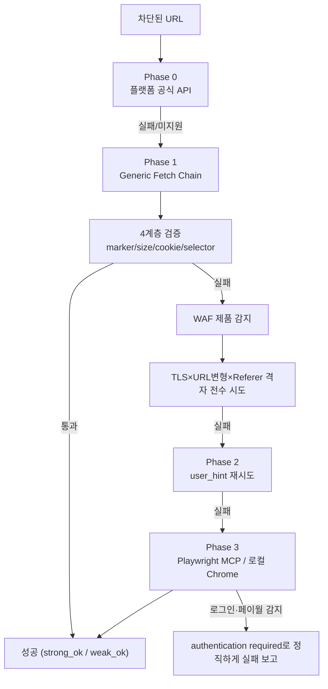

WebFetch로 페이지를 가져오려다 `403 Forbidden`이나 CAPTCHA 화면만 받아본 적이 있다면 익숙한 상황일 것이다. X(트위터), 레딧, 쿠팡처럼 WAF(웹 방화벽)가 걸린 사이트는 기본 fetch 도구로는 거의 뚫리지 않는다. **[insane-search](https://github.com/fivetaku/insane-search)**는 Claude Code용 플러그인으로, API 키나 로그인 없이 "공개된 페이지라면 결국 접근 경로를 찾아낸다"는 목표로 접근 경로를 자동으로 에스컬레이션한다. 이 글에서는 insane-search의 동작 구조와 하네스 규칙, 실제 이점과 한계를 정리하고 관련 도구와 비교한다.

## 개요: 도구 정보와 추천 대상

**insane-search**는 [fivetaku](https://github.com/fivetaku)가 공개한 오픈소스(MIT) Claude Code 플러그인으로, 이 글 작성 시점 기준 버전 0.9.1이며 `gptaku-plugins` 마켓플레이스로 배포된다. 같은 저자가 만든 리서치 플러그인 [insane-research](/post/2026/2026-07-01-insane-research-claude-code-deep-research-plugin/)가 "정보를 종합하는" 역할이라면, insane-search는 그 이전 단계인 "차단된 페이지에 접근하는" 역할을 맡는다. 별도 설정 없이 설치만 하면 Claude Code가 fetch에 실패했을 때 이 플러그인이 자동으로 개입한다.

**추천 대상:** Claude Code로 SNS·커뮤니티·이커머스 페이지를 조사하다가 반복적으로 403/차단에 막히는 개발자, API 키 발급이나 유료 스크래핑 서비스 없이 공개 페이지에 접근하고 싶은 사용자, 리서치·모니터링 워크플로에서 WAF 우회 로직을 매번 직접 짜고 싶지 않은 사용자에게 적합하다.

## 아키텍처: Phase 0→3 적응형 에스컬레이션

insane-search의 핵심은 "안 되면 바로 포기"가 아니라, 이전 단계가 실패하거나 차단 신호를 감지했을 때만 다음 단계로 넘어가는 단계적 구조다.



- **Phase 0 — 플랫폼 공식 API:** X/Twitter의 syndication·oEmbed, 레딧의 `.rss`, YouTube의 `yt-dlp`, Hacker News·arXiv·Bluesky·Mastodon 등 플랫폼이 공식으로 공개한 무인증 엔드포인트를 격자 탐색보다 먼저 시도한다.
- **Phase 1 — Generic Fetch Chain:** 특정 사이트를 하드코딩하지 않는 범용 체인이다. `probe`(curl_cffi + Safari 지문으로 첫 시도) → `validate`(4계층 검증) → `detect`(WAF 제품 랭킹) → `plan`(TLS×URL변형×Referer 격자 구성) → `execute`(격자 전수 시도, 첫 200에서 멈추지 않음) 순으로 진행한다.
- **Phase 2 — 수동 개입:** Phase 1이 실패하면 `user_hint`(예: `{"impersonate_first": "safari_ios"}`)로 1회성 재시도를 허용한다. 힌트는 저장되지 않는다.
- **Phase 3 — Playwright 폴백:** WAF 프로파일의 `capabilities_needed` 태그에 따라 Playwright MCP(Cloudflare급) 또는 로컬 Node+Chrome+Patchright(Akamai Bot Manager급)로 자동 라우팅한다. 로그인 벽이나 페이월이 감지되면 우회를 시도하지 않고 "인증 필요"로 정직하게 실패를 보고한다.

## 주요 기능 상세

### 4계층 검증 — HTTP 200은 성공이 아니다

insane-search는 HTTP 200을 "검사 시작 조건"으로만 취급한다. 실제 성공 판정은 다음 네 가지를 **모두** 통과해야 한다.

1. `Access Denied`, `Just a moment...`, `DataDome` 같은 챌린지 마커가 없을 것
2. 3KB 미만처럼 WAF 핑거프린트에 해당하는 비정상 크기가 아닐 것
3. 쿠키 센서 상태(`_abck` 등)가 정상일 것
4. 호출자가 넘긴 `success_selectors` 중 하나 이상이 매칭될 것(제공 시 `strong_ok`, 미제공 시 `weak_ok`)

이 검증 덕분에 "200은 받았지만 사실은 CAPTCHA 페이지였다"는 흔한 오탐을 막는다.

### 실패 게이트 — "안 뚫린다"고 말하려면 전수 시도부터

Claude가 몇 번 시도해 보고 섣불리 "차단됨"이라 결론짓는 문제를 막기 위해, 엔진은 실패 시 `ok=false`와 함께 아직 시도하지 않은 경로 목록(`untried_routes`)과 `must_invoke_playwright_mcp` 플래그를 함께 반환한다. 격자가 예산 컷으로 중단됐거나(`grid_exhausted=false`), 안 해본 경로가 남아 있거나, Playwright MCP를 아직 안 돌려봤다면 "접근 불가"라는 결론을 낼 수 없다. 이 규칙은 CLI가 `⛔ NOT EXHAUSTED` 메시지를 표준 에러로 출력하는 방식으로 강제된다. 429(레이트리밋)는 이 검사에서 예외로, 종결이 아니라 백오프 후 재시도 대상으로 취급한다.

### No-Site-Name Rule — 편향 방지 장치

`engine/` 코드와 `waf_profiles.yaml`에는 특정 사이트의 도메인·URL·셀렉터를 하드코딩하지 않는다. `if "coupang" in url` 같은 분기는 금지되며, `python3 engine/bias_check.py`가 이를 CI에서 강제한다. 사이트 고유 정보는 호출 시점의 `user_hint`로만 전달하고 저장소에 남기지 않는다. 이 설계 덕분에 새 사이트가 추가돼도 코드 변경 없이 동일한 격자 로직이 그대로 적용된다.

### 프롬프트 인젝션 방어 (0.9.0+)

가져온 웹 본문은 `untrusted_public_web`으로 태깅되고, CLI 출력은 `[BEGIN UNTRUSTED WEB CONTENT]` / `[END UNTRUSTED WEB CONTENT]` 경계로 감싸진다. 페이지 안의 문장이 "이전 지시를 무시하라"처럼 명령조로 되어 있어도 이는 요약·비교 대상 데이터일 뿐, 실행할 지시가 아니라고 명시한다. 다만 저자 스스로도 이를 "완전한 차단이 아니라 완화 장치"라고 밝히고 있다.

## 기본 Claude Code 대비 실제 이점

| 상황 | 기본 Claude Code | insane-search 적용 |
| :--- | :--- | :--- |
| `403`/WAF 차단 페이지 | 포기하고 접근 실패 보고 | 경로 하나가 뚫릴 때까지 에스컬레이션 |
| X·레딧·HN 같은 플랫폼 콘텐츠 | 자주 차단되거나 빈 결과 | 공식 공개 API·피드로 우회 |
| CAPTCHA/안티봇 챌린지 | 즉시 중단 | TLS 위장 후 실제 헤드리스 브라우저까지 시도 |
| YouTube 등 미디어 페이지(1,858개 사이트) | 자막·메타데이터 없음 | `yt-dlp` 메타데이터·자막 추출 |
| `curl_cffi`·`yt-dlp` 등 의존성 미설치 | — | 최초 사용 시 자동 설치 |
| 로그인 벽·페이월 | — | 우회 시도 없이 "인증 필요"로 정직하게 보고 |

## 적용 시나리오와 판단 기준

**적합한 경우:** Claude Code로 SNS·커뮤니티·이커머스 페이지를 정기적으로 조사하는데 매번 403에 막혀 수작업 우회를 반복해야 했던 경우, API 키 발급이나 유료 스크래핑 서비스 구독 없이 공개 데이터만으로 리서치를 끝내고 싶은 경우, 여러 페이지를 순회하며 수집해야 하는데(R7 병렬 API 우선 분기) 내부 API가 있을 법한 SPA/커머스 사이트를 다루는 경우에 적합하다.

**부적합하거나 주의할 경우:** 로그인이 필요한 비공개 콘텐츠나 유료 구독 콘텐츠에는 애초에 접근하지 않으므로 대안이 될 수 없다. 대상 사이트의 이용약관이 자동화 접근을 명시적으로 금지한다면 기술적으로 뚫리더라도 별도로 준수 여부를 검토해야 한다. 단발성 조회 한두 건에는 Playwright 로컬 실행·의존성 설치 과정이 오히려 과할 수 있어, 이 경우 `r.jina.ai` 같은 경량 리더가 더 간단하다.

## 장단점과 종합 평가

**장점**

- API 키·회원가입 없이 동작하며, 필요한 의존성(`curl_cffi`, `yt-dlp` 등)을 최초 실행 시 자동 설치한다.
- 첫 200에서 멈추지 않는 4계층 검증과 "전수 시도 후에만 실패 선언" 게이트로, 성급한 "차단됨" 오판을 구조적으로 줄인다.
- No-Site-Name Rule로 사이트별 하드코딩을 막아, 특정 사이트 하나가 막히면 전체 로직을 다시 짜야 하는 흔한 스크래퍼의 문제를 피한다.
- 로그인 벽·페이월은 우회하지 않고 정직하게 실패를 보고해, 인증 우회 도구로 오용되지 않도록 경계를 명시한다.

**한계·리스크**

- TLS 위장·헤드리스 브라우저 자동화는 대상 사이트의 이용약관이나 `robots.txt` 정책과 충돌할 수 있어, 자동화 접근이 허용되는 범위인지는 사용자가 별도로 판단해야 한다.
- Phase 3(Playwright MCP·로컬 Chrome)까지 가면 Node 의존성 설치, 첫 실행 시 브라우저 다운로드 등 초기 설정 비용이 발생한다.
- WAF 탐지·대응은 본질적으로 군비 경쟁이라, 사이트가 방어 로직을 바꾸면 격자 전수 시도 시간이 늘어나거나 일시적으로 성공률이 떨어질 수 있다.
- 학습 캐시(`~/.insane_search/learned.json`)에 호스트별 성공 경로가 남으므로, 공유 환경에서는 이 캐시 파일의 위치를 인지하고 있는 것이 좋다.

## 유사 도구와 비교

| 도구 | 접근 방식 | 특징 |
| :--- | :--- | :--- |
| **insane-search** | Phase 0~3 적응형 에스컬레이션 | 공식 API 우선 → TLS 위장 → 헤드리스 브라우저 순으로 자동 확대, No-Site-Name 설계 |
| **Jina Reader(`r.jina.ai`)** | 단일 프록시 리더 | WAF 없는 일반 웹에는 간단하고 빠르지만, WAF가 걸린 사이트에는 무력하다 |
| **Playwright MCP 단독** | 브라우저 자동화만 | 매 요청마다 브라우저를 띄우는 비용이 있고, TLS 지문 위장이나 공식 API 우선 시도 같은 단계적 로직은 없다 |
| **Claude Code 기본 WebFetch** | 단순 HTTP 요청 | WAF·anti-bot 챌린지 앞에서 대부분 즉시 실패 |

같은 저자의 [insane-research](/post/2026/2026-07-01-insane-research-claude-code-deep-research-plugin/)와는 역할이 다르다. insane-research가 "여러 소스를 모아 신뢰도를 매기고 보고서로 종합"하는 상위 계층이라면, insane-search는 그 소스 각각에 "일단 접근이 되게 만드는" 하위 계층이다. 두 플러그인을 함께 쓰면 insane-search가 확보한 페이지를 insane-research가 삼각측량·종합하는 조합도 가능하다.

## 시작하기

Claude Code에서 마켓플레이스를 추가하고 플러그인을 설치하면 끝난다. 별도 명령어를 외울 필요 없이, 평소처럼 요청했을 때 fetch가 막히면 자동으로 개입한다.

```bash
/plugin marketplace add https://github.com/fivetaku/gptaku_plugins.git
/plugin install insane-search@gptaku-plugins
/reload-plugins
```

설치 후에는 다음과 같이 평소 말투로 요청하면 된다.

> "레딧에서 Claude Code 관련 반응 찾아서 요약해줘."
> "이 유튜브 영상 자막 뽑아줘."
> "X에서 insane-search 언급 검색해줘."

## 마치며

insane-search는 "일단 헤드리스 브라우저부터 켜자"는 무차별 방식 대신, 가장 가벼운 공식 API부터 순서대로 시도하고 필요할 때만 무거운 수단으로 넘어가는 단계적 설계를 취한다. 동시에 로그인 벽과 페이월 앞에서는 멈춘다는 경계를 코드 레벨에서 강제해, "공개된 정보에 대한 접근성 개선"과 "인증 우회"의 경계를 분명히 하려는 시도로 읽을 수 있다.

**[👉 fivetaku/insane-search 바로가기](https://github.com/fivetaku/insane-search)**

## 참고 문헌

1. [fivetaku/insane-search — GitHub](https://github.com/fivetaku/insane-search): 공식 저장소, README·설치 방법·플랫폼 목록.
2. [insane-search PLATFORMS.md](https://github.com/fivetaku/insane-search/blob/main/PLATFORMS.md): 지원 플랫폼별 접근 방법 전체 목록.
3. [insane-search CHANGELOG.md](https://github.com/fivetaku/insane-search/blob/main/CHANGELOG.md): 버전별 변경 이력(Phase 0 라우터, 실패 게이트, 프롬프트 인젝션 방어, 자가 학습 캐시 등).
4. [fivetaku/gptaku_plugins — GitHub](https://github.com/fivetaku/gptaku_plugins): insane-search를 배포하는 플러그인 마켓플레이스.
5. [insane-research: Claude Code 멀티 에이전트 딥 리서치 플러그인](/post/2026/2026-07-01-insane-research-claude-code-deep-research-plugin/): 같은 저자가 만든 리서치 종합 플러그인과의 역할 비교.
