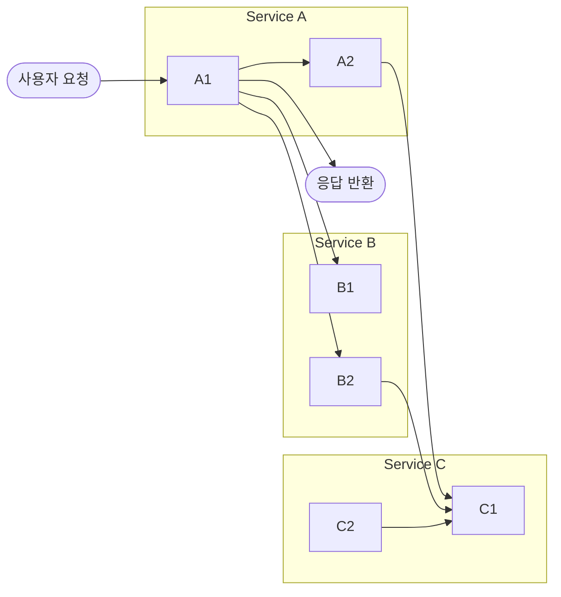
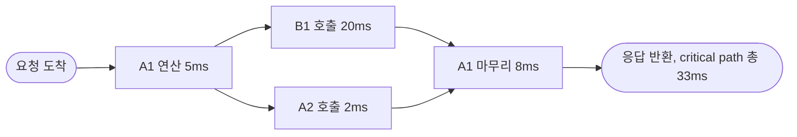
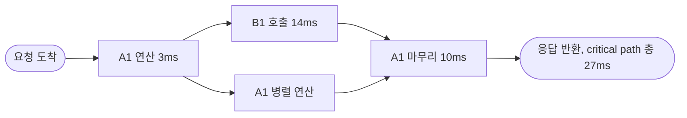
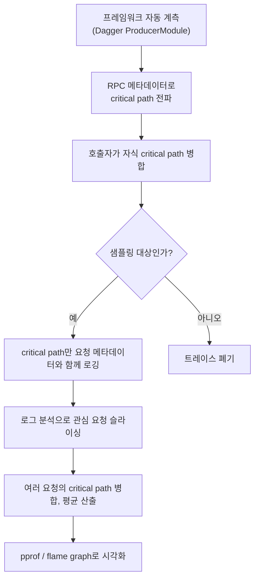
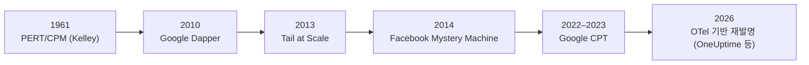

수백 개의 마이크로서비스가 얽혀 있는 시스템에서 응답이 300ms 걸렸다고 하자. 그중 어느 서비스를 최적화해야 실제로 응답 시간이 줄어들까? RPC 모니터링 대시보드를 열어봐도, CPU 프로파일러를 돌려봐도 답이 명확하지 않을 때가 많다. 병렬로 실행된 요청, 어쩌다 한 번 느려지는 하위 컴포넌트, 서비스 경계에 걸쳐 흩어진 지연시간은 기존 도구들의 사각지대이기 때문이다.

Google Search 엔지니어링팀은 이 문제를 **critical path tracing(CPT, 임계 경로 추적)** 이라는 기법으로 풀었다. Brian Eaton, Jeff Stewart, Jon Tedesco, N. Cihan Tas 네 사람이 쓴 [Distributed Latency Profiling through Critical Path Tracing](https://cacm.acm.org/practice/distributed-latency-profiling-through-critical-path-tracing/)은 2022년 [acmqueue](https://queue.acm.org/detail.cfm?id=3526967)에 처음 실렸고, 2023년 1월 *Communications of the ACM*(CACM) Practice 섹션에 재수록됐다. 이 글은 이 원문을 1차 자료로 삼아 CPT의 개념, 계산 방법, 실제 구현, 그리고 Google Search에 적용했을 때 실측된 운영 비용까지 정리한다.

---

## 왜 기존 도구로는 부족한가

원문은 지연시간 분석 도구를 세 갈래로 나누고, 각각이 왜 "가로등 효과(streetlight effect)"—즉 잘 보이는 곳만 들여다보고 정작 문제가 있는 곳은 어둠 속에 남겨두는 현상—에 빠지는지를 설명한다.

### RPC 텔레메트리

서비스 간 호출 횟수와 지연시간 분포를 집계하는 방식이다. 몇 개의 RPC가 항상 병목인 시스템에서는 잘 작동하지만, 세 가지 지점에서 무너진다.

1. **병렬성을 모른다.** A가 B, C, D를 병렬로 호출하고 그중 D의 응답을 기다리는 동안 CPU 작업을 하고 있다면, B와 C를 아무리 최적화해도 전체 지연시간은 줄지 않는다. RPC 텔레메트리는 이 사실을 알려주지 않는다.
2. **반복 호출에 평균이 숨는다.** A가 C에 수백 번 요청을 보낸다면, 그중 단 한 번의 느린 호출이 전체 지연을 좌우할 수 있는데도 평균 지연시간은 "빠름"으로 나타난다.
3. **서비스 내부의 서브컴포넌트를 구분하지 못한다.** 같은 서비스 안의 서로 다른 두 컴포넌트가 같은 하위 서비스를 호출하면, 텔레메트리는 이 둘을 뭉뚱그려 버린다.

### CPU 프로파일링

RPC 텔레메트리로 문제 서비스를 찾아낸 뒤, "그 서비스를 어떻게 더 빠르게 만들까"를 알려주는 도구다. 함수 호출 스택 기반 CPU 샘플을 모아 비싼 코드 경로를 짚어낸다. 다만 이것도 병렬성 정보가 없기는 마찬가지다. CPU 작업이 다른 RPC와 병렬로 일어나는지, 아니면 실제로 요청 진행을 막고 있는지 CPU 프로파일만으로는 구분할 수 없다.

### 분산 트레이싱

개별 요청을 추적하며 타이밍 정보를 모으는 방식으로, 병렬성과 이질적인 워크로드를 비교적 잘 다룬다. 문제는 **비용**이다. Google Search에서 서비스 하나가 가진 RPC 의존성은 많아야 수십 개지만, 의미 있는 서브컴포넌트 수는 그 100배에 달할 수 있다. 서브컴포넌트까지 기본으로 계측하면 트레이스 크기가 수십~수백 배로 불어난다. 게다가 99번째 백분위수(p99) 같은 꼬리 구간을 조사하려면 1%짜리 실험에서 단 하나의 사례를 찾기 위해 1만 건, 통계적 확신을 얻으려면 1만~10만 건의 트레이스가 필요할 수 있다. 결과적으로 10<sup>8</sup>~10<sup>9</sup>건의 전체 트레이스를, 그것도 기본 트레이스보다 100배 큰 크기로 수집해야 하는 상황에 몰린다.

| 도구 | 병렬성 파악 | 서브컴포넌트 구분 | 비용 |
|---|---|---|---|
| RPC 텔레메트리 | 불가 | 취약 | 낮음 |
| CPU 프로파일링 | 불가 | 서비스 내부는 강함 | 낮음~중간 |
| 분산 트레이싱(기본) | 가능 | RPC 경계만 기본 제공 | 서브컴포넌트까지 확장 시 매우 높음 |
| Critical Path Tracing | 가능 | 프레임워크가 자동 제공 | critical path만 남기므로 낮음 |

---

## Critical Path란 무엇인가

**critical path(임계 경로)** 라는 용어 자체는 CPT가 만든 말이 아니다. 프로젝트 관리 분야에서 1961년 James E. Kelley Jr.가 제시한 **PERT/CPM(critical path planning and scheduling)** 기법에서 빌려온 개념이다. 이 글에서 critical path는 "분산 시스템에서 요청 처리의 가장 느린 경로에 직접 기여하는, 순서가 있는 단계들의 목록"으로 정의된다.

요청 처리 과정을 이름이 붙은 노드(서브컴포넌트)로 이뤄진 방향 그래프로 모델링하면, 각 노드는 자체 연산을 수행하고, 각 엣지는 "다음 연산을 시작하려면 이 의존성이 끝나야 한다"는 제약을 나타낸다. **critical path는 요청 진입점에서 응답을 계산하는 노드까지, 가장 오래 걸리는 경로**이며, 이 경로의 총 길이가 곧 요청 처리의 전체 지연시간이다. 여러 단계가 병렬로 진행 중이면, 그중 가장 느린 단계만 critical path에 오른다.

### 예시 시스템의 구조

원문은 세 서비스(A, B, C)가 각각 두 개의 서브컴포넌트를 가진 예시 시스템으로 이를 설명한다. 요청은 Service A로 들어와 A1으로 넘어가고, A1은 B1·B2·A2에 의존하며, A2·B2·C2는 모두 C1을 호출한다. 아래 다이어그램은 원문에 명시된 의존 관계만 표시한 개념도다(원문 Figure 1 이미지 전체를 그대로 재현한 것은 아니며, C2를 호출하는 상위 컴포넌트는 원문 텍스트에 구체적으로 명시돼 있지 않다).



### 병렬 실행이 critical path를 어떻게 바꾸는가

A1이 B1과 A2에 의존하는 상황에서, 이 둘이 순차로 실행되는지 병렬로 실행되는지에 따라 critical path 자체가 달라진다.

| 시나리오 | 실행 방식 | Critical Path 구성 | 총 지연시간 | 비고 |
|---|---|---|---|---|
| (a) 순차 실행 | A1이 B1을 기다린 뒤 A2를 호출 | A1=5ms → B1=20ms → A1=8ms → A2=2ms | 35ms | 4개 구간 모두 critical path에 포함 |
| (b) B1·A2 병렬 실행 | A1이 B1과 A2를 동시에 호출, B1이 더 느림 | A1=5ms → B1=20ms → A1=8ms | 33ms | A2(2ms)는 critical path에서 완전히 빠짐 |
| (c) 부모·자식 노드 중첩 실행 | A1이 B1에 RPC를 보내고 즉시 블록하지 않은 채 다른 연산을 계속함 | A1=3ms → B1=14ms → A1=10ms | 27ms | 나중에 끝나는 쪽이 critical path에 배정 |

아래 세 다이어그램은 각 시나리오의 실행 흐름을 시각화한 것이다.

**(a) 순차 실행 — 35ms.** A1이 B1을 완전히 기다린 뒤에야 A2를 호출하므로, 네 구간이 모두 한 줄로 이어져 critical path 전체를 이룬다.


**(b) B1·A2 병렬 실행 — 33ms.** A1이 B1과 A2를 동시에 호출하면, 둘 중 더 느린 B1만 critical path에 남는다. A2를 아무리 최적화해도 전체 지연시간에는 아무 영향이 없다—A2는 B1보다 먼저 끝나기 때문에 애초에 병목이 아니었다. 반면 A1과 B1을 최적화하면 실제로 응답 시간이 줄어든다. **critical path 분석의 존재 이유는 바로 이 "최적화해도 소용없는 곳에 시간을 쓰지 않게 하는 것"**이다.



`A2c`(2ms)는 `B1c`(20ms)보다 먼저 끝나 `A1d`가 시작되는 시점에는 이미 완료돼 있으므로, 이 경로는 critical path에서 제외된다.

**(c) 부모·자식 노드 중첩 실행 — 27ms.** A1이 B1에 RPC를 보낸 뒤 응답을 기다리지 않고 다른 연산을 계속하는 경우로, 부모(A1)와 자식(B1)이 겹쳐 실행된다. 이때는 둘 중 나중에 끝나는 쪽이 critical path에 배정된다.



여기서는 B1(14ms)이 A1의 병렬 연산보다 나중에 끝나므로 critical path에 배정되고, A1의 병렬 연산은 제외된다.

---

## 어떻게 서브컴포넌트를 자동으로 계측하는가

분산 트레이싱의 가장 큰 걸림돌이 "서브컴포넌트까지 계측하면 비용이 폭발한다"는 것이었다. CPT는 이 문제를 **소프트웨어 프레임워크 계층에서 자동 계측**하는 방식으로 우회한다.

원문은 Google이 사용하는 [Dagger](https://dagger.dev/dev-guide/producers.html) 프레임워크를 예로 든다. Dagger는 개발자가 코드를 `ProducerModule` 단위로 작성하도록 유도하는데, 각 모듈은 자신이 필요로 하는 입력과 생성하는 출력을 선언한다.

```java
@ProducerModule
public abstract class A1ProducerModule {
    @Produces
    @A1Output
    static A1Output runA1(@A2Output a2, @B1Output b1, @B2Output b2) {
        // a2, b1, b2 정보를 읽어 A1Output을 계산
    }
}
```

Dagger는 이 `ProducerModule`들이 만드는 의존성 그래프를 따라 요청을 처리하는데, 이 과정에서 **A2, B1, B2 중 어느 것이 A1의 출력을 만들기 위해 가장 마지막까지 블록했는지**를 프레임워크 스스로 알고 있다. 프레임워크가 서브컴포넌트 간 의존 관계를 이미 알고 있으므로, critical path를 별도 계측 코드 없이 자동으로 기록할 수 있다는 것이 핵심이다. Google Search에서는 여러 언어의 여러 프레임워크가 이런 방식으로 계측을 제공하며, 대부분의 개발자는 자신의 코드가 critical path tracing의 대상이 되고 있다는 사실조차 인식하지 못한 채 그 혜택을 받는다.

### 전파와 병합

서비스 하나의 critical path만으로는 부족하다. 서비스 A가 서비스 B를 호출하면, RPC 메타데이터를 통해 B의 critical path 정보가 호출자인 A로 전파(propagation)되고, A는 이를 자신의 critical path와 병합(merging)해 하나의 통합된 경로를 만든다. 이 과정은 재귀적으로 반복되며, 최종적으로 요청 전체를 아우르는 단일 critical path가 만들어진다.

이 병합 과정에는 세 가지 전형적인 계측 난제가 따른다.

- **과소 계산(undercounting)**: 호출자(A1)가 실제로는 더 긴 지연을 관측했는데, 네트워크 라우팅이나 직렬화 비용이 반영되지 않아 하위 서비스(B1)가 보고한 값보다 작게 잡히는 경우.
- **과대 계산(overcounting)**: 반대로 B1이 실제보다 더 긴 지연을 보고하는 경우로, 대개 B1 쪽 계측 버그가 원인이다.
- **블라인드 스팟(blind spot)**: B1이 아예 critical path 정보를 보고하지 않는 경우. CPT는 이런 사각지대의 크기와, 어느 서비스가 이를 유발했는지를 정확히 보고하도록 설계돼 있어, 계측이 안 된 서비스를 호출하더라도 시스템 전체가 우아하게(gracefully) 성능이 저하된다.

### 샘플링과 트리거링

모든 요청을 추적하면 오버헤드가 감당하기 어려워지므로 샘플링이 필요하다. 각 서비스는 독립적으로 샘플링 여부를 결정하고, 이를 아웃바운드 RPC의 메타데이터에 실어 전파한다. Facebook의 Mystery Machine과 유사하게, 호출자가 CPT를 켰다는 신호를 하위 서비스가 감지하면 하위 서비스도 트레이싱을 활성화한다. 반대로 호출자가 샘플링을 요청하지 않았어도 하위 서비스는 자체적으로 critical path를 기록해 둘 수 있으며, 이 경우 샘플링을 요청하지 않은 호출자는 해당 트레이스를 그냥 무시한다. 운영자가 특정 요청 유형에 대해 수동으로 opt-in해 디버깅용 샘플을 모을 수도 있는데, 이런 비무작위 샘플은 기본적으로 집계 분석에서 제외된다.

### 전체 파이프라인 한눈에 보기

지금까지 설명한 계측·전파·병합·샘플링 단계를 하나로 이으면, 요청 한 건이 로그로 남기까지의 흐름은 다음과 같다.



이 파이프라인에서 "샘플링 대상이 아니면 트레이스를 버린다"는 분기와, 로깅 단계에서 critical path 외 나머지 트레이스 정보를 애초에 남기지 않는다는 점이 앞서 설명한 분산 트레이싱 대비 비용 절감의 핵심이다.

---

## 집계와 시각화: 평균 Critical Path 만들기

트레이스 한 건은 이상치일 수 있으므로, 통계적으로 의미 있는 그림을 얻으려면 여러 요청의 critical path를 병합해야 한다. Google Search는 A/B 실험군, 검색 결과 페이지의 특정 UI 요소 노출 여부, 시간대, 지역 등 비즈니스 기준으로 로그를 슬라이싱해 관심 있는 요청 집합을 추린 뒤, 동일한 서브컴포넌트 경로를 병합하고 샘플 수로 나눠 "평균 critical path"를 만든다. 이 집계와 시각화에는 [pprof](https://github.com/google/pprof)와 [flame graph](https://dl.acm.org/doi/10.1145/2909476)를 활용한다.

여기서 짚어야 할 해석상의 함정이 있다. 평균 critical path는 실제로 어떤 단일 요청도 밟지 않았을 수 있는 가상의 경로라는 점이다. 두 서브컴포넌트가 병렬로 호출된다면, 단일 요청에서 둘 다 critical path에 오르는 일은 있을 수 없다. 하지만 집계된 평균에는 둘 다 등장할 수 있다. 또한 "critical path 위에서 소요된 평균 시간"은 두 가지 서로 다른 원인을 구분하지 못한다는 점도 중요하다. 항상 5ms가 걸리는 컴포넌트와, 1%의 확률로만 critical path에 오르지만 그때는 500ms가 걸리는 컴포넌트는 **평균 집계 프로파일상으로 똑같이 "5ms"로 보인다.** 그래서 원문은 pprof 형식 프로파일과 함께 지연시간 히스토그램을 같이 봐야 한다고 강조한다.

### 통계적 정밀도와 거짓 양성

수천 개의 서브컴포넌트를 담은 집계 프로파일에서는, 95번째 백분위수 신뢰구간을 적용해도 상당수의 거짓 양성(false positive)—실제로는 무작위 변동일 뿐인데 통계적으로 유의미해 보이는 변화—이 나타날 수 있다. Google Search 팀은 동일한 샘플링 기준으로 두 프로파일을 만들어 pprof의 difference-base 뷰로 비교하는 실험을 100회 반복해 거짓 양성 비율을 정량화했다. 그 결과, **프로파일당 1,000개 요청을 기준으로 비교할 때, 5ms 이상 차이가 나는 컴포넌트의 평균 개수는 95% 신뢰구간에서 0.2~0.4개**로 나타났다. 평균 지연시간과 표준편차가 큰 컴포넌트일수록 거짓 양성률도 높아지는데, 이는 중심극한정리가 예측하는 대로다. 실무적으로는, A/B 실험처럼 두 프로파일의 샘플링 기준이 동일할 때는 1ms 이상의 서브컴포넌트 차이가 곧 실험 효과일 가능성이 높지만, 서로 다른 워크로드의 프로파일을 비교할 때는 샘플 수를 늘려도 차이가 더 선명해지지 않는다—애초에 다른 샘플링 기준 자체가 차이를 만들어내기 때문이다.

프로파일 시각화는 요청 수가 수백만 건에 이르면 급격히 느려지므로, Google Search는 정밀도와 사용성의 절충점으로 기본 10만 건 샘플을 사용하고 필요할 때만 그 이상으로 늘린다.

---

## 실측 운영 비용

CPT가 실전에서 쓸 만한 이유는 오버헤드가 낮기 때문이다. 원문이 밝힌 Google Search의 실측치는 다음과 같다.

| 항목 | 수치 |
|---|---|
| 상시 샘플링 비율 | 요청의 0.1% |
| 트레이싱된 요청의 평균 지연시간 증가 | 1.7% |
| 전체 평균 요청 지연시간에 대한 영향 | 0.002% |
| 트레이싱된 요청의 p99 지연시간 오버헤드 | 2.0% |
| CPT 도입을 위한 프레임워크 변경의 CPU 비용 | 대체로 전체 CPU 비용의 0.1% 미만(워크로드에 따라 다름) |

네트워크 오버헤드는 조금 다른 이야기다. critical path 하나에 N개의 요소가 있고 요소당 평균 M개의 서브컴포넌트가 있다면, 현재 와이어 포맷은 O(N×M) 메모리를 쓴다—그래프 형태로 인코딩했다면 이보다 훨씬 저렴했을 것이라고 원문은 인정한다. 실무에서는 0.1% 샘플링과 압축을 병행해 이 비효율을 완화하고 있다.

이 수치들이 중요한 이유는, "critical path만 남기고 나머지 트레이스 정보는 버린다"는 설계가 실제로 앞서 설명한 **분산 트레이싱의 비용 문제(10<sup>8</sup>~10<sup>9</sup>건 규모의 풀 트레이스가 필요할 수 있다는 문제)** 를 자릿수 단위로 줄여준다는 것을 뒷받침하기 때문이다.

---

## CPT의 한계

원문은 스스로 CPT의 약점도 분명히 짚는다.

1. **리소스 경합(resource contention)을 놓친다.** A2가 뮤텍스를 잡고 있거나 CPU를 독점해 다른 critical path 상의 노드들을 굶기고 있다면, critical path에는 "기다리는 쪽"만 나타나고 정작 원인인 A2는 등장하지 않는다. 이런 병목은 CPU·락 경합에 특화된 프로파일러가 더 잘 잡아낸다.
2. **drag와 slack을 보여주지 못한다.** 특정 단계를 최적화했을 때 critical path 전체가 얼마나 줄어들지를 나타내는 지표가 drag이고, 병렬로 실행돼 다소 느려져도 전체 지연시간에 영향을 주지 않는 여유가 slack이다. 원문은 이를 보완하는 기법으로 실험적으로 지연을 주입해 drag·slack을 찾는 [causal profiling(Coz)](https://dl.acm.org/doi/10.1145/2815400.2815409), CPU 프로파일링으로 drag가 큰 서브컴포넌트를 찾는 [Quartz](https://dl.acm.org/doi/10.1145/98457.98518), 로그 분석으로 의존성 그래프를 재구성해 slack을 식별하는 [Facebook의 Mystery Machine](https://www.usenix.org/conference/osdi14/technical-sessions/presentation/chow)을 언급한다.
3. **스트리밍 API를 잘 다루지 못한다.** 서버가 결과를 스트리밍으로 반환하거나 클라이언트·서버가 메시지를 주고받는 양방향 스트리밍에서는 "critical path 구간이 언제 끝나는가"라는 정의 자체가 애매해진다. Google Search의 현재 구현은 스트림의 마지막 메시지를 기준으로 구간을 끝내는데, 초기 메시지가 지연시간 관점에서 더 중요한 상황에서는 이 정의가 오히려 오해를 부를 수 있다고 원문은 인정한다.

이런 한계에도 불구하고 원문은 CPT가 "노력을 가장 효과가 클 곳에 집중시키는 데 도움이 된다"고 결론짓는다.

---

## 계보로 보는 CPT: PERT부터 Tail at Scale까지

CPT는 허공에서 튀어나온 개념이 아니라, 여러 갈래의 선행 연구를 프레임워크 계측이라는 실용적인 방식으로 엮은 결과에 가깝다.



| 시기 | 연구/시스템 | 핵심 기여 | CPT와의 관계 |
|---|---|---|---|
| 1961 | [PERT/CPM(Kelley)](https://www.jstor.org/stable/167563) | 프로젝트 관리에서 "critical path" 개념 정립 | critical path라는 용어와 최장 경로 계산 아이디어의 원류 |
| 2010 | [Google Dapper](https://research.google/pubs/dapper-a-large-scale-distributed-systems-tracing-infrastructure/) | 트리·스팬·주석 모델의 명시적 계측 기반 분산 트레이싱 | CPT가 "부족하다"고 지적하는 인프라 우선(infrastructure-first) 트레이싱의 대표 사례 |
| 2013 | [The Tail at Scale(Dean & Barroso)](https://cacm.acm.org/research/the-tail-at-scale/) | 대규모 시스템에서 드문 지연이 전체 성능을 좌우할 수 있음을 규명 | CPT가 p99 오버헤드까지 실측해 보고하는 이유와 맞닿은 문제의식 |
| 2014 | [Facebook Mystery Machine](https://www.usenix.org/conference/osdi14/technical-sessions/presentation/chow) | 로그 마이닝으로 의존성 그래프를 암묵적으로 추론해 critical path·slack 계산 | 샘플링 전파 방식(호출자가 opt-in하면 하위 서비스도 활성화)을 CPT가 그대로 채택 |
| 2022–2023 | Google CPT(Eaton, Stewart, Tedesco, Tas) | 프레임워크 계층 자동 계측으로 critical path만 남겨 비용을 절감 | 이 글이 다루는 원 논문 |

Mystery Machine과 CPT는 목표는 비슷하지만 접근이 다르다는 점이 흥미롭다. Mystery Machine은 기존 로그에서 인과관계를 사후에 추론하는 쪽을, CPT는 Dagger 같은 프레임워크가 실행 시점에 의존성을 이미 알고 있다는 사실을 이용해 애초에 정확한 그래프를 얻는 쪽을 택했다.

원 논문 발표 이후에도 같은 아이디어는 업계에서 되풀이해 등장하고 있다. 예컨대 2026년 초 옵저버빌리티 업체 OneUptime이 공개한 [critical path analysis 구현 가이드](https://oneuptime.com/blog/post/2026-01-30-critical-path-analysis/view)는 OpenTelemetry 스팬 데이터를 의존성 그래프로 바꾼 뒤 "가장 이른 시작 시각"과 "가장 늦은 시작 시각"의 차이(slack)가 0인 스팬만 골라 critical path를 뽑아낸다. 이 글은 Google의 CPT 논문을 직접 인용하지는 않지만, "병렬 경로 중 슬랙이 0인 구간만 최적화 대상"이라는 핵심 아이디어는 CPT·Mystery Machine과 정확히 같은 결론에 독자적으로 도달한 셈이다. 같은 문제의식이 표준 트레이싱 포맷(OpenTelemetry) 위에서 계속 재발명되고 있다는 것은, critical path 기반 분석이 특정 회사의 사내 기법을 넘어 옵저버빌리티 분야의 일반적인 패턴으로 자리잡고 있다는 신호로 볼 수 있다.

---

## 자주 하는 오해

1. **"critical path에 없으면 최적화할 필요가 없다"는 절반만 맞다.** 리소스 경합처럼 critical path 노드가 "기다리기만 하고" 실제 원인은 밖에 있는 경우가 있다. critical path는 어디를 봐야 하는지 알려줄 뿐, 원인 규명까지 자동으로 해주지는 않는다.
2. **"평균 critical path의 각 구간 시간 = 그 구간이 실제로 걸리는 시간"이 아니다.** 앞서 본 것처럼 "항상 5ms" 컴포넌트와 "1%의 확률로 500ms" 컴포넌트가 집계 프로파일에서 구분되지 않는다. 반드시 히스토그램이나 원본 분포를 함께 봐야 한다.
3. **"트레이스를 더 많이 모으면 더 정확해진다"는 워크로드가 같을 때만 성립한다.** 서로 다른 워크로드의 프로파일을 비교할 때는 샘플을 늘려도 노이즈가 줄지 않는다. 애초에 비교 대상 자체가 다르기 때문이다.
4. **"이건 트레이싱 도구를 완전히 대체한다"는 원문의 주장이 아니다.** 원문은 CPT가 RPC 텔레메트리·CPU 프로파일링·분산 트레이싱의 "빈틈을 메운다"고 표현하지, 이들을 대체한다고 말하지 않는다. 리소스 경합 진단에는 여전히 CPU·락 프로파일러가 필요하다.

---

## 요약

- Critical path tracing(CPT)은 요청 처리를 방향 그래프로 모델링하고, 각 병렬 구간에서 가장 느린 경로만 남겨 "실제로 지연시간에 영향을 주는 구간"만 추적하는 기법이다.
- RPC 텔레메트리·CPU 프로파일링·분산 트레이싱이 각각 놓치는 병렬성, 서브컴포넌트 구분, 비용 문제를 프레임워크 계층 자동 계측으로 동시에 해결한다.
- Google Search는 요청의 0.1%를 상시 샘플링하며, 트레이싱된 요청의 평균 지연시간 증가는 1.7%(전체 평균 대비 0.002%), p99 오버헤드는 2.0%, CPU 오버헤드는 대체로 0.1% 미만이라고 보고했다.
- 리소스 경합, drag/slack, 스트리밍 API는 CPT가 아직 잘 다루지 못하는 영역으로 원문이 스스로 인정한다.
- Kelley의 PERT/CPM(1961), Dapper(2010), Tail at Scale(2013), Mystery Machine(2014)의 흐름 위에 있는 기법이며, 같은 아이디어가 OpenTelemetry 기반 도구에서도 독자적으로 재발명되고 있다.

---

## 참고 자료

- Eaton, B., Stewart, J., Tedesco, J., Tas, N.C. [Distributed Latency Profiling through Critical Path Tracing](https://cacm.acm.org/practice/distributed-latency-profiling-through-critical-path-tracing/). *Communications of the ACM*, Jan. 2023. (원 출처: [acmqueue 20, 1 (2022)](https://queue.acm.org/detail.cfm?id=3526967))
- Sigelman, B.H. et al. [Dapper, a Large-Scale Distributed Systems Tracing Infrastructure](https://research.google/pubs/dapper-a-large-scale-distributed-systems-tracing-infrastructure/). Google Technical Report, 2010.
- Dean, J., Barroso, L.A. [The Tail at Scale](https://cacm.acm.org/research/the-tail-at-scale/). *Communications of the ACM* 56, 2 (Feb. 2013), 74-80.
- Chow, M., Meisner, D., Flinn, J., Peek, D., Wenisch, T.F. [The Mystery Machine: End-to-end Performance Analysis of Large-scale Internet Services](https://www.usenix.org/conference/osdi14/technical-sessions/presentation/chow). USENIX OSDI, 2014.
- Curtsinger, C., Berger, E.D. [Coz: Finding Code That Counts with Causal Profiling](https://dl.acm.org/doi/10.1145/2815400.2815409). SOSP, 2015.
- Anderson, T.E., Lazowska, E.D. [Quartz: A Tool for Tuning Parallel Program Performance](https://dl.acm.org/doi/10.1145/98457.98518). ACM SIGMETRICS, 1990.
- Gregg, B. [The Flame Graph](https://dl.acm.org/doi/10.1145/2909476). *Communications of the ACM* 59, 6 (Jun. 2016), 48-57.
- Dagger. [Dagger Producers](https://dagger.dev/dev-guide/producers.html).
- OneUptime. [How to Build Critical Path Analysis](https://oneuptime.com/blog/post/2026-01-30-critical-path-analysis/view). 2026.
