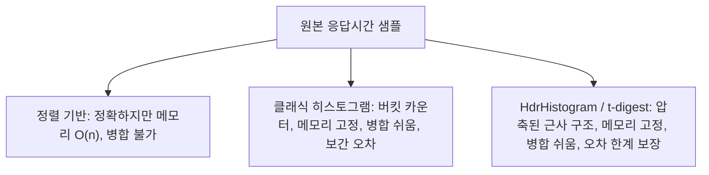

"평균 응답 시간 120ms"라는 대시보드 숫자를 보고 안심했다가, 정작 사용자 불만은 계속 들어오는 경험을 해본 적이 있을 것이다. 검색창에 "p95 p99"를 입력해 이 글에 도착했다면 이미 그 이유를 짐작하고 있을 가능성이 높다. 평균은 다수의 빠른 요청 뒤에 숨은 소수의 느린 요청을 지워버린다. 이 글은 왜 실무에서 평균 대신 p95·p99·p99.9 같은 백분위수(percentile)를 쓰는지, 그 값을 어떻게 계산하는지, Prometheus·Grafana 같은 도구로 어떻게 다루는지, 그리고 SLO/SLA에 어떻게 반영하는지를 실제 수치와 함께 정리한다.

---

## 평균이 감추는 것: 구체적인 수치로 보기

평균(mean)은 모든 값을 더해 개수로 나눈 값이라, 분포의 모양과 무관하게 하나의 숫자로 뭉개진다. 다음 표는 같은 "평균 100ms"를 만들어내는 서로 다른 두 서비스를 보여준다.

| 요청 순위 | 서비스 A (균일 분포) | 서비스 B (롱테일 분포) |
|---|---|---|
| 하위 90% | 90–110ms | 40–60ms |
| p95 | 약 115ms | 약 90ms |
| p99 | 약 120ms | 800ms |
| p99.9 | 약 125ms | 4,500ms |
| 평균 | 약 100ms | 약 100ms |

두 서비스는 평균만 보면 동일하지만, 서비스 B는 100번 중 1번(p99) 꼴로 800ms를 기다려야 하고 1,000번 중 1번(p99.9)은 4.5초를 기다린다. 평균만 모니터링하면 이 차이는 대시보드에 전혀 드러나지 않는다.

이 문제는 트래픽 규모가 커질수록 더 심각해진다. Google의 Jeffrey Dean과 Luiz André Barroso는 논문 [The Tail at Scale](https://cacm.acm.org/research/the-tail-at-scale/)(*Communications of the ACM*, 2013)에서, 개별 서버의 p99 지연시간이 1초인 경우 요청 100건 중 1건은 1초가 걸린다고 지적한다. 문제는 검색 결과 하나를 만들기 위해 100대의 서버에 병렬로(fan-out) 요청을 보내는 경우다. 100개의 하위 요청 중 단 하나라도 느리면 전체 응답이 느려지므로, 개별 서버가 1%의 확률로 느려지더라도 전체 요청이 "느린 서버를 최소 하나는 포함할" 확률은 수학적으로 약 63%까지 치솟는다. 이 논문이 보고한 Google 실측 사례에서는, 단일 요청의 p99 지연시간이 10ms인 서비스라도 대규모 fan-out을 거친 뒤 전체 요청의 p99는 140ms로 14배 늘어났다. 개별 컴포넌트는 빨라도 병렬 호출 수가 늘어날수록 "누군가는 느리다"가 거의 확실해지는 것이다.

<strong>Google SRE Book(Site Reliability Engineering)</strong>의 [모니터링 챕터](https://sre.google/sre-book/monitoring-distributed-systems/)도 같은 문제의식을 공유한다. 이 책은 "초당 1,000건을 처리하는 웹 서비스의 평균 지연시간이 100ms라면, 요청의 1%는 5초가 걸릴 수도 있다"고 지적하며, 평균과 느린 "꼬리(tail)"를 구분하는 가장 단순한 방법은 지연시간을 구간별로 나눠 요청 수를 세는 것이라고 설명한다. 같은 책은 "4대 골든 시그널(Golden Signals)" 중 하나로 p99 응답 시간을 포화(saturation)의 선행 지표로 꼽는다.

---

## 백분위수는 무엇을 의미하는가

p95는 "전체 요청 중 95%가 이 값 이하로 완료됐다"는 뜻이다. 다르게 말하면 요청 100건 중 5건은 p95보다 느렸다는 의미이기도 하다. p99는 요청 100건 중 1건, p99.9는 1,000건 중 1건이 그 값을 넘겼다는 뜻이다. 어떤 백분위수를 볼지는 트래픽 규모와 직결된다.

- 초당 요청이 10건이면 p99는 10초에 1건꼴로만 발생하므로 통계적 노이즈가 크고, 그 값 하나로 SLO를 정하기 어렵다.
- 초당 요청이 10,000건이면 p99만으로도 초당 약 100건, 즉 사용자 100명이 매초 그 느린 경험을 겪는다는 뜻이 된다. 트래픽이 클수록 더 높은 백분위수(p99.9, p99.99)가 실질적인 의미를 갖는다.

p50(중앙값)은 "전형적인 사용자 경험"을 보여주지만 개선 여지를 잘 드러내지 않는다. 반면 p99·p99.9는 소수지만 실재하는 나쁜 경험을 보여준다. 흥미로운 점은, 한 사용자가 여러 번 요청을 보내는 세션 단위로 보면 "가끔 걸리는 p99"조차 결국 대부분의 사용자가 한 번쯤 경험하게 된다는 것이다. 요청마다 독립적으로 1%의 확률로 느려진다면, 20번 요청을 보내는 세션에서 적어도 한 번 느린 요청을 겪을 확률은 약 18%다. 이는 1 - (1 - 0.01)^20 ≈ 0.182로 계산된다. p99가 "드문 일"처럼 보여도 세션 단위에서는 드물지 않다.

---

## 백분위수 계산 방법: 정렬 기반 vs 근사 알고리즘

### 정렬 기반(정확한) 계산

가장 직관적인 방법은 모든 응답 시간 값을 정렬한 뒤, N개 값 중 순위 <code>⌈0.99 × N⌉</code>번째 값을 p99로 읽는 것이다. 예를 들어 요청 1,000건을 정렬했다면 990번째 값이 p99다. 이 방식은 정확하지만 두 가지 실무적 문제가 있다.

1. **메모리**: 모든 원본 값을 보관해야 하므로 요청량이 많은 서비스에서는 메모리 사용량이 선형으로 늘어난다.
2. **분산 집계 불가**: 여러 서버에 흩어진 값을 합쳐 전체 p99를 구하려면 결국 원본 값을 한곳에 모아 다시 정렬해야 한다. 각 서버가 계산한 p99의 평균은 전체 p99와 다르다 — 백분위수는 평균처럼 단순 합산되지 않는다.

### 히스토그램 기반 근사

Prometheus의 클래식 히스토그램은 값을 미리 정한 버킷 경계(예: 10ms, 50ms, 100ms, 500ms, 1s, +Inf)별 누적 카운터로 기록한다. 개별 값을 저장하지 않고 "얼마나 많은 요청이 각 경계 이하였는지"만 세기 때문에 메모리가 상수로 고정되고, 여러 인스턴스의 버킷 카운터를 단순히 더하기만 하면 집계 p99를 구할 수 있다.

대신 정확도를 희생한다. `histogram_quantile()` 함수는 목표 백분위수가 속한 버킷 안에서 값이 균등하게 분포한다고 가정하고 선형 보간한다. [Prometheus 공식 문서](https://prometheus.io/docs/practices/histograms/)는 이 보간이 버킷 경계를 잘못 잡으면 큰 오차로 이어질 수 있다고 명시하며, 실측 p95가 약 320ms인 분포에서 버킷 경계가 성기면 히스토그램 추정치가 443ms로 나온 예시를 들어 경고한다. SLO 임계값 근처에서는 이 오차가 통과·위반 판정을 뒤집을 수 있다.

### 스케치 알고리즘: HdrHistogram·t-digest

정렬 기반의 정확성과 히스토그램의 고정 메모리 사이 절충안으로, 스트리밍 데이터에서 근사 백분위수를 계산하는 전용 자료구조가 쓰인다.

- **[HdrHistogram](https://github.com/HdrHistogram/HdrHistogram)**: 지수적으로 커지는 버킷과 그 안의 선형 서브버킷을 부동소수점 표현과 유사한 방식으로 조합해, 유효자릿수(예: 3자리)를 고정한 채 넓은 값 범위를 다룬다. 마이크로초~시간 단위를 모두 다뤄도 메모리 사용량이 약 185KB로 고정되며, 값 기록에 3–6나노초 수준의 오버헤드만 든다. 또한 "코디네이티드 오미션(coordinated omission)" — 측정 도구 자체가 느려져 정작 가장 느린 샘플을 누락하는 현상 — 을 보정하는 기능을 제공한다.
- **[t-digest](https://github.com/tdunning/t-digest)**: 1차원 k-평균 군집화 변형으로 값을 압축된 클러스터 집합으로 요약한다. 분포의 중앙보다 꼬리(극단값) 근처에서 클러스터를 더 촘촘하게 유지하도록 설계돼, 중앙값보다 p99·p99.9 같은 극단 백분위수에서 오히려 더 정확하다. 클러스터는 서로 병합 가능해서 분산 시스템에서 여러 노드의 요약을 합치는 데 적합하다.

두 알고리즘 모두 "정확한 값"이 아니라 "오차 한계가 보장된 근사값"을 제공하는 대신, 메모리를 상수로 유지하고 분산 환경에서 병합이 가능하다는 공통점이 있다.



---

## Prometheus·Grafana로 실무에서 다루기

Prometheus는 세 가지 관측 타입으로 지연시간을 다룬다.

- **Histogram**: 애플리케이션이 값을 버킷 카운터로 노출하고, 서버 측(PromQL)에서 `histogram_quantile()`로 원하는 백분위수를 계산한다. 여러 인스턴스를 `sum by (le) (...)`로 합친 뒤에도 계산할 수 있어 분산 집계에 유리하다.
- **Summary**: 클라이언트 라이브러리가 자체적으로 백분위수를 계산해 노출한다. 개별 인스턴스 값은 더 정확하지만, 여러 인스턴스의 summary를 합쳐 "전체 p99"를 구할 수는 없다.
- **Native histogram**: 최신 Prometheus가 지원하는 방식으로, 버킷 경계를 미리 정하지 않고 지수 스키마로 동적으로 세분화해 histogram과 summary의 장점을 함께 얻는다. [Prometheus 문서](https://prometheus.io/docs/practices/histograms/)는 클라이언트 라이브러리가 지원한다면 native histogram을 우선 권장한다.

실제 쿼리 예시는 다음과 같다.

```promql
# 지난 5분간 요청의 p99 지연시간(초)
histogram_quantile(0.99, sum(rate(http_request_duration_seconds_bucket[5m])) by (le))

# 서비스별 p95 지연시간
histogram_quantile(0.95, sum(rate(http_request_duration_seconds_bucket[5m])) by (le, service))
```

`rate()`로 구간별 증가량을 먼저 구한 뒤 `histogram_quantile()`에 넘기는 순서가 중요하다. 누적 카운터를 그대로 백분위수 함수에 넣으면 시간에 따라 계속 증가하는 값이라 의미 있는 결과가 나오지 않는다. [Prometheus 공식 문서](https://prometheus.io/docs/prometheus/latest/querying/functions/#histogram_quantile)는 버킷 카운트가 단조 증가해야 하며, φ(목표 백분위수)가 0보다 작으면 `-Inf`, 1보다 크면 `+Inf`를 반환한다고 명시한다.

Grafana는 이렇게 계산된 백분위수를 시계열 그래프나 [히트맵 패널](https://grafana.com/docs/grafana/latest/panels-visualizations/visualizations/heatmap/)로 시각화한다. 히트맵은 시간 축과 지연시간 버킷을 2차원으로 배치하고 각 셀의 색으로 요청 밀도를 표시하기 때문에, 단일 p99 선 그래프보다 분포 전체의 변화(예: 이중 봉우리 분포, 특정 시간대의 꼬리 확대)를 더 잘 드러낸다. p50·p95·p99 세 선을 한 그래프에 겹쳐 그리는 것만으로도 "평균 대비 꼬리가 얼마나 벌어져 있는지"를 한눈에 확인할 수 있다.

---

## SLO/SLA에서 백분위수를 쓰는 방식

서비스 수준 목표(SLO, Service Level Objective)는 보통 "p99 지연시간이 300ms 이하인 요청이 전체의 99.9%"처럼 백분위수와 목표 비율을 함께 명시한다. 평균 기반 SLO("평균 응답 시간 100ms 이하")는 앞서 본 것처럼 롱테일 문제를 완전히 놓치므로 실무에서는 거의 쓰이지 않는다.

Google SRE Book이 소개하는 Bigtable 사례가 대표적이다. 이 책은 Bigtable 팀이 초기에 평균 지연시간 기반 SLO를 썼다가, 고객이 실제로 체감하는 문제를 반영하지 못한다는 것을 깨닫고 75th percentile(p75) 지연시간 기반 SLO로 전환했다고 설명한다. 어떤 백분위수를 SLO 기준으로 삼을지는 서비스 성격에 따라 다르다.

| 서비스 유형 | 흔히 쓰는 SLO 기준 | 이유 |
|---|---|---|
| 사용자 대면 API(로그인, 검색) | p95 또는 p99 | 소수의 나쁜 경험도 이탈로 직결 |
| 배치·비동기 작업 | p50 또는 p90 | 개별 지연보다 처리량이 더 중요 |
| 결제·주문 같은 핵심 트랜잭션 | p99.9 이상 | 실패 허용도가 극히 낮음 |
| 내부 마이크로서비스 간 호출 | p99 | fan-out 시 꼬리가 누적되므로 |

SLO에는 보통 측정 창(window, 예: "지난 28일간")과 오차 예산(error budget)이 함께 정의된다. 예를 들어 "p99 < 300ms인 요청이 99.9% 이상"이라는 SLO는, 30일 동안 p99를 초과한 요청이 0.1%를 넘지 않는 한 오차 예산 안에 있다는 뜻이다. 이 예산을 소진하면 신규 기능 배포를 멈추고 신뢰성 작업에 우선순위를 두는 식으로 조직의 의사결정에 직접 연결된다. SLA(Service Level Agreement)는 여기에 계약상 페널티가 붙은 대외 약속이라는 점에서 SLO와 구분된다 — 보통 SLA 수치는 SLO보다 여유를 두어 설정한다(예: 내부 SLO는 p99 300ms, 대외 SLA는 p99 500ms).

---

## 롱테일 지연시간이 실제 사용자 경험에 미치는 영향

한 페이지가 5개의 백엔드 호출을 순차 또는 병렬로 거친다고 하자. 각 호출의 p99가 200ms라면, 순차 호출 시 전체 p99는 산술적으로 최대 1,000ms까지 늘어날 수 있다(모든 호출이 동시에 느려질 필요 없이, 어느 한 호출만 느려져도 전체가 느려지기 때문이다). 병렬로 호출하더라도 앞서 살펴본 fan-out 문제와 마찬가지로, 5개 중 하나라도 느리면 전체 응답이 그 느린 호출을 기다려야 한다. 호출 수가 늘어날수록 "적어도 하나는 느림"이 발생할 확률이 커지므로, 마이크로서비스 아키텍처에서 서비스 depth가 깊어질수록 최종 사용자가 체감하는 p99는 개별 서비스의 p99보다 훨씬 나빠지는 경향이 있다.

이 문제에 대한 실무 대응으로 널리 쓰이는 기법이 hedged request(예비 요청)다. 첫 요청을 보낸 뒤 해당 요청 클래스의 p95 지연시간만큼 기다려도 응답이 없으면 같은 요청을 다른 서버로 한 번 더 보내고, 둘 중 먼저 도착한 응답을 쓰는 방식이다. Dean과 Barroso의 논문은 이 방식이 추가 부하를 약 5% 수준으로 제한하면서도 꼬리 지연시간을 크게 줄인다고 보고한다. 재시도 스톰(retry storm)을 막기 위해 예비 요청은 무조건 즉시 보내지 않고 원 요청이 임계값을 넘겼을 때만 보내는 것이 핵심이다.

결국 p95·p99를 모니터링하는 이유는 통계적 취향의 문제가 아니라, 평균 하나로는 "이 서비스를 쓰는 사용자 100명 중 몇 명이 지금 나쁜 경험을 하고 있는가"라는 질문에 답할 수 없기 때문이다. 트래픽이 커질수록, 호출 체인이 길어질수록 그 답은 평균에서 점점 멀어진다.

---

## 요약

- 평균은 롱테일 분포에서 소수의 느린 요청을 감춘다. 같은 평균 100ms라도 p99가 120ms인 서비스와 800ms인 서비스는 완전히 다른 사용자 경험을 만든다.
- p95·p99·p99.9는 각각 100건 중 5건, 100건 중 1건, 1,000건 중 1건이 그 값을 넘긴다는 뜻이며, 트래픽 규모가 클수록 더 높은 백분위수가 실질적인 의미를 갖는다.
- 정렬 기반 계산은 정확하지만 메모리·분산 집계에 취약하다. 클래식 히스토그램은 고정 메모리와 병합 용이성을 얻는 대신 보간 오차를 감수한다. HdrHistogram·t-digest 같은 스케치 알고리즘은 오차 한계를 보장하면서 메모리를 고정한다.
- Prometheus는 `histogram_quantile()`로 서버 측 백분위수를 계산하고, Grafana는 시계열 그래프와 히트맵으로 이를 시각화한다.
- SLO는 "p99 < 임계값인 요청이 목표 비율 이상"의 형태로 정의되며, 서비스 depth·fan-out이 클수록 최종 사용자가 체감하는 꼬리 지연시간은 개별 컴포넌트의 값보다 나빠진다.

---

## 참고 자료

- Dean, J., Barroso, L.A. [The Tail at Scale](https://cacm.acm.org/research/the-tail-at-scale/). *Communications of the ACM* 56, 2 (Feb. 2013), 74–80.
- Google. [Monitoring Distributed Systems](https://sre.google/sre-book/monitoring-distributed-systems/). *Site Reliability Engineering* (SRE Book).
- Google. [Service Level Objectives](https://sre.google/sre-book/service-level-objectives/). *Site Reliability Engineering* (SRE Book).
- Prometheus. [Query functions: histogram_quantile](https://prometheus.io/docs/prometheus/latest/querying/functions/#histogram_quantile).
- Prometheus. [Histograms and summaries](https://prometheus.io/docs/practices/histograms/).
- Grafana Labs. [Heatmap panel](https://grafana.com/docs/grafana/latest/panels-visualizations/visualizations/heatmap/).
- HdrHistogram. [HdrHistogram/HdrHistogram](https://github.com/HdrHistogram/HdrHistogram).
- Dunning, T. [tdunning/t-digest](https://github.com/tdunning/t-digest).
