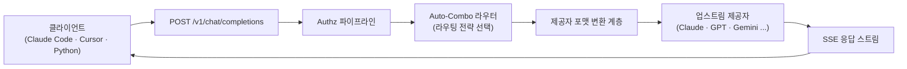
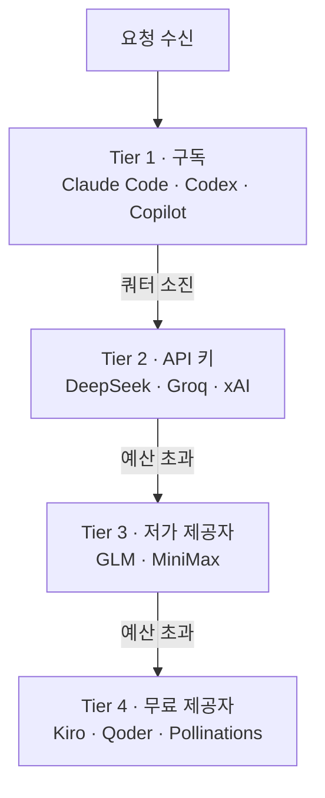
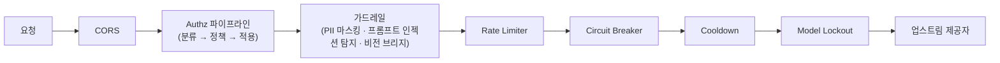

Claude Code에는 Anthropic 구독을, Cursor에는 별도 API 키를, 사이드 프로젝트에는 무료 티어를 준 제공자를 하나씩 붙여본 적이 있다면 이 문제를 안다. 제공자마다 대시보드가 다르고, 쿼터 소진 시점이 다르고, 그날 어떤 키가 살아있는지조차 기억하기 어렵다. [OmniRoute](https://github.com/diegosouzapw/OmniRoute)는 이 문제를 "여러 AI 제공자 앞에 로컬로 구동되는 단일 OpenAI 호환 게이트웨이를 세운다"는 한 가지 발상으로 풀려는 오픈소스 프로젝트다.

이 글은 OmniRoute의 README가 내세우는 숫자를 그대로 옮기지 않는다. GitHub 저장소의 소스 코드, 위키, 내부 비교 문서, GitHub API 실측치를 서로 대조해 실제로 확인되는 것과 문서마다 다르게 적힌 것을 구분했다. 라우팅 경험이 있는 개발자를 대상으로, 아키텍처·자동 라우팅·토큰 압축·보안 구조를 코드 수준까지 들여다보고, 마케팅 수치를 어떻게 걸러 읽어야 하는지도 함께 다룬다. 이 글을 읽고 나면 다음을 할 수 있어야 한다.

- OmniRoute의 Auto-Combo 라우팅과 4단계 폴백 캐스케이드가 각각 어떤 문제(제공자 선택 vs 소진 시 대체)를 푸는지 구분해서 설명한다.
- RTK와 Caveman 압축 엔진의 대상(도구 출력 vs 자연어)이 다르다는 점과, "평균 89% 절감"이 독립 벤치마크가 아니라 자체 보고치의 합성값이라는 한계를 함께 말한다.
- 오픈소스 프로젝트의 README 헤드라인 수치(제공자 수, 기여자 수, 도구 개수 등)를 위키·소스 코드·릴리스 노트와 직접 대조해 신뢰도를 검증하는 절차를 재현한다.

---

## OmniRoute란 무엇인가

OmniRoute는 Next.js 16 기반으로 만들어진 로컬 AI 라우팅 게이트웨이 겸 대시보드다. 서버를 실행하면 `http://localhost:20128/v1`에 <strong>OpenAI 호환 엔드포인트</strong>가 열리고, Claude Code·Cursor·Cline 같은 코딩 에이전트나 직접 만든 스크립트가 이 엔드포인트 하나만 바라보면 된다. 실제 요청은 OmniRoute가 다시 여러 업스트림 제공자(Claude, GPT, Gemini, DeepSeek 등) 중 하나로 변환해 전달하고, 응답을 다시 OpenAI 포맷으로 바꿔 돌려준다.

저장소는 [diegosouzapw](https://github.com/diegosouzapw)가 2026년 2월에 시작해 MIT 라이선스로 공개했고, 이 글을 쓰는 시점 기준 GitHub 스타 <strong>2만 8,800개</strong> 이상, 포크 3,700개 이상을 기록하며 활발히 유지보수되고 있다(마지막 푸시가 조사 당일이었다). TypeScript가 주 언어이며, `package.json`의 테스트 스크립트는 Node.js 내장 테스트 러너(`node --test`)로 `api`·`auth`·`authz`·`combo`·`compression`·`guardrails`·`mcp`·`security` 등 20개 이상 디렉터리를 병렬(`--test-concurrency=20`)로 돌리도록 구성되어 있다.

## 아키텍처: 요청은 어떻게 흐르는가

OmniRoute 위키의 아키텍처 문서는 요청 처리를 네 가지 책임으로 나눠 설명한다: 제공자별 포맷 변환, 모델 콤보 폴백(여러 모델을 순서대로 시도), OAuth/API 키 토큰 리프레시, 그리고 사용량·비용 추적 및 요청 로깅이다. 클라이언트 요청은 `src/app/api/v1/*` 라우트를 거쳐 SSE(Server-Sent Events) 코어로 들어가며, 여기서 변환·실행기 디스패치·재시도/리프레시 처리·스트림 설정이 이뤄진다.



여기서 실무적으로 중요한 지점은 <strong>포맷 변환</strong>이다. OmniRoute는 OpenAI Chat Completions뿐 아니라 Responses API 포맷까지 상호 변환한다고 문서화되어 있어, 클라이언트 코드를 제공자별로 분기하지 않고도 Claude·Gemini 백엔드를 오갈 수 있게 설계되었다. 커스텀 헤더를 보낼 수 없는 클라이언트를 위해 `/vscode/YOUR_KEY/...` 형태의 토큰 내장 호환 경로도 별도로 제공한다.

## 자동 라우팅: Auto-Combo 엔진과 숫자가 안 맞는 이유

라우팅 전략은 소스 코드 상수 파일 `src/shared/constants/routingStrategies.ts`에 정의되어 있으며, 실제로 열어 세어보면 `priority`, `weighted`, `round-robin`, `context-relay`, `fill-first`, `p2c`, `random`, `least-used`, `cost-optimized`, `reset-aware`, `reset-window`, `headroom`, `strict-random`, `auto`, `lkgp`, `context-optimized`, `fusion`, `pipeline`까지 <strong>18개</strong>다. 그런데 같은 저장소 안에서도 `docs/guides/FEATURES.md`와 경쟁 도구 비교 문서는 "17 strategies"라고 적고, README 상단 히어로 이미지의 대체 텍스트는 "19 routing strategies"라고 적는다. 세 곳 모두 같은 기능을 가리키지만 숫자가 다르다.

`auto` 계열은 `auto/coding`, `auto/fast`, `auto/cheap`, `auto/offline`, `auto/smart`, `auto/lkgp`라는 6개의 제로컨피그 프리픽스로 노출되며, 문서는 이를 "9-factor scoring engine"이 구동한다고 광고한다. 그런데 정작 라우팅 문서(`docs/routing/AUTO-COMBO.md`) 안의 "How It Works" 절에서 실제 스코어링 함수(`scoring.ts`의 `DEFAULT_WEIGHTS`)를 펼쳐 보면 다음과 같이 <strong>12개</strong> 팩터가 나열되고 가중치 합이 1.0이 된다.

| 팩터 | 가중치 | 팩터 | 가중치 |
|---|---|---|---|
| health(가용성) | 0.20 | tierPriority | 0.05 |
| quota(쿼터 여유) | 0.15 | tierAffinity | 0.05 |
| costInv(비용 역수) | 0.15 | specificityMatch | 0.05 |
| latencyInv(지연 역수) | 0.12 | contextAffinity | 0.05 |
| taskFit(작업 적합도) | 0.08 | connectionDensity | 0.05 |
| stability(안정성) | 0.05 | resetWindowAffinity | 0.00 |

같은 문서 안에서 전략 표·"Virtual Auto-Combo Factory" 절·파일 참조표는 여전히 "9-factor"라고 반복해서 부른다. 즉 "9-factor"라는 마케팅 문구를 프로젝트 자신의 구현 문서가 뒷받침하지 못하는, 문서 내부 모순이다. 코드 근거(18개 전략, 12개 팩터)를 1차 기준으로 삼되, 이런 프로젝트는 문서가 매우 빠르게 갱신되므로 실제로 붙이는 값은 설치 시점 버전에서 직접 확인하는 편이 안전하다.

## 4단계 폴백 캐스케이드

라우팅 전략과 별개로, OmniRoute는 요청이 실패하거나 쿼터가 소진됐을 때 내려가는 4단계 우선순위 캐스케이드를 문서화하고 있다: 구독 기반 제공자 → API 키 제공자 → 저가 제공자 → 무료 제공자.



요청 단위로 이 동작을 세밀하게 제어하는 헤더도 v3.8.44 릴리스에서 추가됐다: `X-OmniRoute-Mode`(fast/balanced/quality/cheap/reliable/offline 중 선택)와 `X-OmniRoute-Budget`(요청당 USD 상한)이다. v3.8.46에서는 유료 모델을 `auto` 라우팅에서 아예 숨기는 `hidePaidModels` 옵션(기본값 OFF)과 `auto/glm`, `auto/minimax`, `auto/gemini`처럼 제공자군 단위로 좁힌 오토콤보가 추가됐다. 릴리스 간격이 며칠 단위로 매우 짧다는 점도 확인했다 — 기능이 빠르게 늘어나는 만큼 문서 동기화가 뒤처지는 것도 자연스러운 결과로 보인다.

## 토큰 압축: RTK와 Caveman을 쌓는 방식

OmniRoute의 두 번째 축은 토큰 압축이다. 핵심 엔진은 두 개다.

- <strong>RTK(Rust Token Killer)</strong>: `git status`/`diff`/`log`, 테스트 러너 출력, TypeScript·Vite·Webpack 같은 빌드 도구 로그, ESLint·Biome·Prettier 같은 린터 출력처럼 <strong>명령행 도구가 쏟아내는 장황한 텍스트</strong>에 특화됐다. ANSI 컬러 코드, 진행바, 중복 줄을 제거한다.
- <strong>Caveman</strong>: 자연어 문장에서 "please", "I think", "basically" 같은 필러 워드와 "in order to" → "to"처럼 장황한 구문을 축약한다. 언어팩을 지원해 다국어 텍스트에도 적용된다.

두 엔진을 `rtk -> caveman` 순서로 이어붙인 것을 <strong>Stacked</strong> 모드라 부른다. 압축률 계산식은 위키 Compression Guide에 곱셈식으로 공개되어 있다.

```text
combined = 1 - (1 - RTK savings) × (1 - Caveman input savings)
평균 = 1 - (1 - 0.80) × (1 - 0.46) ≈ 89.2%
```

README·위키·FEATURES.md를 종합하면 모드별 절감률은 대략 다음과 같다.

| 모드 | 절감률 | 비고 |
|---|---|---|
| Lite | 약 15% | 최소 개입 |
| Standard(Caveman) | 약 30% | 자연어 축약만 |
| Aggressive | 약 50% | – |
| RTK | 60–90% | 도구 출력 특화 |
| Ultra | 약 75% | – |
| Stacked(RTK→Caveman) | 78–95% | 평균 약 89% |

여기서 짚어야 할 것은, 이 89%라는 숫자가 <strong>독립 기관이 재현한 벤치마크가 아니라</strong> RTK와 Caveman 각각의 "자체 보고" 절감률을 곱셈식으로 합성한 문서상 계산값이라는 점이다. RTK 예시 세션 하나는 실제로 118,000 토큰을 23,900 토큰으로 줄인 사례(약 79.7% 절감)가 문서에 남아 있어 이 정도 절감이 실제로 관측된 적은 있지만, "평균 89%"를 그대로 자신의 워크로드에 적용될 숫자로 기대하기보다는 도구 출력이 많은 세션일수록 RTK 쪽 절감이 커진다는 방향성 정도로 읽는 편이 안전하다. 참고로 최근 릴리스(v3.8.47, v3.8.48)에서는 GCF(Headroom) 코덱과 신규 `omniglyph` 엔진이 추가돼, 압축 서브시스템은 RTK·Caveman 두 개로 고정된 것이 아니라 계속 늘어나는 다중 엔진 체계로 발전하고 있다.

## 무료 티어 조합: "월 15.3억 토큰"은 어떻게 나온 수치인가

README가 헤드라인으로 내세우는 "약 1.53B(15.3억) Free Tokens / Month"는 다른 마케팅 수치들과 달리 비교적 투명한 산출 근거를 갖고 있다. README는 이 숫자를 <strong>43개 제공자 풀·516개 모델</strong>의 공개된 무료 한도를 모아, 같은 풀을 공유하는 제공자는 한 번만 계산하는 "풀 중복 제거(pool-dedup)" 방식으로 합산했다고 설명하며, 별도 문서(`docs/reference/FREE_TIERS.md`)는 43개 풀이라는 숫자와 산출 방법론을 그대로 뒷받침한다. 이 집계는 `open-sse/config/freeModelCatalog.ts` 하나를 단일 소스로 삼고, `check:docs-counts`라는 CI 검사가 문서에 적힌 수치와 실제 카탈로그가 어긋나면 빌드를 실패시키도록 만들어 두었다. 모든 쿼터를 24시간 내내 소진한다고 가정하면 이론상 약 100억 토큰까지 계산되지만, 문서는 이 값을 "헤드라인으로 쓰지 말라"고 스스로 명시하며 공개하지 않는다.

눈여겨볼 부분은 이 수치의 변동 이력이다. 문서는 2026-06-17 리프레시에서 약 1.94B였던 수치가 낮아졌다고 기록한다 — Gemini Flash 계열 변종을 개별 모델로 중복 계산하던 것을 하나의 풀로 합치고, `cloudflare-ai`를 실제 한도로 정정하고, 종료된 무료 티어를 제거하는 등 부풀려 세던 항목을 스스로 찾아 낮춘 "정직화 보정"이었다고 설명한다. v3.8.42에서는 `longcat`을 상시 지급 무료 한도가 아니라 1회성 가입 크레딧으로 재분류하며 약 1.37B까지 한 번 더 내려갔다. 반대로 v3.8.49에서는 실제로 존재하지만 카탈로그에 누락돼 있던 무료 티어(`requesty`, `ovhcloud`, `agnes`, `glm` 등)를 새로 반영해 풀 개수가 39개에서 43개로 늘면서 약 1.53B로 다시 올라갔다 — 부풀리기가 아니라 <strong>누락분 보충</strong>이라는 뜻이다. README에 따르면 이 값은 <strong>2주마다</strong> 실제 카탈로그와 대조해 재검증되며, 대시보드의 `/dashboard/free-tiers` 페이지에서 실시간 사용량과 함께 확인할 수 있다. 이용약관상 애매한 제공자 15곳은 별도로 "ToS 플래그"를 달아 사용자가 직접 판단하도록 분리해 뒀다.

즉 이 프로젝트에서 <strong>가장 신뢰할 만한 수치</strong>는 오히려 헤드라인 숫자가 아니라, 산출 방식·하향 보정 이력·CI 검증까지 공개한 이 무료 티어 집계 쪽이다. 뒤에서 다룰 제공자 수·MCP 도구 수처럼 문서마다 다르게 적힌 숫자들과는 결이 다르다.

## 보안 아키텍처

`SECURITY.md`는 요청이 실제 제공자에 닿기 전 거치는 파이프라인을 명시한다.



인증은 두 갈래로 나뉜다. 대시보드 로그인은 비밀번호 기반에 HttpOnly 쿠키로 감싼 JWT를 쓰고, API 호출은 CRC 검증이 붙은 HMAC 서명 키를 쓴다. Claude·Codex·GitHub·Cursor·Gemini 등 13개 제공자에 대해 OAuth 2.0 + PKCE 플로우를 지원하며, 만료 전 자동으로 토큰을 갱신한다. SQLite에 저장되는 민감 정보(API 키, 액세스/리프레시/ID 토큰)는 <strong>AES-256-GCM</strong>을 scrypt 키 유도와 함께 적용해 `enc:v1:<iv>:<ciphertext>:<authTag>` 형태의 버전 관리된 포맷으로 암호화한다. 다만 환경변수 `STORAGE_ENCRYPTION_KEY`를 설정하지 않으면 평문으로 저장되는 패스스루 모드로 동작한다는 점은 운영 전 반드시 확인해야 하는 부분이다.

가드레일은 우선순위 순서로 세 개가 내장돼 있다: `vision-bridge`(비전 미지원 모델에 이미지 설명을 대신 붙이고 이미지 URL의 SSRF를 방지), `pii-masker`(이메일·전화번호·신용카드번호 등을 호출 전후로 마스킹), `prompt-injection`(시스템 오버라이드·역할 탈취·탈옥 패턴 탐지). 다만 문서는 프롬프트 인젝션 가드가 "완전한 방화벽이 아니다"라고 스스로 명시하며, 리트스피크나 인코딩을 활용한 우회에는 취약할 수 있다고 한계를 인정한다.

## 실전 연동: 설치부터 Python 클라이언트까지

설치는 npm 전역 설치가 공식 권장 경로다.

```bash
npm install -g omniroute
omniroute
# 대시보드: http://localhost:20128
# API 베이스: http://localhost:20128/v1
```

Docker, 소스 빌드, pnpm, Nix, Podman 경로도 함께 제공된다.

```bash
# Docker (멀티 아키텍처 AMD64 + ARM64)
docker run -d --name omniroute --restart unless-stopped --stop-timeout 40 \
  -p 127.0.0.1:20128:20128 -v omniroute-data:/app/data diegosouzapw/omniroute:latest

# 소스에서 직접 실행
cp .env.example .env && npm install
PORT=20128 npm run dev
```

엔드포인트가 OpenAI 호환이므로, Python에서는 `openai` SDK의 `base_url`만 로컬 주소로 바꾸면 기존 코드를 거의 그대로 재사용할 수 있다.

```python
from openai import OpenAI

client = OpenAI(
    base_url="http://localhost:20128/v1",
    api_key="YOUR_OMNIROUTE_KEY",  # 대시보드 Endpoints 탭에서 발급
)

response = client.chat.completions.create(
    model="auto/coding",  # Auto-Combo가 18개 전략 중 하나로 제공자를 고른다
    messages=[{"role": "user", "content": "이 함수의 시간복잡도를 분석해줘"}],
)

print(response.choices[0].message.content)
```

요청별로 라우팅 모드와 예산 상한을 지정하려면, 검증된 커스텀 헤더 `X-OmniRoute-Mode`와 `X-OmniRoute-Budget`을 `extra_headers`로 얹는다. 4단계 캐스케이드가 모두 소진되면 OmniRoute는 오류 상태 코드를 반환하므로, 클라이언트 쪽에서도 이를 감안한 예외 처리가 필요하다.

```python
from openai import OpenAI, APIStatusError

client = OpenAI(base_url="http://localhost:20128/v1", api_key="YOUR_OMNIROUTE_KEY")

try:
    response = client.chat.completions.create(
        model="auto/cheap",
        messages=[{"role": "user", "content": "이 로그에서 에러 원인을 요약해줘"}],
        extra_headers={
            "X-OmniRoute-Mode": "cheap",   # fast/balanced/quality/cheap/reliable/offline
            "X-OmniRoute-Budget": "0.05",  # 요청당 USD 상한
        },
    )
    print(response.choices[0].message.content)
except APIStatusError as e:
    # Tier 1~4 제공자가 모두 실패하거나 예산 상한을 넘으면 여기서 잡힌다
    print(f"모든 제공자 소진 또는 예산 초과: {e.status_code} {e.response.text}")
```

키를 아예 발급받지 않고 시험해보려면, README가 안내하는 대로 인증 없이 열려 있는 `auto` 모델로 바로 호출할 수도 있다.

```bash
curl http://localhost:20128/v1/chat/completions \
  -H "Content-Type: application/json" \
  -d '{"model":"auto","messages":[{"role":"user","content":"Hello!"}]}'
```

## 프로덕션 신호: 무엇이 실제로 확인되는가

README는 "25,000+ tests"를 홍보하지만, 정확한 커버리지 퍼센트는 이번 조사에서 검증하지 못했다. 대신 더 구체적으로 확인할 수 있었던 것은 `.github/workflows/` 아래 <strong>23개</strong>의 CI 워크플로 파일이다. 여기에는 통상적인 `ci.yml`·`quality.yml`·`codeql.yml` 외에도 `nightly-mutation.yml`(뮤테이션 테스트), `nightly-property.yml`(속성 기반 테스트), `nightly-schemathesis.yml`(OpenAPI 스키마 기반 퍼징), `dast-smoke.yml`(동적 보안 스캔), `scorecard.yml`(OpenSSF Scorecard), `semgrep.yml`(정적 보안 분석)이 포함되어 있다. 단발성 유닛 테스트를 넘어, 야간에 뮤테이션·속성 기반·퍼징 테스트를 상시로 돌리는 구성은 개인 프로젝트 규모를 넘어선 엔지니어링 투자로 볼 수 있는 대목이다.

라이선스·기여자 규모는 다르게 읽어야 한다. README와 저장소 설명은 "Built by 500+ contributors"라고 적지만, GitHub Contributors API를 페이지네이션까지 따라가며 직접 세면 실제로는 약 320명이 확인된다. 그중에서도 저장소 소유자 diegosouzapw 한 명이 3,600건 이상의 커밋을 보유해, 다수 기여자가 고르게 참여하는 구조라기보다는 <strong>단일 관리자가 압도적 비중을 차지하는 프로젝트</strong>에 가깝다. 이 자체가 단점은 아니지만, "500+ 기여자"라는 문구에서 연상되는 커뮤니티 규모와는 다르다는 점은 알고 쓰는 편이 좋다.

## 경쟁 구도: OmniRoute가 스스로 그린 비교표

저장소 안의 `docs/comparison/OMNIROUTE_VS_ALTERNATIVES.md`는 LiteLLM·OpenRouter·Portkey와의 기능 비교표를 자체 제공한다. 2026년 2분기 공개 저장소를 감사했다고 명시한 이 문서에서 핵심 항목만 옮기면 다음과 같다.

| 항목 | OmniRoute 3.8 | LiteLLM 1.x | OpenRouter(SaaS) | Portkey |
|---|---|---|---|---|
| 제공자 수 | 237+ | 약 100 | 약 50 | 약 30 |
| 셀프호스팅 | 가능 | 가능 | 불가 | 유료만 |
| OAuth 제공자 연동 | 15+ | 부분 지원 | 없음 | 없음 |
| 자동 폴백 콤보 | 17개 전략 | 우선순위 기반 | 티어 기반 | 가중치 기반 |
| 토큰 압축 | RTK+Caveman 등 다중 엔진 | 없음 | 없음 | 없음 |
| 내장 MCP 서버 | 95개 도구, 30 스코프 | 없음 | 없음 | 없음 |
| 라이선스 | MIT | MIT | 독점 | 독점 |

문서 스스로가 밝히듯 "당신이 자체 호스팅하며 최대한 많은 제공자 커버리지를 원할 때"는 OmniRoute를, "Python 우선이고 성숙한 k8s 배포 레시피가 필요할 때"는 LiteLLM을, "호스팅을 원치 않을 때"는 OpenRouter를, "커머셜 SLA가 필요할 때"는 Portkey를 권한다. 이 비교표 역시 자체 작성 문서이므로 제3자 검증 없이 그대로 받아들이기보다는 방향성 참고 자료로 다루는 게 맞다 — 실제로 이 표의 "237+"조차 README의 "290+", 위키의 "226"과 또 다르다.

## 숫자를 어떻게 읽어야 하는가

같은 저장소 안에서도 핵심 수치들이 문서마다 다르게 적혀 있다는 사실 자체가, 이 프로젝트를 평가할 때 눈여겨봐야 할 특징이다. 조사 과정에서 확인된 불일치를 정리하면 다음과 같다.

| 수치 | README | 위키(Architecture) | 비교 문서 |
|---|---|---|---|
| 제공자 수 | 290+ | 226 | 237+ |
| MCP 도구 수 | 104개, 31 스코프 | 87개 | 95개, 30 스코프 |
| 라우팅 전략 수 | 히어로 이미지 표기 19개 | 코드(routingStrategies.ts) 18개 | FEATURES.md·비교문서 17개 |
| Auto-Combo 스코어링 팩터 | "9-factor"(반복 표기) | 동일 문서 내 스코어링 표는 12개 | – |
| 기여자 수 | "500+ Contributors" | GitHub API 실측 약 320명 | – |

이런 격차가 생기는 이유를 굳이 추측하자면, 릴리스가 며칠 간격으로 매우 빠르게 이어지는 프로젝트 특성상 기능(코드)이 문서보다 먼저 바뀌고, 서로 다른 시점에 작성된 README·위키·비교문서가 각자의 스냅샷에 머물러 있기 때문일 가능성이 높다. 실제로 릴리스 태그가 이 조사를 진행한 기간에도 v3.8.44부터 v3.8.49까지 이어졌다. 이 글에 적은 수치 역시 게시 시점에는 이미 달라져 있을 수 있으므로, 도입을 검토한다면 위 표의 항목들을 설치 시점 저장소에서 직접 재확인하기를 권한다.

## 적용 판단 기준과 한계

- <strong>맞는 경우</strong>: 여러 코딩 에이전트(Claude Code, Cursor, Cline 등)를 병행하면서 제공자별 무료 한도를 최대한 활용하고 싶을 때, 개인 또는 소규모 팀이 셀프호스팅 게이트웨이를 원할 때, 도구 출력이 많은 세션에서 토큰 비용을 줄이고 싶을 때.
- <strong>신중해야 하는 경우</strong>: `STORAGE_ENCRYPTION_KEY`를 설정하지 않으면 민감 정보가 평문으로 저장된다는 점, 프롬프트 인젝션 가드가 스스로 인정하듯 완전하지 않다는 점, 단일 관리자 중심 프로젝트라 버스 팩터가 낮다는 점을 감안해야 한다. 엔터프라이즈 SLA나 성숙한 Kubernetes 배포 레시피가 필요하다면 문서가 직접 권하듯 Portkey나 LiteLLM 쪽이 더 맞을 수 있다.
- <strong>수치는 검증 후 사용</strong>: "290개 제공자", "104개 MCP 도구", "500명 기여자" 같은 헤드라인 숫자를 그대로 인용하지 말고, 필요하다면 저장소·위키·릴리스 노트를 직접 대조해 현재 값을 확인한다.

## 마무리

| 항목 | 요지 |
|---|---|
| 정의 | 로컬 구동 오픈소스 AI 게이트웨이, 단일 OpenAI 호환 엔드포인트 |
| 라우팅 | 코드 기준 18개 전략, Auto-Combo는 12개 팩터로 스코어링 |
| 폴백 | 구독 → API 키 → 저가 → 무료 4단계 캐스케이드 |
| 압축 | RTK(도구 출력) + Caveman(자연어), 문서상 평균 약 89% |
| 무료 티어 | 43개 풀·516개 모델 기준 월 약 15.3억 토큰, 2주마다 재검증 |
| 보안 | AES-256-GCM(키 미설정 시 평문 폴백), OAuth 2.0+PKCE, 3단 가드레일 |
| 한계 | 마케팅 수치와 실측치 괴리, 단일 관리자 의존도 높음 |

OmniRoute는 라우팅·폴백·압축·보안까지 폭넓게 만들어진 프로젝트지만, 이 글에서 확인했듯 자체 문서 안에서도 핵심 수치가 자주 엇갈린다. 아키텍처 자체는 코드로 검증 가능한 견고한 설계이므로, 도입을 고려한다면 헤드라인 숫자보다 라우팅 전략 정의 파일과 릴리스 노트를 직접 열어보는 쪽을 권한다.

## 참고 및 출처

- [OmniRoute GitHub 저장소](https://github.com/diegosouzapw/OmniRoute)
- [위키 – Architecture](https://github.com/diegosouzapw/OmniRoute/wiki/Architecture)
- [위키 – Compression Guide](https://github.com/diegosouzapw/OmniRoute/wiki/Compression-Guide)
- [docs/routing/AUTO-COMBO.md](https://github.com/diegosouzapw/OmniRoute/blob/main/docs/routing/AUTO-COMBO.md)
- [docs/guides/FEATURES.md](https://github.com/diegosouzapw/OmniRoute/blob/main/docs/guides/FEATURES.md)
- [docs/guides/USER_GUIDE.md](https://github.com/diegosouzapw/OmniRoute/blob/main/docs/guides/USER_GUIDE.md)
- [docs/reference/FREE_TIERS.md](https://github.com/diegosouzapw/OmniRoute/blob/main/docs/reference/FREE_TIERS.md)
- [SECURITY.md](https://github.com/diegosouzapw/OmniRoute/blob/main/SECURITY.md)
- [docs/comparison/OMNIROUTE_VS_ALTERNATIVES.md](https://github.com/diegosouzapw/OmniRoute/blob/main/docs/comparison/OMNIROUTE_VS_ALTERNATIVES.md)
- [npm 패키지](https://www.npmjs.com/package/omniroute)
- [Docker Hub](https://hub.docker.com/r/diegosouzapw/omniroute)
- [공식 웹사이트](https://omniroute.online)
