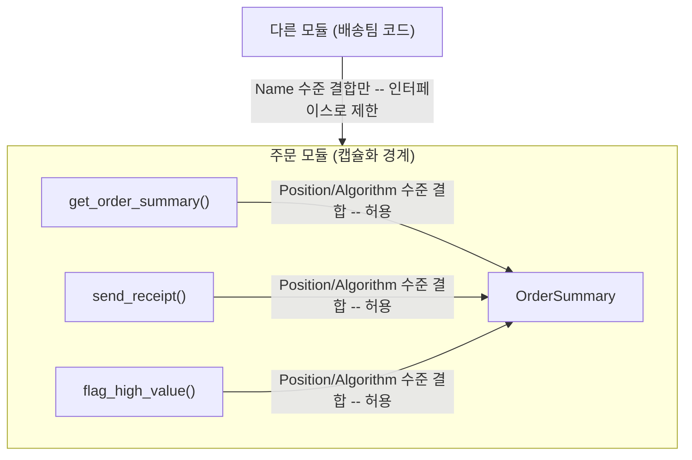

주문 결제 플로우에 필드 하나를 추가했을 뿐인데, 전혀 관련 없어 보이던 배송 알림과 리포트 생성 로직이 동시에 깨지는 경우가 있다. 최근 ArjanCodes 채널에 올라온 실습 영상은 여행 예약 워크플로우를 리팩터링하며 이런 사고가 왜 벌어지는지를 구조적 결합(structural coupling)과 시간적 결합(temporal coupling)이라는 이름으로 짚었다.



이 글은 이 문제를 더 정밀하게 진단하는 틀인 <strong>커나슨스(Connascence)</strong>를 다룬다. [결합도와 응집도](/post/computerterms/coupling-and-cohesion/)에서 다룬 Yourdon과 Constantine의 분류가 "모듈이 서로 얼마나 아는가"를 굵직하게 나누는 체크리스트였다면, 커나슨스는 그 결합을 아홉 가지 하위 유형으로 쪼개고 세기·지역성·정도라는 세 축으로 측정해 "지금 이 결합을 그냥 둘지, 인터페이스를 새로 만들어 끊을지"를 판단하는 실전 기준을 제공한다.

---

## 커나슨스란 무엇인가

커나슨스라는 용어는 Meilir Page-Jones가 1992년 논문 "Comparing Techniques by Means of Encapsulation and Connascence"에서 처음 제안했고, 1995년 저서 *What Every Programmer Should Know About Object-Oriented Design*에서 아홉 가지 하위 유형으로 정리했다. 라틴어 con-(함께)과 nasci(태어나다)를 합친 말 그대로, 두 소프트웨어 요소가 "함께 태어난 관계" — 한쪽을 바꾸면 프로그램의 정확성을 지키기 위해 다른 쪽도 함께 바꿔야 하는 관계 — 에 있을 때 두 요소는 커나슨트(connascent)하다고 부른다.

이 아이디어의 뿌리는 Page-Jones보다 앞서 Larry Constantine과 Ed Yourdon이 *Structured Design*(1979)에서 정립한 결합도·응집도 분류다(원문 발췌: [Structured Design](https://wstomv.win.tue.nl/quotes/structured-design.html)). [결합도와 응집도](/post/computerterms/coupling-and-cohesion/)에서 다룬 내용 결합(Content)·공통 결합(Common)·스탬프 결합(Stamp)·자료 결합(Data)의 4단계 분류가 "모듈이 서로의 내부를 얼마나 아는가"를 거칠게 나눈 것이라면, 커나슨스는 그 질문을 "정확히 무엇에 대해 합의해야 하는가"로 더 잘게 쪼갠다 — 이름에 합의해야 하는지, 타입에 합의해야 하는지, 실행 순서에 합의해야 하는지를 구분하면 같은 "강한 결합"이라도 리팩터링 난이도가 다르다는 걸 알 수 있다.

## 정적 커나슨스 5가지

정적 커나슨스(static connascence)는 소스 코드만 읽어도 알 수 있는 결합이다. 다음 다섯 가지가 있으며, 일반적으로 뒤로 갈수록 세기(리팩터링 난이도)가 강해진다.

| 유형 | 두 요소가 합의해야 하는 것 |
|---|---|
| 이름(Name) | 엔티티(함수·클래스·필드)의 이름 |
| 타입(Type) | 값의 타입 |
| 의미(Meaning) | 특정 값이 뜻하는 바 |
| 위치(Position) | 값들이 나열되는 순서 |
| 알고리즘(Algorithm) | 같은 절차·규칙 |

### 이름 — Connascence of Name

```python
class DiscountCalculator:
    def apply_seasonal_discount(self, price, rate):
        return price * (1 - rate)
```

`apply_seasonal_discount`라는 이름 자체가 계약이다. 이 메서드를 호출하는 모든 코드는 정확히 이 이름을 알아야 하고, 이름을 바꾸면 호출부도 함께 바꿔야 한다. 커나슨스 중 가장 약한 형태다 — 요소에 이름을 붙이는 일 자체를 피할 수 없고, IDE의 이름 변경(rename) 리팩터링으로 기계적으로 해결되기 때문이다.

### 타입 — Connascence of Type

```python
def apply_seasonal_discount(price, rate):
    return price * (1 - rate)

apply_seasonal_discount(19800, 0.1)       # 의도대로 동작
apply_seasonal_discount("19800", "0.1")   # 문자열 곱셈 시도 -> TypeError
```

파이썬처럼 동적 타입 언어에서는 함수 시그니처만 봐서는 `price`와 `rate`가 숫자여야 한다는 약속이 코드에 드러나지 않는다. 호출부가 이 타입 합의를 위반하면 런타임에야 실패가 드러난다. 타입 힌트(`price: float, rate: float`)나 정적 타입 언어를 쓰면 이 커나슨스를 컴파일 타임 오류로 앞당길 수 있다 — 결합 자체가 없어지는 건 아니지만, 위반을 발견하는 비용이 줄어든다.

### 의미 — Connascence of Meaning

```python
ORDER_STATUS_PENDING = 0
ORDER_STATUS_SHIPPED = 1
ORDER_STATUS_DELIVERED = 2

def notify_if_shipped(order):
    if order.status == 1:   # 매직 넘버 -- "1"이 SHIPPED라는 의미는 여기 어디에도 없다
        send_shipping_notification(order)
```

`order.status == 1`이라는 조건은 1이 "배송 시작됨"을 뜻한다는 걸 코드를 쓴 사람의 기억에만 의존한다. 이 의미를 아는 다른 개발자가 상태값 체계를 바꾸면(예: 0을 DRAFT로 새로 끼워 넣으면) 이 숫자를 그대로 비교하는 모든 코드가 조용히 잘못된 상태를 가리키게 된다. `order.status == ORDER_STATUS_SHIPPED`처럼 이름 있는 상수나 열거형으로 바꾸면 의미 커나슨스가 이름 커나슨스로 낮아진다.

### 위치 — Connascence of Position

```python
def get_order_summary(order):
    return [order.id, order.customer_email, order.total, order.status]

def send_receipt(summary):
    email = summary[1]        # 위치 1이 이메일이라는 사실에 의존
    send_email(email, "영수증이 발송되었습니다")

def flag_high_value(summary):
    if summary[2] > 100000:   # 위치 2가 총액이라는 사실에 의존
        escalate_to_review(summary)
```

이 상태에서 `get_order_summary`에 필드 하나(예: 주문 생성 시각 `created_at`)를 앞쪽에 추가하면, `send_receipt`와 `flag_high_value`가 참조하는 인덱스가 한 칸씩 밀린다. 이메일 대신 총액이, 총액 대신 상태값이 잘못 읽힌다 — 리스트를 반환하는 함수 하나를 건드렸을 뿐인데 그 반환값을 위치로 읽는 모든 호출부가 동시에 깨지는 것이, 서두에서 언급한 "기능 하나 고쳤더니 셋이 깨졌다"의 전형적인 형태다.

```python
from dataclasses import dataclass

@dataclass
class OrderSummary:
    id: int
    customer_email: str
    total: int
    status: int

def get_order_summary(order):
    return OrderSummary(order.id, order.customer_email, order.total, order.status)

def send_receipt(summary):
    send_email(summary.customer_email, "영수증이 발송되었습니다")

def flag_high_value(summary):
    if summary.total > 100000:
        escalate_to_review(summary)
```

필드 순서에 상관없이 이름으로 접근하므로, `created_at`을 어디에 추가하든 기존 호출부는 전혀 영향받지 않는다. 위치 커나슨스가 이름 커나슨스로 낮아진 것이다 — 결합이 완전히 사라진 게 아니라 더 약한 형태로 바뀌었다는 점이 중요하다.

### 알고리즘 — Connascence of Algorithm

```python
import hashlib

def issue_token(user_id, secret):
    return hashlib.sha256(f"{user_id}:{secret}".encode()).hexdigest()

def verify_token(user_id, secret, token):
    return issue_token(user_id, secret) == token
```

토큰을 발급하는 쪽과 검증하는 쪽이 똑같은 해시 절차(SHA-256, 문자열을 결합하는 순서)에 합의해야 한다. `issue_token`의 해시 알고리즘이나 결합 순서를 바꾸면 `verify_token`도 반드시 함께 바꿔야 하고, 둘 중 하나만 바뀌면 기존에 발급된 모든 토큰이 조용히 무효화된다 — 컴파일 오류도 타입 오류도 나지 않고 그냥 검증이 실패하기 시작한다는 점에서 이름·타입 커나슨스보다 발견하기 어렵다.

## 동적 커나슨스 4가지

동적 커나슨스(dynamic connascence)는 소스 코드를 읽는 것만으로는 알 수 없고, 프로그램이 실제로 실행되는 동안에만 드러나는 결합이다. 정적 커나슨스보다 일반적으로 더 강하다 — 린터나 타입 체커가 잡아주지 못하고, 재현하기 어려운 버그로만 나타나기 때문이다.

### 실행 — Connascence of Execution

```python
class EmailDraft:
    def set_recipient(self, email):
        self.recipient = email

    def set_subject(self, subject):
        self.subject = subject

    def send(self):
        deliver(self.recipient, getattr(self, "subject", ""))

draft = EmailDraft()
draft.set_recipient("customer@example.com")
draft.send()
draft.set_subject("주문이 접수되었습니다")   # 이미 보낸 뒤 제목을 바꿔봐야 소용없다
```

`send()`를 호출하기 전에 `set_subject()`를 먼저 호출해야 한다는 순서 제약이 타입 시스템 어디에도 드러나지 않는다. 순서를 어겨도 컴파일은 되고 실행도 되지만 결과만 조용히 잘못된다. 상태 머신이나 리소스 락을 다루는 코드에서 흔히 나타나며, 빌더 패턴으로 `send()` 시점에 필수 값이 없으면 예외를 던지게 만들거나, 타입 시스템으로 "제목이 설정된 상태"와 "설정되지 않은 상태"를 구분하면 이 결합을 컴파일 타임 오류로 끌어올릴 수 있다.

### 타이밍 — Connascence of Timing

```python
def reserve_seat(seat_id):
    seat = get_seat(seat_id)
    if seat.is_available:   # 확인
        book_seat(seat_id)  # 확정 -- 이 사이에 다른 요청이 끼어들 수 있다
```

좌석이 비어 있는지 확인하는 시점과 실제로 예약을 확정하는 시점 사이에 다른 스레드나 프로세스가 끼어들면, 두 요청이 같은 좌석을 동시에 예약하는 경쟁 상태(race condition)가 생긴다. 두 연산의 실행 타이밍이 서로 맞물려야 한다는 요구가 코드 어디에도 명시적으로 드러나지 않는다는 점에서 실행 순서(Execution) 커나슨스와 다르다 — 순서 자체는 지켰지만 그 사이의 시간 간격이 문제다. 확인과 확정을 하나의 원자적 연산(예: `UPDATE ... WHERE is_available = true`)으로 묶으면 해소된다.

### 값 — Connascence of Value

```python
DEFAULT_PAGE_SIZE = 20

def fetch_orders(page_size=DEFAULT_PAGE_SIZE):
    ...

def test_fetch_orders_returns_default_page_size():
    orders = fetch_orders()
    assert len(orders) <= 20   # DEFAULT_PAGE_SIZE를 참조하지 않고 값 20을 직접 하드코딩
```

테스트가 `DEFAULT_PAGE_SIZE` 상수를 참조하지 않고 값 `20`을 직접 하드코딩하면, 나중에 기본 페이지 크기를 30으로 바꿀 때 상수 하나만 고치면 될 일이 테스트 코드까지 함께 고쳐야 하는 일이 된다. 서로 다른 곳에 적힌 두 값이 항상 같아야 한다는 암묵적 합의가 있을 때 이 커나슨스가 생긴다 — `assert len(orders) <= DEFAULT_PAGE_SIZE`처럼 같은 상수를 참조하면 값이 한곳으로 묶여 이 결합이 겉으로 드러나지 않는다.

### 정체성 — Connascence of Identity

```python
class SeatMapListeners:
    def __init__(self):
        self._listeners = []

    def subscribe(self, listener):
        self._listeners.append(listener)

    def unsubscribe(self, listener):
        self._listeners.remove(listener)   # subscribe에 넘긴 것과 같은 객체여야 제거된다
```

구독을 해지하려면 `unsubscribe`에 넘기는 `listener`가 `subscribe`에 넘겼던 것과 동일한 객체(같은 identity)여야 한다. 값이 같아 보여도(예: 매번 새로 만든 람다나 바운드 메서드) 참조가 다르면 `remove`는 `ValueError`를 던지거나 엉뚱한 항목을 지운다. 캐시 무효화, 이벤트 구독 해지, 싱글턴 의존성처럼 "같은 값"이 아니라 "같은 인스턴스"를 요구하는 코드에서 흔히 나타나며, 커나슨스 중 가장 강한 축에 속한다 — 값을 로그로 찍어봐도 문제가 안 보이고, 객체 ID를 비교해야 비로소 드러난다.

## 아홉 유형 한눈에 보기

| 구분 | 유형 | 두 요소가 합의해야 하는 것 |
|---|---|---|
| 정적 | 이름(Name) | 엔티티 이름 |
| 정적 | 타입(Type) | 값의 타입 |
| 정적 | 의미(Meaning) | 값이 뜻하는 바 |
| 정적 | 위치(Position) | 값의 나열 순서 |
| 정적 | 알고리즘(Algorithm) | 같은 절차·규칙 |
| 동적 | 실행(Execution) | 호출 순서 |
| 동적 | 타이밍(Timing) | 실행 시점 간격 |
| 동적 | 값(Value) | 여러 값이 함께 바뀌어야 함 |
| 동적 | 정체성(Identity) | 동일한 인스턴스 참조 |

정적 커나슨스 안에서는 이름 → 타입 → 의미 → 위치 → 알고리즘 순으로 세기가 강해진다. connascence.io는 여기서 한 걸음 더 나아가 동적 커나슨스 전체가 정적 커나슨스보다 강하다고 정리한다 — 소스 코드를 읽는 것만으로는 애초에 존재를 발견할 수 없기 때문이다.

## 결합을 판단하는 세 축: 세기·지역성·정도

커나슨스 유형 자체보다 중요한 건 이 유형들을 실제로 어떻게 쓰느냐다. connascence.io는 결합의 위험도를 [세기](https://connascence.io/strength.html)·[지역성](https://connascence.io/locality.html)·정도라는 세 축으로 판단하라고 제안한다.

- **세기(Strength)**: 그 결합을 리팩터링하기 얼마나 어려운가. 앞서 본 것처럼 이름 커나슨스는 IDE 리팩터링 한 번으로 끝나지만, 정체성 커나슨스는 코드 전체에서 "같은 인스턴스를 참조하는가"를 일일이 추적해야 한다.
- **지역성(Locality)**: 커나슨트한 두 요소가 코드베이스 안에서 얼마나 가까운가. 같은 함수 안의 강한 결합은 대개 문제가 아니지만, 서로 다른 모듈·다른 팀이 관리하는 파일 사이의 강한 결합은 위험 신호다.
- **정도(Degree)**: 몇 개의 호출부·컴포넌트가 이 결합에 영향받는가. `get_order_summary`를 참조하는 호출부가 2개일 때와 200개일 때, 같은 위치 커나슨스라도 실제 위험도는 전혀 다르다.

세 축을 합치면 판단 기준이 명확해진다. 세기가 강하고, 지역성이 낮고(멀리 떨어져 있고), 정도가 높은(많은 곳에 영향을 주는) 결합이 가장 먼저 손봐야 할 대상이다. 반대로 세기가 강해도 같은 함수 안에 갇혀 있고 정도가 1이라면, 굳이 인터페이스를 새로 만들어 끊을 이유가 없다.

## 페이지존스의 3원칙 — 언제 인터페이스를 도입해야 하는가

Page-Jones는 커나슨스를 진단 도구에서 그치지 않고 세 가지 실천 규칙으로 정리했다.

1. 시스템 전체의 커나슨스를 최소화하려면 캡슐화된 요소로 분해한다.
2. 캡슐화 경계를 넘는 커나슨스는 최소화한다.
3. 캡슐화 경계 안의 커나슨스는 오히려 최대화해도 된다.

세 번째 규칙이 특히 오해받기 쉽다. "결합은 나쁘다"는 직관과 반대로, 경계 안쪽의 강한 결합은 문제가 아니라 응집도의 다른 이름이다. `OrderSummary`의 필드 순서와 그걸 만드는 생성자가 강하게 얽혀 있는 건(둘 다 같은 파일, 같은 클래스 안에 있으니) 정상이다. 문제는 그 결합이 캡슐화 경계 — 모듈이나 파일, 팀의 소유권 경계 — 를 넘어 다른 쪽으로 새어나갈 때다.



실전 판단은 이 그림을 거꾸로 읽으면 된다. 지금 손대려는 코드가 캡슐화 경계 밖으로 한 번도 나가지 않는다면, Position이든 Algorithm이든 강한 결합을 그대로 둬도 된다 — 인터페이스를 새로 만들면 오히려 간접 계층만 늘어난다. 반대로 다른 모듈이나 다른 팀이 그 코드를 직접 참조하기 시작하는 순간, 그 결합을 이름 수준(인터페이스 호출)까지 낮추는 리팩터링이 필요해진다. "언제 인터페이스를 도입해야 하는가"라는 질문은 결국 "이 결합이 캡슐화 경계를 넘는가"라는 질문으로 바뀐다.

## 실전 팁: 자주 하는 오해

1. **"커나슨스는 결합도의 다른 이름일 뿐이다."** 내용·공통·스탬프·자료 결합이라는 굵은 분류로는 "어떻게 낮출지"까지는 알려주지 않는다. 위치 커나슨스는 이름 커나슨스로, 알고리즘 커나슨스는 공유 라이브러리로 뽑아 이름 커나슨스로 낮추는 식으로, 유형별로 구체적인 리팩터링 방향이 다르다는 게 커나슨스 분류의 실익이다.
2. **"정적 커나슨스만 조심하면 충분하다."** 타입 체커나 린터가 잡아주는 건 이름·타입 정도까지다. 타이밍·정체성 커나슨스는 코드 리뷰나 정적 분석으로는 거의 드러나지 않고, 동시성 테스트나 실제 장애로만 발견된다.
3. **"모든 커나슨스를 없애야 한다."** 페이지존스의 세 번째 규칙이 정확히 이 오해를 반박한다. 캡슐화 경계 안의 커나슨스는 응집도이지 결함이 아니다. 모든 결합을 0으로 만들려는 시도는 함수 하나면 될 일을 인터페이스 세 개로 쪼개는 과설계로 끝난다.
4. **"인터페이스를 도입하면 결합도가 항상 낮아진다."** 인터페이스는 결합을 없애는 게 아니라 더 약한 형태(대개 이름 커나슨스)로 옮기는 것이다. 인터페이스 뒤에 숨긴 구현이 여전히 같은 알고리즘·같은 실행 순서를 요구한다면, 강한 결합은 그대로 남아 있고 간접 계층만 하나 늘어난 것이다.

## 요약

| 항목 | 내용 |
|---|---|
| 제안자·연도 | Meilir Page-Jones, 1992년 논문 → 1995년 저서로 9종 정리 |
| 정적 5종 | 이름·타입·의미·위치·알고리즘 |
| 동적 4종 | 실행·타이밍·값·정체성 |
| 판단 축 | 세기(리팩터링 난이도)·지역성(코드상 거리)·정도(영향받는 컴포넌트 수) |
| 3원칙 | 전체 최소화 → 경계를 넘는 결합 최소화 → 경계 안 결합은 최대화 허용 |
| 실전 질문 | "이 결합이 캡슐화 경계를 넘는가"로 인터페이스 도입 여부 판단 |

결합도·응집도가 "설계가 좋은가 나쁜가"를 가르는 굵은 잣대였다면, 커나슨스는 그 판단을 "정확히 무엇을, 어디까지 합의해야 하는가"라는 구체적인 질문으로 바꿔준다. 다음에 인터페이스를 새로 만들지 고민이 될 때는, 지금 겪는 결합이 아홉 유형 중 무엇이고 캡슐화 경계를 넘는지부터 물어보면 된다.

## 참고 자료

- [connascence.io](https://connascence.io/) — 커나슨스 9종 분류와 세기·지역성·정도 개념 정리
- [connascence.io: Strength](https://connascence.io/strength.html)
- [connascence.io: Locality](https://connascence.io/locality.html)
- [Wikipedia: Connascence](https://en.wikipedia.org/wiki/Connascence)
- [Structured Design 원문 발췌 — Yourdon & Constantine](https://wstomv.win.tue.nl/quotes/structured-design.html)
- [You Added One Feature… and Broke Three Others — ArjanCodes](https://www.youtube.com/watch?v=UEqk0njCuQo)
- 이 사이트: [결합도와 응집도](/post/computerterms/coupling-and-cohesion/)
