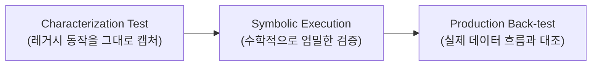

에이전트에게 기능 하나를 맡기면 몇 분 안에 PR이 열린다. 코드만 보면 팀이 하루 종일 걸려 만들던 결과물과 큰 차이가 없다. 그런데 리뷰어는 그 PR을 몇 분 만에 승인하지 못한다. 사람이 신뢰할 수 있는 속도로 코드를 "검토"하는 능력은 에이전트가 코드를 "생성"하는 속도만큼 빨라지지 않았기 때문이다. 2026년 6월 스위스 엥겔베르크에서 열린 두 번째 "Future of Software Development Retreat"(Thoughtworks와 Martin Fowler가 공동 주최한 비공식 언컨퍼런스, CTO·CEO·아키텍트급 시니어 기술자 40여 명이 참가)는 이 어긋남을 정면으로 다뤘다. Fowler는 2026-07-21 자신의 블로그에 리트릿을 정리하는 글 "Fragments: July 21"을 올렸고, 같은 리트릿을 근거로 한 Thoughtworks 공식 보고서 "The Future of Software Engineering — Retreat Findings"도 함께 공개됐다. 이 글은 두 자료를 교차 확인해, 코드 생성이 아니라 검증이 새 병목이 됐다는 진단과 그로부터 파생되는 세 가지 조직적 변화 — harness engineering, 도제식 학습 위기, 경영진-엔지니어 기대격차 — 를 정리한다.

---

## Thoughtworks 리트릿의 5대 발견

Thoughtworks 보고서는 서두에서 "거의 모든 세션을 관통하는" 다섯 개 발견을 제시한다.

1. **코드 생성은 더 이상 병목이 아니다 — 검증이 병목이다.** 에이전트는 어떤 팀이 신뢰할 수 있는 속도보다 훨씬 빠르게 코드·스펙·테스트·인프라를 생산한다.
2. **harness engineering이 별도의 독자적 분야로 부상하고 있다.** 에이전트를 둘러싼 스캐폴딩(컨텍스트 관리, 결정론적 가드레일, skills, 자기개선 피드백 루프)이 모델이나 프롬프트 자체보다 중요하다는 평가가 반복됐다.
3. **조직들이 진짜 apprenticeship crisis(도제식 학습 위기)와 충돌하고 있다.** 시니어가 에이전트하고만 페어링하면 주니어가 실무 경험으로 판단력을 쌓을 경로를 잃는다.
4. **경영진-엔지니어 기대격차가 어떤 기술적 한계보다 큰 리스크다.** 이사회·CEO는 벤더 데모와 자신의 리포트 작성 AI 경험을 근거로 빠르게 베팅하는 반면, 엔지니어는 검증·보안·거버넌스 문제가 쌓이는 것을 본다.
5. **레거시 현대화가 AI로 얻을 수 있는 가장 방어 가능한 단기 가치 풀이다.** 여러 세션이 COBOL·메인프레임 현대화에 실제로 작동하는, 검증 규율을 갖춘 접근을 설명했다.

이 글에서는 소프트웨어 개발팀의 일상적 작업 방식에 직접 영향을 주는 1–4번 발견을 순서대로 살펴본다. 5번(레거시 현대화)은 별도의 깊은 주제라 이 글에서는 다루지 않는다.

## 검증이 새 병목이 되는 구체적 양상

보고서는 이 발견을 추상적 관찰이 아니라 구체적 실무 문제로 풀어낸다. 새로운 테스트 어휘가 등장하고 있는데, 에이전트가 생성할 수 있는 범위를 좁히는 단일 입출력 테스트인 **constraint test**, 시나리오 단위로 동작을 검증하는 **scenario test**, 실제 프로덕션 인시던트에서 뽑은 **good/bad log**가 그 예다. 몇 시간 만에 만든 커스텀 approval-testing 장치가 범용 BDD 프레임워크보다 효과적이었다는 평가도 나왔는데, step definition이 복잡성을 숨겨 사람이 검토해야 할 표면을 오히려 불투명하게 만들고 에이전트가 테스트를 통과시키기만 하는 방식으로 "속이기" 쉬워지기 때문이다.

고위험 마이그레이션 작업에는 3단계 검증 스택이 형성되고 있다.

이 3단계는 순서 자체가 설계 의도다. characterization test로 "지금 이 시스템이 실제로 무엇을 하는지"를 먼저 고정하지 않으면, symbolic execution도 production back-test도 무엇을 기준으로 옳고 그름을 판단할지 정할 수 없다.

LLM-as-judge의 신뢰성 문제에 대한 실무적 답은 결정론적 방식과 비결정론적 방식을 섞는 것이다. 한 팀은 린터·패턴 매칭에 3개 모델로 구성된 "council of judges"를 결합해 첫 시도 머지 승인률을 약 60%에서 80%로 끌어올렸다고 보고했다. 동시에 "수동 코드 리뷰가 품질을 보장한다"는 오래된 믿음도 도전받고 있다 — 참가자들은 리뷰가 실제로 몇 건의 결함을 잡아내는지 데이터로 답할 수 있는 사람이 아무도 없었다는 "현상 유지 착각(status quo illusion)"을 지적했다. 검증이 병목이 됐다는 진단이 무서운 이유는 바로 여기에 있다. 기존에 품질을 보증한다고 믿었던 장치(코드 리뷰)조차 그 효과를 측정한 적이 없다는 사실이, 생산량이 몇 배로 늘어난 지금에서야 드러났다.

## Harness Engineering이 별도 분야로 부상하는 이유

보고서는 harness engineering을 "모델이나 프롬프트가 아니라 에이전트를 둘러싼 스캐폴딩 — 컨텍스트 관리, 결정론적 가드레일, skills, 자기개선 피드백 루프"로 정의한다. 모델이 상품화(commoditize)될수록 경쟁 차별화가 이 스캐폴딩 층에서 일어날 것이라는 관측이 여러 세션에서 수렴했다.

구체적 성과 사례도 함께 제시됐다. 어떤 조직은 효과적인 harness를 도입해 토큰 사용량을 최소 4배 줄이고 출력 결정성을 크게 높였다. 리팩터링 실험에서는 단순 린터 출력만으로는 코드 스멜 해결률이 50% 미만이었지만, 린터 출력을 구체적이고 결정론적인 단계별 리팩터링 지침("habit hooks")으로 변환하자 해결률이 약 90%까지 올라갔다. 좋은 harness를 갖춘 작은 모델이 나쁜 harness를 가진 큰 모델보다 낫다는 평가도 나왔다.

흥미로운 점은 성과가 가장 좋은 팀들이 harness를 사람이 직접 정교하게 작성하지 않는다는 것이다. 대신 에이전트를 실패하게 두고, 매 세션을 반성해 harness 수정을 제안하는 "learn" skill을 돌린 뒤, 사람의 역할은 작성(authorship)이 아니라 주기적인 가지치기(pruning)와 단순화로 국한한다. 다만 공유 harness·skill의 거버넌스는 아직 풀리지 않은 조직적 문제로 남아 있다. 명확한 소유권이 없으면 skill과 공유 컨텍스트 산출물은 주인 없는 코드 프레임워크와 똑같이 썩어간다. 그렇다고 이를 전담 "harness team"으로 중앙화하면 과거 ops 팀의 안티패턴을 재현할 위험이 있다는 지적도 함께 나왔다 — 보고서는 이 문제에 "누가 맡아야 하는지 합의가 없었다"고 솔직히 인정한다.

## Apprenticeship Crisis — 도제식 학습이 무너지는 이유

보고서는 최소 여섯 개의 서로 다른 세션에서 독립적으로 같은 우려가 제기됐다고 밝힌다. 주니어가 실제 코드, 실제 프로덕션 인시던트, 실제 설계 트레이드오프와 씨름할 기회를 갖지 못하면 — 에이전트가, 혹은 에이전트하고만 페어링하는 시니어가 그 작업을 흡수해버리면 — 업계가 다음 세대의 판단력을 길러내던 핵심 메커니즘을 잃는다. 보고서는 이 문제의 이면도 짚는다. 이런 방식으로 소프트웨어를 개발하는 사람은 "무엇이 좋은 결과물인지" 이미 알고 있어야 하고, 그것이 바로 시니어 엔지니어가 에이전트와 협업하며 성과를 내는 이유다. 하지만 그 안목을 애초에 도제식 학습으로 얻지 못하면 apprenticeship crisis는 더 심해지는 악순환이 생긴다.

특히 강한 압박을 받는 집단으로 보고서는 경력 7–10년차 코호트를 지목한다. 지난 10년간 공들여 숙련한 기술을 이제 모델이 종종 능가하는 상황에 처해, 실질적인 정서적·정체성 충격을 겪고 있다는 것이다. 보고서는 이를 뒷받침하는 관련 연구로, LLM의 도움을 많이 받아 에세이를 쓴 대학생들이 3개월에 걸쳐 (자기 자신의 비보조 기준선 대비로도) 비판적 사고 능력이 측정 가능할 정도로 저하됐다는 연구 결과를 인용한다.

대응책으로 제안·시범 운영 중인 것은 다음 세 가지다.

- 시니어가 설계 대화를 주도하고 주니어가 실제 프롬프팅을 담당하는 "design quorum"·몹 프로그래밍 패턴
- 명시적인 비-AI 학습 훈련 — 공개적 책무성을 부여하는 방식
- 에이전트 오케스트레이션·감독을 초년차부터 가르치는 새 커리큘럼

세 가지 모두 아직 업계 표준으로 정착되지 않은 시범 단계라는 점은 뒤에서 다시 짚는다.

## 경영진-엔지니어 기대격차

보고서가 "어떤 기술적 한계보다 큰 리스크"로 꼽은 이 발견은, 이사회·CEO가 "PM이 PRD를 마법 기계에 넣으면 완벽하게 작동하는 소프트웨어가 나온다"고 믿는다는 반복적 불만에서 출발한다. 이 격차는 경영진의 직접적 AI 경험이 대부분 리포트 작성·요약 도구(이 분야에서는 실제로 성능이 좋다)에 국한되어, 소프트웨어 엔지니어링의 대리 지표로는 부적절함에도 그렇게 일반화되기 때문에 생긴다. 경고 신호로 한 조직은 6개월 만에 내부 보안 인시던트가 약 20배 늘었고, AI 토큰 예산이 연간 배정량을 12개월이 아니라 3개월 만에 소진하고 있다고 보고했다. 한 참가자는 전체 SDLC 기준으로 현실적인 단기 생산성 향상은 벤더가 주장하는 10배가 아니라 약 2–3배 수준이라고 추정했고, 이 기대와 현실의 격차가 12–18개월 내에 업계의 "버블을 터뜨릴 수 있다"고 예측했다.

Fowler는 자신의 fragment 글에서 이 발견을 다른 사례로 확장한다. ML로 훈련된 소프트웨어가 현장 장비의 에어필터 교체 주기를 최적화해 연 5천만 달러를 절감했지만, 그 모델이 사막 환경 데이터로 학습되어 정작 북극 환경에 배치된 결과(사막의 먼지 대신 죽은 모기가 부패해 화재 위험을 유발) 10억 달러 규모의 화재 손실로 이어졌다는 일화다. Fowler는 이런 실패가 AI가 없어도 벌어질 수 있는 "새 맥락에 적용될 때 생기는 문제"이지만, AI의 제안을 경계하고 빠른 피드백을 얻을 센서를 항상 마련해야 한다는 교훈으로 이어진다고 짚는다.

이 격차는 더 나은 모델로는 좁혀지지 않는다는 것이 보고서의 결론이다. 조직의 재무 결과와 연결된 구체적 스토리텔링, 벤더의 "몇 배" 주장을 실제 동종 업계 벤치마크와 대조하는 데이터 규율, 경영진이 직접 무언가를 만들어보고 실제 한계에 부딪히는 구조화된 실습으로만 좁혀진다.

## 지금 팀이 판단해야 할 것

네 가지 발견을 관통하는 하나의 원칙이 있다 — 생산량이 늘어난 만큼 검증·판단·이해의 역량도 별도로 설계해서 늘려야 한다. 이를 팀 단위의 판단 기준으로 정리하면 다음과 같다.

| 발견 | 방치했을 때의 결과 | 지금 할 수 있는 최소 조치 |
|------|------|------|
| 검증이 병목 | 코드 리뷰가 형식적으로 붕괴, 리뷰가 실제 결함을 몇 건 잡는지 아무도 모르는 채로 규모만 커짐 | constraint test·scenario test처럼 검토 표면을 좁히는 테스트 어휘를 팀 리뷰 기준에 명시적으로 도입 |
| harness 방치 | skill·컨텍스트 산출물이 주인 없는 코드처럼 fork·decay | harness 변경에 소유자를 지정하고, 정기적으로 가지치기(pruning)하는 리뷰 주기를 둠 |
| apprenticeship crisis | 다음 세대 시니어 공급이 끊김 | 주니어가 에이전트 없이 설계·디버깅을 직접 담당하는 세션을 의도적으로 남겨 둠 |
| 기대격차 | 예산·보안 인시던트가 갑자기 불어난 뒤에야 이사회가 개입 | 벤더의 배수 주장 대신 자체 벤치마크(2–3배 등 실측치)로 목표를 재설정 |

harness 자체가 이미 검증 대상이라는 점도 중요하다. 새 skill이나 가드레일을 팀에 도입할 때, 그 harness가 실제로 결함 해결률·머지 승인률 같은 지표를 개선하는지 측정하지 않으면 "harness가 있다"는 사실 자체가 새로운 현상 유지 착각이 될 수 있다.

## 남아있는 트레이드오프

harness의 소유권과 책임 소재는 보고서 스스로 "반복적으로 제기됐지만 누가 맡아야 하는지 합의가 없었다"고 인정한 미해결 문제다. 전담 harness 팀으로 중앙화하면 과거 ops 팀의 안티패턴을 재현할 위험이 있고, 각 팀에 분산시키면 거버넌스가 약해진다. apprenticeship crisis 대응책(design quorum, 비-AI 학습 체크포인트) 역시 아직 시범 단계이며 업계 표준 커리큘럼으로 정착되지 않았다. 검증·프로토타이핑·기초 엔지니어링 역량이 계속 상품화되면, 결국 남는 유일한 차별화 요소는 사람의 판단이라는 점이 다시 새로운 질문 — 그 판단력을 애초에 어떻게 길러낼 것인가 — 으로 순환된다. 보고서는 이미 테스트 문화가 약하거나 리스크 소유권이 불분명하거나 문서화가 부실한 조직은 에이전트 도입으로 그 문제가 "더 나아지지 않고 더 빨리 나빠진다"고 경고한다. 규율을 먼저 갖추지 않은 채 속도부터 올리면, 검증 부채가 코드 생성 속도와 같은 배율로 함께 불어난다.

## 참고 자료

- [Martin Fowler, "Fragments: July 21" (2026-07-21, martinfowler.com)](https://martinfowler.com/fragments/2026-07-21.html)
- [Thoughtworks, "The Future of Software Engineering — Retreat Findings" (2026, PDF 보고서)](https://www.thoughtworks.com/content/dam/thoughtworks/documents/report/tw_future_of_software_engineering_europe_2026.pdf)
- [Martin Fowler, "Future of Software Development" (bliki, 리트릿 시리즈 개요)](https://martinfowler.com/bliki/FutureOfSoftwareDevelopment.html)
- [Jason Koebler, "Your AI Use Is Breaking My Brain" (404 Media, 2026-05-11)](https://www.404media.co/your-ai-use-is-breaking-my-brain/)
- [Martin Fowler, "Say Your Writing" (bliki)](https://martinfowler.com/bliki/SayYourWriting.html)
