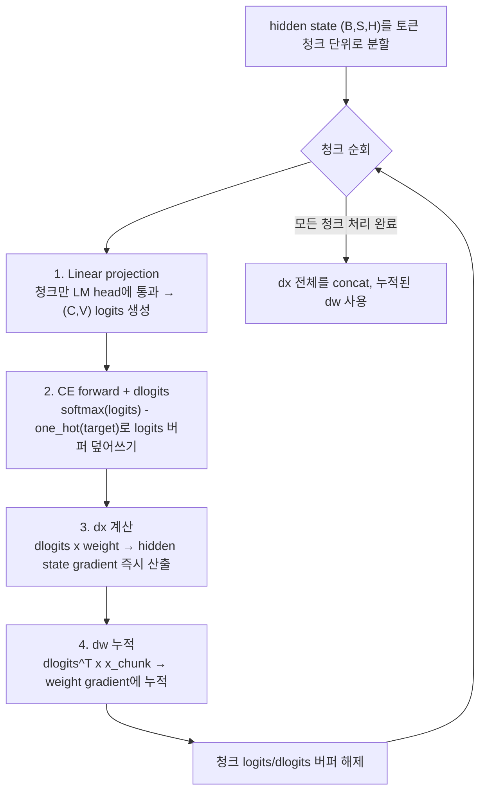

모델 가중치는 GPU 메모리에 여유 있게 들어갔는데, loss를 계산하는 마지막 한 줄에서 OOM(Out Of Memory)이 터진 경험이 있다면 범인은 대개 정해져 있다. **cross-entropy 계산이 만드는 logits 텐서**다. 어휘 크기(vocabulary size)와 컨텍스트 길이가 각각 128K 토큰, 100K 토큰 단위로 커진 최근 LLM에서는, 모델 자체보다 이 "손실 함수 하나"가 더 많은 메모리를 요구하는 역전이 흔하게 일어난다. 이 글은 그 병목이 왜 생기는지, 그리고 <strong>Fused Linear Cross-Entropy(FLCE)</strong>가 어떤 방식으로 그 텐서를 아예 만들지 않고도 같은 loss와 gradient를 계산하는지를 다룬다.

---

## logits 텐서가 왜 이렇게 큰가

LLM의 순전파 마지막 단계는 단순하다. 마지막 hidden state `(B, S, H)`(배치, 시퀀스 길이, hidden dimension)를 LM head 가중치로 투영해 `(B, S, V)`(V는 vocabulary 크기) 크기의 **logits**를 만들고, 여기에 softmax와 cross-entropy를 적용해 loss를 구한다. 문제는 hidden dimension과 vocabulary 크기의 스케일이 다르게 커져 왔다는 데 있다. hidden dimension은 보통 수천 단위(4,096 등)에 머무르지만, 다국어·대형 어휘를 쓰는 최근 모델은 vocabulary가 12만–26만 토큰에 달한다. Trillion Labs Research가 Qwen3 설정(vocab 151,936, hidden dimension 4,096)으로 계산한 수치를 보면, 배치 4·시퀀스 4K 조건에서 hidden state는 0.13GB인 반면 logits 텐서는 4.97GB로 **약 37배**나 크다. 128K 컨텍스트로 넘어가면 배치 1만으로도 logits이 약 40GB에 달해 H100 80GB의 절반을 차지한다.

Towards Data Science의 Ryan Pégoud가 Llama 3(vocab 128,256, hidden dimension 4,096) 기준으로 계산한 수치도 같은 결론을 가리킨다. 시퀀스 길이 8,192·배치 8(총 65,536토큰) 조건에서 logits 텐서는 약 84억 원소 규모(bfloat16 기준 16.8GB, float32로 안정화하면 33.6GB)에 달한다. 별도로 시퀀스 길이 16,384·배치 1 조건으로 실측한 벤치마크에서는, PyTorch 표준 구현으로 이 손실을 계산할 때 peak 메모리가 **36.02GB**까지 치솟는다. PyTorch 코어에 이 문제를 해결할 fused 함수(`torch.nn.functional.linear_cross_entropy`)를 추가해 달라는 요청([pytorch/pytorch#124480](https://github.com/pytorch/pytorch/issues/124480))도 Llama 3 8B·배치 81,920 토큰 조건에서 logits만으로 약 19.57GB가 소비된다는 실측을 근거로 들었다. 게다가 이 텐서는 순전파와 역전파 양쪽에서 필요하므로 실질 부담은 두 배에 가깝다 — 모델 가중치는 그대로인데, "loss 한 줄"이 학습 배치 크기와 컨텍스트 길이의 상한을 결정하는 셈이다.

## FLCE의 핵심 아이디어: logits을 오래 들고 있지 않는다

FLCE(또는 Fused Linear + Cross-Entropy)의 발상은 단순하다. 전체 시퀀스의 logits을 한 번에 만들어 메모리에 올려두는 대신, 토큰을 **청크(chunk) 단위**로 나눠 각 청크마다 계산을 끝내고 바로 다음 청크로 넘어간다. LinkedIn이 공개한 Liger Kernel의 실제 구현(`fused_linear_cross_entropy.py`)과 Trillion Labs 블로그가 설명하는 절차를 종합하면 각 청크에서 벌어지는 일은 다음 네 단계로 정리된다.



요약하면 각 청크는 **투영 → CE forward와 gradient 동시 계산 → dx 산출 → dw 누적**의 네 단계를 거치고, 다음 청크로 넘어가기 전에 자신의 logits·dlogits 버퍼를 즉시 버린다. 그 결과 메모리에 동시에 존재하는 logits은 전체 시퀀스가 아니라 **청크 하나 분량**뿐이다. 각 단계를 풀어 쓰면 다음과 같다.

1. **Linear projection**: 전체가 아닌 청크 하나만 LM head에 통과시켜 `(C, V)` 크기(C는 청크 토큰 수)의 logits을 만든다.
2. **CE forward + dlogits**: 이 청크의 cross-entropy loss를 계산하는 동시에, 같은 버퍼를 `softmax(logits) - one_hot(target)` 결과로 덮어써 gradient(dlogits)로 재사용한다. 별도 메모리 할당이 없다.
3. **dx 계산**: dlogits를 LM head 가중치와 곱해 hidden state에 대한 gradient(dx)를 그 자리에서 바로 구한다.
4. **dw 누적**: LM head weight gradient(dw)는 `dlogits_chunk.T @ x_chunk`를 청크마다 누적해 완성한다.

Liger Kernel 소스의 주석은 이 설계를 "마지막 계층이므로 순전파에서 이미 gradient를 계산할 수 있다"는 말로 요약한다 — 어차피 backward에서 입력과 target을 다시 참조할 필요가 없으니, 아예 forward 안에서 backward까지 끝내버리는 것이다. 실제 CUDA/Triton 커널 없이 이 제어 흐름만 PyTorch로 옮기면 아래와 같다. 진짜 Liger Kernel/QuACK 구현은 이 로직을 단일 Triton 커널로 융합해 `logits_chunk`조차 별도 텐서로 남기지 않지만, 아래 코드는 "청크마다 forward 직후 backward를 끝내고 그래프를 버린다"는 핵심 제어 흐름을 실제로 실행 가능한 형태로 보여준다.

```python
import torch
import torch.nn.functional as F

def fused_linear_cross_entropy(hidden, weight, target, chunk_size):
    # hidden: (BT, H), weight: (V, H), target: (BT,)
    BT, H = hidden.shape
    dx = torch.zeros_like(hidden)
    dw = torch.zeros_like(weight)
    total_loss = 0.0

    for start in range(0, BT, chunk_size):
        end = min(start + chunk_size, BT)
        x_chunk = hidden[start:end].detach().requires_grad_()
        w = weight.detach().requires_grad_()

        # 1. Linear projection: 청크만 (C, V) logits 생성
        logits_chunk = x_chunk @ w.t()

        # 2. CE forward: 청크 loss만 계산 (전체 시퀀스 logits은 존재하지 않는다)
        loss_chunk = F.cross_entropy(logits_chunk, target[start:end], reduction="sum")
        total_loss += loss_chunk.item()

        # 3~4. dx/dw: 이 청크의 gradient를 즉시 계산하고 그래프는 버린다
        loss_chunk.backward()
        dx[start:end] = x_chunk.grad
        dw += w.grad

    # reduction="sum"으로 청크별 backward를 했으므로, loss와 같은 mean 기준으로
    # 맞추려면 gradient도 전체 토큰 수 BT로 정규화해야 한다.
    return total_loss / BT, dx / BT, dw / BT
```

`chunk_size`만큼씩 잘라 순전파·역전파를 반복하는 이 반복문이 핵심이다. 다음 반복으로 넘어가면 `logits_chunk`와 그 계산 그래프는 파이썬 가비지 컬렉터가 회수하므로, 어느 시점에도 `(BT, V)` 크기의 텐서 전체가 동시에 존재하지 않는다. 실제 Triton 구현은 이 반복문 자체를 GPU 커널 안으로 옮기고 `logits_chunk`를 별도 할당 없이 SRAM/레지스터에서 재사용하지만, 메모리를 줄이는 근본 원리는 이 파이썬 루프와 동일하다.

## 왜 "청킹만"으로는 부족한가 — Chunked CE와의 차이

logits을 청크로 나눈다는 아이디어 자체는 FLCE 이전에도 있었다(Chunked CE). 하지만 단순 청킹과 FLCE는 메모리 곡선이 다르다. Chunked CE는 forward 단계의 logits 크기를 청크 수만큼 줄이지만, **backward를 수행하기 전까지 모든 청크의 계산 그래프를 메모리에 남겨둬야** 한다. 청크를 8개로 나눠도 peak 메모리가 약 4.7GB 아래로는 내려가지 않는 plateau가 관찰된 이유다. 반면 FLCE는 위 4단계에서 보듯 청크 단위로 **gradient까지 즉시 계산해 버리므로** 이전 청크의 계산 그래프를 들고 있을 필요가 없다. 같은 청크 수에서 FLCE의 peak 메모리가 Chunked CE보다 낮게 유지되는 것은 이 차이 때문이다.

세 방식을 정리하면 다음과 같다.

| 방식 | Peak logits 메모리 | Backward 처리 | 특징 |
|------|---------------------|----------------|------|
| Naive CE (PyTorch 표준) | `B×S×V` 전체를 한 번에 보유 | 저장된 전체 logits로 역전파 | 구현은 가장 단순하지만 OOM 위험이 가장 크다 |
| Chunked CE (forward만 청킹) | 청크 수만큼 줄지만 일정 수준에서 plateau (8청크 기준 약 4.7GB) | 전체 청크의 계산 그래프를 모아뒀다가 한 번에 역전파 | 청크를 늘려도 메모리가 더는 줄지 않는다 |
| FLCE (forward+backward 융합) | 청크 하나(`C×V`)만 유지, 즉시 폐기 | 청크마다 forward 직후 gradient 계산·누적 | 계산 그래프를 보관하지 않아 메모리가 청크 크기에 선형적으로 비례 |

실측 수치로도 이 차이가 드러난다. LinkedIn Liger Kernel의 공식 벤치마크(Llama 3-8B, 배치 8, bf16, A100 8기 기준)는 다중 GPU 학습에서 처리량 20% 향상과 메모리 60% 절감을, DPO 등 post-training(정렬·증류) 워크로드에서는 최대 80% 메모리 절감을 보고한다. Towards Data Science의 독립 벤치마크(A100, 시퀀스 16,384·배치 1·hidden 4,096·vocab 128,256 조건)는 PyTorch 표준 구현의 peak 36.02GB가 Triton 기반 fused 커널에서 5.04GB로 줄어드는, **84% 절감**을 실측으로 보였다.

## 실전에서 마주치는 트레이드오프

FLCE가 공짜는 아니다. 실전에 적용할 때 흔히 놓치는 지점 네 가지를 짚어둔다.

1. **청크가 작을수록 메모리는 줄지만 지연시간은 늘어난다.** 청크를 잘게 쪼갤수록 청크당 메모리는 줄지만, 청크 수만큼 커널 launch가 늘어나 오버헤드가 커진다. Liger Kernel 구현은 `chunk_size = triton.next_power_of_2(triton.cdiv(BT, inc_factor))` 형태로 vocabulary 크기 대비 hidden dimension 비율(`inc_factor = ceil(V / H)`)에서 청크 크기를 자동 산출해, 메모리 소비를 대략 `B×T×H` 수준으로 맞추면서 커널 호출 수를 과도하게 늘리지 않도록 균형을 잡는다. 직접 구현할 때 청크를 고정값으로 너무 작게 잡으면 메모리보다 처리량이 먼저 무너진다.
2. **추론에는 대체로 필요 없는 최적화다.** 이 병목은 시퀀스 전체 토큰에 대해 loss를 계산하는 **학습(training)** 단계에서만 발생한다. 추론(inference)은 보통 다음 토큰 하나에 대한 logits만 필요하므로 `(B, 1, V)` 크기에 그쳐 같은 문제가 나타나지 않는다. 학습 파이프라인이 아니라면 이 기법을 먼저 적용할 이유가 없다.
3. **vocabulary가 작고 컨텍스트가 짧으면 이득이 미미하다.** 이득의 크기는 결국 `V/H` 비율과 시퀀스 길이에 좌우된다. vocabulary가 3–5만 수준이고 컨텍스트가 짧은 모델(예: 초기 GPT-2류 설정)에서는 logits 텐서가 애초에 hidden state 대비 크지 않으므로, 커널 융합의 구현·디버깅 비용이 절감액을 넘어설 수 있다. 실제로 Liger Kernel README도 이 기법의 이득을 강조하는 벤치마크를 vocabulary가 큰 Llama 3-8B 기준으로 제시한다.
4. **메모리 절감이 곧 속도 향상을 뜻하지는 않는다.** Liger Kernel처럼 잘 최적화된 Triton 커널은 메모리와 처리량을 동시에 개선하지만, 그건 커널 자체가 GPU 병렬성까지 고려해 튜닝됐기 때문이다. 원리 이해용으로 파이썬 반복문에 순수 PyTorch 연산만 얹은 구현(바로 다음 절의 예시 포함)은 청크마다 별도의 커널 호출과 autograd 그래프 생성이 발생해, 청킹 이전보다 오히려 느려질 수 있다. Towards Data Science의 educational 구현도 "가독성 우선, 네이티브 PyTorch보다 느림"이라고 스스로 밝힌다 — 메모리 문제를 푸는 것과 속도를 올리는 것은 별개의 목표다.

## 직접 구현할 때 참고할 자료

바닥부터 CUDA/Triton 커널을 짤 필요는 없다. LinkedIn이 BSD-2-Clause 라이선스로 공개한 [Liger Kernel](https://github.com/linkedin/Liger-Kernel)은 FLCE를 포함한 RMSNorm·RoPE·SwiGLU 등 학습용 Triton 커널을 즉시 갈아 끼울 수 있는 형태로 제공하며, Trillion Labs Research도 자체 구현 시 CUDA/CuTe 커널 라이브러리 QuACK의 `linear_cross_entropy.py`를 참고 구현으로 언급했다. 직접 원리를 익히고 싶다면 Towards Data Science의 educational 목적 Triton 구현이 원자 연산(atomic operation) 기반의 더 단순한 버전을 제공한다 — 다만 저자 스스로 밝히듯 이 버전은 가독성을 우선해 프로덕션용 네이티브 PyTorch보다 느리다.

## 요약

cross-entropy는 수식으로는 한 줄이지만, vocabulary와 컨텍스트 길이가 계속 커지는 지금은 "어떤 중간 텐서를 실제로 메모리에 만들 것인가"를 결정하는 시스템 설계 문제가 됐다. FLCE는 전체 logits을 한 번에 만들지 않고 청크 단위로 순전파·역전파를 즉시 끝내버림으로써, Chunked CE가 넘지 못한 메모리 plateau를 넘어 60–84% 수준의 실측 절감을 만들어낸다. 자체 학습 파이프라인에서 배치나 컨텍스트 길이를 늘릴 때 loss 계산 단계에서 OOM이 반복된다면, 모델 구조를 줄이기 전에 이 지점부터 점검할 가치가 있다.

## 이 글을 읽은 후 확인할 것

이 글을 제대로 읽었다면 청크별 메모리 plateau가 왜 생기는지, 청크 크기가 어떤 공식으로 정해지는지, 자신의 모델에 이 기법이 필요한지, OOM이 났을 때 무엇부터 점검해야 하는지를 스스로 설명할 수 있어야 한다. 구체적으로는 다음 네 가지다.

- Naive CE·Chunked CE·FLCE 세 방식의 peak 메모리 곡선이 왜 다른지, "계산 그래프를 언제 버리는가"를 기준으로 설명할 수 있는가.
- `inc_factor = ceil(V/H)`가 청크 크기 산출에 어떻게 쓰이는지, 그리고 청크를 작게 잡을수록 어떤 트레이드오프가 생기는지 말할 수 있는가.
- 자신이 다루는 모델의 vocabulary·컨텍스트 길이 조건에서 FLCE 적용이 이득이 될지, 아니면 구현 비용이 더 클지 판단할 수 있는가.
- 학습 파이프라인에서 loss 계산 단계 OOM을 마주쳤을 때, 배치나 모델 크기를 줄이기 전에 먼저 점검할 지점이 어디인지 아는가.

## 참고 자료

- [Fused Linear Cross Entropy — 메모리 아끼면서 Cross Entropy Loss 계산하기 (Trillion Labs Research, 석주영, 2026-07-04)](https://blog.trillionlabs.co/posts/fused-linear-cross-entropy/)
- [linkedin/Liger-Kernel — Efficient Triton Kernels for LLM Training (GitHub)](https://github.com/linkedin/Liger-Kernel)
- [Liger-Kernel fused_linear_cross_entropy.py 구현 소스](https://github.com/linkedin/Liger-Kernel/blob/main/src/liger_kernel/ops/fused_linear_cross_entropy.py)
- [Cutting LLM Memory by 84%: A Deep Dive into Fused Kernels — Ryan Pégoud, Towards Data Science, 2026-01-16](https://towardsdatascience.com/cutting-llm-memory-by-84-a-deep-dive-into-fused-kernels/)
- [Feature Request: Fused Linear and Cross-Entropy Loss — pytorch/pytorch#124480](https://github.com/pytorch/pytorch/issues/124480)
