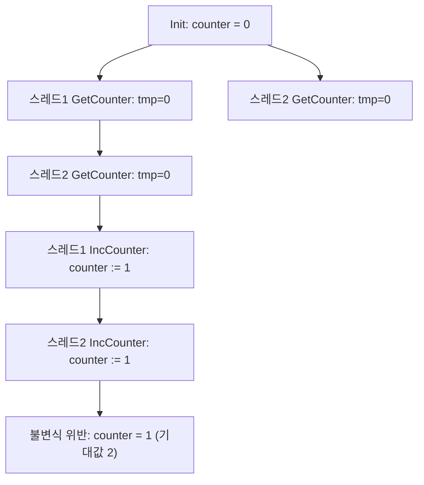

## 개요

단위 테스트를 전부 통과하고, 코드 리뷰도 두 명이 승인했고, 스테이징에서 몇 주간 아무 문제 없이 돌던 코드가 프로덕션에서 갑자기 무너지는 경우가 있다. 원인을 추적해보면 대개 "그 순서로 이벤트가 겹칠 수 있다"는 사실 자체를 아무도 몰랐던 경합 상태(race condition)다. 테스트는 개발자가 상상한 시나리오만 검증하고, 코드 리뷰는 사람이 읽으면서 떠올릴 수 있는 반례만 걸러낸다. 애초에 "이런 순서도 가능하다"는 생각 자체를 못 했다면, 테스트도 리뷰도 그 버그를 통과시킨다.

<strong>TLA+(Temporal Logic of Actions)</strong>는 이 문제를 정반대 방향에서 공격한다. 시나리오를 상상하는 대신, 시스템이 가질 수 있는 상태와 그 사이의 전이 규칙만 정의하면 컴퓨터가 도달 가능한 모든 상태 조합을 기계적으로 열거해서 정의한 속성이 깨지는 경로가 있는지 찾아준다. 이 글은 AWS와 MongoDB가 실제로 TLA+로 무엇을 찾아냈는지, 그 원리가 왜 테스트와 다른 층위에서 작동하는지, 그리고 형식 검증 컨설턴트 Hillel Wayne이 말하는 "언제 쓰고 언제 안 써야 하는가"의 기준을 정리한다.

---

## TLA+란 무엇인가 — 상태 기계로 시스템을 명세한다

TLA+는 병렬·분산 시스템의 마이크로소프트 리서치 연구원이었던 Leslie Lamport가 만든 형식 명세 언어다([Lamport, TLA Home Page](https://lamport.azurewebsites.net/tla/tla.html)). 핵심 아이디어는 프로그램을 상태 기계(state machine)로 다시 쓰는 것이다.

- **상태(state)**: 시스템의 모든 변수가 특정 시점에 가지는 값의 조합.
- **초기 상태(Init)**: 시스템이 시작할 때 변수들이 가질 수 있는 값.
- **다음 상태 관계(Next)**: 현재 상태에서 다음 상태로 넘어갈 수 있는 모든 방법(동시에 실행 가능한 여러 스레드·서버·요청이 만드는 모든 조합 포함).
- **불변식(invariant)**: 도달 가능한 모든 상태에서 항상 성립해야 하는 조건.

이 네 가지를 정의하면 <strong>TLC 모델 체커</strong>가 초기 상태에서 출발해 Next 관계로 도달 가능한 상태를 전부 너비 우선으로 펼쳐보며, 그중 불변식을 어기는 상태가 있는지 전수 조사한다. 사람이 "이 순서로 실행되면 어떻게 될까"를 하나씩 상상해서 테스트 케이스로 옮기는 대신, 가능한 조합 자체를 기계가 빠짐없이 펼쳐본다는 점이 테스트와의 근본적인 차이다.

## 코드로 보는 차이 — 왜 테스트는 이 버그를 놓치는가

말로 하는 설명보다 실제 경합 상태 하나를 명세해보면 차이가 분명해진다. 아래는 두 스레드가 공유 카운터를 1씩 증가시키는 PlusCal(TLA+의 알고리즘형 문법) 스펙이다([Learn TLA+, "Concurrency"](https://learntla.com/core/concurrency.html)의 스레드 카운터 예제를 완전한 모듈 형태로 재구성).

```text
---- MODULE Counter ----
EXTENDS Integers
CONSTANT NumThreads
Threads == 1..NumThreads

(*--algorithm Counter
variables counter = 0;

process thread \in Threads
variables tmp = 0;
begin
  GetCounter:
    tmp := counter;
  IncCounter:
    counter := tmp + 1;
end process;
end algorithm; *)

Correct == (\A p \in Threads : pc[p] = "Done") => counter = NumThreads
====
```

`GetCounter`와 `IncCounter`를 별도 레이블로 나눈 것이 핵심이다. PlusCal에서 레이블은 원자적으로(atomic) 실행되는 단위의 경계이므로, 두 레이블 사이에서 다른 프로세스가 끼어들 수 있다는 뜻이다. `NumThreads = 2`로 TLC를 돌리면 다음 경로를 찾아낸다.

1. 스레드 1이 `GetCounter`를 실행해 `tmp = 0`을 읽는다.
2. 스레드 2가 `GetCounter`를 실행해 `tmp = 0`을 읽는다(스레드 1이 아직 `counter`를 갱신하기 전).
3. 스레드 1이 `IncCounter`를 실행해 `counter := 1`.
4. 스레드 2가 `IncCounter`를 실행해 `counter := 1`(자신의 `tmp`도 0이었으므로).
5. 두 스레드 모두 종료했는데 `counter = 1`. `Correct` 불변식이 요구하는 `counter = NumThreads(=2)`와 어긋난다.

이 반례는 `GetCounter`와 `IncCounter`를 하나의 레이블로 합쳐 원자적으로 만들면(즉 `counter := counter + 1` 한 줄로 쓰면) 사라진다. 실제 멀티스레드 코드에서 이 조치는 read-modify-write 구간을 뮤텍스(mutex)나 락으로 감싸 임계 구역(critical section)을 만드는 것과 정확히 같은 효과다 — TLA+는 그 락이 실제로 필요한지, 어느 경계에 둬야 하는지를 코드를 짜기 전에 알려준다는 점이 다르다. 중요한 건 이 반례를 얻는 데 필요한 것이 "여러 스레드로 부하 테스트를 돌려서 우연히 재현되길 기다리는 것"이 아니라, 상태 공간을 정의하고 TLC를 돌리는 것뿐이라는 점이다. 아래는 이 상태 공간이 갈라지는 지점을 도식화한 것이다.



이 카운터는 아주 단순한 예시지만, 실제 분산 시스템에서는 "레이블 사이에 끼어들 수 있는 지점"이 수십 곳이고 참여자도 여러 서버·여러 세대(term)에 걸쳐 있다. 사람이 손으로 모든 인터리빙을 추적하는 건 애초에 불가능한 규모이고, 바로 이 지점에서 모델 체킹이 테스트를 대체하는 게 아니라 테스트가 닿지 못하는 층위를 메운다.

## 실전 사례 — AWS와 MongoDB가 실제로 찾아낸 버그

### AWS: 7개 팀, 최단 반례 35단계

Amazon의 엔지니어 6명이 2015년 Communications of the ACM에 발표한 논문에 따르면, AWS는 2011년부터 S3·DynamoDB 등 핵심 서비스 설계에 TLA+를 사용해왔고, 이를 적용한 7개 팀 모두가 가치를 봤다고 보고했다([Newcombe et al., "How Amazon Web Services Uses Formal Methods", CACM Vol. 58 No. 4, 2015](https://lamport.azurewebsites.net/tla/formal-methods-amazon.pdf)). 이 논문이 주는 핵심 메시지는 TLA+가 "설계 검토·코드 리뷰·테스트를 이미 통과한" 시스템에서도 초당 수백만 요청을 처리하는 조건에서만 드러나는 경합 상태를 찾아냈다는 것이다.

형식 검증 컨설턴트 Hillel Wayne은 The Pragmatic Engineer 인터뷰에서 이 사례군 중 하나를 두고 "그 버그를 드러내는 가장 짧은 오류 추적이 35단계였다"고 설명한다([The Pragmatic Engineer, "Formal methods with Hillel Wayne", 2026-07-29](https://newsletter.pragmaticengineer.com/p/formal-methods-with-hillel-wayne)). 35단계짜리 상태 전이 시퀀스를 사람이 코드 리뷰나 수동 테스트로 재구성하는 건 사실상 불가능에 가깝다 — 이것이 왜 "리뷰를 더 꼼꼼히 했으면 잡았을 것"이라는 가정이 이런 종류의 버그에는 성립하지 않는지를 보여준다.

### MongoDB: 재구성 프로토콜을 상태 기계로 다시 본 순간

더 상세한 사례는 MongoDB 엔지니어링 팀이 Raft 합의 알고리즘을 기반으로 하는 레플리카 셋의 동적 재구성(dynamic reconfiguration) 프로토콜을 재설계하며 공개한 기록이다([MongoDB Engineering Blog, "Rapid Prototyping A Safe, Logless Reconfiguration Protocol For MongoDB With TLA+"](https://www.mongodb.com/company/blog/technical/rapid-prototyping-safe-logless-reconfiguration-protocol-mongodb-tla-plus); 이 작업의 정형 증명은 [Schultz, Dardik, Tripakis, CPP 2022](https://arxiv.org/pdf/2109.11987)로 별도 학술 발표됐다). 기존 프로토콜을 TLA+로 옮기고 TLC를 돌리자 세 겹의 문제가 드러났다.

| 반복 | 시도한 규칙 | TLC가 찾은 반례 |
|------|-------------|------------------|
| 1차 | 한 번에 노드 하나만 바꾸도록 제한 | 인접하지 않은 설정끼리 과반(quorum) 교집합이 비어, 같은 term에서 프라이머리가 두 번 선출됨 |
| 2차 | 새 설정 적용 전 config 커밋 조건 추가 | 일부 케이스는 안전해졌지만, 이전 설정에서 커밋된 로그 항목이 새 설정에 전파되지 않는 경로가 남음 |
| 3차 | oplog 커밋 조건까지 추가 | 경쟁하는 두 프라이머리가 서로 다른 설정을 동시에 밀어붙이는 경로에서 여전히 quorum이 갈라짐 |

세 번의 반복 끝에 얻은 통찰은 "설정(config) 자체를 oplog와 마찬가지로 별도의 합의 대상, 즉 상태 기계로 취급해야 한다"는 것이었다. `(configVersion, configTerm)` 쌍으로 설정에 순서를 매기고, 과반수가 받아들인 설정만 "커밋"된 것으로 인정하도록 재설계하자 TLC는 8억 개 이상의 상태를 20시간 동안 탐색하고서야 위반 사례를 더 찾지 못했다. 이 설계는 이후 MongoDB 4.4부터 배포됐고, 팀은 배포 이후 이 경로에서 유의미한 프로토콜 버그가 없었다고 보고했다. 설계 자체는 1주일 만에 초안이 나왔고 2주일 만에 안전성이 증명된 최종안으로 수렴했는데, 이는 손으로 모든 케이스를 따져가며 설계했다면 나올 수 없었던 속도라는 점을 팀은 함께 짚는다.

같은 패턴은 Microsoft의 Azure Cosmos DB 팀에서도 나타난다 — 클라이언트에게 보이는 일관성 모델과 내부 구현 사이의 정련(refinement) 관계를 TLA+ 명세로 검증한다([Hackett, Rowe, Kuppe, "Understanding Inconsistency in Azure Cosmos DB with TLA+"](https://arxiv.org/pdf/2210.13661)). 세 회사의 공통점은 문제 자체가 "동시에 여러 참여자가 상태를 바꿀 수 있고, 그 상태 조합의 수가 사람이 손으로 다 나열하기엔 너무 많다"는 데 있다.

## 언제 쓰고 언제 안 쓰는가

TLA+가 강력한 것과 별개로, Hillel Wayne은 대부분의 일상적인 코드에는 형식 명세가 오히려 비현실적이라고 잘라 말한다. 그가 드는 예는 "디렉토리에서 가장 줄 수가 많은 파일 찾기"처럼 단순해 보이는 문제다 — 이 연산 하나도 완전히 형식화하려면 ASCII와 UTF-8의 개행 처리 차이, 읽을 수 없는 파일, 심볼릭 링크 등 수많은 엣지 케이스를 전부 정의해야 한다. 대부분의 소프트웨어는 이런 엣지 케이스에 "99%+ 상황에서 맞으면 충분한" 검증으로도 실무적으로 문제가 없다.

Wayne이 실제로 제시하는 기준은 이렇다.

- **경합 상태가 실제 피해로 이어지는 시스템**(분산 데이터베이스, 합의 프로토콜, 결제·트랜잭션 처리)에는 형식 검증이 값어치를 한다. AWS와 MongoDB 사례가 정확히 이 범주다.
- **대부분의 나머지 엔지니어링**에는 property-based testing이 "형식 검증의 엄밀함"과 "실무 적용 가능성" 사이의 실용적인 절충안이다.
- AI가 형식 기법 채택률을 끌어올리긴 하겠지만 주류로 만들지는 못할 것이라 보며, AI를 명세 작성에 성공적으로 활용하는 사람들은 대개 이미 형식 검증에 익숙한 전문가라는 점도 짚는다 — 즉 AI 보조가 기초 학습을 대체하지는 못한다.

## Property-based testing — 실용적인 중간 지점

형식 검증이 "모든 도달 가능한 상태"를 정의하고 전수 조사하는 반면, property-based testing은 입력 공간에서 무작위로 생성한 값들을 특정 속성(property)에 대해 반복적으로 검사한다. 도달 가능한 상태를 전부 훑는 게 아니라 표본을 대량으로 던져보는 것이므로 완전성은 없지만, 일반적인 함수·자료구조 코드에는 이 정도로도 손으로 쓴 예제 기반 단위 테스트보다 훨씬 많은 엣지 케이스를 걸러낸다.

```python
from hypothesis import given, strategies as st

def merge_sorted(a: list[int], b: list[int]) -> list[int]:
    result, i, j = [], 0, 0
    while i < len(a) and j < len(b):
        if a[i] <= b[j]:
            result.append(a[i]); i += 1
        else:
            result.append(b[j]); j += 1
    return result + a[i:] + b[j:]

@given(st.lists(st.integers()).map(sorted), st.lists(st.integers()).map(sorted))
def test_merge_preserves_sortedness(a, b):
    merged = merge_sorted(a, b)
    assert merged == sorted(merged)
    assert sorted(a + b) == merged
```

Python의 [Hypothesis](https://hypothesis.readthedocs.io/) 라이브러리는 이런 `@given` 데코레이터로 명시한 속성을 수백–수천 개의 생성된 입력에 대해 검사하고, 실패하면 실패를 재현하는 가장 작은 반례로 자동으로 축소(shrink)해서 보여준다. TLA+가 "상태 전이 규칙 자체를 정의해서 전수 탐색"한다면, Hypothesis는 "함수의 입출력 관계를 속성으로 정의해서 표본 탐색"한다는 점에서 계층이 다르다.

| | 예제 기반 단위 테스트 | Property-based Testing | TLA+ 형식 검증 |
|---|---|---|---|
| 검증 대상 | 개발자가 고른 특정 입력 | 정의한 속성 + 무작위/생성 입력 | 정의한 불변식 + 도달 가능한 전체 상태 공간 |
| 완전성 | 없음(선택한 케이스만) | 없음(표본, 통계적으로 넓음) | 유한 모델 범위 안에서는 완전 |
| 학습 비용 | 낮음 | 낮음–중간 | 중간–높음(새 언어, 새 사고방식) |
| 가장 적합한 대상 | 회귀 방지, 문서화된 예시 | 순수 함수, 자료구조, 파서 | 동시성·분산 프로토콜, 상태 전이가 많은 시스템 |
| 대표 도구 | pytest, JUnit, GoogleTest | Hypothesis, QuickCheck | TLA+ / TLC, PlusCal |

## 시작하는 법

TLA+ 자체 문법(수학 기호 기반)은 진입 장벽이 있지만, 위 예제처럼 PlusCal이라는 알고리즘형 문법으로 시작하면 일반적인 의사코드에 가깝게 작성할 수 있고 TLA+ 툴박스가 이를 자동으로 TLA+로 번역해준다. 무료 온라인 가이드인 [Learn TLA+](https://learntla.com/)는 기본 연산부터 결정적 알고리즘, 동시성, 시간적 속성(temporal property)까지 선형적으로 진행되도록 구성돼 있고, Hillel Wayne이 쓴 책 [*Practical TLA+*](https://www.hillelwayne.com/post/practical-tla/)는 실무 사례 중심으로 더 깊게 다룬다.

## 자주 하는 오해

1. **"형식 검증은 코드에 버그가 없음을 증명한다"** — TLA+가 증명하는 건 <em>명세</em>가 불변식을 어기지 않는다는 것이지, 실제 구현 코드가 그 명세와 정확히 같다는 것은 아니다. 명세와 구현 사이의 간극(specification–implementation gap)은 여전히 사람이 메워야 한다.
2. **"모든 코드에 명세를 써야 한다"** — Wayne이 든 "파일 찾기" 예시처럼, 엣지 케이스가 무한히 갈라지는 단순 문제를 형식화하는 비용은 그 문제가 실제로 요구하는 정확도를 초과하는 경우가 대부분이다.
3. **"TLA+를 배우지 않으면 형식적인 검증은 못 한다"** — property-based testing은 별도 언어 학습 없이 기존 코드베이스에 바로 적용 가능한, 완전성은 낮지만 실용적인 대안이다.
4. **"AI에게 명세를 맡기면 형식 검증의 진입 장벽이 사라진다"** — 현재까지의 관찰로는 AI로 명세를 성공적으로 생성하는 사람 대부분이 이미 형식 검증 경험자이며, 기초 이해 없이 AI가 대신 학습곡선을 없애주지는 않는다.

## 평가 기준

이 글의 목표는 TLA+를 당장 실무에 도입시키는 것이 아니라, 세 가지 검증 수단(단위 테스트·property-based testing·형식 검증)이 서로 다른 층위의 질문에 답한다는 것과 그 경계를 스스로 판단할 수 있게 하는 것이다. 아래 항목을 스스로 설명할 수 있다면 이 글의 목적은 달성된 것이다.

- 카운터 예제에서 `GetCounter`와 `IncCounter`를 하나의 레이블로 합치면 왜 반례가 사라지는지, PlusCal의 "레이블 = 원자적 실행 단위" 개념으로 설명할 수 있다.
- 단위 테스트, property-based testing, TLA+ 모델 체킹이 각각 "무엇을 표본으로 검사하는가"의 관점에서 어떻게 다른지 구분할 수 있다.
- 자신이 다루는 시스템이 Wayne의 기준(경합 상태가 실제 피해로 이어지는가)에서 형식 검증이 값어치를 할 범주인지, 아니면 property-based testing으로 충분한 범주인지 판단할 수 있다.
- "형식 검증이 통과하면 버그가 없다"는 주장이 왜 틀렸는지, 명세-구현 간극(specification–implementation gap) 개념으로 설명할 수 있다.

## 마무리

세 검증 수단은 서로 배타적인 선택지가 아니라 같은 시스템의 서로 다른 층을 맡는다. MongoDB 사례를 예로 들면, 쿼리 파서나 API 핸들러 같은 일반 비즈니스 로직은 단위 테스트와 property-based testing만으로 충분히 다뤄지고, TLA+는 오직 "재구성 중 두 프라이머리가 동시에 존재할 수 있는가"처럼 참여자 수가 늘어날수록 사람이 손으로 못 따라가는 합의·복제 핵심부에만 투입됐다. 즉 형식 검증을 도입한다는 것이 코드베이스 전체를 명세로 다시 쓴다는 뜻이 아니라, 상태 조합이 사람의 상상력을 넘어서는 경계선이 어디인지 먼저 식별하고 그 부분에만 정밀한 도구를 배치한다는 뜻이다. 이 글에서 다룬 판단 기준과 코드 예제가 그 경계선을 스스로 그어보는 출발점이 되길 바란다.

## 참고 자료

- [The Pragmatic Engineer, "Formal methods with Hillel Wayne"](https://newsletter.pragmaticengineer.com/p/formal-methods-with-hillel-wayne), 2026-07-29
- [Newcombe, Rath, Zhang, Munteanu, Brooker, Deardeuff, "How Amazon Web Services Uses Formal Methods", Communications of the ACM Vol. 58 No. 4, 2015](https://lamport.azurewebsites.net/tla/formal-methods-amazon.pdf)
- [MongoDB Engineering Blog, "Rapid Prototyping A Safe, Logless Reconfiguration Protocol For MongoDB With TLA+"](https://www.mongodb.com/company/blog/technical/rapid-prototyping-safe-logless-reconfiguration-protocol-mongodb-tla-plus)
- [Schultz, Dardik, Tripakis, "Formal Verification of a Distributed Dynamic Reconfiguration Protocol", CPP 2022](https://arxiv.org/pdf/2109.11987)
- [Hackett, Rowe, Kuppe, "Understanding Inconsistency in Azure Cosmos DB with TLA+"](https://arxiv.org/pdf/2210.13661)
- [Learn TLA+, "Concurrency"](https://learntla.com/core/concurrency.html)
- [Learn TLA+](https://learntla.com/)
- [Lamport, TLA Home Page](https://lamport.azurewebsites.net/tla/tla.html)
- [Hillel Wayne, "Practical TLA+ Now Available"](https://www.hillelwayne.com/post/practical-tla/)
- [Hypothesis 공식 문서](https://hypothesis.readthedocs.io/)
