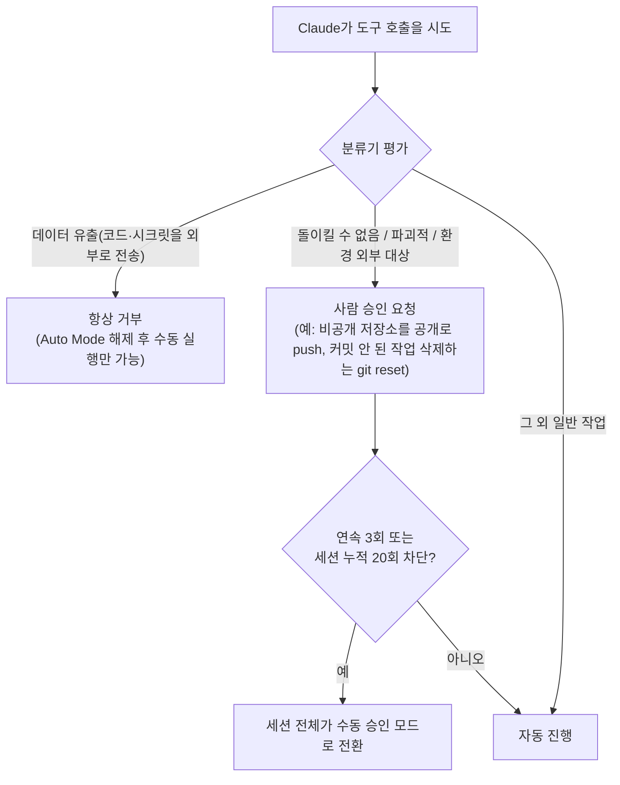

2026년 8월 14일부터 Claude Code Pro·Max·Team 플랜의 신규 세션은 매 도구 호출마다 사람에게 승인을 묻던 방식 대신 <strong>Auto Mode</strong>가 기본값으로 켜진다. Anthropic은 이 전환을 발표하면서 근거가 된 실험 수치를 이례적으로 상세히 공개했는데, 핵심은 "사람이 매번 승인 버튼을 누르는 방식이 실제로는 안전하지 않다"는 데이터였다. 이 글은 그 수치와 레드팀 검증 결과, 그리고 Simon Willison이 제기한 prompt injection 우려까지 정리해서 이 전환을 어떻게 받아들여야 할지 판단 기준을 세운다.

---

## 개요

Auto Mode는 Claude Code가 실행하려는 도구 호출을 분류기(classifier)로 먼저 평가해, "돌이킬 수 없거나 파괴적이거나 작업 환경 외부를 목표로 하는" 행동만 사람 승인을 요구하고 나머지는 자동으로 진행시키는 권한 모델이다. Pro·Max·Team 플랜은 2026년 8월 14일부터 신규 세션에 기본 적용되며, Enterprise 플랜은 1개월 내 기본값 전환이 예정되어 있고 현재는 선택 적용 상태다. 이 글은 Claude Code를 이미 쓰고 있는 개발자, 그리고 팀 단위로 자동화 범위를 결정해야 하는 리드·보안 담당자를 대상으로 한다.

## 구조: 분류기가 승인 프롬프트를 대체하는 방식

기존 수동 승인 모드는 위험도와 무관하게 파일 쓰기·명령 실행 등 정의된 도구 호출마다 사람에게 "허용/거부"를 묻는다. Auto Mode는 이 지점에 판단 계층을 하나 더 끼워 넣는다. Claude가 도구를 호출하면 분류기가 그 행동을 먼저 검토하고, 아래 흐름에 따라 자동 진행 여부를 결정한다.

데이터 유출처럼 되돌릴 수 없는 피해로 이어지는 행동은 분류기 판단과 무관하게 항상 거부되는 하드 딜라이(hard deny) 카테고리로 별도 처리된다. 반대로 대부분의 파일 읽기·편집·테스트 실행 같은 일상적 작업은 분류기를 통과하면 승인 프롬프트 없이 바로 진행된다. 사용자는 CLI에서 Shift+Tab을 누르거나 데스크톱 앱의 모드 드롭다운으로 언제든 모드를 전환할 수 있고, 조직 관리자는 managed settings의 `defaultMode` 값으로 팀 전체 기본값을 지정하거나 `disableAutoMode`로 아예 비활성화할 수 있다.

## 이 전환의 근거: 세 갈래 검증 데이터

### 승인 피로도의 증거 — 13.6% 대 89%

Anthropic이 공개한 핵심 수치는 1,053명의 유료 플랜 사용자를 대상으로 한 통제 실험이다. 수동 승인 방식은 실제 위험한 명령의 13.6%만 차단했지만(143명 분), Auto Mode 분류기는 같은 조건에서 89%를 차단했다(937명 분). 더 눈에 띄는 대목은 시간에 따른 변화다. 세션 초반에는 사람이 위험 명령의 약 17%를 잡아냈지만, 프롬프트 50개를 넘긴 뒤에는 이 수치가 5%까지 떨어졌다. 반면 분류기의 차단 성능은 세션 길이와 무관하게 일정하게 유지됐다. Anthropic은 이를 "confirmation fatigue(승인 피로도)"가 실제 안전장치로 기능하지 않는다는 근거로 제시한다.

### 레드팀 검증 — Apollo Research와 Trajectory Labs

Apollo Research는 2주간 적대적 레드티밍을 수행해 분류기의 초기 미스율 12%를 별도 보류 테스트셋 기준 7%까지 개선시켰다. Trajectory Labs는 간접 prompt injection 공격 시나리오 72개를 각각 10회씩, 총 720회 테스트했다. Claude Fable 5·Opus 5·Sonnet 5의 Auto Mode는 이 720회 전부에서 공격 성공률 0%를 기록한 반면, 비교 대상으로 함께 테스트된 GPT-5.6 Sol의 Codex Auto-review는 5.83%의 공격 성공률을 보였다.

### 실사용 사례 — 도입 기업의 반응

Adobe, Nuro, Gusto, Garner Health는 이미 Auto Mode를 프로덕션에 도입했다고 밝혔다. Nuro의 Staff Software Engineer Kai Zhou는 이렇게 말했다.

> "The other day, I kicked off an agent at 10 p.m. and it kept running until 5 a.m.—and it gave me three PRs in the morning. I think it's pretty impressive. Only auto mode enables this kind of workload."

Gusto의 Software Engineer Martin Emde는 반복 승인 프롬프트를 없애면서도 안전성 체감은 유지됐다고 밝혔다.

> "Auto mode gave us a safer balance between speed and control. We were able to remove the repeated prompts and increase productivity without compromising safety."

Garner Health는 직원 550명 규모 엔지니어링 조직 전체에 표준화된 SDLC를 구축할 수 있었던 배경으로 Auto Mode를 꼽았다.

## 그런데 이 수치, 그대로 믿어도 될까 — Simon Willison의 반론

이 발표 직후 Simon Willison은 Anthropic의 실험 설계 자체에는 동의하면서도 두 가지 지점에서 신중한 태도를 보였다. 먼저 승인 피로도 진단에는 공감을 표했다.

> "Confirmation fatigue is real, and asking humans to click 'OK' every few steps is clearly not going to result in safe behavior."

하지만 그가 더 우려하는 지점은 따로 있다.

> "The second is the one I worry about more: prompt injection, where someone smuggles malicious instructions to your agent hiding in content that it consumes from elsewhere."

Willison은 악의적인 서드파티 패키지나 웹 콘텐츠에 숨겨진 지시문을 에이전트가 그대로 실행해버리는 상황에서 분류기가 실제로 방어막이 될 수 있을지 의문을 제기하며, Trajectory Labs의 0% 성공률 수치에 대해서도 "I'd like to see more independent confirmation of this"라는 입장을 밝혔다. 89% 차단율, 720회 무성공 같은 수치는 전부 Anthropic이 위촉한 기관의 실험이거나 자체 발표 자료에 근거하며, 이 글을 쓰는 시점까지 제3자의 독립 재현 검증은 확인되지 않는다. 인상적인 수치일수록 발표 주체가 곧 이해당사자라는 점을 함께 놓고 읽을 필요가 있다.

## 적용 시나리오와 판단 기준

Auto Mode를 그대로 켜 둬도 괜찮은 쪽은 이미 버전 관리와 CI로 변경 사항을 사후 검증할 수 있는 표준적인 코드베이스에서, 야간 장시간 에이전트 실행처럼 사람이 매 단계를 지켜볼 수 없는 워크플로우를 굴리는 팀이다. 위 사례의 Nuro·Gusto처럼 반복 승인이 실제 병목이었던 상황일수록 효과가 크다.

반대로 신중하게 접근해야 할 상황도 있다. 에이전트가 신뢰할 수 없는 외부 콘텐츠(낯선 GitHub 이슈, 스크래핑한 웹페이지, 검증되지 않은 서드파티 패키지 문서 등)를 대량으로 소비하는 워크플로우라면, Willison이 지적한 prompt injection 경로가 열려 있는 셈이므로 하드 딜라이 카테고리 밖의 판단을 분류기에게만 맡기기보다 해당 작업만 수동 모드로 전환하는 편이 안전하다. 금융·의료처럼 모든 행동에 감사 추적이 필요한 규제 산업에서는 조직 관리자가 `disableAutoMode`로 전사 기본값 자체를 수동으로 유지하는 선택도 합리적이다. 어느 쪽이든 "기본값이 바뀌었으니 그대로 둔다"보다는, 자신의 코드베이스가 얼마나 외부 미검증 콘텐츠에 노출되는지를 먼저 점검하고 결정하는 편이 안전하다.

## 장단점과 종합 평가

Auto Mode의 가장 큰 강점은 이 전환이 "자율성이 편하니까"가 아니라 승인 피로도라는 구체적인 실패 지점을 수치로 짚었다는 점이다. 세션이 길어질수록 사람의 판단력이 떨어진다는 관찰은 코딩 에이전트뿐 아니라 반복 승인을 요구하는 다른 도구 설계에도 시사점이 있다. 연속 3회·누적 20회 차단 시 자동으로 수동 모드로 되돌아가는 폴백 정책과, 데이터 유출을 분류기 판단과 무관하게 항상 거부하는 하드 딜라이 카테고리도 안전망으로 기능한다.

다만 한계도 분명하다. 공개된 실험 수치는 전부 Anthropic 자체 발표 또는 위촉 기관의 결과이며, Willison이 지적했듯 prompt injection 방어력에 대한 독립 검증은 아직 없다. 분류기가 "돌이킬 수 없음"으로 판단하는 경계선 자체도 공개된 몇 가지 예시(비공개 저장소 push, 커밋 안 된 작업 삭제) 밖의 회색지대에서는 사용자가 직접 검증하기 전에는 알기 어렵다. 결국 Auto Mode는 "사람의 수동 승인보다 통계적으로 낫다"는 근거를 갖춘 기본값이지, 모든 상황에서 검토 없이 켜 둬도 되는 완성형 안전장치는 아니다.

## 참고 및 출처

- [Anthropic 공식 블로그 — Auto mode is coming to Claude Code by default](https://claude.com/blog/auto-mode-default-in-claude-code) (2026-08-08, 실험 수치·레드팀 결과·도입 사례 인용 출처)
- [Simon Willison — Claude Code auto mode](https://simonwillison.net/2026/Aug/8/auto-mode/) (2026-08-08, prompt injection 관련 인용 출처)
- [TechCrunch — Anthropic is turning Claude Code's auto mode on by default](https://techcrunch.com/2026/08/09/anthropic-is-turning-claude-codes-auto-mode-on-by-default/) (2026-08-09)
