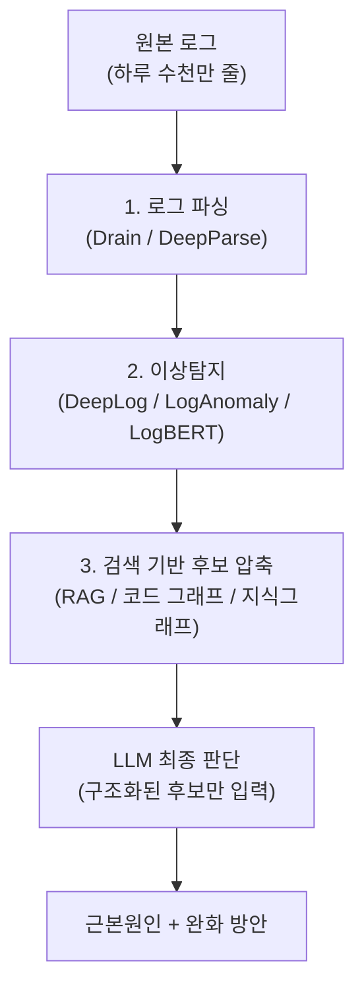

새벽 3시, 서비스가 죽었다. 로그 수집기에는 하루치로만 수천만 줄이 쌓여 있고, 온콜 엔지니어는 그 안 어딘가에 있을 원인 몇 줄을 찾아야 한다. "이걸 그냥 LLM에 던지면 안 되나?"라는 질문은 자연스럽다. 실제로 해보면 두 가지 벽에 바로 부딪힌다. 로그 볼륨이 어떤 모델의 컨텍스트 창도 가볍게 초과하고, 억지로 잘라 넣으면 이번엔 LLM이 그럴듯하지만 틀린 원인을 자신 있게 지목한다. 그래서 프로덕션에서 실제로 돌아가는 로그 기반 RCA(Root Cause Analysis, 근본원인분석) 시스템들은 전부 로그를 통째로 넣지 않는다. 이 글은 Microsoft·Meta·ByteDance가 각자 다른 방식으로 수렴한 "파싱 → 이상탐지 → 검색으로 후보를 좁히고, LLM은 마지막에만 판단한다"는 공통 설계를 정리하고, 왜 이 구조가 필요한지, 아직 뭘 못 풀었는지, 언제 도입할 가치가 있는지를 따진다.

---

## 문제: 로그를 통째로 넣으면 왜 실패하는가

원본 로그를 그대로 LLM에 넣는 접근이 실패하는 이유는 단순한 컨텍스트 길이 문제 하나가 아니다. 대규모 시스템의 하루 로그량은 어떤 상용 모델의 컨텍스트 창도 훌쩍 넘기고, 억지로 최근 로그 일부만 잘라 넣으면 정작 원인이 담긴 구간이 잘려나갈 수 있다. 더 심각한 문제는 무관한 로그가 신호 대비 잡음 비율을 낮춰 LLM이 그럴듯하지만 틀린 원인을 지목하는 환각(hallucinated RCA)이다. Microsoft Research의 Roy 외 연구진이 클라우드 인시던트 RCA에이전트 세 종류(ReAct, Chain-of-Thought, Retrieval 베이스라인)를 비교한 실험에서, 정확도가 가장 낮았던 ReAct 에이전트(정확도 35%)의 틀린 답변 중 환각 비율은 6%로 가장 낮았던 반면, 검색 기반 베이스라인은 정확도가 39%로 더 높았음에도 틀린 답변의 40%가 환각이었다(Roy 외, "Exploring LLM-based Agents for Root Cause Analysis", 2024). 정확도와 환각률이 반비례하지 않는다는 이 결과는, "더 정교해 보이는 답을 내놓는 방법일수록 안전하다"는 직관이 항상 맞지는 않는다는 것을 보여준다. 게다가 이런 환각은 겉보기에 정상적인 인시던트 리포트를 그대로 재진술하거나 지나치게 일반적인 답을 내놓는 형태로 나타나는 경우가 많아, 원인을 이미 아는 사람이 아니면 첫눈에 틀렸다고 알아채기 어렵다.

## 3단계 파이프라인: 파싱 → 이상탐지 → 검색으로 좁히고, LLM은 마지막에만 판단한다

이 문제에 대해 학계와 빅테크가 수렴한 답은 "LLM이 원시 데이터 전체를 스스로 훑게 하지 않는다"는 원칙이다. 대신 로그를 구조화된 템플릿으로 정규화하고, 딥러닝으로 이상 구간을 좁히고, 검색으로 관련 후보를 추린 뒤, LLM에는 그렇게 좁혀진 소수의 구조화된 후보만 입력해 최종 자연어 판단을 맡긴다.

### 로그 파싱: Drain에서 DeepParse까지

딥러닝 모델에 로그를 넣기 전, IP·숫자·경로 같은 가변 부분을 변수로 마스킹한 "템플릿"으로 정규화하는 파싱 단계가 필요하다. Drain은 고정 깊이 파스 트리로 로그의 고정부와 가변부를 분리하는 온라인 템플릿 추출의 표준 기법이며, IBM Cloud 등에서 널리 쓰이는 구현체 Drain3는 포맷에 종속되지 않아 이종 시스템에 두루 적용된다. 2025년 발표된 LLM 기반 로그 파싱 방법 29개 리뷰는 LLM 파서가 사전학습 지식 덕분에 일반화 능력은 높지만 추론 비용·지연이 크고 결과가 불안정하다고 지적한다(Le & Zhang, "System Log Parsing with Large Language Models: A Review", 2025). 2026년 발표된 DeepParse는 이 트레이드오프를 한 번에 해결한다 — LLM의 확률적 추론은 오프라인에서 정규식 마스크를 합성하는 데만 한 번 쓰고, 런타임에는 그 정규식을 Drain의 파스 트리 위에 결정론적으로 적용한다. LogHub 벤치마크 16개 시스템에서 평균 파싱 정확도 97.6%, 그룹핑 정확도 94.1%를 기록했고, 줄당 LLaMA-7B 추론(28.93초) 대비 약 100배 빠른 0.30초로 처리했다. 파싱 품질이 좋아지면 하류 단계도 함께 좋아진다는 근거로, DeepParse가 정제한 로그를 LogBERT 이상탐지에 넣었더니 인증 로그의 하루 오탐 건수가 147건에서 96건(35% 감소)으로, 설정 로그는 42% 감소했다(Shetaia & Kauffman, "DeepParse: Hybrid Log Parsing with LLM-Synthesized Regex Masks", 2026).

### 이상탐지 3세대 계보: DeepLog → LogAnomaly → LogBERT

파싱으로 정규화된 로그에서 이상 구간을 좁히는 딥러닝 기법은 세 세대로 이어진다. DeepLog는 LSTM으로 로그 이벤트 시퀀스를 순차 모델링해 다음에 올 이벤트를 예측하는 초기 접근이지만, 수치형(quantitative) 패턴 탐지에는 약하다. LogAnomaly는 의미적 표현과 정량적 표현을 결합해 비지도 방식으로 정확도와 강건성의 균형을 맞춘다. LogBERT는 트랜스포머 기반 자기지도학습(masked log key prediction)으로 문맥적 의존성을 포착해 셋 중 가장 높은 F1 점수를 보이지만 연산 비용이 크다(Landauer 외, "Deep Learning for Anomaly Detection in Log Data: A Survey", 2023). 이 세 기법은 이후 등장하는 모든 LLM 기반 접근에서 "1차 필터" 역할을 하는 baseline으로 계속 인용된다 — LLM이 처음부터 관여하는 게 아니라, 이 필터를 통과한 이상 이벤트만 다음 단계로 넘어간다.

### RAG로 후보를 좁히는 두 프레임워크: LogSage와 AetherLog

정규화·이상탐지를 거친 로그에서 근본원인을 뽑아내는 단계는 RAG(검색증강생성)와 결합되는 경우가 많다. LogSage는 CI/CD 파이프라인 실패의 원인분석·해결책 제시를 위한 LLM 프레임워크로, 토큰 효율적 로그 전처리(노이즈 필터링·핵심 오류 추출) 다음 구조화된 진단 프롬프팅으로 원인을 좁히고, 마지막으로 과거 해결 사례를 RAG로 검색해 재사용한다. GitHub CI/CD 실패 367건 벤치마크에서 정밀도 98% 이상, 베이스라인 LLM 대비 F1 38%p 이상 개선을 기록했고, ByteDance에서 1년간 107만 건 이상의 파이프라인 실행에 실제 적용해 종단간(end-to-end) 정밀도 80% 이상을 유지했다(Xu 외, "LogSage: An LLM-Based Framework for CI/CD Failure Detection and Remediation with Industrial Validation", 2025). AetherLog는 로그 기반 RCA에 LLM과 지식그래프(KG)를 결합해, 오프라인 단계에서 LLM이 로그를 개체화·클러스터링해 중복 제거된 지식그래프를 구축하고, 온라인 단계에서 LLM이 생성한 요약으로 관련 KG 개체를 검색해 RCA 프롬프트를 구성한다(ISSRE 2025).

## 프로덕션 실측: Microsoft, Meta, ByteDance는 각각 뭘 얻었나

세 회사는 같은 원칙("구조화된 후보로 좁힌 뒤 LLM이 최종 판단")을 각자 다른 방식으로 구현했고, 공개한 실측 수치도 접근 방식만큼 다르다.

| 조직 | 방식 | 규모 | 핵심 결과 |
|------|------|------|-----------|
| Microsoft | 인시던트 텍스트로 GPT-3.5 파인튜닝 | 4만여 건, 1,000개 이상 서비스 | 원인 생성 어휘유사도 45.5%↑, 완화단계 생성 131.3%↑(제로샷 대비), 온콜 엔지니어 70% 이상이 유용성 5점 만점 3점 이상 평가 |
| Microsoft(후속) | GPT-4 in-context learning(파인튜닝 없이) | 10만 건 | 제로샷 대비 49.7%↑, 이전 파인튜닝 GPT-3 대비 평균 24.8%↑, 인시던트 담당자 평가 정확도 43.5%↑ |
| Meta | 코드 소유권·런타임 코드 그래프로 후보 압축 후 파인튜닝 Llama2(7B)가 상위 5개 랭킹 | 5,000건 인스트럭션 튜닝 | 조사 초기 단계에서 42%가 실제 원인을 top-5 후보에 포함 |
| ByteDance(LogSage) | 토큰 효율 전처리 → 구조화 진단 → RAG 해결책 검색 | 1년, 107만 건 이상 파이프라인 실행 | 종단간 정밀도 80% 이상 유지 |

세 접근 모두 "로그·인시던트 텍스트를 그대로 LLM에 넣는" 것이 아니라 검색·랭킹·파인튜닝으로 후보를 먼저 좁힌 뒤 LLM이 최종 판단을 내린다는 공통점이 있다. 흥미로운 대목은 Microsoft가 같은 문제를 파인튜닝(2023)에서 인컨텍스트 러닝(2024)으로 옮겨갔다는 점이다 — 파인튜닝 없이도 더 큰 개선폭(49.7% vs 45.5%)을 얻었다는 결과는, 모델 자체의 추론 능력이 좋아질수록 무거운 파인튜닝 없이도 좁혀진 컨텍스트만으로 충분한 성능이 나올 수 있음을 시사한다(Zhang 외, "Automated Root Causing of Cloud Incidents using In-Context Learning with GPT-4", 2024).

## 같은 원칙의 다른 응용: 로그가 아니라 프로파일로

"구조화된 후보로 좁힌 뒤 LLM이 판단한다"는 원칙은 장애 원인분석뿐 아니라 성능 최적화에도 그대로 적용된다. POLO(IJCAI 2025)는 프로파일링과 반복 가중치 조정으로 핫스팟을 식별하고, 정적분석으로 생성한 프로젝트 콜그래프 위에서 두 LLM 에이전트가 협업해 코드를 반복 재작성하는 3단계 프레임워크로, 실험에서 1.34–21.5배의 속도 개선을 보고했다. Microsoft의 RAPGen은 과거 성능 버그 수정 사례로 구축한 지식베이스에서 관련 프롬프트 지침을 검색해 재사용하는 RAG 방식으로, 전문가 검증 데이터셋에서 약 60% 사례가 개발자 수준과 동등하거나 더 나은 제안이었고 약 42%는 개발자 해법과 완전히 일치했다. 2026년 발표된 MOA는 동적 프로파일링 데이터를 소스코드 분석과 결합해 코드베이스 규모에서 메모리 비효율을 자동 탐지·수정하는 프레임워크다. 로그든 프로파일이든, LLM에 넘기기 전 다른 도구로 후보를 좁히는 구조는 동일하다.

## 왜 다층 구조인가 — 시도됐지만 충분하지 않았던 대안들

| 대안 | 아이디어 | 왜 충분하지 않았는가 |
|------|----------|---------------------|
| 원본 로그를 LLM에 직접 입력 | 별도 전처리 없이 로그 텍스트를 그대로 프롬프트에 넣음 | 컨텍스트 길이 초과, 무관한 로그가 신호 대비 잡음 비율을 낮춰 환각 유발 |
| 딥러닝 이상탐지만 단독 사용(LogBERT 등) | 이상 여부는 잘 탐지하지만 "왜"에 대한 자연어 설명이 없음 | 개발자가 원인 코드 위치까지 도달하려면 여전히 수작업 필요 |
| RAG 없는 파인튜닝 LLM 단독 | 사내 인시던트 데이터로 LLM을 직접 파인튜닝 | 신규 이슈 패턴에 취약, 재학습 비용, 지식 갱신 지연 |

Microsoft·Meta·ByteDance 사례가 공통으로 보여주는 최종 설계의 핵심은 "다층 구조"다 — 1차로 딥러닝·휴리스틱·검색이 방대한 로그·코드에서 소수의 구조화된 후보(이상 이벤트, 관련 코드 변경, 유사 과거 사례)로 범위를 좁히고, LLM은 그 구조화된 후보만 입력받아 최종 자연어 판단을 내린다. 지연시간(실시간 인시던트 대응은 초–분 단위 응답 필요), 컨텍스트 예산, 환각 허용치(잘못된 원인 지목이 잘못된 조치로 이어질 위험)가 이 설계에서 우선순위로 다뤄지는 제약이다. 만약 원본 로그를 그대로 LLM에 넣는 방식으로 갔다면, 로그 볼륨이 큰 시스템에서는 애초에 동작하지 않거나 무관한 로그에 묻혀 정확도가 크게 떨어졌을 것이다 — Meta의 42% top-5 정확도, Microsoft의 45.5%/131.3% 개선 수치는 모두 "휴리스틱·검색으로 좁힌 후보 위에서" 달성된 것이지 "로그 전체를 LLM에 넣어서" 달성된 것이 아니다.

## 아직 못 푼 문제

다층 구조는 환각 리스크를 줄이지만 없애지는 못한다. Roy 외의 실험에서 정확도가 가장 높았던 검색 기반 베이스라인조차 틀린 답변의 40%가 환각이었다는 사실은, "후보를 좁히는 단계를 추가하면 환각이 사라진다"는 기대가 지나치게 낙관적임을 보여준다. 또한 1차 필터(딥러닝 이상탐지, 휴리스틱 검색)의 품질이 전체 파이프라인의 상한을 결정하므로, 이 필터가 애초에 놓친 원인은 뒤에 오는 LLM 단계에서도 복구되지 않는다. 연구 자체의 재현성 문제도 있다 — LLM 기반 로그 파싱 방법 29개를 검토한 리뷰는 그중 45%가 오픈소스 구현을 공개하지 않았고, 공개된 저장소 중에도 실행되지 않거나 문서가 불완전한 경우가 많다고 지적한다. 이는 이 글에서 인용한 개별 수치들도 각 조직·논문의 자체 벤치마크 조건 안에서 해석해야 하고, 다른 로그 형식·장애 유형에 그대로 일반화된다고 단정할 수 없다는 뜻이다.

## 도입 판단 기준

이 파이프라인 전체를 항상 구축해야 하는 것은 아니다. 아래 기준으로 어느 단계까지 필요한지 가늠할 수 있다.

- **로그 볼륨이 LLM 컨텍스트를 넘어서는가**: 하루 로그가 수백만 줄 미만이고 특정 서비스로 필터링하면 컨텍스트 안에 들어온다면, 무거운 파싱·이상탐지 계층 없이 RAG 검색만으로도 충분할 수 있다.
- **실시간 대응이 필요한가**: 초–분 단위 응답이 필요한 온콜 시나리오라면 Drain 같은 결정론적 파서가 필수다. LLM 기반 파서는 지연·비용 때문에 실시간 경로에 부적합하다.
- **오탐의 대가가 큰가**: 잘못된 원인 지목이 실제 장애 대응을 지연시키는 상황(금융·인프라 코어 서비스)이라면, LLM 단독 판단 대신 사람이 최종 확인하는 human-in-the-loop 단계를 반드시 남겨야 한다 — 이 글에서 다룬 어떤 시스템도 환각을 완전히 제거하지 못했다.
- **과거 인시던트 데이터가 충분한가**: RAG·지식그래프 기반 접근은 검색할 과거 사례가 축적돼 있어야 효과가 난다. 신생 서비스라면 우선 로그 파싱·이상탐지만 도입하고, 인시던트 데이터가 쌓인 뒤 RAG 계층을 얹는 순서가 합리적이다.

## 참고 및 출처

- [Deep Learning for Anomaly Detection in Log Data: A Survey (Landauer 외, arXiv:2207.03820)](https://arxiv.org/abs/2207.03820)
- [System Log Parsing with Large Language Models: A Review (arXiv:2504.04877)](https://arxiv.org/html/2504.04877v2)
- [DeepParse: Hybrid Log Parsing with LLM-Synthesized Regex Masks (Shetaia & Kauffman, arXiv:2604.20553)](https://arxiv.org/html/2604.20553v1)
- [LogSage: An LLM-Based Framework for CI/CD Failure Detection and Remediation with Industrial Validation (Xu 외, arXiv:2506.03691)](https://arxiv.org/pdf/2506.03691)
- [AetherLog: Log-based RCA by Integrating LLMs and Knowledge Graphs (ISSRE 2025)](https://netman.aiops.org/wp-content/uploads/2025/09/Tianyu_AetherLog_to_ISSRE-3.pdf)
- [Microsoft Research — Large Language Models for Automatic Cloud Incident Management](https://www.microsoft.com/en-us/research/blog/large-language-models-for-automatic-cloud-incident-management/)
- [Recommending Root-Cause and Mitigation Steps for Cloud Incidents using Large Language Models (arXiv:2301.03797, ICSE 2023)](https://arxiv.org/abs/2301.03797)
- [Automated Root Causing of Cloud Incidents using In-Context Learning with GPT-4 (Zhang 외, arXiv:2401.13810)](https://arxiv.org/abs/2401.13810)
- [Exploring LLM-based Agents for Root Cause Analysis (Roy 외, arXiv:2403.04123)](https://arxiv.org/html/2403.04123v1)
- [Meta Engineering — Leveraging AI for Efficient Incident Response](https://engineering.fb.com/2024/06/24/data-infrastructure/leveraging-ai-for-efficient-incident-response/)
- [POLO: An LLM-Powered Project-Level Code Performance Optimization Framework (IJCAI 2025)](https://www.ijcai.org/proceedings/2025/814)
- [RAPGen: An Approach for Fixing Code Inefficiencies in Zero-Shot (Garg 외, arXiv:2306.17077)](https://arxiv.org/abs/2306.17077)
- [MOA: A Profiling-Guided LLM Framework for Memory-Optimization Automation at Codebase Scale (arXiv:2606.31368)](https://arxiv.org/pdf/2606.31368)
