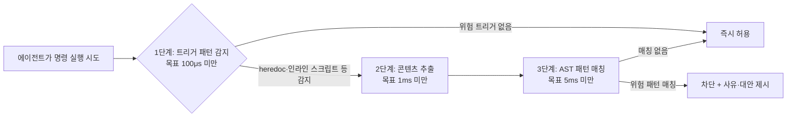

AI 코딩 에이전트에게 터미널 접근 권한을 준 사람이라면 한 번쯤 심장이 내려앉는 순간을 겪는다. 커밋하지 않은 몇 시간짜리 작업이 에이전트가 실행한 `git reset --hard` 한 줄에 사라지거나, 정리를 부탁했더니 `rm -rf`가 엉뚱한 디렉터리를 지운 경험이다. dcg(Destructive Command Guard)는 이 문제를 정면으로 겨냥한 오픈소스 러스트(Rust) 프로그램으로, 에이전트가 명령을 실행하기 **직전**에 가로채 위험 패턴과 대조하고 매칭되면 이유와 함께 차단한다. 이 글은 dcg의 3단계 판정 구조, 기본 보호와 선택적 보안 팩, 차단을 우회하는 안전장치, 그리고 설치·적용 시 고려할 점을 정리한다.

---

## dcg란 무엇인가

dcg는 Claude Code, Codex CLI, Gemini CLI, GitHub Copilot CLI, VS Code Copilot Chat, Cursor IDE, Hermes Agent, Grok(xAI) 등 에이전트가 셸이나 git 명령을 실행하기 직전 호출되는 **pre-tool 훅**으로 동작한다. 개발자 Jeffrey Emanuel이 처음 파이썬 스크립트로 만든 아이디어를 러스트로 재작성하면서 50개 이상의 모듈식 보안 팩, heredoc·인라인 스크립트 스캔, 3단계 아키텍처, 컨텍스트 인식, 허용 목록(allowlist) 기능을 추가해 지금의 형태가 됐다(출처: [GitHub 공식 저장소 README](https://github.com/Dicklesworthstone/destructive_command_guard/blob/main/README.md)). GitHub API 기준 저장소는 2026-01-07에 만들어졌고 2026-08-14까지 커밋이 이어지고 있으며, 별표(star) 약 5,767개, 포크 232개를 기록하고 있다(2026-08-17 확인, 출처: [GitHub API `repos/Dicklesworthstone/destructive_command_guard`](https://api.github.com/repos/Dicklesworthstone/destructive_command_guard)). 제작자는 X(트위터)에서 이 도구를 소개하며, 존재를 몰라서 못 쓰고 있는 개발자가 많을 것이라는 취지로 직접 공유하기도 했다(2026-01-25, 출처: [@doodlestein 게시물](https://x.com/doodlestein/status/2015510232869245033)).

에이전트에게 "무엇을 할 수 있게 할 것인가"만큼 "무엇을 실수로 하지 못하게 막을 것인가"가 별도의 도구 카테고리로 자리 잡고 있다는 점에서, dcg는 AI 코딩 에이전트 생태계가 자율성을 확장하는 동시에 안전장치를 요구하는 흐름을 보여주는 사례이기도 하다.

## 3단계 아키텍처: 대부분의 명령은 첫 단계에서 끝난다

dcg가 서브밀리초(sub-millisecond) 지연을 낼 수 있는 이유는 모든 명령을 똑같이 무겁게 분석하지 않기 때문이다. 명령은 트리거 감지 → 콘텐츠 추출 → AST(추상 구문 트리) 패턴 매칭 순서로 흐르고, 대부분의 평범한 명령은 첫 단계에서 "트리거 없음" 판정을 받고 곧바로 통과한다.



1단계는 정규식 집합(`RegexSet`)으로 재귀적 `rm`, git 파괴 명령, `python -c`/`node -e`/`bash -c` 같은 인라인 실행, heredoc·here-string 패턴을 한 번에 검사한다. 트리거가 없으면 즉시 허용해 대부분의 명령이 지연을 거의 느끼지 못한다. 트리거가 걸리면 2단계에서 실제 코드 본문을 최대 1MB·1만 줄·10개 heredoc 한도 안에서 추출하고, 3단계에서 tree-sitter/ast-grep 기반 언어별 문법으로 `subprocess.run("rm -rf", shell=True)` 같은 구조적 패턴까지 잡아낸다. 셸 파이프라인 내부에 중첩된 명령은 재귀적으로 다시 평가한다(출처: 위 README).

이 설계는 **컨텍스트를 구분**한다는 점도 중요하다. `grep "rm -rf"`처럼 위험 문자열이 데이터(검색어)로만 등장하는 명령은 통과시키고, 실제로 실행되는 `rm -rf /`만 막도록 만들어졌다(출처: 위 README). 문자열 매칭만 하는 도구였다면 오탐(false positive)이 잦아 실무에서 꺼졌을 기능이다.

## 기본 보호와 50개 이상의 선택적 보안 팩

dcg는 설정 파일 없이도 두 가지 핵심 보호가 항상 켜져 있다: 재귀적 `rm`을 막는 `core.filesystem`과 파괴적 git 명령을 막는 `core.git`이다. Windows에서는 `windows.filesystem`, `windows.system` 팩도 기본 활성화된다. 여기에 더해 데이터베이스·컨테이너·클라우드·원격 접속 등 영역별로 50개 이상의 모듈식 팩을 필요에 따라 켤 수 있다(출처: 위 README).

| 카테고리 | 포함 팩 예시 | 개수 |
|---|---|---|
| 데이터베이스 | postgresql, mysql, mongodb, redis, sqlite, snowflake, supabase, bigquery | 8개 |
| 컨테이너 | docker, compose, podman | 3개 |
| 쿠버네티스 | kubectl, helm, kustomize | 3개 |
| 클라우드 | aws, azure, gcp | 3개 |
| 오브젝트 스토리지 | s3, gcs, minio, azure_blob | 4개 |
| 원격 접속 | rsync, scp, ssh | 3개 |
| 기타 | CI/CD, 시크릿 관리, DNS, 이메일, 메시징, 모니터링 등 | 다수 |

프로젝트가 postgreSQL과 도커만 쓴다면 `postgresql`·`docker` 팩만 켜서 검사 범위를 좁히고, 나머지 오탐 가능성을 줄이는 식으로 조정할 수 있다.

## 차단당했을 때: fail-open 설계와 4단계 우회 경로

안전 도구가 실제로 채택되려면 "분석 자체가 실패했을 때 에이전트 워크플로 전체를 막지 않는가"가 관건이다. dcg는 훅 입력을 파싱할 수 없는 경우와, 파싱은 됐지만 안전성 평가가 시간 안에 끝나지 못한 경우를 구분해서 다룬다. 전자는 감시 경고와 함께 기본적으로 허용(fail-open)하고, 평가 자체가 시작됐다면 걸린 시간이나 명령 크기만으로 "안전하다"고 넘겨짚지 않는다는 원칙을 따른다. 평가 시간 제한은 기본 1000ms(보수적인 환경 프로파일에서는 3000ms)이며, `general.fail_closed = true`를 켜면 해석 불가능한 입력을 오히려 거부하도록 반대로 바꿀 수 있다(출처: 위 README).

정당한 파괴적 명령까지 막아버렸을 때를 위한 우회 경로도 우선순위별로 마련돼 있다.

| 방법 | 적용 범위 | 사용법 |
|---|---|---|
| 환경변수 우회 | 해당 명령 1회 | `DCG_BYPASS=1 <command>` |
| Allow-once 코드 | 해당 명령 1회 | 차단 메시지의 코드를 `dcg allow-once <code>`에 입력 |
| 영구 허용 목록 | 특정 규칙/명령 | `dcg allowlist add core.git:reset-hard` |
| 훅 제거 | 모든 명령 | 에이전트 설정에서 dcg 훅 항목 삭제 |

Allow-once 코드는 6자리 숫자를 SHA256으로 파생시켜 24시간 안에 만료되거나 일회성으로만 쓰도록 구성할 수 있다(출처: 위 README). 차단 메시지 자체도 "왜 막혔는지"와 "대신 이렇게 하라"는 안내를 함께 보여준다 — 예를 들어 `git reset --hard`가 걸리면 "커밋되지 않은 변경을 파괴한다"는 이유와 함께 `git stash`를 먼저 쓰라는 대안을 제시하는 식이다.

## 왜 이런 도구가 필요한가

에이전트에게 셸 접근 권한을 준다는 것은 사실상 실수까지 위임한다는 뜻이다. 사람은 `git reset --hard`나 `rm -rf`를 치기 전에 무의식적으로 한 번 더 확인하는 습관이 있지만, 에이전트는 "정리해줘", "초기화해줘" 같은 지시를 문자 그대로 실행 명령으로 옮기고, 컨텍스트 창이 길어질수록 몇 턴 전에 커밋되지 않은 파일이 있었다는 사실을 놓치기 쉽다. dcg 같은 후크는 이 판단을 에이전트의 "선의"에만 맡기지 않고, 실행 직전 단계에 별도의 규칙 기반 게이트를 하나 더 끼워 넣는다. 이 접근은 이 사이트가 최근 다룬 [Claude Code의 Auto Mode 기본값 전환](/post/2026-08-15-claude-code-auto-mode-default/)이 보여준 흐름 — 사람의 매 단계 승인 대신 분류기와 레드팀 검증으로 안전을 재구성하는 흐름 — 과 같은 방향에 있다. 다만 Auto Mode가 에이전트 벤더가 자체 제공하는 승인 정책이라면, dcg는 벤더와 무관하게 사용자가 직접 얹는 독립적인 방어선이라는 점이 다르다.

## 적용 시나리오와 판단 기준

dcg는 다음 상황에서 특히 유용하다.

- **에이전트에게 반자율(semi-autonomous) 권한을 준 워크플로**: 매 명령을 사람이 승인하지 않고 에이전트가 연속으로 셸 명령을 실행하게 두는 환경일수록, 사람의 확인 습관을 대신할 장치가 필요하다.
- **여러 에이전트 CLI/IDE를 함께 쓰는 팀**: Claude Code·Codex·Cursor 등을 동시에 쓰면 벤더별 안전장치 수준이 제각각이라, 공통 후크 하나로 최소한의 방어선을 통일할 수 있다.
- **되돌리기 어려운 인프라를 다루는 세션**: 프로덕션 데이터베이스, 클라우드 리소스, 원격 서버에 접근하는 에이전트 세션이라면 해당 영역의 보안 팩을 켜는 실익이 크다.

반대로 다음과 같다면 굳이 도입할 필요는 크지 않다.

- 에이전트를 항상 읽기 전용/제안 모드로만 쓰고 실행은 사람이 직접 한다.
- 이미 컨테이너·가상머신처럼 파괴돼도 즉시 복구되는 일회용 환경에서만 에이전트를 돌린다.
- fail-open 설계상 "이 도구가 있으니 백업이 필요 없다"고 여기는 것은 잘못된 전제다 — dcg는 확률을 낮추는 게이트이지, 백업이나 버전 관리를 대체하는 안전망이 아니다.

## 장단점과 한계

**장점**은 앞서 다룬 서브밀리초 지연, 8개 이상 에이전트 크로스 벤더 지원, 컨텍스트 인식으로 오탐을 줄인 설계, 그리고 fail-open과 다단계 우회 경로로 "안전 도구가 워크플로를 막는" 부작용을 최소화한 점이다.

**한계**도 분명하다. 첫째, fail-open이 기본값이라는 것은 훅 자체가 죽거나 응답하지 못하는 경우 보호가 사라진다는 뜻이다 — 이 방향을 반대로 조정하려면 `general.fail_closed`를 직접 켜야 한다. 둘째, AST 패턴 매칭이라는 접근 자체가 결국 "알려진 위험 패턴 목록"에 의존하므로, 이 목록에 없는 새로운 형태의 파괴적 명령까지 막아준다는 보장은 없다. 셋째, 프로젝트는 커뮤니티 기여를 받지 않는 1인 유지보수 구조라고 README에서 밝히고 있어(출처: 위 README), 버스 팩터(bus factor)가 낮다.

라이선스도 눈여겨볼 지점이다. dcg는 표준 MIT가 아니라 "OpenAI/Anthropic 라이더가 붙은 MIT 라이선스"를 쓴다. OpenAI와 Anthropic, 그 계열사, 그리고 이들을 대신해 행동하는 개인·단체를 "제한된 당사자"로 지정해 소프트웨어에 대한 권리를 아예 부여하지 않고, "사용"의 정의에 실행·배포뿐 아니라 벤치마킹·평가·데이터셋 편입·모델 학습까지 포함시켜 놓았다(출처: [LICENSE 원문](https://github.com/Dicklesworthstone/destructive_command_guard/blob/main/LICENSE)). 즉 이 라이선스가 겨냥한 것은 dcg를 훅으로 호출하는 Claude Code나 Codex 같은 도구의 일반 사용자가 아니라, 오픈소스 코드를 모델 학습 데이터로 흡수하는 AI 랩 자체다 — Claude Code는 여전히 dcg의 공식 지원 에이전트 목록에 올라 있다. 다만 이런 라이더가 실제로 법적으로 얼마나 강제력을 가지는지, 조직 내에서 사용할 때 법무 검토가 필요한지는 표준 MIT와 다르게 별도로 확인해 둘 부분이다.

## 시작하기 — 설치

Linux·macOS·WSL에서는 설치 스크립트를 curl로 받아 실행한다.

```bash
curl -fsSL "https://raw.githubusercontent.com/Dicklesworthstone/destructive_command_guard/main/install.sh?$(date +%s)" | bash -s -- --easy-mode
```

Windows PowerShell에서는 다음과 같이 설치한다.

```powershell
& ([scriptblock]::Create((irm "https://raw.githubusercontent.com/Dicklesworthstone/destructive_command_guard/main/install.ps1"))) -EasyMode -Verify
```

Homebrew를 쓴다면 탭을 추가하고 설치한 뒤 초기화한다.

```bash
brew install dicklesworthstone/tap/dcg
dcg install
```

`--easy-mode`/`-EasyMode`는 감지된 에이전트(Claude Code, Codex CLI 등)의 설정 파일에 훅 항목을 자동으로 추가해준다. 설치 후에는 필요한 보안 팩만 선택적으로 켜고, 팀 전체에 적용하기 전에 실제 워크플로에서 오탐이 얼마나 발생하는지 며칠 정도 관찰한 뒤 허용 목록을 조정하는 순서를 권한다(출처: 위 README).

---

## 참고 문헌

- [Dicklesworthstone/destructive_command_guard — GitHub 공식 저장소 README](https://github.com/Dicklesworthstone/destructive_command_guard/blob/main/README.md)
- [dcg LICENSE 원문 (MIT with OpenAI/Anthropic Rider)](https://github.com/Dicklesworthstone/destructive_command_guard/blob/main/LICENSE)
- [GitHub API — 저장소 메타데이터(별표·포크·생성일)](https://api.github.com/repos/Dicklesworthstone/destructive_command_guard)
- [Jeffrey Emanuel(@doodlestein) — dcg 소개 게시물, 2026-01-25](https://x.com/doodlestein/status/2015510232869245033)
- [[Claude Code] Auto Mode 기본값 전환: 사람의 승인은 왜 못 미더운가](/post/2026-08-15-claude-code-auto-mode-default/)
