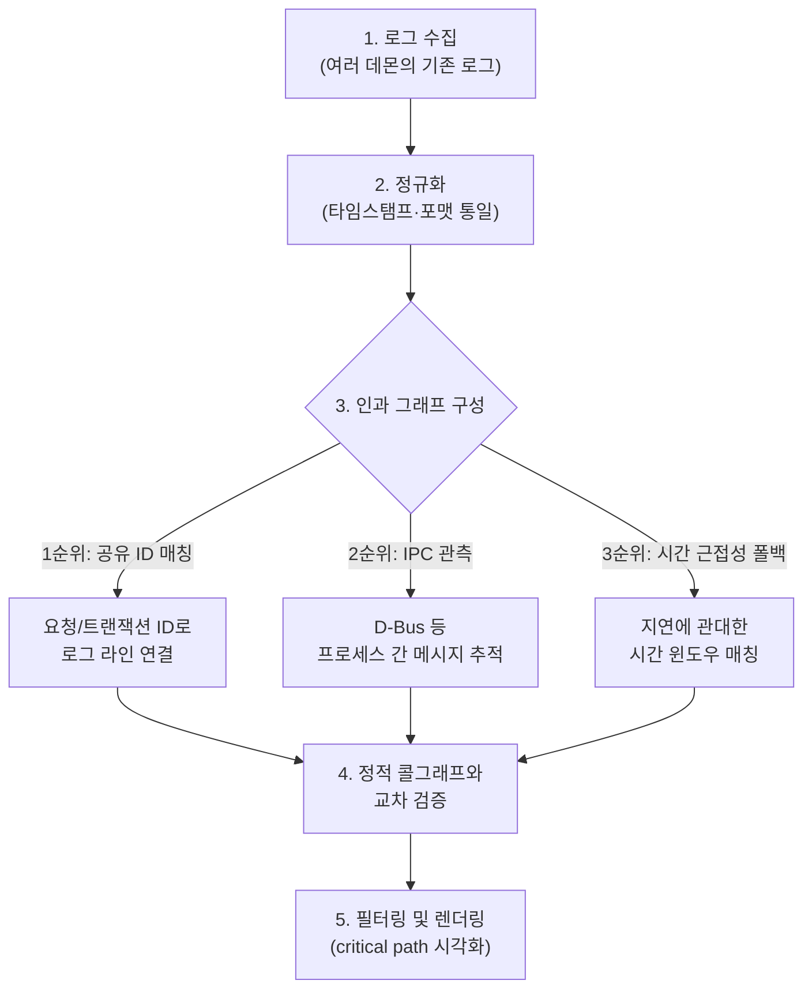

가장 자주 실행되는 함수를 프로파일러로 찾아 열심히 최적화했는데, 사용자가 체감하는 지연은 왜 그대로였을까. 답은 간단하다 — 자주 실행되는 경로(hot path)와 실제 지연을 결정하는 경로(critical path)는 다른 개념이기 때문이다. 이 둘을 같은 것으로 착각하면 엉뚱한 곳을 최적화하고도 문제를 풀었다고 믿게 된다. 단일 프로세스라면 프로파일러 하나로 대부분 해결되지만, 여러 데몬이 IPC로 얽혀 돌아가는 임베디드 시스템에서는 이야기가 달라진다. 계측을 새로 심을 여유도, 권한도 없이 이미 쌓여 있는 로그와 소스코드만으로 "무엇이 무엇을 지연시켰는가"라는 인과관계를 재구성해야 하는 상황이 흔하다. 이 글은 그 문제를 10여 년째 다뤄온 연구 계보 — Facebook의 Mystery Machine과 University of Toronto의 lprof(둘 다 2014년 OSDI)에서 시작해 Canopy·Google Critical Path Tracing으로 프로덕션 규모까지 커지고, 2026년의 SDVDiag·Lumos로 이어지는 흐름 — 을 정리한다.

## Hot Path와 Critical Path는 다른 질문에 답한다

Hot path는 "가장 자주 실행되거나 CPU 시간을 가장 많이 소비하는 코드 경로"로, 빈도와 누적 시간이라는 통계적 기준으로 정의된다. 프로파일러가 기본적으로 보여주는 값이 바로 이것이다. Critical path는 스케줄링 그래프 이론에서 온 개념으로, 특정 결과(응답 지연, 장애 발생 시점 등)에 실제로 인과적으로 기여한 이벤트들의 의존성 사슬 중 가장 긴 것을 가리킨다. 어떤 함수가 초당 수만 번 호출되며 CPU 시간의 큰 비중을 차지하더라도, 그 실행이 다른 스레드·프로세스와 병렬로 겹쳐서 진행된다면 전체 응답 시간에는 거의 기여하지 않을 수 있다. 반대로 드물게만 호출되는 짧은 함수라도 그것이 끝나야만 다음 단계가 시작되는 순차 의존 관계의 마지막 고리라면, 그 함수 하나가 critical path 전체를 좌우한다.

| 구분 | Hot Path | Critical Path |
|---|---|---|
| 정의 기준 | 빈도·누적 CPU 시간 (통계적) | 결과에 대한 인과 의존 사슬 (구조적) |
| 전형적 도구 | CPU 프로파일러 (perf, gprof 등) | 분산 트레이싱, 이벤트 인과 그래프 |
| "여기를 최적화하면?" | CPU 총 사용량이 줄어들 수 있다 | 최적화한 만큼 실제 지연이 줄어든다 |
| 멀티 프로세스에서 | 프로세스별로 독립 측정 가능 | 프로세스 경계를 넘는 인과관계 추적이 필요 |

이 둘의 관계를 명확히 정리한 게 Google이 Search를 포함한 수백 개 서비스에 표준으로 적용하는 Critical Path Tracing(CPT)의 핵심 주장이다 — critical path 위에 있지 않은 구간을 아무리 최적화해도 전체 지연은 줄지 않는다([Google, ACM Queue/CACM](https://queue.acm.org/detail.cfm?id=3526967)). 즉 critical path 식별 자체가 "무엇을 최적화해야 하는가"를 결정하는 선행 조건이며, hot path 목록만 들여다보는 최적화는 이 선행 조건을 건너뛴 것이다. CPT가 프레임워크 계층에서 어떻게 critical path를 자동 계측하는지, 실측 운영 비용이 얼마인지는 [이전 글에서 원문 기반으로 자세히 다뤘다](/post/2026-07-20-critical-path-tracing-distributed-latency/) — 이 글은 그 전제를 공유하되 질문을 하나 더 밀어붙인다. **CPT조차 심을 수 없는 상황이라면, 즉 계측을 새로 추가할 권한도 여유도 없는 임베디드 멀티 데몬 시스템이라면 critical path를 어떻게 찾는가?**

## 계측 우선이 안 되면 로그 우선으로

멀티 프로세스 시스템에서 이 인과 사슬을 재구성하는 데는 크게 두 전략이 있다. 계측 우선(instrumentation-first) 방식은 vector clock처럼 프로세스 간 이벤트 순서를 명시적으로 기록하는 계측을 코드에 미리 심어두는 것이고, Google Dapper류의 분산 트레이싱이 이 접근을 대표한다. 문제는 임베디드 멀티 데몬 시스템에서는 이 전제 자체가 자주 무너진다는 점이다. 이미 필드에 배포된 레거시 데몬을 재컴파일할 수 없거나, 계측 코드를 추가할 권한이 없거나, 계측을 심을 시간적 여유가 없는 상황이 흔하다. 이럴 때 남는 선택지가 로그 우선(log-first) 방식이다 — 이미 존재하는 로그만 가지고 사후적으로 인과 관계를 추론하는 것이다. 구체적으로는 공유 ID(요청 ID, 트랜잭션 ID 등)로 여러 프로세스의 로그 라인을 이어 붙이고, 로그 텍스트의 의미적 연관을 파악하며, 정확한 타임스탬프 정렬이 어려운 임베디드 환경 특성상 지연에 관대한 시간 윈도우로 매칭하는 조합을 쓴다. 이렇게 재구성한 인과 그래프의 신뢰도를 높이는 표준적인 방법은 정적 콜 그래프(소스코드 분석으로 얻은 "이론적으로 가능한 호출 관계")와 동적 로그(실제로 관측된 실행 순서)를 교차 검증하는 것이다. 임베디드 Linux 환경에서 이 작업을 지원하는 실전 도구로는 이벤트 간 흐름 관계를 SQL로 질의할 수 있게 노출하는 Perfetto의 `flow` 테이블, 여러 프로세스의 트레이스를 하나의 시간축으로 정렬하는 LTTng의 공유 클럭, 프로세스 간 메시지 교환을 관찰하는 D-Bus 모니터링이 있다.

## 계측 없이 인과관계를 추론한 원조 — Mystery Machine과 lprof

로그 우선 전략의 학술적 뿌리는 2014년 OSDI에 나란히 발표된 두 논문이다. Facebook의 Mystery Machine은 요청마다 명시적 계측을 추가하는 대신, 이미 소규모로 샘플링되고 있던 로그를 대량으로 마이닝해 이벤트 쌍 사이의 선후·병렬·상호배타 관계를 "가설을 세우고 반례로 기각"하는 방식으로 통계적으로 추론했다. 130만 건 이상의 요청에 이 방식을 적용해 critical path와 컴포넌트별 기여도(slack)를 계산했으며([USENIX OSDI'14](https://www.usenix.org/conference/osdi14/technical-sessions/presentation/chow)), 이 샘플링 전파 아이디어는 훗날 Google CPT에도 그대로 이어졌다([이전 글의 "계보로 보는 CPT" 참고](/post/2026-07-20-critical-path-tracing-distributed-latency/)). 같은 학회에서 University of Toronto가 발표한 lprof는 접근 자체가 다르다 — "개발자는 사후에 실행 흐름을 재구성할 수 있도록 로그를 남긴다"는 경험적 관찰(Flow Reconstruction Principle)에 기반해, 코드 수정이나 계측 추가 없이 기존 printf류 로그만으로 분산 시스템의 요청별 실행 흐름을 재구성했다. 정적 소스코드 분석으로 로그 문장이 남긴 문맥(호출 위치, 변수)을 파악해 런타임 로그와 매칭하는 방식이며, 요청 추출 정밀도 88%, 실제 성능 이상 65% 진단이라는 수치로 검증됐고 산업 현장에도 배포됐다([USENIX OSDI'14](https://www.usenix.org/conference/osdi14/technical-sessions/presentation/zhao)). 통계적 가설검증(Mystery Machine)과 정적분석-런타임 매칭(lprof), 두 갈래 모두 지금 이 글이 다루는 "로그 우선" 전략의 구체적 실행 방법론에 해당하며, 임베디드처럼 새 계측을 심을 수 없는 환경일수록 lprof 쪽 접근(정적 콜그래프 매칭)이 더 직접적으로 적용된다.

## 프로덕션 규모로 — Canopy가 보여준 인과 그래프의 다음 단계

Mystery Machine의 후속으로 Facebook은 Canopy(SOSP 2017)를 통해 브라우저·모바일 앱·백엔드 전 구간에서 인과적으로 연결된 성능 데이터를 수집하는 엔드투엔드 트레이싱 시스템을 만들었다. 하루 13억 건의 트레이스를 처리하며, 사용자가 임의로 정의한 feature(critical path 도출 포함)를 계산할 수 있다([Facebook Research](https://research.facebook.com/publications/canopy-end-to-end-performance-tracing-at-scale/)). Google이 같은 문제를 프레임워크 자동 계측으로 푼 CPT의 구체적인 구현·샘플링·통계적 함정은 앞서 링크한 이전 글에서 다뤘으므로, 여기서는 "계측 없이 인과관계를 추론"하는 이 글의 갈래가 Canopy를 거쳐 어떻게 임베디드 도메인까지 확장됐는지에 집중한다.

## 로그가 애초에 희소한 이유 — 임베디드 로깅 예산

이 글이 전제하는 "기존 로그만으로" 재구성해야 하는 상황은 임베디드 시스템에서 예외가 아니라 표준적인 설계 결과다. 자동차 임베디드 로그 표준인 AUTOSAR DLT(Diagnostic Log and Trace)는 로그 레벨을 컴파일타임뿐 아니라 외부 제어 메시지로 런타임에도 원격 조정할 수 있게 하고, 출력 버퍼가 가득 차면 링버퍼에 저장하다가 그마저 가득 차면 가장 오래된 메시지를 조용히 폐기하는 정책을 쓴다([COVESA dlt-daemon 설계 명세](https://github.com/COVESA/dlt-daemon/blob/master/doc/dlt_design_specification.md)). Zephyr RTOS의 로깅 서브시스템도 동일한 oldest-discard 정책을 채택하며, 호출 지점 단위 레이트리미팅(`LOG_ERR_RATELIMIT`, 기본 5초 간격)과 컴파일타임·런타임 이중 필터링으로 로그량을 통제한다. Deferred(비동기) 모드의 로그 호출 오버헤드는 벤치마크 환경에서 마이크로초 단위(7–11µs)로 측정됐다([Zephyr Project 공식 문서](https://docs.zephyrproject.org/latest/services/logging/index.html)). 이런 "로그 출력량 자체가 하드웨어 제약으로 통제된다"는 전제를 정면으로 다룬 개념이 Microsoft Research의 Log2(USENIX ATC 2015)가 정식화한 로깅 예산(logging budget)이다 — 특정 시간 구간 내 허용되는 최대 로그 출력량을 정의하고, 무관한 로그를 저비용으로 대량 폐기하는 1단계 필터와 유용한 로그만 예산 내에서 출력하는 2단계 필터를 결합하는 구조다([USENIX ATC'15](https://www.usenix.org/conference/atc15/technical-session/presentation/ding)). 2025년의 E-Log(데이터베이스 시스템 대상)는 평상시엔 경량 로깅을 유지하다 이상 징후가 감지되면 그때만 상세 로깅으로 전환하는 트리거 기반 탄력적 로깅 구조로 한 걸음 더 나아간다([IEEE Transactions on Services Computing 2025](https://ieeexplore.ieee.org/document/11106810/)). 즉 "로그 우선 전략"은 계측을 못 해서 어쩔 수 없이 쓰는 차선책이 아니라, 로그 출력량 자체가 표준적으로 제약된 환경에서 그 제약을 주어진 조건으로 받아들이고 재구성 알고리즘을 설계해야 한다는 뜻이다.

## 로그 빈틈을 코드로 메우기

로그가 완전하지 않을 때 소스코드의 정적 콜그래프로 빈 구간을 보완하는 구체적인 기법도 나왔다. Hadoop 3.3.6을 분석한 AnomalyGen 계열 연구는 전체 콜그래프 29만 5천여 노드 중 로깅 API를 직접 호출하는 노드는 1.91%뿐이라는 데 착안했다. "로깅 지점으로의 역방향 도달가능성(backward reachability)"만 남기는 정적 분석으로 콜그래프를 원본의 15.11% 크기로 축소한 뒤, 이를 이용해 로그 사이의 빈 구간을 코드 구조로 보완하는 방식이다([arXiv:2604.11107](https://arxiv.org/pdf/2604.11107)). 이 기법은 앞서 소개한 "정적 콜그래프와 동적 로그의 교차 검증" 원칙을 실제 알고리즘으로 구현한 사례로 볼 수 있다.

## 2026년의 최신 흐름 — 커넥티드 차량과 provenance 하이브리드

임베디드·차량 도메인에 가장 근접한 최신 연구는 SDVDiag(University of Stuttgart, 2026)다. 커넥티드 차량의 다중 서브시스템 실패를 진단하기 위해 로그 이벤트 사이의 시간·논리적 의존관계에 시스템 상태·맥락(부하, 배터리, 온도 등)을 결합하는 "context-aware causality mining"으로 단순 상관관계와 실제 인과관계를 구분한다([arXiv:2604.03391](https://arxiv.org/pdf/2604.03391)). Lumos(2026)는 온라인 디버깅을 위해 오프라인 정적 의존성 그래프로 먼저 실행 계획을 세운 뒤, 그 계획에 따라 필요한 최소한의 런타임 데이터만 기록하는 "provenance-guided" 하이브리드 접근을 제시한다 — 계측 우선과 로그 우선 두 전략의 중간 지점을 탐색하는 시도다([arXiv:2603.29013](https://arxiv.org/pdf/2603.29013)). 한편 임베디드 로그는 타임스탬프 해상도가 낮거나 동일 타임스탬프 이벤트가 다수 존재해 시간순서만으로 실행순서를 확정할 수 없는 경우가 많다. 프로세스 마이닝 분야의 부분순서(partial order) 재구성 연구는 이런 순서 불확실성을 확률로 명시적으로 모델링해, "확정된 순서"가 아니라 "확률 분포"로 critical path 후보를 산출하는 접근을 제안한다([arXiv:2509.15346](https://arxiv.org/pdf/2509.15346)).

## 실전 파이프라인 — 5단계로 인과 그래프 재구성하기

지금까지의 연구 계보를 실무에서 쓸 수 있는 형태로 정리하면 5단계 파이프라인이 된다. 계측을 새로 심을 수 없는 상황에서 기존 로그만으로 시작해, 정적 콜 그래프로 교차 검증한 뒤 렌더링까지 이어지는 흐름이다.

3단계의 세 방법은 우선순위 순서로 시도된다 — 공유 ID가 있으면 가장 신뢰도가 높으므로 우선 쓰고, ID가 없는 구간은 IPC 관측으로, 그마저 없으면 시간 근접성으로 보완하는 폴백 구조다. 이 5단계 자체를 "로그를 시퀀스 다이어그램으로 자동 변환"해주는 기성 도구는 임베디드 멀티 데몬 시스템 영역에는 존재하지 않는다. 대신 JIVE·AppMap·ShiViz-XVector 같은 기존 시각화 도구들의 아이디어를 참고해 각 조직이 자체 파이프라인을 조립하는 것이 현재의 실전 수준이다.

## 언제 쓰고, 언제 다른 방법이 더 나은가

로그 우선 재구성은 계측을 새로 추가할 권한·여유가 없는 레거시 임베디드 시스템에서, 그리고 장애가 이미 발생한 뒤 사후 분석(post-mortem)이 필요할 때 가장 값어치가 있다. 반대로 시스템을 처음부터 새로 설계하는 상황이라면, 애초에 vector clock이나 분산 트레이싱 계측을 심어두는 계측 우선 전략이 훨씬 적은 노력으로 더 정확한 인과 그래프를 준다 — 로그 우선 전략은 "계측이 이미 불가능해진 뒤에 남은 최선"이지, 처음부터 선택할 이상적인 설계는 아니다. 또한 로그 우선 재구성의 정확도는 근본적으로 로그 자체의 밀도에 의존한다. AUTOSAR DLT나 Zephyr처럼 로깅 예산이 빡빡한 환경에서는 공유 ID 매칭조차 안 되는 구간이 많아지고, 그때는 시간 근접성 폴백에 의존할 수밖에 없어 신뢰도가 떨어진다. Lumos류의 provenance-guided 하이브리드가 등장한 이유도 이 지점이다 — 완전한 계측도, 완전한 사후 추론도 아닌 중간 지점을 찾는 것이 현재 연구가 향하는 방향이다. 결국 이 글의 출발점으로 돌아가면, hot path와 critical path를 혼동하지 않는 것이 첫 단추이고, 계측을 심을 수 없는 상황이라면 이 5단계 파이프라인이 "어디를 고쳐야 실제 지연이 줄어드는가"라는 질문에 답할 수 있는 현재까지의 최선이다.

## 참고 자료

- The Mystery Machine (Facebook, OSDI 2014): <https://www.usenix.org/conference/osdi14/technical-sessions/presentation/chow>
- lprof (University of Toronto, OSDI 2014): <https://www.usenix.org/conference/osdi14/technical-sessions/presentation/zhao>
- Canopy — End-to-End Performance Tracing at Scale (Facebook, SOSP 2017): <https://research.facebook.com/publications/canopy-end-to-end-performance-tracing-at-scale/>
- Distributed Latency Profiling through Critical Path Tracing (Google, ACM Queue/CACM 2022–2023): <https://queue.acm.org/detail.cfm?id=3526967>
- AnomalyGen — 로깅 지점 역도달성 콜그래프 프루닝 (2025–2026): <https://arxiv.org/pdf/2604.11107>
- SDVDiag — Context-Aware Causality Mining for Connected Vehicle Diagnosis (University of Stuttgart, 2026): <https://arxiv.org/pdf/2604.03391>
- Lumos — Provenance-Guided Automatic Online Debugging (2026): <https://arxiv.org/pdf/2603.29013>
- Revealing Inherent Concurrency in Event Data — 부분순서 재구성 (2025): <https://arxiv.org/pdf/2509.15346>
- COVESA dlt-daemon 설계 명세 (AUTOSAR DLT): <https://github.com/COVESA/dlt-daemon/blob/master/doc/dlt_design_specification.md>
- Zephyr Project 공식 로깅 문서: <https://docs.zephyrproject.org/latest/services/logging/index.html>
- Log2 — A Cost-Aware Logging Mechanism for Performance Diagnosis (Microsoft Research, USENIX ATC 2015): <https://www.usenix.org/conference/atc15/technical-session/presentation/ding>
- E-Log — Fine-Grained Elastic Log-Based Anomaly Detection (IEEE TSC 2025): <https://ieeexplore.ieee.org/document/11106810/>
