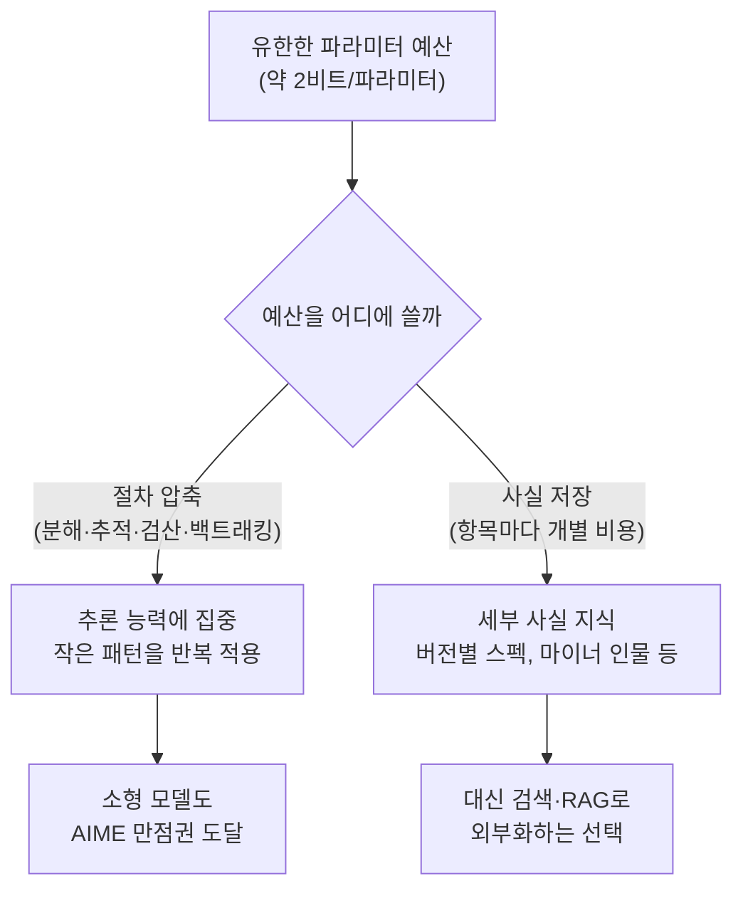

GLM-5.2는 AIME 2026(고교 수학 경시대회 문제 벤치마크)에서 99.2%를 받는다. 활성 파라미터는 토큰당 약 400억 개뿐이고, 이는 2023년 GPT-4의 유출 추정치(MoE 구조, 16개 전문가 중 2개만 활성화·총 파라미터 약 1.7–1.8조 개로 보도됨. 출처: [the-decoder.com](https://the-decoder.com/gpt-4-architecture-datasets-costs-and-more-leaked/). OpenAI 공식 확인은 없음)의 활성 파라미터 규모보다도 작다. 그런데 같은 모델에게 평범한 사실 하나를 물으면 그림이 완전히 뒤집힌다. 개발자 Walter van der Giessen이 2026-08-17 게시한 글은 이 역설을 "모델이 의도적으로 더 멍청해지고 있다"고 표현한다 — 정확히는, 사실 지식을 의도적으로 덜어내고 그 자리에 추론 능력을 채우고 있다는 것이다(출처: [Models Are Getting Dumber on Purpose](https://w4g1.dev/blog/models-are-getting-dumber-on-purpose)). 즉 **추론 능력**은 남기고 **사실 지식**은 덜어낸다는 것이다. 이 글은 이 관찰을 뒷받침하는 수치와 연구를 검증하고, 저자가 낙관적으로 그리는 미래상이 놓치는 지점까지 함께 짚는다.

---

## 숫자로 보는 역설

같은 모델·같은 세대 안에서 추론 벤치마크와 순수 사실 회상 벤치마크의 성적이 크게 갈린다. 아래 수치는 각 벤치마크·리더보드의 확인 시점 기준이며, 프론티어 모델 경쟁이 매주 바뀌는 만큼 스냅샷으로 읽어야 한다.

| 모델 | 활성 파라미터 | AIME 2026 | 사실 회상 / 할루시네이션 |
|------|--------------|-----------|--------------------------|
| GLM-5.2 | 약 400억(총 7,530억, MoE) | 99.2% — 2026-08-07 기준 리더보드 1위 | — |
| Qwen3.5(397B-A17B) | 170억 | 91.3%(w4g1.dev 원문 인용치. 2026-08-20 기준 [BenchLM.ai](https://benchlm.ai/benchmarks/aime2026) 리더보드에서는 93.3%로 갱신돼 있어, 확인 시점에 따라 수 %p 차이가 난다) | 4B·9B급은 [Artificial Analysis AA-Omniscience](https://artificialanalysis.ai/articles/qwen3-5-small-models) 기준 지식 벤치마크 할루시네이션율 각각 80%·82% |
| DeepSeek V4-Flash | 130억 | — | — |
| Gemini 2.5 Pro | — | — | SimpleQA(도구 사용 없는 순수 사실 회상) 53.0% — 2026-08-17 기준 1위 |
| GPT-4(2023, 비교용) | 유출 추정 MoE 구조(16개 전문가 중 2개 활성, 총 약 1.7–1.8조) | — | — |

AIME 리더보드 1위 수치(GLM-5.2 99.2%)는 [BenchLM.ai AIME26 리더보드](https://benchlm.ai/benchmarks/aime2026)와 독립적으로 교차 확인되고, SimpleQA 1위 수치(Gemini 2.5 Pro 53.0%)도 [PricePerToken SimpleQA 리더보드](https://pricepertoken.com/leaderboards/benchmark/simpleqa)에서 같은 값으로 확인된다. Qwen3.5의 활성 파라미터 170억은 [Artificial Analysis의 Qwen3.5-397B-A17B 분석](https://artificialanalysis.ai/articles/qwen3-5-397b-a17b-everything-you-need-to-know)과 일치한다. 표에서 가장 눈에 띄는 지점은 최상위 사실 회상 모델(Gemini 2.5 Pro)조차 53%에 그치는데, 최상위 추론 모델(GLM-5.2)은 99.2%로 사실상 만점권이라는 비대칭이다. 이건 어느 한쪽이 아직 덜 발전해서가 아니라, 파라미터 예산을 어디에 쓸지 각 랩이 내린 선택의 결과에 가깝다.

## 왜 이런 선택을 하는가 — 유한한 파라미터 예산

이 비대칭의 뿌리는 파라미터 저장 용량이 유한하다는 정보이론적 사실에 있다. Meta의 Zeyuan Allen-Zhu와 Yuanzhi Li가 "Physics of Language Models: Part 3.3, Knowledge Capacity Scaling Laws"(2024)에서 측정한 바에 따르면, 언어 모델은 int8로 양자화해도 **파라미터당 약 2비트**의 사실 지식만 저장할 수 있다 — 7B 모델이면 약 140억 비트로, 영어 위키백과와 주요 교과서를 합친 것보다 큰 규모지만 그래도 유한하다(출처: [arXiv:2404.05405](https://arxiv.org/abs/2404.05405)). 모든 개별 사실(어떤 인물의 출생연도, 특정 지자체의 인구, 어떤 npm 패키지 함수의 인자 순서)은 저장 비용을 개별적으로 청구하고, 이것이 프론티어 모델이 한때 파라미터를 수조 개까지 키워온 이유의 상당 부분을 설명한다.

반면 추론은 압축 효율이 훨씬 좋다. 문제를 쪼개고, 중간 상태를 추적하고, 스스로 검산하고, 실패한 단계에서 되돌아가는 절차는 상대적으로 작은 집합의 패턴을 계속 반복 적용하는 것에 가깝기 때문이다. 저자는 이를 직접 관찰한 사례로 Phi-4를 든다 — 140억 파라미터에 합성 교과서 스타일 데이터로 집중 학습한 이 모델은 수학은 잘하고 잡학(trivia)은 못하는데, 이 조합이 한때는 합성 데이터 접근법의 한계처럼 보였지만 지금은 오히려 설계 목표처럼 보인다는 것이다.

## 무엇이 남고 무엇이 사라지는가

파라미터 예산을 추론에 몰아준다고 해서 지식이 전부 사라지는 것은 아니다. 남는 지식에는 뚜렷한 모양이 있다. 이런 모델은 제너럴리스트가 된다 — 거의 모든 것을 조금씩 알고, 깊이 아는 것은 거의 없다. PostgreSQL에 대해 물으면 그것이 무엇이고 무엇에 강하며 MVCC(다중 버전 동시성 제어)가 대략 어떻게 동작하는지는 알지만, 특정 버전에 어떤 플래너 기능이 추가됐는지 물으면 다시 지어낸 답으로 돌아간다. 원문은 이 남는 지식의 층위를 다음과 같이 정당화한다.

> "That's the right layer to keep in weights, because breadth is what lets a model understand what a question is about, know what to look up, and judge whether a source is plausible. The depth is cheap to retrieve and expensive to store, so it's the part that goes."
> (넓이는 모델이 질문의 맥락을 이해하고, 무엇을 찾아봐야 할지 알고, 출처가 그럴듯한지 판단하는 데 필요하다. 깊이는 검색으로 값싸게 채울 수 있고 저장하기엔 비싼 부분이라, 먼저 버려지는 부분이다.)

즉 무엇을 찾아봐야 할지 아는 능력, 곧 **breadth**는 파라미터 안에 남기고, 정확한 세부값, 곧 **depth**는 파라미터 밖으로 밀어낸다는 것이 이 설계의 핵심 논리다.

## 사라진 지식을 어떻게 메우는가 — 검색으로 옮겨간 사실

깊이를 파라미터 밖으로 밀어낸 대가는 검색·RAG(Retrieval-Augmented Generation) 계층이 떠맡는다. 저자가 이 구조를 선호하는 이유는 오류 수정의 성격이 달라지기 때문이다.

> "The model cites a document, so you can open the document. If the document is wrong, you edit the document, and every future query gets the correction, which beats waiting for the next training run by roughly a year."
> (모델이 문서를 인용하면, 그 문서를 열어볼 수 있다. 문서가 틀렸다면 문서를 고치면 되고, 이후 모든 질의는 그 수정을 즉시 반영한다 — 다음 학습 사이클을 1년 가까이 기다리는 것보다 낫다.)

가중치 안에 압축된 사실이 틀리면 재학습 전까지 고칠 방법이 마땅치 않지만, 외부 문서가 틀리면 그 문서를 고치는 것으로 끝난다는 것이다. 저자 스스로도 이 방식이 완벽하지 않다는 점은 인정한다 — 모델이 출처를 잘못 읽거나 두 문서를 잘못 짜깁기할 수 있어 "retrieval doesn't get you to zero"라고 명시한다. 다만 출처가 있는 주장은 검증 가능하고, 가중치에서 나온 주장은 검증할 수 없다는 차이는 남는다.

## 이 낙관론이 놓치는 것

이 트레이드오프를 "지식은 검색이, 추론은 모델이" 식으로 깔끔하게 나누는 그림에는 몇 가지 구멍이 있다.

첫째, breadth 자체도 파라미터 예산 안에서 경쟁한다. "무엇을 찾아봐야 할지 판단하는 능력"을 지키기 위해 depth를 버린다는 논리는, 예산을 더 줄이면 breadth마저 흔들릴 수 있다는 뜻이기도 하다. Qwen3.5의 4B·9B급 모델에서 지식 벤치마크 할루시네이션율이 80–82%까지 치솟는다는 수치는, 파라미터가 더 작아질수록 "그럴듯한 출처인지 판단하는" breadth 자체도 함께 무너질 위험을 시사한다 — 이 부분은 원문이 명시적으로 다루지 않는 지점이다.

둘째, 검색 인프라가 없거나 실패하는 환경에서는 이 그림 전체가 성립하지 않는다. 오프라인·에어갭 환경, 검색 API가 느리거나 비싼 실시간 서비스, 도구 사용 자체가 허용되지 않는 평가 상황(SimpleQA가 정확히 이 조건이다)에서는 모델이 다시 자기 가중치만으로 답해야 하고, 이때는 소형 추론 특화 모델의 사실 회상 취약점이 그대로 드러난다.

셋째, 벤치마크 수치는 스냅샷이다. 이 글에서 인용한 AIME26 1위(2026-08-07 기준)와 SimpleQA 1위(2026-08-17 기준)는 열흘 새 확인 시점이 다르고, 프론티어 순위는 몇 주 단위로 바뀐다. 트레이드오프의 방향성(추론 압축이 사실 압축보다 유리하다)은 안정적인 관찰이지만, 개별 모델의 정확한 퍼센트는 이 글이 검증한 시점 기준으로 읽어야 한다.

## 실무 판단 기준

이 트레이드오프를 실무에 적용할 때는 아래 기준으로 소형 추론 모델+검색 조합이 적합한지, 지식 밀도가 높은 대형 모델이 필요한지 가늠할 수 있다.

- **최신성이 중요한 사실인가**: 자주 바뀌는 사실(가격, 버전, 최근 사건)이라면 어차피 가중치에 넣어도 곧 낡으므로 검색·RAG로 외부화하는 편이 낫다.
- **검색 인프라·도구 사용이 가능한 환경인가**: 오프라인·에어갭·도구 미지원 환경이라면 소형 추론 모델의 사실 회상 취약점을 그대로 감수해야 하므로, 지식 밀도가 높은 대형 모델이나 온프레미스 지식베이스가 필요하다.
- **오답의 대가가 큰 도메인인가**: 의료·법률·금융처럼 사실 오류가 실질적 피해로 이어지는 영역이라면, "출처가 있는 주장은 검증 가능하다"는 이점을 살리기 위해 반드시 출처 인용을 강제하고 사람이 최종 확인하는 human-in-the-loop 단계를 남겨야 한다 — 검색 자체도 오독·오짜깁기 가능성이 있어 완전히 자동화할 수 없다.
- **지연시간·배포 환경 제약이 있는가**: 온디바이스·초저지연이 목표라면 20–40B급 4비트 양자화 모델이 24GB급 소비자용 GPU에도 올라가는 지금 흐름에 맞춰 추론 특화 소형 모델이 유리하다.

## 마무리

저자는 이 흐름을 몇 년 더 이어가면 "가정용 GPU 한 장에서 돌아가는 프론티어급 추론 모델"에 도달할 것으로 내다본다. 다만 이 전망이 성립하려면 검색 인프라가 항상 곁에 있어야 한다는 전제가 함께 따라온다. 파라미터 예산이 유한하다는 것은 물리적 사실이지만, 그 예산을 추론과 사실 중 어디에 배분할지는 여전히 설계 선택이고, 그 선택은 검색이 불가능한 환경에서는 언제든 다시 뒤집힐 수 있는 트레이드오프다.

## 이 글을 읽은 후 달성해야 할 목표

- 추론 압축(절차 반복)과 사실 압축(항목별 개별 저장) 중 왜 추론이 더 파라미터 효율적인지, "파라미터당 약 2비트"라는 수치를 근거로 설명할 수 있다.
- 어떤 모델의 벤치마크 표를 보고, AIME 같은 추론 점수와 SimpleQA 같은 순수 사실 회상 점수가 왜 같은 방향으로 움직이지 않는지 구분해 해석할 수 있다.
- 오프라인·에어갭 환경, 도구 사용이 금지된 평가, 오답의 대가가 큰 도메인(의료·법률) 각각에서 "소형 추론 모델+검색" 조합이 적합한지 아닌지 판단할 수 있다.
- "지식은 검색으로 외부화하면 된다"는 낙관론이 breadth 축소·검색 실패·벤치마크 스냅샷 한계 앞에서 왜 완전한 해법이 아닌지 반박 논거를 제시할 수 있다.

## 참고 및 출처

- [Models Are Getting Dumber on Purpose, Walter van der Giessen, 2026-08-17](https://w4g1.dev/blog/models-are-getting-dumber-on-purpose)
- [Hacker News 토론](https://news.ycombinator.com/item?id=49322695)
- [Lobsters 토론](https://lobste.rs/s/cgpbme/models_are_getting_dumber_on_purpose)
- [Physics of Language Models: Part 3.3, Knowledge Capacity Scaling Laws (Allen-Zhu & Li, arXiv:2404.05405, 2024)](https://arxiv.org/abs/2404.05405)
- [GLM-5.2 — AIME26 리더보드, BenchLM.ai](https://benchlm.ai/benchmarks/aime2026)
- [GLM-5.2 모델 스펙, Artificial Analysis](https://artificialanalysis.ai/models/glm-5-2)
- [Qwen3.5-397B-A17B 분석, Artificial Analysis](https://artificialanalysis.ai/articles/qwen3-5-397b-a17b-everything-you-need-to-know)
- [SimpleQA 리더보드, PricePerToken](https://pricepertoken.com/leaderboards/benchmark/simpleqa)
- [GPT-4 Architecture, Datasets, Costs and More Leaked, the-decoder.com](https://the-decoder.com/gpt-4-architecture-datasets-costs-and-more-leaked/)
- [Qwen3.5 Small Models: Everything You Need to Know (AA-Omniscience 할루시네이션율), Artificial Analysis](https://artificialanalysis.ai/articles/qwen3-5-small-models)
