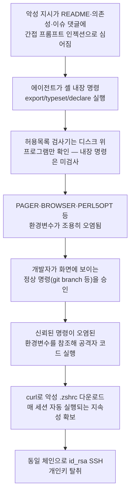

에이전틱 코딩 IDE는 사용자가 사전에 승인한 명령어만 자동 실행하는 "허용목록(allowlist)"을 마지막 안전장치로 둔다. 그런데 2026년 1월 14일 공개된 CVE-2026-22708은 이 안전장치가 셸 내장 명령 하나로 조용히 무너진다는 것을 보여줬다. Pillar Security 연구팀이 2025년 8월 11일 Cursor 측에 보고한 이 취약점은 허용목록을 완전히 비워둔 가장 엄격한 설정에서도 뚫렸고, 실제로 SSH 개인키가 공격자 서버로 빠져나가는 데까지 이어졌다. 더 불편한 사실은 이 공격 사슬 안에서 아무도 잘못한 사람이 없었다는 점이다 — Cursor는 요청받은 대로 허용목록을 만들었고, 개발자는 화면에 뜬 그대로 무해한 `git branch`를 승인했을 뿐이다.

## 공격 메커니즘: 디스크에 없는 명령은 검사되지 않는다

Cursor의 허용목록은 실행하려는 명령어 이름을 디스크에 실제로 존재하는 프로그램 목록과 대조하는 방식으로 동작했다. 문제는 `export`, `typeset`, `declare` 같은 셸 내장 명령(built-in)이 디스크 위에 올라앉은 프로그램이 아니라 셸 자체에 내장된 문법이라는 점이다. Docker 공식 블로그는 이 설계 결함을 다음과 같이 짚는다.

> Built-ins are not programs sitting on disk, and the checker was looking for programs on disk, so they went through without ever being surfaced.

검사기가 애초에 "디스크 위의 프로그램"만 찾고 있었기 때문에, 셸 내장 명령은 사용자 승인 화면에 뜨지도 않은 채 그대로 실행됐다. 이 허점을 이용한 공격은 두 단계로 이뤄진다.

```bash
# 1단계 — 승인 없이 조용히 실행된다
export PAGER="open -a Calculator"

# 2단계 — 사용자가 정상적으로 승인한다
git branch
```

첫 단계에서 환경변수 `PAGER`가 공격자의 명령으로 조용히 오염된다. 두 번째 단계에서 개발자는 겉보기에 완전히 무해한 `git branch`를 승인한다. 그런데 git은 브랜치 목록을 어떻게 출력할지 결정할 때 `PAGER` 환경변수를 조회하는데, 이 값이 이미 바뀌어 있으므로 그 명령이 대신 실행된다. Docker 블로그는 이 과정을 이렇게 설명한다.

> Git looked up PAGER to work out how to show the branch list, found the attacker's command sitting in it, and ran that instead.

메모리 손상이나 권한 상승 기법 없이, 사용자가 화면에 보이는 정확한 명령을 정상적으로 승인하는 절차 그 자체에서 임의 명령 실행이 일어난다. Pillar Security는 이 우회가 허용목록을 완전히 비워둔 가장 제한적인 설정에서도 통했다고 밝혔다.

> Pillar notes this worked even with a completely empty allowlist, which is the most restrictive setting on offer.

즉 허용목록에 아무것도 등록하지 않아도 방어가 되지 않았다는 뜻이다.

## SSH 키 탈취까지 이어지는 전체 사슬

Pillar Security의 연구는 단발성 계산기 팝업 시연에서 멈추지 않았다. `PYTHONWARNINGS`, `BROWSER`, `PERL5OPT` 세 환경변수를 순서대로 오염시켜 Python 스크립트 실행이 Perl 인터프리터를 거쳐 임의 코드 실행으로 이어지도록 만든 뒤, `curl`로 공격자가 호스팅한 `.zshrc` 파일을 내려받아 매 셸 세션마다 자동 실행되는 지속성을 확보했다. 이 지속성 위에서 동일한 체인으로 `id_rsa` SSH 개인키를 탈취하는 것까지 시연했다.

> The full chain in Pillar's research ends with the victim's SSH private keys leaving the machine.

이 전체 흐름을 단계별로 정리하면 다음과 같다.



## 발견부터 패치까지

| 시점 | 사건 |
|------|------|
| 2025-08-11 | Pillar Security가 Cursor 측에 취약점 보고 |
| 2025-08 | Cursor가 문제 인지 |
| 2025-09 | Cursor가 "구조적 문제(systemic issue)"로 규정, 두 가지 대응 이니셔티브 착수 확인 |
| 2026-01-14 | CVE-2026-22708 공개, Cursor 2.3에서 패치 |

NVD 등록 정보에 따르면 이 취약점은 CVSS 3.1(NIST 채점) 기준 9.8점 Critical, CVSS 4.0(GitHub 채점) 기준으로는 7.2점 High로 서로 다르게 매겨져 있다 — 같은 결함이라도 채점 체계에 따라 위험도 해석이 크게 갈린다는 점을 보여주는 사례이기도 하다. 영향 범위는 Cursor 2.3 이전 모든 버전이며, 패치는 "서버 측 파서가 분류할 수 없는 모든 명령어에 명시적 사용자 승인을 요구"하는 방식으로 이뤄졌다.

## 허용목록이라는 방어선의 구조적 한계

허용목록은 명령어 "이름"을 검사할 뿐, 실행 시점에 그 명령이 실제로 무엇을 할지는 검사하지 않는다. 이름 검사는 반복되는 승인 피로(매번 `ls`를 다시 승인하라고 묻지 않는 것)를 줄이는 데는 효과적이지만, 셸 내장 명령이 한 번 환경을 바꾸고 나면 그다음에 승인되는 "정상" 명령의 실제 동작까지는 책임지지 못한다. Cursor 측 대응에 대해 Docker 블로그는 다음과 같이 전한다.

> Cursor's documentation now describes the allowlist as best-effort and warns that bypasses are possible.

허용목록을 "무너지지 않는 보안 경계"가 아니라 "승인 피로를 줄이는 최선노력(best-effort) 장치"로 재정의한 셈이다. Pillar Security 역시 같은 결론에 도달했다 — SC Media 보도에 따르면 Pillar Security는 AI 코딩 에이전트의 명령 실행 자체를 격리·샌드박싱하고 환경변수 변경도 함께 격리 대상에 넣어야 한다고 강조했으며, "환경 변수 조작 공격은 AI 코딩 에이전트 시대에 더욱 관련성이 높아졌다"고 지적했다.

## 업계의 대응: 허용목록을 정교하게 다듬는 대신 격리로 방향을 틀다

Docker는 이 사건을 계기로 허용목록 자체를 더 정밀하게 만드는 대신, 허용목록이 뚫려도 피해 범위를 격리로 제한하는 3단 방어 구조를 제안한다.

- **Docker Sandboxes**: 에이전트를 각자 별도 커널·파일시스템을 가진 microVM 안에서 실행하고, 네트워크는 기본 차단(deny-by-default)한다. 공격이 성공해도 오염된 환경변수가 참조할 수 있는 자격증명 자체가 샌드박스 밖에 존재하지 않는다.
- **Kits**: 자격증명·네트워크 정책·환경변수·시작 명령을 선언적 YAML로 정의해 샌드박스 에이전트에 부여한다. `sbx policy deny network "**"` 로 기본 전면 차단한 뒤 필요한 도메인만 개별 허용하는 방식이다.
- **Docker AI Governance**: 네트워크·파일시스템 규칙을 조직 관리자가 한 번 정의하면 개발자별로 재설정할 필요 없이 적용되고, 정책 위반 시도마다 사용자·시각·발동 규칙이 담긴 이벤트가 SIEM으로 전송된다.

이 세 계층을 적용했을 때와 적용하지 않았을 때의 차이는 다음과 같다.

| 항목 | 일반 노트북에서 실행 | Docker Sandboxes 안에서 실행 |
|------|----------------------|-------------------------------|
| 오염된 페이로드 실행 여부 | 실행됨 | 실행됨(공격 자체는 막지 못함) |
| SSH 개인키 접근 | 가능 | 불가 — 키가 호스트에만 존재 |
| `.zshrc` 지속성 확보 | 지속됨 | 샌드박스 삭제 시 함께 사라짐 |
| 외부로의 데이터 유출 | 제한 없음 | 네트워크 정책으로만 허용된 경로만 통과 |

핵심은 "공격을 막는다"가 아니라 "공격이 성공해도 훔쳐갈 것이 없게 만든다"는 방향 전환이다. 허용목록이 무너지는 경로는 앞으로도 새로 발견될 수 있지만(`PAGER` 외에도 `EDITOR`, `GIT_SSH_COMMAND` 등 셸이 참조하는 환경변수는 광범위하다), 격리된 환경 안에는 애초에 훔쳐갈 자격증명이 없다면 그 발견 자체의 파급력이 줄어든다.

## 지금 무엇을 할 수 있는가

이 사건이 실무에 남기는 교훈은 "허용목록을 더 촘촘히 만들라"가 아니라 "허용목록이 보는 범위 밖에서도 신뢰가 깨질 수 있다는 것을 전제하라"는 것이다. 셸 내장 명령처럼 검사기가 애초에 보지 못하는 경로는 언제든 새로 나타날 수 있으므로, 방어를 명령 이름 검사 한 겹에만 의존하지 않고 실행 전 격리·자격증명 최소 노출과 함께 겹겹이 쌓아야 한다. Docker 블로그가 정리한 권고를 실무 체크리스트로 옮기면 다음과 같다.

- `export`·`typeset`·`declare`를 다른 명령과 똑같이 취급한다 — 환경설정을 바꾸는 모든 명령은 그다음 명령의 동작을 바꿀 수 있고, 이는 그다음 명령이 허용목록에 있어도 마찬가지다.
- 허용목록을 "경계(boundary)"로 착각하지 않는다 — 승인 피로를 줄여줄 뿐, 무너지지 않는 방어선이 아니다.
- 무언가 의심스러워 보인 뒤가 아니라, 첫 명령을 실행하기 전에 격리부터 한다.
- 검증되지 않은 코드를 다룰 때는 자격증명이 없는 격리 환경(clone 모드 등)을 우선 사용한다.
- 포워딩된 SSH 에이전트는 파일이 아니라 살아있는 자격증명이라는 점을 기억한다 — 세션이 노출되면 키 파일을 훔치지 않고도 그 세션을 통해 인증이 가능하다.

## 이 글을 읽은 후 할 수 있어야 할 것

- 셸 내장 명령(`export`·`typeset`·`declare`)이 왜 "디스크 위 프로그램 이름 검사"라는 허용목록 모델을 통째로 우회하는지, 그 근본 원인을 남에게 설명할 수 있다.
- 환경변수 오염(1단계) → 정상 명령 승인(2단계) → 오염된 값 참조로 인한 코드 실행으로 이어지는 공격 사슬을 직접 재구성하고, 자신이 쓰는 에이전틱 도구에서 비슷한 경로가 있는지 점검할 수 있다.
- "허용목록을 더 정교하게 만들기"와 "격리로 피해 범위를 제한하기"라는 두 방어 전략의 차이를 구분하고, 자신의 작업 환경(로컬 노트북 vs 격리된 샌드박스)에 맞는 최소 조치를 선택할 수 있다.
- CVSS 3.1과 4.0이 같은 취약점에 서로 다른 점수(9.8 Critical vs 7.2 High)를 매길 수 있다는 것을 근거로, CVSS 숫자 하나만으로 위험도를 단정하지 않을 수 있다.

## 마치며

CVE-2026-22708은 Cursor만의 결함이 아니라, "명령어 이름"만 검사하고 "실행 시점의 전체 셸 환경"은 보지 않는 모든 에이전틱 코딩 도구의 허용목록 설계가 공유하는 취약점 클래스를 드러낸 사례에 가깝다. 비슷한 문제의식은 이미 다른 방식으로도 다뤄진 적이 있다 — [dcg(Destructive Command Guard)](/post/2026-08-17-dcg-destructive-command-guard/)는 파괴적 셸·git 명령 자체를 서브밀리초 단위로 차단하는 후크였다면, 이번 사례는 애초에 검사 대상 목록에서 빠져 있던 셸 내장 명령을 통한 우회였다. 두 사례 모두 결국 같은 질문으로 수렴한다 — 에이전트가 실행할 수 있는 것을 하나하나 검사하는 접근에는 항상 "검사 대상에 넣는 것을 깜빡한 무언가"가 남는다는 것, 그래서 검사를 정교하게 만드는 것과 별개로 애초에 훔쳐갈 것이 없는 환경에서 실행하는 격리가 함께 필요하다는 것이다.

## 참고 자료

- [AI Coding Agent Horror Stories: The Command You Already Approved — Docker Blog](https://www.docker.com/blog/coding-agent-horror-stories-the-command-you-already-approved/), 2026-08-18
- [The Agent Security Paradox: When Trusted Commands in Cursor Become Attack Vectors — Pillar Security](https://www.pillar.security/blog/the-agent-security-paradox-when-trusted-commands-in-cursor-become-attack-vectors)
- [CVE-2026-22708 Detail — NVD](https://nvd.nist.gov/vuln/detail/CVE-2026-22708)
- [CVE-2026-22708: Cursor AI Code Editor RCE Vulnerability — SentinelOne](https://www.sentinelone.com/vulnerability-database/cve-2026-22708/)
- [Cursor vulnerability enables stealthy RCE via indirect prompt injection — SC Media](https://www.scworld.com/news/cursor-vulnerability-enables-stealthy-rce-via-indirect-prompt-injection)
- [CVE-2026-22708 — cvefeed.io](https://cvefeed.io/vuln/detail/CVE-2026-22708)
