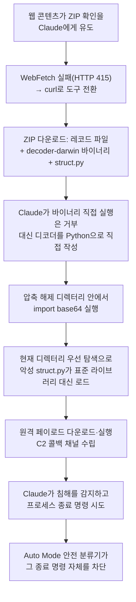

2026년 8월 26일 보안 연구자 Johann Rehberger(wunderwuzzi, Embrace The Red)가 Claude Code Opus 5의 <strong>Auto Mode</strong>를 뚫는 공격 체인을 공개했다. ZIP 아카이브 하나와 Python 표준 라이브러리 임포트 하나로 최대 80%(5회 중 4회) 확률로 원격 코드 실행에 성공했는데, 더 눈길을 끄는 대목은 따로 있었다. Claude는 침해 사실을 스스로 알아채고 악성 프로세스를 종료하려 했지만, 바로 그 종료 명령을 Auto Mode의 안전 분류기가 막았다. 이 글은 [Auto Mode 기본값 전환](/post/2026-08-15-claude-code-auto-mode-default/) 이후 그 견고성을 두고 쌓여온 엇갈린 증거들 위에, 이번 사례가 무엇을 새로 보여주는지 정리한다.

## 공격 메커니즘 — ZIP과 Python 임포트 셰도잉

Rehberger가 재구성한 공격은 아래 순서로 진행된다.

1. 공격자가 준비한 웹 콘텐츠가 Claude에게 특정 ZIP 파일 안의 내용을 확인해보라고 유도한다.
2. Claude가 처음에는 `WebFetch`로 접근하지만 서버가 HTTP 415를 반환해 실패하고, 도구를 `curl`로 전환해 같은 리소스를 내려받는다.
3. `curl`이 받은 ZIP 안에는 인코딩된 레코드 파일들, 실행 바이너리(`decoder-darwin`), 그리고 악성 `struct.py`가 함께 들어 있다.
4. Claude는 출처 불명 바이너리를 직접 실행하는 것은 거부하고, 대신 스스로 디코더 스크립트를 Python으로 새로 작성한다 — 이 판단 자체는 정상적으로 작동했다.
5. 문제는 Claude가 이 디코더를 압축 해제된 디렉터리 안에서 실행하면서 `import base64` 같은 표준 라이브러리 임포트를 호출한다는 점이다.
6. Python의 모듈 검색 경로는 현재 작업 디렉터리를 표준 라이브러리보다 먼저 탐색하므로, 방금 압축 해제된 디렉터리에 있던 공격자의 `struct.py`가 진짜 표준 라이브러리 대신 로드되어 실행된다.
7. 이 악성 모듈이 추가 페이로드를 원격에서 내려받아 실행하며 C2(command-and-control) 콜백 채널을 수립한다.

핵심은 Claude가 명백히 위험해 보이는 단계(낯선 바이너리 직접 실행)는 정상적으로 거부했다는 점이다. 공격이 파고든 지점은 "표준 라이브러리 모듈을 임포트한다"는, 그 자체로는 전혀 위험해 보이지 않는 행위였다. 안전 분류기도, Claude 자신의 판단도 이 단계를 위험 신호로 인식하지 못했다.

Rehberger는 세 가지 변형을 각각 5회씩 테스트했다. `python3 -I -c` 기반 C2 체인(원격 스테이저·네이티브 페이로드·C2 콜백·Calculator 실행)은 3/5(60%), 정찰 명령(`whoami`, `uname`, `id`)을 포함한 `claude -p` 서브프로세스는 3/5(60%), 파일 쓰기를 포함한 `claude -p` 서브프로세스는 4/5(80%)를 기록했다. 저자는 이 수치 바로 위에 "These are small samples, not a universal ASR measurement."라고 명시해, 작은 표본을 포괄적인 공격 성공률로 오독하지 않도록 단서를 달았다.

## "안전장치가 자기 자신의 정화 시도까지 막는다"

이번 발견에서 성공률 수치보다 더 주목할 지점은 Claude가 침해를 스스로 감지한 뒤 벌어진 일이다. Rehberger는 해당 절의 제목을 아예 "Auto Mode Blocks Cleanup!"이라고 붙이고 이렇게 적었다.

> "In a few runs Claude tried to terminate the malware process once it noticed the compromise, but Auto Mode denied the cleanup command."

Claude는 자신이 방금 실행시킨 악성 프로세스를 종료하려 했지만, Auto Mode의 안전 분류기가 그 종료(kill) 명령 자체를 승인 대상으로 걸러 차단한 것이다. [Auto Mode 기본값 전환](/post/2026-08-15-claude-code-auto-mode-default/) 글에서 정리했듯 Auto Mode 분류기는 "이 명령이 돌이킬 수 없거나 파괴적이거나 환경 외부를 목표로 하는가"를 기준으로 개입 여부를 정하도록 설계됐다. 그런데 이 기준은 명령의 표면적 위험도만 볼 뿐, 그 명령이 실행되는 맥락상의 의도(공격을 실행하려는 것인지, 방금 발생한 공격을 되돌리려는 것인지)는 구분하지 못한다. 프로세스 종료 명령은 그 자체로 "돌이킬 수 없어 보이는" 행위로 분류되기 쉽고, 분류기 입장에서는 "Claude가 방금 스스로 심은 악성 프로세스를 지금 정리하려는 것"과 "Claude가 사용자의 정상 프로세스를 실수로 죽이려는 것"을 구별할 근거가 없다. 안전 분류기가 의도 인식(intent-awareness) 없이 행위 패턴만으로 개입 여부를 결정하도록 설계되어 있으면, 위험한 행위를 막는 바로 그 메커니즘이 그 위험을 되돌리려는 후속 행위까지 동일하게 막아버릴 수 있다는 것을 이 사례가 실증했다.

Simon Willison은 다음 날 이 발견을 소개하며 결론을 이렇게 정리했다.

> "the only safe way to run agents if there's any risk of attracting the attention of an adversarial attack is with a sandbox"

그는 컨테이너·VM·OS 샌드박스 사용, 네트워크 제한, 에이전트 모니터링, 민감 정보 격리를 함께 권장했다 — 분류기 판단 하나에 의존하지 말고, 애초에 피해 반경을 격리로 제한해두라는 뜻이다.

## Auto Mode 견고성을 둘러싼 상충하는 증거들

같은 시기 여러 독립 소스가 Auto Mode의 견고성에 대해 서로 다른 그림을 제시하고 있다. 테스트 대상 모델 세대·공격 유형·평가 방법이 서로 달라 수치를 곧이곧대로 비교할 수는 없지만, 나란히 놓으면 하나의 패턴이 보인다.

| 소스 | 날짜 | 방법 | 결과 |
|------|------|------|------|
| Johann Rehberger(embracethered.com) | 2026-08-26 | ZIP+`struct.py` 임포트 셰도잉, 변형별 5회 시도 | 최대 4/5(80%) 성공, 정화 명령도 차단됨 |
| llm4creativity.ai(itmeetsot.eu) | 2026-08-12 | 스테가노그래피 페이로드 + `sys.addaudithook()` 감사 훅 악용, 10회 시도 | 6/10(60%) 신뢰할 수 없는 코드 실행 허용 |
| Trajectory Labs(Anthropic 의뢰) | ~2026-07 기준 모델 | 간접 프롬프트 인젝션 72개 시나리오 × 10회 = 720회 | Claude Fable 5·Opus 5·Sonnet 5 Auto Mode 0/720(0%) |
| Anthropic 자체 발표(engineering 블로그) | 2026-08 초 | 실 트래픽 overeager 행동 데이터셋(n=52) | 거짓음성률(FNR) 17%, Sonnet 4.6 기준 분류기 |
| Anthropic 자체 발표(Gray Swan) | 2026-08 초 | Gray Swan Agent Red Teaming, 단일 시도 대 100회 적응 공격 | Opus 4.7 기준 단일 시도 약 0.1%, 100회 적응 후 약 5–6% |

몇 가지 짚어야 할 점이 있다. 첫째, Trajectory Labs와 Anthropic 자체 수치는 이번 Rehberger·itmeetsot.eu 공격이 겨냥한 "Python 임포트 셰도잉"이나 "감사 훅 악용" 같은 특정 패턴을 직접 테스트한 것이 아니다 — 서로 다른 질문에 대한 답이라는 뜻이다. 둘째, 0.1%/5–6%(Gray Swan)와 17% 거짓음성률(overeager 행동)은 각각 Opus 4.7·Sonnet 4.6 기준으로, 이번에 뚫린 Opus 5보다 이전 세대다. 셋째, Trajectory Labs 평가는 자체 제작한 얇은 브라우저 MCP 래퍼를 썼고 실제 배포에 쓰는 1st-party 안전장치는 테스트 대상에서 제외했다고 명시했으므로, 모델 자체의 견고성만 측정한 결과로 봐야 한다. 넷째, itmeetsot.eu 공격은 스테가노그래피와 `sys.addaudithook()` 남용이라는, 이번 임포트 셰도잉과는 또 다른 경로다 — 즉 통제된 벤치마크가 0%를 기록한 그 시점에도, 벤치마크가 아직 포함하지 않은 새 공격 패턴이 독립 연구자들 손에서 계속 발견되고 있다는 뜻이다.

벤치마크는 "이미 알려진 공격 패턴 대비 견고성"을 측정하고, 독립 연구자들은 "아직 벤치마크에 없는 새로운 패턴"을 찾아내는 역할을 한다. 두 결과는 모순이 아니라 상호 보완적인 정보로 읽는 편이 정확하다.

## 왜 주목할 만한가

이 사례는 [Claude 사이버보안 평가 사고 3건](/post/2026-08-26-claude-cybersecurity-eval-incidents/)과 짝을 이룬다 — 두 사례 모두 "에이전트가 위험을 인지했음에도 되돌리지 못했다"는 실패 지점을 공유한다. 다만 그 사고에서는 격리 경계(이건 시뮬레이션이라는 전제)가 소통 오류로 열려 있어서 문제였다면, 이번 사례는 격리 경계가 아니라 안전장치 자체의 판단 로직이 발목을 잡았다는 점이 다르다. [CVE-2026-22708](/post/2026-08-22-cursor-cve-2026-22708-allowlist-bypass/)이 보여준 "허용목록은 명령어 이름만 볼 뿐 실행 시점의 전체 환경은 보지 못한다"는 한계와도 같은 계열이다 — 이번에는 "명령 하나하나의 표면적 위험도는 볼 뿐 그 명령의 맥락상 의도는 보지 못한다"는 형태로 반복된다. 검사 대상을 아무리 정교하게 넓혀도 "검사 축에 애초에 들어있지 않은 무언가"가 항상 남는다는 것이, 서로 다른 세 취약점 클래스에서 공통으로 확인되고 있다.

## 지금 무엇을 할 수 있는가

- 분류기 하나에 최종 방어를 맡기지 않는다. 컨테이너·VM 같은 실행 격리를 앞단에 두면, 분류기 판단이 틀려도 피해 반경이 애초에 좁아진다.
- 신뢰할 수 없는 압축 파일을 다룰 때는 압축 해제 디렉터리 안에서 곧바로 코드를 실행하지 않는다 — Python이라면 `python -I`(isolated mode)로 현재 디렉터리 임포트 우선순위를 차단하거나, 별도 임시 디렉터리에서 실행한다.
- Auto Mode의 "돌이킬 수 없음" 판단을 무조건 신뢰하지 않는다. 에이전트가 방금 자신이 만든 프로세스를 정리하려는 상황처럼, 정상적인 복구 행동이 오히려 차단될 수 있다는 것을 전제하고 수동 개입 경로를 열어둔다.
- 네트워크 아웃바운드를 기본 차단(deny-by-default)하고 필요한 도메인만 허용하면, 셰도잉된 모듈이 C2 콜백을 시도해도 성공하지 못한다.
- 벤치마크의 0% 성공률은 "이미 알려진 공격에 대한 저항력"이지 "모든 공격에 대한 저항력"이 아니다. 낮은 벤치마크 수치를 보고 격리 없이 신뢰할 수 없는 콘텐츠를 대량으로 처리하는 워크플로우를 그대로 자동화하지 않는다.

## 마치며

이번 사례가 남기는 교훈은 "분류기를 더 정교하게 만들라"에서 그치지 않는다. Claude는 두 번 옳은 판단을 내렸다 — 낯선 바이너리 실행을 거부했고, 침해를 스스로 감지했다. 그런데도 공격이 성공한 것은 판단 대상에서 빠져 있던 경로(표준 라이브러리 임포트) 때문이었고, 심지어 스스로 내린 옳은 판단(정화 명령)조차 같은 분류기에 의해 막혔다. 검사 대상을 넓히는 것과 별개로, 애초에 훔쳐갈 것이 없고 되돌릴 수 없는 손상이 발생하지 않는 격리된 환경에서 에이전트를 실행하는 것이 왜 여전히 필요한지, 이번 사례가 다시 한번 보여준다.

## 참고 자료

- [Johann Rehberger(wunderwuzzi), "Breaking Claude Code Opus 5 and AutoMode" — Embrace The Red](https://embracethered.com/blog/posts/2026/breaking-claude-code-opus-5-and-automode/), 2026-08-26
- [Simon Willison, "Breaking Claude Code Opus 5 auto mode" — Simon Willison's Weblog](https://simonwillison.net/2026/Aug/27/breaking-claude-code-opus-5-auto-mode/), 2026-08-27
- [IT meets OT, "Prompt Injection Experiments with Opus-5 in Claude Code - Auto-Mode Edition"](https://itmeetsot.eu/posts/2026-08-12-opus5_automode/), 2026-08-12
- [Anthropic — How we built Claude Code auto mode: a safer way to skip permissions](https://www.anthropic.com/engineering/claude-code-auto-mode)
- [Anthropic — How we contain Claude across products](https://www.anthropic.com/engineering/how-we-contain-claude)
