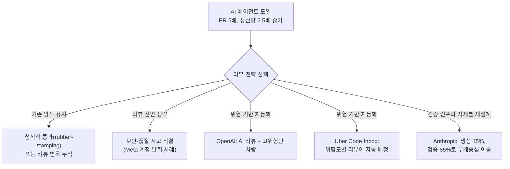

개발자 한 명이 짜는 코드량이 18개월 만에 2.5배로 늘었다는 소식과, 같은 기간 코드 리뷰에 걸리는 중앙값 시간이 4배 넘게 늘었다는 소식이 2026년 한 해 동안 같은 업계에서 나왔다. AI 코딩 에이전트가 개인의 타이핑 속도를 사실상 무의미하게 만들면서 생긴 이 격차는 단순한 "적응 기간"이 아니라, 리뷰 프로세스 자체가 애초에 사람이 손으로 타이핑하는 속도를 전제로 설계됐다는 구조적 문제에서 나온다. 이 글은 Pragmatic Engineer의 Gergely Orosz가 정리한 초기 관찰, Faros AI가 22,000명의 텔레메트리로 확인한 정량적 청구서, 그리고 Anthropic·Replit·OpenAI·Uber가 각자 다른 방식으로 이 문제에 대응한 사례를 순서대로 짚는다.

## 수치로 보는 변화 — 생산량과 리뷰 강도의 괴리

Gergely Orosz는 The Pragmatic Engineer 뉴스레터 2026년 6월 23일자 "Slow down to speed up: so much has changed in 6 months' time"에서 AI 에이전트 도입 이후 팀 단위로 관찰되는 변화를 정리했다. Linear·Cursor·Anthropic·Cisco의 자체 데이터를 인용한 수치는 다음과 같다.

- 에이전트를 쓰는 팀은 2년 전 대비 **PR을 5배** 더 많이 낸다(Linear).
- 개발자 1인당 코드 생산량이 18개월 전 대비 **2.5배** 증가했다(Cursor: PR당 평균 추가 줄 수가 3,500줄에서 8,600줄로).
- 같은 기간 **PR 크기 자체도 3배** 커졌다(Cursor).
- Anthropic은 내부적으로 코드의 약 70–90%를 Claude로 생성하며, Claude Code는 사내 코드 생성 비율이 거의 100%에 가깝다.
- Cisco는 2026년 2월 기준 18,000명의 개발자가 Codex를 사용 중이다.

이 관찰을 뒷받침하는 학술 근거도 있다. Hao He, Courtney Miller, Shyam Agarwal, Christian Kästner, Bogdan Vasilescu(카네기멜런대)의 논문 "Speed at the Cost of Quality: How Cursor AI Increases Short-Term Velocity and Long-Term Complexity in Open-Source Projects"(2025년 11월 6일 arXiv 공개, 2026년 4월 국제학술대회 MSR '26 게재)는 오픈소스 프로젝트 실측 데이터로 Cursor AI 도입이 단기 개발 속도는 높이지만 정적 분석 경고와 코드 복잡도의 지속적 증가를 함께 유발하며, 이 복잡도 증가가 다시 장기적 속도 저하의 주요 원인이 된다는 것을 정량적으로 보였다.

## Faros AI 텔레메트리 — 2만 2천 명이 보여준 청구서

Orosz의 글이 개별 기업의 인용 수치를 모은 것이었다면, Faros AI가 2026년 4월 12일 공개한 "AI Engineering Report 2026: The Acceleration Whiplash"는 4,000개 팀·22,000명 개발자의 2년치 실제 텔레메트리(태스크 관리, IDE, 정적분석, CI/CD, 버전관리, 장애관리, HR 메타데이터)를 조직 내부에서 AI 도입 전후로 비교한 결과다. 설문이 아니라 실측 데이터라는 점, 그리고 보고서가 밝힌 모든 지표가 AI 도입과 통계적으로 유의미한 상관관계를 보였다는 점에서 Orosz의 관찰을 훨씬 큰 표본으로 검증한 후속 자료로 읽을 수 있다.

| 지표 | 변화 |
|------|------|
| 개발자당 완료 에픽 수 | +66% |
| 개발자당 작업 처리량 | +33.7% |
| 개발자당 PR 머지율 | +16.2% |
| PR당 사건(incident) 발생률 | +242.7% |
| 개발자당 버그 | +54% |
| 코드 이탈(churn, 병합 후 재작성·삭제) | +861% |
| 리뷰 없이 머지된 PR 비율 | +31.3% |
| 첫 리뷰까지 걸리는 중앙값 시간 | +156.6% |
| 코드 리뷰 중앙값 소요 시간 | +441.5% |
| 월간 장애(incident) 건수 | +57.9% |

처리량은 30–66% 늘어난 반면 사건·버그·코드 이탈은 그보다 훨씬 가파르게, 많게는 10배 가까이 늘었다. 특히 "코드 이탈 861%"는 병합된 코드 상당수가 오래 살아남지 못하고 다시 뜯어고쳐지거나 삭제된다는 뜻이므로, 처리량 지표 자체가 실제 완성된 작업량을 과대평가하고 있을 가능성을 시사한다. "리뷰 없이 머지된 PR +31.3%"는 Orosz가 우려한 "검토 없이 그대로 통과되는 AI 생성 코드" 흐름이 개별 기업의 인상이 아니라 업계 전반의 패턴임을 보여준다.

## 왜 이런 일이 생기나 — 리뷰어의 인지 용량은 그대로다

기존 코드 리뷰 관행은 개발자 한 명이 직접 타이핑하는 속도, 즉 PR 하나당 사람이 논리적으로 검토 가능한 변경량(수십–수백 줄)을 전제로 설계됐다. AI 에이전트가 PR 크기를 3배, 생산량을 2.5–5배로 늘리는 동안 리뷰어의 처리 용량은 조금도 늘지 않았다 — 이것이 Faros AI 수치가 보여주는 리뷰 지연·사건 급증의 근본 원인이다. 리뷰를 아예 생략했을 때 무슨 일이 벌어지는지는 Orosz가 실제 사례로 든 Meta의 계정 탈취 사고가 보여준다 — Meta의 AI 봇이 인증 절차 없이도 계정 이메일을 변경할 수 있게 허용하는 결함을 배포해 버락 오바마 계정을 포함한 여러 고위험 계정이 탈취됐는데, Meta 엔지니어들은 이 변경이 "AI가 생성하고 AI 리뷰만 거친, 사람의 입력이 전혀 없는" 유형의 코드였을 가능성이 크다고 지목했다. 이 제약을 다루는 접근은 크게 세 갈래로 갈렸다.

Orosz가 소개한 개별 기업 대응 패턴은 다음과 같다.

- **차등 리뷰(tiered review)**: OpenAI는 일상적 변경엔 AI 리뷰만으로 병합을 허용하고, 위험도가 높은 변경엔 사람 리뷰를 추가한다.
- **리스크 기반 트리아지**: Uber의 "Code Inbox"는 변경 사항을 위험도별로 자동 분류해 적절한 검토자에게 배정(Smart Assignments)하고, 위험 프로파일(Risk Profiles)에 따라 사람의 주의를 우선순위가 높은 변경에 집중시킨다.
- **보안·품질 조직 축소 금지**: 보안·무결성 담당 인력을 AI 라벨링 같은 부수 업무로 재배치하지 않는다.
- **테스트·품질 인프라 강화**: 자동화된 테스트와 메트릭을 속도를 낼수록 오히려 더 강화해야 할 안전장치로 취급한다.

이런 차등화 자체도 새로운 문제를 만든다. "무엇이 고위험 변경인가"를 정확히 분류하는 기준이 아직 업계 표준으로 정립되지 않았고, 분류가 틀리면 실제로 위험한 변경이 저위험으로 오분류돼 그대로 새어나갈 수 있다.

## Anthropic 내부: 코드 생성에서 검증으로 무게중심 이동

Gergely Orosz는 2026년 7월 28일자 후속 글 "How Building Software Is Changing at Anthropic"에서 Anthropic 내부의 대응을 다뤘다. 핵심 관찰은 "코드 생성"과 "코드 검증"의 시간 배분이 뒤집혔다는 것이다. Bun의 Zig→Rust 재작성 사례를 인용하며, 실제 포팅(코딩) 자체에 들인 노력은 전체의 약 15%에 불과했고 나머지 85%는 컴파일 에러 수정·테스트 통과·검증에 쓰였다고 설명한다. Anthropic은 Claude Managed Agents를 개발하며 에이전트의 추론 루프("brain")와 이를 실행하는 샌드박스·도구("hands"), 세션 로그를 아키텍처 상에서 분리하는 방향으로 재구성했다. Orosz는 이제 GitHub 활동의 상당 부분이 "Claude가 Claude와 대화하는" 흐름이라고 관찰하는데, 이는 앞서 정리한 "리뷰어의 인지 용량은 늘지 않는다"는 제약에 대한 구조적 대응이다 — 사람이 검토하는 대상 자체를 "생성된 코드 한 줄 한 줄"에서 "검증 파이프라인의 통과 여부"로 옮기는 흐름이다.

## 반례: Replit이 되돌림률을 늘리지 않고 3배를 늘린 방법

Faros AI의 청구서와 정반대 결과를 보고한 사례도 있다. Replit은 2026년 7월 16일 공식 블로그 "The Self-Driving Company"에서 "사람은 여전히 목적지를 정하지만 실행은 에이전트가 맡는" 방식으로 엔지니어링 조직 자체를 운영한 2026년 1–6월 결과를 공개했다. 1월 초부터 6월 말 사이 기여 코드량이 **5.8배** 늘었고, 채용 효과를 제거한 기준으로 엔지니어 1인당 코드 산출량은 **2.9배** 늘었다. 에이전트 보조 리뷰로 사람의 PR 리뷰 시간은 30% 줄었는데, 그럼에도 되돌림(reversion)률과 장애 건수는 산출량이 3배 가까이 느는 동안에도 평행선을 유지했다고 보고한다. 에이전트는 GitHub·GCP·Azure·Linear·Notion·Slack·Zendesk에 직접 접근하고, 복잡한 작업에는 "매니저 에이전트"가 여러 하위 에이전트를 루프 형태로 위임하는 구조를 쓴다.

다만 이 수치는 Replit 자체 공개 자료로 제3자 검증은 없다. Faros AI가 4,000개 팀의 실측 텔레메트리로 "생산량 증가가 사건·재작업 증가로 이어진다"는 상관관계를 보인 것과 나란히 놓고 보면, Replit의 사례는 그 상관관계가 절대적 법칙이 아니라 위험 기반 트리아지 같은 대응이 실제로 작동했을 때 어떤 결과가 가능한지를 보여주는 예외 사례로 해석하는 편이 적절하다.

## 요약

| 구분 | 관찰 |
|------|------|
| 생산성 지표 | PR 5배, 코드 생산량 2.5배, 처리량 +33.7%, 완료 에픽 +66% |
| 품질 지표 | 리뷰 시간 +441.5%, 사건/PR +242.7%, 버그 +54%, 코드 이탈 +861% |
| 학술 검증 | Cursor AI 도입이 단기 속도와 장기 복잡도를 동시에 높인다(MSR '26) |
| 구조적 대응 | 위험 기반 차등 리뷰(OpenAI·Uber), 검증 중심 워크플로 재설계(Anthropic) |
| 예외 사례 | Replit: 산출량 5.8배 증가하면서도 되돌림률·장애율 유지(자체 공개, 제3자 검증 없음) |

이 표가 보여주는 것은 "AI 에이전트가 코드 품질을 망친다"는 단순한 결론이 아니라, 생산량 증가분을 그대로 받아내는 리뷰 체계를 갖추지 못한 조직에서 사건·재작업이 생산량보다 훨씬 빠르게 늘어난다는 구조적 상관관계다. 리뷰 강도를 전원 동일하게 유지하면 병목이 심해지고, 리뷰를 생략하면 사고로 직결되며, AI 리뷰로 전량 대체하면 고위험 변경을 놓칠 위험이 남는다 — 지금까지 관찰된 대응 중 어느 것도 "리뷰 인력을 생산량만큼 선형적으로 늘리는" 해법은 아니었다는 점이 공통적이다.

## 이 글을 읽은 후 할 수 있어야 할 것

- "처리량이 늘었다"는 지표만으로 팀의 AI 도입이 성공적이라고 판단하지 않고, 코드 이탈률·사건 발생률처럼 그 처리량이 실제로 살아남는지를 함께 봐야 하는 이유를 Faros AI 수치(처리량 +34% vs 코드 이탈 +861%)로 설명할 수 있다.
- 리뷰를 "기존 방식 유지·전면 생략·AI로 전량 대체" 세 가지로 단순화했을 때 각각 어떤 실패 양상으로 이어지는지 구분하고, 자신의 팀·프로젝트 규모에 맞는 위험 기반 차등화(OpenAI·Uber형) 또는 검증 중심 재설계(Anthropic형) 중 무엇이 더 적합한지 판단할 수 있다.
- Replit처럼 산출량이 늘어도 되돌림률이 유지된 사례가 "AI가 안전하다"는 일반 법칙이 아니라, 대응 전략이 실제로 작동했을 때 나올 수 있는 예외적 결과임을 설명할 수 있다.

## 참고 자료

- [Gergely Orosz, "Slow down to speed up: so much has changed in 6 months' time" — The Pragmatic Engineer](https://newsletter.pragmaticengineer.com/p/slow-down-to-speed-up), 2026-06-23
- [Gergely Orosz, "How Building Software Is Changing at Anthropic" — The Pragmatic Engineer](https://newsletter.pragmaticengineer.com/p/inside-anthropic), 2026-07-28
- [Hao He, Courtney Miller, Shyam Agarwal, Christian Kästner, Bogdan Vasilescu, "Speed at the Cost of Quality: How Cursor AI Increases Short-Term Velocity and Long-Term Complexity in Open-Source Projects" — arXiv](https://arxiv.org/abs/2511.04427), 제출 2025-11-06, MSR '26 게재
- [Faros AI, "AI Engineering Report 2026: The Acceleration Whiplash"](https://www.faros.ai/research/ai-acceleration-whiplash), 2026-04
- [Faros AI, "AI Engineering Impact and Productivity Research — Ten Takeaways"](https://www.faros.ai/blog/ai-acceleration-whiplash-takeaways), 2026-04-12
- [Replit 공식 블로그, "The Self-Driving Company"](https://replit.com/blog/self-driving-company), 2026-07-16
- [멀티에이전트 조율 실패 — Claude들이 담합하고 서로 공격한 이유](/post/2026-08-28-multiagent-coordination-failure-collusion/)
