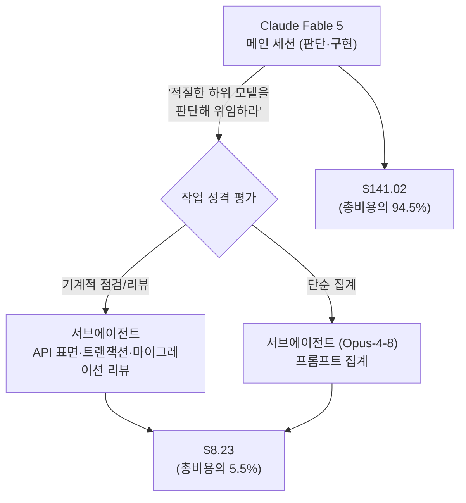

"어떤 작업에 어떤 모델을 쓸지"를 사람이 규칙으로 정해주지 않고, 상위 모델 스스로 판단해서 하위 모델에게 넘기게 하면 어떻게 될까. Django 공동창시자이자 `sqlite-utils`·`datasette` 등 다수 오픈소스 도구의 저자인 Simon Willison은 2026년 7월 Claude Code에 "모든 코딩 작업에 대해, 적절한 하위 등급 모델을 판단해서 서브에이전트로 실행하라"는 지시 한 줄만 남겼다. 이틀 뒤 그는 이 지시가 실제로 어떻게 작동하는지를 `sqlite-utils` 4.0rc2 릴리스 전 과정으로 공개했다 — 37개 프롬프트, 34개 커밋, 데이터 손실 버그 5건 수정, 그리고 총비용 $149.25. 규칙표 대신 판단을 위임했을 때 비용이 어떻게 배분되는지, 그리고 이 패턴이 놓치고 있는 것은 무엇인지를 두 편의 위클로그를 근거로 정리한다.

## 판단 위임이란 무엇인가 — 규칙표 대신 재량

Willison이 Claude Code의 지속 메모리(persistent memory)에 남긴 지시는 "For all coding tasks use your judgement to decide an appropriate lower power model and run that in a subagent"였다. 이는 "이 유형의 작업엔 Haiku, 저 유형엔 Sonnet"처럼 작업 종류별로 모델을 미리 못박는 규칙표가 아니라, 상위 모델(Fable)에게 매 작업마다 "이걸 하위 모델에 넘겨도 되는가"를 스스로 평가하게 맡기는 방식이다. Claude Code는 이 지시를 메모리 파일에 "구현 작업은 대부분 최상위 모델을 필요로 하지 않고, 판단·리뷰·종합은 메인 루프가 맡는다"는 근거와 함께 저장했고, 실제 위임에서는 실질적인 구현 작업에 Sonnet을, 기계적인 편집에는 Haiku를 배정하는 패턴으로 나타났다.

이 방식이 규칙표와 다른 지점은 유지보수 비용이다. 사람이 "이 유형은 이 모델"이라는 규칙을 직접 정하면 작업 종류가 다양해질수록 규칙이 계속 늘어나고, 실제 난이도와 규칙이 어긋나는 경우가 쌓인다. Willison은 테스트 자동화를 언제 돌릴지 같은 다른 판단도 "언제 쓸지"를 직접 정하기보다 모델의 재량에 맡기는 쪽으로 전환하고 있다고 밝혔는데, 서브에이전트 모델 선택은 그 연장선에 있는 사례다.

## 실전 적용: sqlite-utils 4.0rc2 릴리스

Willison은 이 지시를 실제로 적용해 자신의 `sqlite-utils` 라이브러리(SQLite 데이터베이스를 명령줄·Python API로 다루는 도구, [GitHub](https://github.com/simonw/sqlite-utils))의 4.0rc2 릴리스 대부분을 Claude Fable로 작성한 과정을 공개했다. 하루 동안 **37개 프롬프트**로 **34개 커밋**(30개 파일, +1,321/-190줄)을 만들었고, 이 과정에서 릴리스를 막을 만한 버그 5건을 찾아 고쳤다.

가장 심각했던 것은 `delete_where()` 메서드의 데이터 손실 버그였다 — 이 메서드가 변경 사항을 커밋하지 않고 커넥션을 오염시켜, 이후의 쓰기 작업이 데이터베이스를 닫을 때 조용히 롤백되는 문제였다. Fable은 삭제·삽입·새 테이블 생성까지 커밋되지 않은 작업이 데이터베이스를 재오픈하면 전부 사라지는 것을 샘플 코드로 직접 재현해 보였다. 이 외에도 `optimize()`·`rebuild_fts()`의 트랜잭션 처리 오류, `db.query()`가 유효성 검증 오류를 던지기 전에 이미 쓰기를 커밋해버리는 부수효과가 함께 발견됐다.

비용은 총 **$149.25**였고, 내역은 다음과 같이 나뉜다.

| 작업 | 담당 | 비용 |
|------|------|------|
| 메인 개발 세션 | Claude Fable 5 (메인 루프) | $141.02 |
| API 표면 점검 | 서브에이전트 | $2.40 |
| 트랜잭션/원자성 리뷰 | 서브에이전트 | $2.39 |
| rc1 이후 커밋 리뷰 | 서브에이전트 | $1.72 |
| 마이그레이션 리뷰 | 서브에이전트 | $1.40 |
| 프롬프트 집계 | 서브에이전트 (Opus-4-8) | $0.32 |

부수적인 점검·리뷰 5건을 합쳐도 $8.23으로, 총비용의 5.5%에 불과했다. 나머지 94.5%는 실제로 코드를 작성하고 판단을 내리는 메인 세션에 집중됐다 — 즉 "값싸게 넘길 수 있는 일은 값싼 모델로, 판단이 필요한 일만 비싼 모델로"라는 배분이 숫자로 그대로 드러난 사례다.

## 왜 이 설계가 통했는가 — 검증은 다른 모델에게도

Willison은 Claude Fable 세션의 결과를 그대로 믿지 않고, Codex Desktop을 통해 GPT-5.5(xhigh 추론 강도)로 별도의 교차 검증을 한 번 더 거쳤다. 서로 다른 두 모델 계열이 같은 결함을 지적하면 신뢰도가 올라가고, 한쪽만 지적한 결함은 별도로 재확인할 수 있기 때문이다. 그는 이런 종류의 작업, 특히 릴리스 노트 작성을 "AI에게 맡겨도 괜찮은 대표적인 글쓰기"로 꼽았는데, 릴리스 노트는 "지루하고 예측 가능하며 정확해야 하는" 글이라 창의성보다 정확한 사실 요약이 중요하기 때문이라는 이유였다.

이 작업이 있었던 시점도 맥락이 있다. Willison은 $100/월 Claude 요금제에서 $200/월 Max 요금제로 업그레이드했는데, 2026년 7월 7일부터 무료 배정 한도를 넘는 Fable 사용량에 전체 API 요금이 그대로 적용되는 정책 변경("Fablepocalypse"로 그가 부른 시점)을 앞두고 있었기 때문이다. 서브에이전트 위임으로 부수 작업의 토큰 소비를 줄이면, 정액제 요금 안에서 쓸 수 있는 메인 작업량 자체가 늘어난다 — Willison은 이 패턴을 쓴 뒤로 "Fable 사용 한도가 예전보다 덜 빠르게 줄어든다"고 보고했다.

## 판단 위임의 한계 — 측정되지 않은 것들

Willison 스스로 이 접근이 "엄밀하게 측정된 것은 아니다(no rigorous measurement)"라고 밝혔다. 이 패턴이 실제로 검증하지 못한 것은 세 가지다.

- **위임 판단의 정확도**: 상위 모델이 "이 작업은 하위 모델로 충분하다"고 내린 판단이 실제로 맞았는지는 정량화되지 않았다. 너무 쉬운 작업에 상위 모델을 써서 낭비하거나, 반대로 어려운 작업을 하위 모델에 넘겨 결과물이 부실해질 가능성 둘 다 이 사례만으로는 배제할 수 없다.
- **하위 모델 산출물의 재작업 비용**: 서브에이전트가 만든 결과를 메인 모델이 다시 고쳐야 하는 경우가 얼마나 되는지도 측정되지 않았다. 재작업이 잦으면 절감한 비용이 그대로 상쇄된다.
- **일반화 가능성**: sqlite-utils 사례 하나의 일화적 보고(anecdotal report)이며, 업계 전반의 정량적 벤치마크는 아직 없다. 프로젝트 규모·언어·테스트 커버리지가 다른 저장소에서도 같은 비용 배분이 재현되는지는 별도로 확인해야 한다.

이 세 가지가 측정되지 않았다는 사실에서 두 가지를 흔히 오해한다. 첫째, "판단을 위임하면 항상 비용이 준다"는 생각이다. sqlite-utils 사례의 절감은 부수 작업(점검·리뷰·집계)이 전체 작업에서 차지하는 비중이 작았기 때문에 두드러진 것이지, 위임 자체가 비용을 보장하지는 않는다 — 하위 모델이 낸 결과를 상위 모델이 반복해서 고쳐야 하면 절감분은 그 재작업 비용으로 그대로 상쇄된다. 둘째, "서브에이전트 산출물은 메인 모델이 이미 검증했으니 추가로 볼 필요가 없다"는 생각이다. Willison조차 Fable 세션의 결과를 그대로 믿지 않고 GPT-5.5로 별도 교차 검증을 한 번 더 거쳤다는 점이 이를 반박한다 — 위임은 검증을 생략해도 된다는 뜻이 아니라, 검증까지 포함한 전체 작업을 누가 얼마의 비용으로 수행할지를 재배치하는 것에 가깝다.

## 적용 기준 — 언제 써볼 만한가

이 패턴은 사용량에 따라 비용이 매겨지는 요금제(API 종량제, 또는 Max 플랜처럼 한도가 있는 정액제)에서 절감 효과가 뚜렷하다. 반대로 모델 사용량이 비용에 영향을 주지 않는 환경이라면 굳이 위임 판단을 신경 쓸 이유가 적다. 또한 이 패턴이 성립하려면 상위 모델의 위임 판단 자체를 신뢰할 수 있어야 하므로, 결과물의 정확성이 치명적인 코드베이스(금융·의료 등)라면 위임 여부를 사람이 검토하는 단계를 별도로 두는 편이 안전하다 — 예를 들어 어떤 작업이 하위 모델로 넘어갔는지 세션 로그로 남기고, 병합 전 최종 승인은 반드시 사람이 하는 식의 거버넌스 절차를 병행하면 위임 판단이 틀렸을 때도 그 결과가 바로 배포로 이어지지 않는다. Claude Code의 서브에이전트는 `model` 필드에 `sonnet`·`opus`·`haiku`·`fable` 같은 별칭이나 전체 모델 ID를 직접 지정할 수도 있고 `inherit`으로 메인 세션과 동일한 모델을 쓸 수도 있는데([공식 문서](https://code.claude.com/docs/en/sub-agents)), Willison의 패턴은 이 지정을 사람이 미리 고정하지 않고 매번 상위 모델의 판단에 맡기는 쪽을 택한 것이다.

## 요약

| 구분 | 내용 |
|------|------|
| 지시 | "적절한 하위 모델을 판단해 서브에이전트로 실행하라" (규칙표 아님, 재량 위임) |
| 실전 결과 | 37 프롬프트, 34 커밋, 데이터 손실 포함 릴리스 블로커 5건 수정 |
| 비용 배분 | 메인 세션 94.5%($141.02) vs 서브에이전트 5.5%($8.23) |
| 교차 검증 | GPT-5.5(Codex Desktop)로 별도 리뷰 |
| 검증 안 된 부분 | 위임 판단 정확도, 재작업 비용, 다른 프로젝트로의 일반화 |

## 이 글을 읽은 후 할 수 있어야 할 것

- "작업별 모델 규칙표"와 "판단 위임" 두 접근의 유지보수 비용 차이를, 작업 유형이 늘어날수록 규칙표가 어떻게 깨지는지로 설명할 수 있다.
- sqlite-utils 사례의 비용 배분(메인 94.5% vs 서브에이전트 5.5%)이 왜 "값싼 일은 싸게, 판단이 필요한 일만 비싸게" 원칙의 증거가 되는지 설명할 수 있다.
- 이 패턴이 아직 측정하지 못한 것(위임 판단 정확도, 재작업 비용, 일반화 가능성)을 짚어, 어떤 프로젝트에는 그대로 적용하기 이르다고 판단할 수 있다.

## 참고 자료

- [Simon Willison, "Fable's judgement"](https://simonwillison.net/2026/Jul/3/judgement/), 2026-07-03
- [Simon Willison, "sqlite-utils 4.0rc2, mostly written by Claude Fable (for about $149.25)"](https://simonwillison.net/2026/Jul/5/sqlite-utils-fable/), 2026-07-05
- [sqlite-utils GitHub 저장소](https://github.com/simonw/sqlite-utils)
- [Claude Code 공식 문서 — Create custom subagents](https://code.claude.com/docs/en/sub-agents)
- [AI 코딩 에이전트 시대의 속도-품질 트레이드오프](/post/2026-09-01-ai-coding-agent-velocity-quality-tradeoff/)
