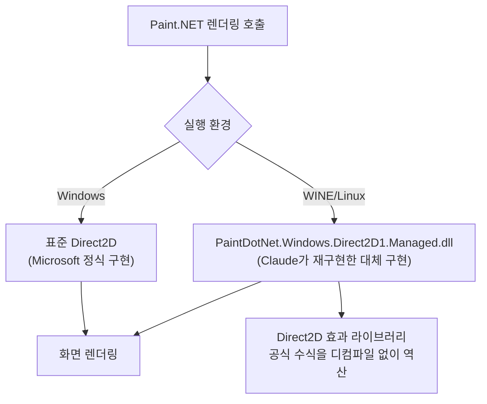

이미지 편집 도구 Paint.NET을 리눅스에서 실행하는 일은 20년 넘게 불가능했다. Windows 전용 저수준 그래픽 API인 Direct2D를 Windows 호환 계층 WINE이 제대로 구현하지 못했기 때문이다. Paint.NET 제작자 Rick Brewster는 이 문제를 WINE 팀의 진전을 기다리는 대신, Claude에게 Direct2D를 처음부터 통째로 재작성시키는 방식으로 풀었다. 그 결과물은 약 18만 줄짜리 대체 구현이었고, 걸린 시간은 3주였다. Brewster 본인이 "손으로 했다면 꼬박 2년, 그것도 비참한 2년이 걸렸을 것"이라 표현한 이 작업은, 동시에 "18만 줄을 도저히 다 리뷰할 수 없다"는 새로운 문제를 남겼다. Simon Willison이 2026년 9월 2일 자신의 블로그에서 이 사례를 소개하며 알려졌다(출처: [Simon Willison, "Rick Brewster on Paint.NET's Direct2D reimplementation"](https://simonwillison.net/2026/Sep/2/rick-brewster/), 2026-09-02).

## 문제 — WINE이 12년간 풀지 못한 API

Paint.NET은 2014년 6월 출시된 4.0부터 Direct2D 기반 하드웨어(GPU) 가속 렌더링을 도입했다(출처: [Paint.NET Blog, "paint.net 4.0 is now available!"](https://blog.paint.net/2014/06/24/paint-net-4-0-is-now-available/), 2014-06-24). Direct2D는 Windows에만 있는 하드웨어 가속 2D 그래픽 API로, 리눅스에서 Windows 앱을 구동시키는 호환 계층 WINE에는 완전한 구현이 없다. WINE 프로젝트가 이 API에 손을 놓고 있었던 것은 아니지만, Brewster가 전한 바로는 12년 동안 "거의 0에 가까운 진전(almost 0 progress)"에 그쳤다. Direct2D 자체가 방대하고 문서화도 불완전해, 명세만 보고 동작을 재현하기가 그만큼 어려웠기 때문이다.

Brewster에게는 선택지가 두 가지뿐이었다 — 리눅스 지원을 포기하거나, WINE의 표준 구현이 아니라 Paint.NET 전용의 대체 구현을 직접 만드는 것. 그는 후자를 택했고, 그 작업량을 스스로 "손으로 했다면 꼬박 2년, 그것도 비참한 2년이 걸렸을 것"이라고 가늠했다. "그러니 선택지는 둘 중 하나였다. 1) 존재하지 않거나, 2) AI 덕분에 존재하거나"라는 것이 그가 내린 결론이었다(출처: Rick Brewster, Paint.NET 포럼 게시글, [Simon Willison 블로그](https://simonwillison.net/2026/Sep/2/rick-brewster/) 및 [Lemmy 재게시](https://lemmy.imagisphe.re/post/2841494)를 통해 확인, 2026-09-02).

## 무엇을 만들었나 — 클린룸 재구현 18만 줄

Brewster가 Claude와 함께 만든 결과물은 `PaintDotNet.Windows.Direct2D1.Managed.dll`이라는 이름의 새 어셈블리로, WINE 환경에서 실행될 때만 기존 Direct2D 호출을 가로채 이 대체 구현으로 대신 처리한다. Windows에서 정식 Direct2D를 쓰는 기본 경로는 건드리지 않고, WINE 위에서만 우회 경로가 켜지는 구조다.

새로 작성된 코드는 약 **18만 줄**로, 20년 넘게 쌓인 Paint.NET 본체 코드(약 70만 줄)의 4분의 1에 해당하는 규모다. 이 안에는 Direct2D의 내장 효과(effect) 라이브러리가 쓰는 렌더링 공식을 원본 라이브러리를 디컴파일하지 않고도 역산해낸 "클린룸(clean-room)" 리버스 엔지니어링 결과물도 포함된다. Brewster는 이 부분에 대해 "지치지 않고 해낸 리버스 엔지니어링(tireless reverse engineering work)"이라고 평가했다.

## 어떻게 3주 만에 가능했나 — 여러 모델을 병행 투입

이 작업은 Claude 모델 하나가 아니라 Fable·Opus·Sonnet 여러 모델을 병행 투입해 진행됐고, 실제 결과물이 나오기까지 약 3주가 걸렸다. Brewster는 Claude의 작업 편차를 "때로는 풀려난 천재 아인슈타인급 10x 코더 10명이 한꺼번에 달려드는 기세로 일했다"고 표현했는데, 이는 코드 산출량과 리버스 엔지니어링의 완성도를 두고 한 말이다. 다만 그 표현은 결과물의 정확성까지 보증하는 말은 아니었다 — 실제로는 사람의 폭넓은 개입이 계속 필요했다.

## 드러난 대가 — 리뷰할 수 없는 규모

Brewster가 개입해야 했던 지점 중 가장 근본적인 결함은 COM(Component Object Model) 참조 카운팅(reference counting)이었다. Direct2D는 COM 기반 API라 객체의 참조 카운트를 `AddRef`·`Release`로 정확히 관리해야 하는데, Claude가 작성한 초기 코드는 이 처리를 빠뜨렸다. 참조 카운팅 누락은 메모리를 너무 일찍 해제하거나 영영 해제하지 못하는 결함으로 이어질 수 있는, COM 프로그래밍에서 가장 기본적이면서도 놓치면 치명적인 규칙이다. 이 외에도 리소스 관리 오류, 아키텍처 설계 판단 오류가 함께 발견됐다.

문제는 이런 결함을 찾아내는 과정 자체가 이미 한계에 부딪혔다는 데 있다. Brewster는 "18만 줄의 코드를 도저히 다 리뷰할 수 없다, 그냥 너무너무너무 많다"고 밝혔고, 결과물 대부분이 "철저히 검토되지 않은 vibe coding" 상태임을 인정했다. 그가 내린 현재 상태에 대한 평가는 "작동하지 않는 건 아니다('doesn't not' work)"라는, 정상 작동을 보장하지 않는다는 뜻의 표현이었다. 2026년 9월 1일 공개된 Paint.NET 5.2 알파 빌드 9739의 WINE/Linux 지원은 그래서 "극도로 실험적"이라는 딱지를 달고 나왔다(출처: [Rick Brewster, X(Twitter) 게시글](https://x.com/rickbrewPDN/status/2094626538654502939), 2026-09-01).

## 왜 주목할 만한가 — 생산량이 리뷰 역량을 앞지를 때

이 사례가 흥미로운 지점은 능력의 증명과 한계의 증거가 같은 프로젝트 안에 공존한다는 데 있다. 12년간 WINE 커뮤니티 전체가 거의 진전시키지 못한 문제를, 한 사람이 AI 에이전트와 함께 3주 만에 동작하는 수준까지 끌어올렸다는 것은 에이전트가 저수준 시스템 프로그래밍(COM, 그래픽 API, 리버스 엔지니어링)까지 감당할 수 있음을 보여준다. 동시에 그 결과물이 COM 참조 카운팅이라는 기초적인 결함을 코드 리뷰 없이 안고 갈 수 있다는 것도 같은 사례가 보여준다.

이 결함이 어떻게 발생했는지는 [AI 코딩 에이전트 시대의 품질 청구서](/post/2026-09-01-ai-coding-agent-velocity-quality-tradeoff/)가 22,000명 규모의 텔레메트리로 이미 짚은 문제와 정확히 같은 구조다 — AI가 만드는 코드 생산량이 늘어난 속도만큼 리뷰 역량이 함께 늘지 않으면, 그 격차만큼 결함이 검증되지 않은 채로 쌓인다. Brewster의 사례는 그 격차가 개인 프로젝트 규모에서 구체적으로 어떤 결함(COM 참조 카운팅 누락)으로 나타나는지 보여주는 실측 사례에 가깝다. 다만 이 결함들이 자동 테스트나 사용자 보고를 거쳐 이미 발견·수정된 것이라는 점도 함께 봐야 한다 — 문제는 "결함이 있었다"가 아니라 "18만 줄 중 아직 발견되지 않은 결함이 얼마나 남아 있는지 아무도 모른다"는 쪽에 있다.

## 적용 판단 기준 — 언제 이런 방식이 정당한가

이 접근이 정당화되려면 몇 가지 조건이 함께 있어야 한다. 첫째, 대안이 "존재하지 않음"에 가까운 상황이어야 한다 — Brewster의 표현대로 손으로 하면 2년이 걸릴 일이라 AI 없이는 애초에 시도조차 안 될 작업이었다. 둘째, 결과물이 실패해도 시스템 전체가 위험해지지 않는 격리 구조가 필요하다 — 이 대체 구현은 WINE 환경에서만 활성화되고 Windows의 정식 Direct2D 경로는 그대로 남아 있어, 실패해도 기존 사용자에게는 영향이 없다. 셋째, "극도로 실험적"이라는 라벨과 "vibe coded"라는 고지를 사용자에게 숨기지 않아야 한다. 반대로 결함이 곧바로 데이터 손실이나 보안 사고로 이어지는 영역(결제, 인증, 참조 카운팅이 자원 누수를 넘어 보안 경계까지 영향을 주는 시스템 등)이라면, 18만 줄을 통째로 리뷰 없이 배포하는 이 패턴은 그대로 옮겨선 안 된다.

## 요약

| 구분 | 내용 |
|------|------|
| 문제 | WINE이 12년간 사실상 진전시키지 못한 Direct2D 지원 |
| 해결 방식 | Claude(Fable·Opus·Sonnet)로 Direct2D를 클린룸 재구현 |
| 규모 | 신규 코드 약 18만 줄(Paint.NET 본체 약 70만 줄의 1/4) |
| 소요 기간 | 약 3주 (손으로 했다면 약 2년 추정) |
| 드러난 결함 | COM 참조 카운팅 누락, 리소스 관리·아키텍처 오류 |
| 현재 상태 | Paint.NET 5.2 알파 빌드 9739, "극도로 실험적" 라벨 |

## 이 글을 읽은 후 할 수 있어야 할 것

- Brewster가 왜 "리뷰 없는 18만 줄"을 감수하기로 했는지, "존재하지 않거나 AI 덕분에 존재하거나"라는 이분법의 근거(2년 대 3주)로 설명할 수 있다.
- COM 참조 카운팅 누락이 왜 AI 생성 코드에서 "그럴듯해 보이지만 근본적인" 결함의 전형적인 사례인지 짚을 수 있다.
- 이런 방식이 정당화되는 조건(대안 부재, 실패 격리, 상태 고지)과 옮겨선 안 되는 영역을 구분해 판단할 수 있다.

## 참고 자료

- [Paint.NET Blog, "paint.net 4.0 is now available!"](https://blog.paint.net/2014/06/24/paint-net-4-0-is-now-available/), 2014-06-24
- [Simon Willison, "Rick Brewster on Paint.NET's Direct2D reimplementation"](https://simonwillison.net/2026/Sep/2/rick-brewster/), 2026-09-02
- [Rick Brewster, X(Twitter) 게시글 — Paint.NET 5.2 알파 빌드 9739 공지](https://x.com/rickbrewPDN/status/2094626538654502939), 2026-09-01
- [Lemmy(imagisphe.re) 재게시 — Paint.NET WINE/Linux 지원](https://lemmy.imagisphe.re/post/2841494)
- [AI 코딩 에이전트 시대의 품질 청구서](/post/2026-09-01-ai-coding-agent-velocity-quality-tradeoff/)
