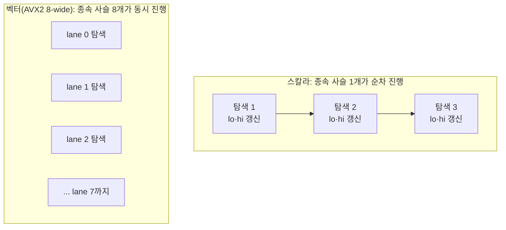

"SIMD로 벡터화하면 N배 빨라진다"는 설명은 절반만 맞다. AVX2처럼 하드웨어 gather 명령어를 지원하는 CPU에서는 명령어 수 자체가 줄어들어 이 설명이 그럭저럭 통하지만, NEON처럼 gather가 없는 CPU에서 같은 코드를 벡터화하면 **명령어 수가 오히려 늘어나는데도 실행 시간은 줄어드는** 역설적인 결과가 나온다. 이 글은 Johnny's Software Lab의 이진 탐색 벤치마크를 근거로, 벡터화가 실제로 벌어들이는 이득이 "SIMD 레지스터 폭"이 아니라 "명령어 수준 병렬성(ILP)과 메모리 수준 병렬성(MLP)의 노출"이라는 점을 코드 수준에서 설명한다.

## 이진 탐색이 느린 이유: 루프 캐리 종속성

정렬된 배열에서 값을 찾는 표준 이진 탐색은 다음과 같다.

```cpp
int binary_search_scalar(const int* arr, int n, int key) {
    int lo = 0, hi = n - 1;
    while (lo <= hi) {
        int mid = lo + (hi - lo) / 2;
        if (arr[mid] == key) {
            return mid;
        } else if (arr[mid] < key) {
            lo = mid + 1;
        } else {
            hi = mid - 1;
        }
    }
    return -1;
}
```

이 루프의 각 반복은 직전 반복이 갱신한 `lo`·`hi` 없이는 `mid`를 계산할 수 없다. 이런 <strong>루프 캐리 종속성(loop-carried dependency)</strong>이 있으면 반복 사이에 엄격한 순서가 강제된다. 현대 CPU는 분기 예측과 투기적 실행(speculative execution)으로 다음 반복을 미리 진행해보지만, `arr[mid]`의 비교 결과에 따라 분기가 갈리므로 예측이 틀리면 그 투기적 작업 전체가 폐기된다. 게다가 `arr[mid]` 자체가 캐시에 없을 가능성이 높은 랜덤 접근이라, 메모리 지연(memory latency) 수백 사이클을 그대로 노출한다. 요컨대 스칼라 이진 탐색은 **한 번에 하나의 종속 사슬만 진행되는 구조**라서, 사슬 하나가 메모리 지연에 막히면 CPU의 나머지 실행 자원이 놀게 된다.

## 벡터화가 실제로 바꾸는 것: 종속 사슬의 개수

벡터화는 이 구조 자체를 바꾼다. 하나의 탐색을 "더 빠르게" 만드는 것이 아니라, **서로 독립적인 여러 개의 탐색을 동시에 진행**시켜 여러 개의 막히지 않는 종속 사슬을 만든다.



스칼라 버전은 사슬 하나가 메모리 지연에 막히면 CPU가 다음 탐색으로 넘어가지 못하고 그대로 기다린다. 벡터 버전은 8개의 사슬이 서로 다른 lane에서 동시에 진행되므로, 어느 한 lane이 메모리 응답을 기다리는 동안 다른 lane이 계산을 계속 진행할 수 있다. 아래는 AVX2 gather 명령어로 8개의 독립적인 키를 동시에 탐색하는 형태다.

```cpp
#include <immintrin.h>

// 서로 독립적인 8개의 key를 동시에 이진 탐색한다.
// 각 SIMD lane은 자신만의 lo/hi를 유지하므로 8개의 종속 사슬이 병렬로 진행된다.
// 찾은 lane과 lo > hi로 실패가 확정된 lane은 각자 다른 시점에 active에서 빠진다.
void binary_search_avx2_batch8(const int* arr, int n,
                                const int* keys, int* results) {
    __m256i lo = _mm256_setzero_si256();
    __m256i hi = _mm256_set1_epi32(n - 1);
    __m256i key = _mm256_loadu_si256(reinterpret_cast<const __m256i*>(keys));
    __m256i active = _mm256_set1_epi32(-1);
    __m256i one = _mm256_set1_epi32(1);

    for (int iter = 0; iter < 32 && _mm256_movemask_epi8(active) != 0; ++iter) {
        __m256i mid = _mm256_srli_epi32(_mm256_add_epi32(lo, hi), 1);
        __m256i val = _mm256_i32gather_epi32(arr, mid, 4);

        __m256i eq = _mm256_cmpeq_epi32(val, key);
        __m256i keyGreater = _mm256_cmpgt_epi32(key, val);   // key > val -> lo = mid+1
        __m256i valGreater = _mm256_cmpgt_epi32(val, key);   // val > key -> hi = mid-1

        lo = _mm256_blendv_epi8(lo, _mm256_add_epi32(mid, one),
                                 _mm256_and_si256(keyGreater, active));
        hi = _mm256_blendv_epi8(hi, _mm256_sub_epi32(mid, one),
                                 _mm256_and_si256(valGreater, active));

        __m256i found = _mm256_and_si256(eq, active);
        _mm256_maskstore_epi32(results, found, mid);
        active = _mm256_andnot_si256(found, active);

        __m256i failed = _mm256_cmpgt_epi32(lo, hi);   // lo > hi -> 그 lane은 값이 없음
        active = _mm256_andnot_si256(failed, active);
    }
}
```

핵심은 `_mm256_i32gather_epi32` 한 줄이다. 이 명령어는 `mid` 레지스터에 담긴 8개의 서로 다른 인덱스로 `arr`에서 8개의 값을 한 번에 읽어온다. 8개의 탐색이 각자 다른 메모리 주소를 건드리지만, 8개가 동시에 발행되므로 CPU는 이 메모리 요청들을 동시에 처리할 수 있다 — 8배의 메모리 수준 병렬성이 생기는 것이다.

## AVX2와 NEON이 서로 다른 방식으로 빨라지는 이유

Ivica Bogosavljević가 2026년 2월 Johnny's Software Lab에 게시한 벤치마크는 정렬된 100만 개 정수 배열에서 400만 개의 키를 탐색하는 실험을 AVX2(AMD Ryzen 9 PRO 8945HS)와 NEON(Raspberry Pi 4, Cortex-A72)에서 각각 수행했다.

| 플랫폼 | 실행 시간 | 명령어 수 | CPI |
|---|---|---|---|
| AVX2 스칼라 | 2.80s | 98.6억 | 1.42 |
| AVX2 벡터(8-wide) | 1.43s (1.96배) | 25.8억 (3.8배 감소) | 2.82 |
| NEON 스칼라 | 53.07s | 73.1억 | 10.74 |
| NEON 벡터(4-wide) | 33.79s (1.57배) | 84.8억 (16% 증가) | 5.91 |

AVX2 결과는 통념과 일치한다. 하드웨어 gather 명령어 하나가 8번의 스칼라 로드·비교·분기를 대체하므로 명령어 수가 3.8배 줄고, 그만큼 빨라진다. 이런 복합 명령어(하나가 여러 메모리 접근·계산을 대신하는 명령어)는 <strong>CISC(복합 명령어 집합 컴퓨터)</strong> 계보인 x86이 전통적으로 강화해 온 영역이다. 문제는 NEON이다. <strong>RISC(축소 명령어 집합 컴퓨터)</strong> 계보인 ARMv8 NEON에는 정수 gather 명령어가 없다. 컴파일러는 `_mm256_i32gather_epi32`에 대응하는 NEON 벡터 gather 코드를 요청받으면 이를 **4번의 개별 스칼라 로드로 풀어서(scalarize)** 실행한다. 그 결과 명령어 수는 스칼라 버전보다 오히려 16% 늘었다. 그런데도 실행 시간은 1.57배 줄었다 — 이유는 이 4번의 스칼라 로드가 이제 서로 독립적이기 때문이다. 스칼라 이진 탐색에서는 각 키의 메모리 접근이 순차적으로, 하나씩 지연을 그대로 드러내며 발생했지만, 벡터화된 코드에서는 4개의 로드가 같은 명령어 스트림 안에 나란히 배치되어 비순차 실행기(out-of-order engine)가 동시에 발행한다. CPI(사이클당 명령어)가 10.74에서 5.91로 거의 절반이 된 것이 이 메모리 지연 은닉 효과를 보여주는 지표다.

두 사례를 나란히 놓으면 벡터화의 이득이 두 개의 서로 다른 축에서 온다는 점이 드러난다. AVX2는 **명령어 수 감소** 축에서, NEON은 **명령어 수는 그대로거나 늘어도 병렬 발행으로 지연을 숨기는** 축에서 이득을 낸다. "명령어 수만 세면 벡터화 효과를 예측할 수 있다"는 단순화된 모델로는 NEON 사례를 설명할 수 없고, 오히려 gather가 없는 아키텍처에서는 벡터화를 포기해야 한다는 잘못된 결론에 도달하게 된다.

## 이 논지가 적용되지 않는 경우

이 관찰은 이진 탐색처럼 **원래 루프 캐리 종속성이 강한 알고리즘**에서 특히 두드러진다. 반대로 배열 원소를 단순히 더하는 루프처럼 반복 사이에 애초에 종속성이 없는 코드는 스칼라 버전도 이미 컴파일러 최적화(언롤링, 파이프라이닝)로 어느 정도 병렬 발행이 이루어지고 있으므로, 벡터화의 이득이 이진 탐색만큼 극적으로 "명령어 수 감소 vs 지연 은닉"으로 나뉘지 않고 명령어 수 감소 쪽에 더 가깝게 나타난다. 벡터화 전에 대상 루프에 루프 캐리 종속성이 있는지, 메모리 접근이 캐시에 잘 맞는지부터 확인해야 하는 이유다.

## 실전에서 자주 하는 실수

1. **CPI만 보고 최적화를 판단한다.** NEON 사례처럼 CPI와 명령어 수가 늘어도 전체 실행 시간은 줄어들 수 있다. `perf stat`으로 명령어 수·CPI만 확인하고 "느려졌다"고 판단하기 전에 반드시 벽시계 시간(wall-clock time)을 함께 봐야 한다.
2. **gather 지원 여부를 확인하지 않고 벡터화 여부를 결정한다.** 타깃 아키텍처에 하드웨어 gather가 없으면 컴파일러가 스칼라화하는 코드로 자동 변환하는데, 이 경우에도 루프 캐리 종속성이 강한 코드라면 여전히 이득이 있다. 반대로 gather 없이 종속성 없는 단순 루프를 벡터화하면 스칼라화 오버헤드만 남을 수 있다 — 반드시 실측한다.
3. **모든 벡터화 이득을 같은 원인으로 설명하려 한다.** 위에서 본 대로 AVX2와 NEON은 같은 코드에서 서로 다른 메커니즘으로 이득을 낸다. 플랫폼마다 `perf stat`으로 명령어 수와 CPI를 따로 측정해 어느 메커니즘이 지배적인지 확인해야 한다.

## 요약

벡터화된 루프가 빠른 근본 이유는 SIMD 레지스터가 넓어서가 아니라, 원래 순차적으로 진행되던 여러 개의 독립적인 작업 단위를 하나의 명령어 스트림 안에 나란히 배치해 CPU의 비순차 실행기가 동시에 처리할 기회를 늘리기 때문이다. 하드웨어 gather를 지원하는 AVX2에서는 이 이득이 명령어 수 감소로 나타나고, gather를 지원하지 않아 스칼라 로드로 풀리는 NEON에서는 명령어 수가 늘어도 병렬 발행에 의한 메모리 지연 은닉으로 나타난다. 두 경우 모두 공통점은 하나다 — 루프 캐리 종속성이 있던 자리에 독립적인 종속 사슬 여러 개가 대신 들어섰다는 것.

## 평가 기준

이 글의 핵심은 루프 캐리 종속성이 벡터화로 어떻게 여러 개의 독립 사슬로 바뀌는지, 그리고 그 이득이 gather 지원 여부에 따라 명령어 수 감소(AVX2)와 지연 은닉(NEON)이라는 서로 다른 형태로 나타난다는 점이다. 이 글을 읽고 나면 다음을 스스로 설명할 수 있어야 한다.

- 스칼라 이진 탐색이 느린 이유를 "루프 캐리 종속성"이라는 용어로 설명할 수 있다.
- AVX2와 NEON에서 벡터화 이득이 서로 다른 메커니즘(명령어 수 감소 vs 병렬 발행에 의한 지연 은닉)으로 나타나는 이유를, 각 아키텍처의 gather 명령어 지원 여부와 연결해 설명할 수 있다.
- "명령어 수가 늘었는데 왜 더 빨라졌는가"라는 NEON 벤치마크의 역설적 결과를 CPI·비순차 실행 개념으로 풀어낼 수 있다.
- 어떤 루프를 벡터화하기 전에 확인해야 할 두 가지 조건(루프 캐리 종속성 여부, 타깃 아키텍처의 gather 지원 여부)을 말할 수 있다.

## 참고 자료

- [Exposing More Parallelism Is the Hidden Reason Why Some Vectorized Loops Are Faster (Not Vectorization Per Se) — Johnny's Software Lab](https://johnnysswlab.com/exposing-more-parallelism-is-the-hidden-reason-why-some-vectorized-loops-are-faster-not-vectorization-per-se/)
- [Intel Intrinsics Guide — `_mm256_i32gather_epi32`](https://www.intel.com/content/www/us/en/docs/intrinsics-guide/index.html#text=_mm256_i32gather_epi32)
