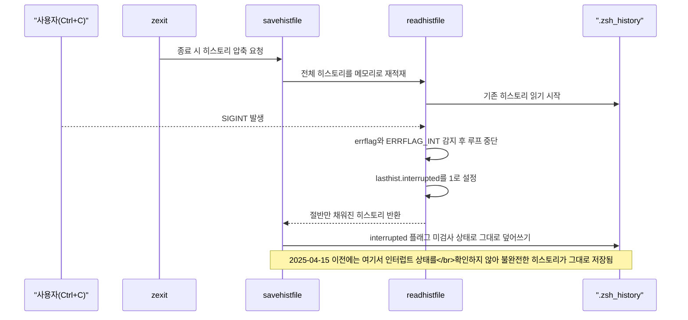
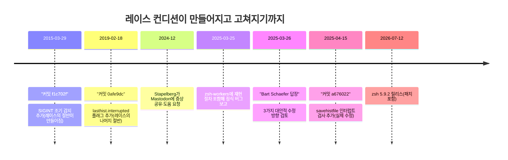

터미널을 끌 때 창이 다 닫힐 때까지 Ctrl+C와 Ctrl+D를 습관적으로 연타하는 사람이라면, 어느 날 `.zsh_history`에서 최근 몇 년치 명령이 통째로 사라져 있는 걸 발견할 수도 있다. 파일이 깨진 것도 아니고 에러 메시지 하나 없이, 그냥 오래된 항목만 남고 최신 항목이 조용히 증발한다. Debian 개발자 Michael Stapelberg가 실제로 이 현상을 겪고 원인을 추적한 과정을([원문](https://michael.stapelberg.ch/posts/2026-08-09-zsh-history-truncation-bug/), 2026-08-09) 코드 메커니즘·디버깅 도구 선택·타임라인 순으로 정리한다.

## 증상과 재현 조건

문제는 파일 손상이 아니라 **부분 덮어쓰기**였다. Stapelberg가 2025년 3월 25일 zsh 개발 메일링 리스트(zsh-workers)에 보고한 재현 절차([msg00114](https://www.zsh.org/mla/workers/2025/msg00114.html))는 다음과 같다.

1. 5만 줄짜리 `HISTFILE`을 새로 만들고 `SAVEHIST=85000`으로 설정한다.
2. 이 상태로 zsh를 실행한 뒤 <strong>Ctrl+D(EOF)</strong>로 정상 종료하면 히스토리는 그대로 55,071줄로 유지된다 — 여기까지는 이상 없음.
3. 다시 zsh를 실행해 시작 시점의 `readhistfile()`이 실행되는 도중 <strong>Ctrl+C(SIGINT)</strong>를 보낸 뒤 Ctrl+D로 종료하면, 종료 직전 55,075줄이던 히스토리 파일이 단 12,962줄로 줄어든다.

4분의 3 이상이 한 번의 Ctrl+C로 사라진 셈이다. 이 조건은 실험실에서만 발생하는 게 아니라, "터미널 창을 몰아서 닫을 때 Ctrl+C를 반복해서 누르는" 흔한 습관만으로도 확률적으로 걸릴 수 있었다 — Stapelberg 본인도 2024년 12월 Mastodon에 이 증상을 처음 공유했을 때는 원인을 전혀 특정하지 못한 상태였다.

## 원인 메커니즘 — 두 커밋이 10년 뒤 만난 레이스

zsh가 종료될 때 호출되는 `zexit()`는 히스토리 파일을 압축(오래된 중복 제거 등)하기 위해 `savehistfile()`을 부르고, `savehistfile()`은 전체 히스토리를 메모리에 다시 올리려고 먼저 `readhistfile()`을 호출한 뒤 그 결과를 파일에 새로 쓴다. 문제는 이 두 단계 사이에 상태를 확인하는 코드가 없었다는 것이다.

`readhistfile()`의 읽기 루프에는 2015년 3월 29일 Peter Stephenson이 커밋한 [`f1c702f`](https://github.com/zsh-users/zsh/commit/f1c702f)("Catch some errors earlier when reading history")에서 추가된 `if (errflag & ERRFLAG_INT) break;`가 있다. SIGINT가 들어오면 `errflag`에 `ERRFLAG_INT` 비트가 서고, 이 코드가 읽기 루프를 즉시 중단시킨다 — 여기까지는 의도한 동작이다. 2019년 2월 18일에는 Yutian Li가 작성하고 Stephenson이 반영한 [`0afe9dc`](https://github.com/zsh-users/zsh/commit/0afe9dc)("Make history read safer on interrupt")가 `lasthist` 구조체에 `interrupted` 플래그를 추가해, 중단된 읽기 다음에 오는 빠른 재읽기 경로를 건너뛰도록 만들었다.

두 커밋 각각은 자기 목적(조기 오류 감지, 안전한 재읽기)에는 맞았지만, 그 사이에 낀 `savehistfile()`은 애초에 이 인터럽트 상태를 전혀 검사하지 않았다. 즉 `readhistfile()`이 SIGINT로 절반만 읽고 중단됐다는 사실을 `lasthist.interrupted = 1`이라는 플래그로 남겨놓아도, 뒤이어 실행되는 `savehistfile()`은 "지금 메모리에 있는 히스토리가 불완전하다"는 걸 모른 채 그 절반짜리 상태를 그대로 파일에 덮어썼다. 두 안전장치가 각각 따로는 옳았는데, 그 사이의 계약(하나가 세운 플래그를 다른 하나가 확인해야 한다는 것)이 빠져 있던 셈이다 — 코드 리뷰에서 가장 잡기 어려운 부류의 결함이다.

이 흐름에서 `readhistfile()`이 `Read->>Read`로 표시한 두 동작(조기 종료·플래그 설정)은 각각 2015년·2019년 커밋이 만든 것이고, 정작 그 플래그를 소비해야 할 `Save->>File` 지점의 검사는 2025년까지 없었다 — 문제를 만든 커밋과 문제를 고친 커밋 사이에 6–10년의 간격이 있는 셈이다.

### 실제 수정 내용

2025년 4월 15일, 원래 버그 보고에 답했던 Bart Schaefer가 직접 수정을 반영했다(zsh 커밋 [`a676022`](https://github.com/zsh-users/zsh/commit/a6760226c75c8a13e78f8b4c7163f1256322531a), 커밋 메시지 "53454: fix interrupt handling in savehistfile()"). 변경은 두 함수에 걸쳐 있다. `readhistfile()`에서는 기존에 읽기 루프 **안**에서 인터럽트를 감지해 즉시 플래그를 세우던 처리를 루프 **밖**으로 옮겨, 인터럽트 여부를 한 곳에서 확정하도록 정리했다. 그리고 `savehistfile()`에는 `readhistfile()` 호출 직후 `if (errflag & ERRFLAG_INT)` 검사를 새로 추가해, 인터럽트가 있었으면 파일을 쓰지 않고 반환값을 -1로 설정하도록 만들었다(기존에 무조건 실행되던 `if (histlinect)` 저장 로직은 이 조건 뒤의 `else if`로 바뀌었다). 요컨대 앞서 그린 시퀀스 다이어그램에서 빠져 있던 `Save->>File` 직전의 상태 확인 한 줄을 추가한 것이 수정의 전부다 — 인터럽트가 있었으면 그냥 아무것도 쓰지 않고 기존 파일을 그대로 둔다.

이 사례를 처음 보면 "SIGINT 처리 코드(`f1c702f`) 자체가 버그였다"고 생각하기 쉽다. 하지만 그 커밋은 "인터럽트가 오면 읽기를 멈춘다"는 원래 목적에서는 옳게 동작했고, `0afe9dc`가 추가한 `interrupted` 플래그도 "중단된 읽기 다음의 재읽기를 건너뛴다"는 자기 목적에서는 정확했다. 실제 결함은 이 두 함수 중 어느 한쪽의 로직이 아니라, `readhistfile()`이 세운 상태를 `savehistfile()`이 확인해야 한다는 **함수 간 계약이 코드 어디에도 명시돼 있지 않았다**는 데 있다. 즉 "인터럽트 안전 처리 함수 하나만 잘 짜면 이런 레이스는 생기지 않는다"는 통념은 틀렸다 — 개별 함수가 각자 안전해도, 그 함수들 사이에서 상태를 주고받는 지점을 아무도 검사하지 않으면 레이스는 그대로 남는다.

## 디버깅 여정 — 관찰 도구를 세 단계로 정밀화하기

Stapelberg가 원인을 좁혀간 과정은 "무엇을 관찰할 수 있는가"를 단계적으로 좁혀가는 전형적인 시스템 디버깅 흐름을 보여준다.

| 도구 | 확인할 수 있었던 것 | 한계 |
|---|---|---|
| `inotify` | `.zsh_history`가 삭제되고 `.zsh_history.new`로 원자적 교체됨(rename) | 어느 프로세스가, 얼마나 썼는지는 알 수 없음 |
| `fatrace` | 관여한 프로세스명과 PID(단일 zsh 프로세스) | 실제로 몇 바이트를 읽고 썼는지는 여전히 불명 |
| `bpftrace` | 시스템콜 단위 read/write 바이트 수. 정상 종료 시에는 `read()`가 0을 반환(EOF)하는데, 손상되는 실행에서는 이 EOF 신호 없이 읽기가 도중에 끊김 | 커널 이벤트를 정확히 짚어내지만 유저스페이스 변수 값(`errflag`, `lasthist.interrupted`)까지는 보여주지 않음 |

`inotify`는 "파일이 바뀌었다"는 사실만, `fatrace`는 "누가 건드렸다"는 사실만 알려줬다. 진짜 단서는 `bpftrace`로 read/write 시스템콜의 바이트 수를 추적하고 나서야 나왔다 — 정상 로그아웃과 손상되는 로그아웃의 차이가 "EOF(0바이트 read)가 오는가, 안 오는가"로 뚜렷하게 갈렸다. 이 관찰이 "읽기가 도중에 끊긴다"는 방향으로 조사를 좁혀줬고, 거기서부터는 소스 코드에서 SIGINT를 검사하는 지점을 찾는 일이었다.

바이트 단위 증거를 얻은 뒤에는 재현을 결정론적으로 만들기 위해 `savehistfile()` 자체를 패치했다 — 새로 쓴 줄 수를 세는 카운터(`lines_written`)를 추가하고, `.zsh_history.new`를 다 쓴 시점에 그 값이 **50,000줄 미만**이면 잘못된 주소에 값을 대입해 의도적으로 세그폴트를 일으키도록 만들어 `systemd-coredump`가 코어를 자동으로 남기게 했다. 실제로 손상이 재현된 순간의 코어를 `gdb`로 열어보니 `lines_written = 45546`, `errflag = 2`, `lasthist.interrupted = 1`이 그대로 잡혔다 — 절반 남짓만 쓰인 채로 크래시했다는 물증이다. 관찰 도구로 현상의 경계를 좁힌 다음, 그 경계에서 재현율을 100%로 끌어올리는 계측 코드를 심고, 마지막에 디버거로 메모리 상태를 확정하는 3단계 조사 패턴이다.

## 타임라인

보고부터 릴리스 반영까지 1년 넘게 걸렸다는 점 자체도 눈여겨볼 만하다 — 원인이 명확해도(2025년 4월 15일에 이미 패치가 있었다) 정기 릴리스 주기를 따라가는 오픈소스 프로젝트에서는 실제 배포까지 별개의 시간이 걸린다.

## 부록 — LLM에게 로그만 주고 진단시키기

Stapelberg는 원인을 다 밝힌 뒤, 부록으로 증상 설명과 정상/손상 `bpftrace` 로그 한 쌍만 주고 15개 이상의 LLM에게 시도당 3회씩 원인을 진단시키는 실험을 덧붙였다. 그의 개인 블로그에 실린 비공식 테스트로 정식 논문 형태의 벤치마크는 아니지만, 모델별 점수·토큰 사용량·소요 시간까지 표로 공개돼 있다. 정답 판정 기준은 "SIGINT가 `errflag`를 세워 `readhistfile()`을 중단시키고 그 결과 히스토리가 잘린다"는 인과관계를 정확히 짚었는지였다.

| 조건 | 3/3 정답 모델 | 나머지 결과 |
|---|---|---|
| 증상 + 로그만 제공 | GPT-5.6-Sol, Claude Opus 5 | Gemini·GPT 계열 다수가 1–2/3, 오픈웨이트 중에는 Kimi K3만 1/3로 근접, GLM 5.2를 포함한 나머지 오픈웨이트는 전부 0/3 |
| "Ctrl+C/Ctrl+D를 반복해서 누른다"는 종료 습관 힌트 추가 | GPT-5.6-Sol, GPT-5.5, Claude Opus 5, Claude Opus-4-8, Claude Sonnet 5, Kimi K3(medium·high), GLM 5.2 | 3/3 모델 수가 2개에서 7개로 늘었고 오픈웨이트 중 Kimi K3·GLM 5.2가 처음으로 3/3에 도달. Qwen·Minimax 계열은 힌트를 줘도 끝내 0/3에 머묾 |

힌트 문장 하나가 정답률에 이렇게 큰 차이를 만든 이유는, 실패한 모델들의 공통 패턴이 "그럴듯하지만 틀린 이론에 성급히 고착되는 것"이었기 때문이다. 예를 들어 GLM 5.2는 트레이스에 찍힌 `lseek(offset, SEEK_SET)` 패턴을 근거로 "그렇다면 `SHAREHISTORY`가 켜져 있는 게 틀림없다"고 결론짓고, 정작 프롬프트에 명시된 `unsetopt SHARE_HISTORY` 설정과 모순되는데도 그 가설을 밀어붙였다. 힌트가 SIGINT·인터럽트 쪽으로 탐색 방향을 미리 좁혀주자, 같은 모델이 엉뚱한 이론에 갇히지 않고 정답에 도달한 것이다. 사람이 inotify→fatrace→bpftrace→gdb까지 거쳐 좁혀간 원인을 상위권 모델은 로그 한 장으로도 짚어냈다는 점은 흥미롭지만, 힌트 없이는 오픈웨이트 모델 대부분이 무너졌다는 점에서 "정보가 부족하면 그럴듯한 오답에 안착한다"는 한계도 그대로 드러난다.

## 이 사례에서 가져갈 것

이 사례가 남기는 교훈은 코드 리뷰 관점, 디버깅 도구 선택 관점, 재현성 확보 관점 셋으로 나뉜다.

- **레이스 컨디션은 커밋 리뷰 시점에 보이지 않는다.** `f1c702f`와 `0afe9dc`는 각각 4년 간격으로 반영됐고 개별적으로는 합리적인 변경이었다. 한쪽이 남긴 상태 플래그를 다른 쪽이 확인해야 한다는 암묵적 계약은 두 커밋의 diff 어디에도 명시돼 있지 않았다 — 신호 처리 도중 자원을 정리하는 코드를 review할 때는 "이 함수가 호출되기 전에 인터럽트될 수 있는 경로가 있는가"를 별도로 점검할 필요가 있다.
- **관찰 도구는 정밀도 순서로 배치한다.** 파일 변경 감지(inotify) → 프로세스 식별(fatrace) → 바이트 단위 시스템콜 추적(bpftrace) → 변수 값 확정(코어덤프 + gdb)으로 갈수록 얻는 정보는 늘지만 계측 비용도 늘어난다. 저비용 도구로 현상의 경계를 먼저 좁히고, 그 경계 안에서만 고비용 도구를 쓰는 순서가 효율적이다.
- **결정론적 재현이 안 되면 재현되게 만든다.** Stapelberg는 소스를 임시로 패치해 "특정 줄 수 이하로 쓰이면 크래시"하도록 만들어 코어덤프를 강제로 남겼다. 확률적으로만 재현되는 버그는, 그 조건이 발생했을 때 시스템이 알아서 증거를 남기게 만드는 쪽이 반복 실행보다 빠를 때가 많다.

## 참고 자료

- [Michael Stapelberg, "Tracking down a Zsh history data loss bug", 2026-08-09](https://michael.stapelberg.ch/posts/2026-08-09-zsh-history-truncation-bug/)
- [zsh-workers 메일링 리스트, "BUG: Zsh loses history entries since 2015", 2025-03-25](https://www.zsh.org/mla/workers/2025/msg00114.html)
- [zsh-workers 메일링 리스트, Bart Schaefer의 답장, 2025-03-26](https://www.zsh.org/mla/workers/2025/msg00118.html)
- [zsh 커밋 f1c702f — "Catch some errors earlier when reading history", 2015-03-29](https://github.com/zsh-users/zsh/commit/f1c702f)
- [zsh 커밋 0afe9dc — "Make history read safer on interrupt", 2019-02-18](https://github.com/zsh-users/zsh/commit/0afe9dc)
- [zsh 커밋 a676022 — "53454: fix interrupt handling in savehistfile()", 2025-04-15](https://github.com/zsh-users/zsh/commit/a6760226c75c8a13e78f8b4c7163f1256322531a)
- [zsh 공식 릴리스 노트](https://zsh.sourceforge.io/releases.html)
