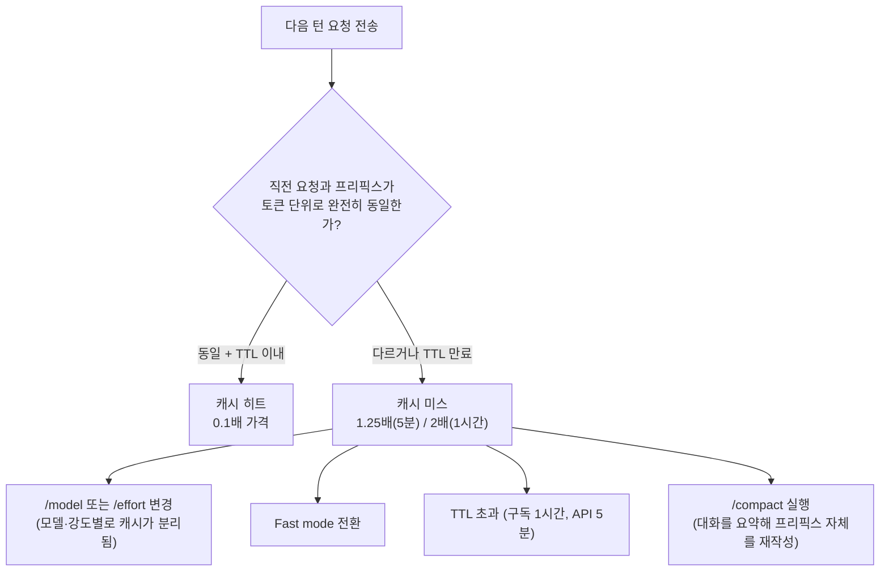

같은 작업을 시켰는데 어떤 날은 세션이 저렴하고 어떤 날은 유독 비싸다면, 보통 원인은 프롬프트 품질이 아니라 **그 턴이 캐시를 다시 써야 했는지 여부**다. 2026년 8월 14일 Anthropic Claude 블로그에 Lydia Hallie가 올린 [Maximizing the value of your Claude Code sessions](https://claude.com/blog/maximizing-the-value-of-your-claude-code-sessions)는 새 기능 발표가 아니라, 기존 명령어(`/clear`·`/compact`·`/rewind`·`/context`)를 프롬프트 캐싱 구조에 맞춰 언제 써야 하는지 정리한 운영 가이드다. 이 글은 그 권장 사항 각각이 [공식 가격 문서](https://platform.claude.com/docs/en/build-with-claude/prompt-caching)의 캐시 단가와 어떻게 맞물리는지 실제 숫자로 계산해, "왜 그렇게 해야 하는지"까지 확인한다.

## 프리필과 디코드: 입력과 출력이 다르게 과금되는 이유

Claude 같은 트랜스포머 기반 모델은 요청 하나를 처리할 때 두 단계를 거친다. 먼저 **프리필(prefill)** 단계에서 시스템 프롬프트·대화 이력·도구 정의를 포함한 전체 컨텍스트를 한 번에 읽어 들이고, 이어서 **디코드(decode)** 단계에서 응답 토큰을 하나씩 순차적으로 생성한다. 프리필은 병렬로 처리되는 반면 디코드는 토큰마다 이전 토큰에 의존하는 순차 연산이므로 GPU를 그만큼 오래 점유한다. Hallie의 글은 이 구조적 차이 때문에 출력 토큰 가격이 입력 토큰 가격의 대략 5배라고 설명한다. 즉 같은 토큰 수라도 모델이 "읽는" 것과 "쓰는" 것은 원가 자체가 다르다.

## 프롬프트 캐싱: 공개 단가로 직접 계산해보기

프롬프트 캐싱은 프리필 단계의 이 비용을 줄이는 장치다. 요청의 앞부분(프리픽스)이 직전 요청과 토큰 단위로 완전히 동일하면, 모델은 그 부분을 다시 계산하지 않고 저장된 상태를 그대로 불러온다. [공식 가격 문서](https://platform.claude.com/docs/en/build-with-claude/prompt-caching)는 이 할인·할증 폭을 명확한 배수로 못박아 둔다.

| 항목 | 배수 | Claude Sonnet 5 기준 단가 |
|------|------|---------------------------|
| 기본 입력 | 1배 | $2 / MTok |
| 캐시 쓰기(5분 TTL, 기본값) | 1.25배 | $2.50 / MTok |
| 캐시 쓰기(1시간 TTL) | 2배 | $4 / MTok |
| 캐시 읽기(히트) | 0.1배 | $0.20 / MTok |
| 출력 | 5배 | $10 / MTok |

이 단가를 그대로 대입하면 캐싱의 효과가 감이 아니라 숫자로 잡힌다. 예를 들어 CLAUDE.md·MCP 도구 정의·시스템 프롬프트를 합쳐 20,000토큰짜리 프리픽스로 세션을 시작한다고 하자.

- **1턴째(캐시 없음)**: 20,000토큰을 캐시에 쓴다. 비용 = 20,000 ÷ 1,000,000 × $2.50 = **$0.05**.
- **2턴째(5분 이내, 프리픽스 동일)**: 기존 20,000토큰은 캐시 히트로 읽고(20,000 ÷ 1,000,000 × $0.20 = $0.004), 새로 늘어난 대화 내용 2,000토큰만 다시 캐시에 쓴다(2,000 ÷ 1,000,000 × $2.50 = $0.005). 합계 **$0.009** — 같은 22,000토큰을 캐싱 없이 그냥 입력으로 보냈다면 22,000 ÷ 1,000,000 × $2 = $0.044이므로, 캐시 히트 구간 덕에 약 **80% 절감**된다.
- **어떤 이유로든 캐시가 깨진 턴**: 20,000토큰 전체를 다시 써야 하므로 비용이 $0.004(읽기)에서 $0.05(쓰기)로, 그 구간만 놓고 보면 **약 12.5배** 뛴다.

이 마지막 줄이 핵심이다. 캐시가 유지되는 한 프리픽스는 거의 공짜에 가깝게 재사용되지만, 한 번이라도 깨지면 그 순간 프리필 원가를 전액 다시 지불한다. Hallie의 글이 나열한 습관 대부분은 결국 "무엇이 이 캐시를 깨는가"를 피하거나, 깨질 수밖에 없는 순간을 최대한 늦추는 방법이다.

## 캐시를 깨는 4가지 순간

가장 비싼 순간은 `/model`·`/effort` 변경이다. 모델과 추론 강도마다 캐시가 별도로 관리되므로, 세션 중간에 바꾸면 그 시점까지 쌓인 캐시를 이어 쓸 방법이 없다. Hallie의 글은 두 설정 모두 이전 세션에서 고른 값을 그대로 기억하므로, 세션을 시작할 때 의도적으로 한 번 확인하고 그 뒤로는 건드리지 말라고 권한다. 같은 모델이라도 Fast mode로 전환하면 별도 추론 경로를 타므로 이 역시 캐시 분리 대상이 되며, 겉보기에는 "모델은 그대로인데" 캐시만 깨지는 것처럼 보여 원인을 찾기가 오히려 더 까다롭다.

두 번째 순간은 TTL 초과다. 구독 세션은 1시간, API 호출은 5분이 기본 TTL이며, 캐시는 사용할 때마다 추가 비용 없이 TTL이 자동 연장된다. 반대로 그 시간 안에 다음 요청이 오지 않으면 캐시는 그냥 소멸하므로, 회의나 점심시간처럼 세션을 오래 비워두면 다시 돌아왔을 때 첫 요청은 자동으로 캐시 쓰기 비용을 물게 된다.

세 번째는 `/compact`다. 대화 이력을 요약해서 프리픽스 자체를 다시 쓰는 명령이므로, 실행 직후에는 필연적으로 새 캐시를 처음부터 다시 채워야 한다. 반면 `/rewind`는 마지막 몇 턴을 잘라내기만 할 뿐 남은 프리픽스는 그대로이므로, 캐시가 살아있는 동안이라면 재작성 비용이 사실상 없다. 두 명령이 같은 "컨텍스트 줄이기" 목적처럼 보여도 캐시 관점에서는 정반대로 작동하는 이유가 여기에 있다 — `/compact`는 프리픽스의 내용을 바꾸고, `/rewind`는 프리픽스의 길이만 줄인다.

## 컨텍스트가 쌓이는 3가지 경로

캐시 문제와 별개로, 세션이 길어질수록 프리픽스 자체가 계속 자라난다는 문제도 있다. Hallie의 글은 이 축적이 세 경로로 일어난다고 짚는다.

첫 번째 경로는 초기 로드다. 시스템 프롬프트, `CLAUDE.md`, MCP 서버가 노출하는 도구 정의가 세션 시작과 동시에 컨텍스트에 올라가며, 이 적재량은 대화를 한 마디도 나누기 전부터 이미 매 턴 재전송되는 프리픽스의 바닥을 이룬다. `/context` 명령으로 이 초기 적재량을 확인하고, 당장 필요 없는 MCP 서버 연결이나 불필요하게 긴 `CLAUDE.md` 항목을 걷어낼 수 있다.

두 번째 경로는 Read 호출 결과다. 파일을 파일명으로 설명하면 모델이 검색·Read 왕복을 한 번 더 거치고, 그 왕복의 결과까지 컨텍스트에 남는다. `@`-멘션으로 파일을 메시지에 직접 첨부하면 이 왕복 자체가 생략되지만, 같은 파일을 여러 번 `@`-멘션하면 그때마다 사본이 추가되므로 한 세션에서 반복 참조할 파일은 처음 한 번만 멘션하는 편이 낫다.

세 번째 경로는 명령 출력이다. 셸 명령 실행 결과는 파일처럼 대화에 그대로 추가돼 이후 모든 턴에 재전송된다. Claude Code의 `BASH_MAX_OUTPUT_LENGTH`(기본 30,000자)를 넘는 출력은 자동으로 파일에 저장되고 미리보기만 컨텍스트에 남지만, 그 미만이면 전량이 그대로 쌓인다. 로그 분석처럼 출력이 원래 방대한 작업은 `--reporter=dot`처럼 조용한 플래그를 쓰거나, 아예 서브에이전트에 위임해 요약된 결과만 메인 세션으로 돌려받는 편이 낫다.

이 세 경로가 문제인 진짜 이유는 캐시가 살아있어도 사라지지 않는다는 데 있다. 캐시는 이미 쌓인 프리픽스를 *다시 계산하지 않게* 해줄 뿐, *애초에 프리픽스가 얼마나 큰가*는 그대로 매 턴 청구서에 반영된다. Hallie의 글이 언급하듯 40번째 턴은 이전 39개 턴 전체를 다시 읽는다 — 그 39턴 분량이 전부 캐시 히트(0.1배)라 해도, 턴이 늘어날수록 매턴 다시 읽어야 하는 절대 토큰 수 자체가 계속 커진다는 사실은 바뀌지 않는다. 그래서 관련 없는 다음 작업으로 넘어갈 때는 `/compact`로 요약하는 대신 `/clear`로 아예 새 세션을 여는 편이 낫다 — 프리픽스를 100% 요약이라는 형태로라도 이어가지 않고 0에서 다시 시작하기 때문이다.

## 실전 습관 정리

| 습관 | 언제 쓰나 | 캐시·비용 관점의 근거 |
|------|-----------|------------------------|
| `/clear` | 관련 없는 새 작업을 시작할 때 | 이전 프리픽스를 아예 버려, 다음 작업이 앞 작업의 무관한 이력까지 매번 재전송·재해석하지 않게 한다 |
| `/context` | 새 세션 시작 직후 | 시스템 프롬프트·CLAUDE.md·MCP 도구 정의가 초기 적재량으로 얼마나 잡혔는지 확인, 불필요한 항목 정리 |
| `/model`·`/effort` 고정 | 세션 시작 시점에만 결정 | 중간에 바꾸면 그 시점까지의 캐시를 통째로 잃는다 |
| `@`-멘션 | 파일을 참조할 때 | 이름만 설명하면 발생하는 검색·Read 왕복(과 그 결과의 컨텍스트 적재)을 생략 |
| quiet 플래그·서브에이전트 위임 | 출력이 큰 명령을 실행할 때 | 원본 출력이 세션에 남지 않고, 서브에이전트가 요약만 메인 세션으로 반환 |
| `/rewind` vs `/compact` | 각각 "마지막 몇 턴만 취소" vs "같은 작업의 앞부분을 요약 후 계속" | `/rewind`는 캐시가 살아있는 프리픽스를 그대로 두고 잘라내기만 해 사실상 무료, `/compact`는 프리픽스를 재작성해 캐시를 새로 쓴다 |
| CLAUDE.md에 반복 명령 문서화 | 하루에도 여러 번 쓰는 명령이 있을 때 | 예: "단일 테스트 파일은 `npx vitest run <file> --reporter=dot`로 실행"처럼 quiet 플래그까지 포함해 못박아 두면, 매 세션 그 설명을 다시 주고받는 턴 자체가 사라진다 |

## 판단 기준: 무엇을 먼저 확인해야 하나

Hallie의 글은 비용에 영향을 주는 요인을 아래 순서로 나열한다. 세션이 예상보다 비쌌다면 이 순서대로 원인을 좁혀가면 된다.

1. **모델·Effort 변경 여부** — 세션 중간에 캐시를 통째로 무효화하는 가장 비싼 조작이므로 가장 먼저 의심한다.
2. **컨텍스트 길이** — `/context`로 초기 적재량이 비정상적으로 크지 않은지 확인한다.
3. **세션 지속 시간(턴 수)** — 40턴 넘게 이어진 단일 세션이라면, 그 자체로 재전송되는 누적 프리픽스가 방대하다는 뜻이다.
4. **명령 출력 크기** — 최근 실행한 명령 중 quiet 플래그 없이 대량 출력을 낸 것이 있는지 살핀다.

## 한계와 남은 트레이드오프

이 가이드가 다루는 것은 어디까지나 **비용 구조**이지 **결과물의 품질**이 아니다. `/clear`로 세션을 자주 끊으면 캐시는 절약되지만, 그 세션이 알고 있던 맥락(직전 결정, 왜 이 방식을 택했는지)도 함께 사라진다. 서브에이전트 위임도 마찬가지다 — 큰 출력을 요약해 돌려주는 이점은 명확하지만, 작업 자체가 작다면 서브에이전트를 새로 띄우고 다시 파일을 읽게 하는 오버헤드가 절감분보다 클 수 있다. 또한 이 글이 제시한 단가·TTL 값은 2026년 8월 기준 Claude Sonnet 5 API 가격이며, Claude 구독 플랜의 세션 한도는 API 종량제와 계산 방식이 달라 이 예시의 절감 폭이 그대로 적용되지는 않는다. 무엇보다 이 계산은 모두 "프리픽스가 완전히 동일하다"는 전제에서 출발하는데, 실제 세션에서는 도구 호출 순서나 파일 참조 방식이 미세하게 달라지는 것만으로도 프리픽스 일치가 깨질 수 있다는 점은 이 가이드도, 이 글도 정량화하지 못한다.

## 이 글을 읽은 후 확인할 것

- 어떤 조작이 캐시 히트를 캐시 미스로 바꾸는지(모델·Effort·Fast mode 전환, TTL 초과, `/compact`) 원인별로 구분해 설명할 수 있다.
- 프리픽스 토큰 수와 캐시 단가(읽기 0.1배·쓰기 1.25배/2배)가 주어지면, 캐시 히트/미스 상황의 비용 차이를 직접 계산할 수 있다.
- `/compact`와 `/rewind`가 둘 다 "컨텍스트를 줄인다"는 목적은 같지만 캐시 관점에서는 왜 정반대로 작동하는지(프리픽스 내용을 바꾸는지, 길이만 줄이는지) 판단 기준으로 설명할 수 있다.
- 캐시가 살아있어도 세션이 길어질수록 비용이 계속 늘어나는 이유(재전송되는 프리픽스 자체가 매 턴 커진다는 점)를 캐시 할인율과 구분해 설명할 수 있다.

## 참고 자료

- [Lydia Hallie, "Maximizing the value of your Claude Code sessions", Claude Blog (2026-08-14)](https://claude.com/blog/maximizing-the-value-of-your-claude-code-sessions)
- [Anthropic, "Prompt caching" 공식 문서](https://platform.claude.com/docs/en/build-with-claude/prompt-caching)
