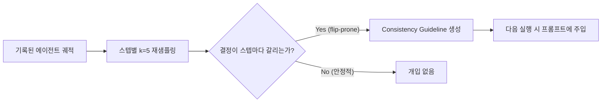

에이전트 벤치마크 리더보드에서 "평균 성공률 77.4%"라는 숫자를 보면 대체로 안심하게 된다. 그런데 같은 에이전트에게 똑같은 작업을 5번 반복시켰을 때 "5번 모두 성공"한 비율이 53.0%뿐이라면 어떨까. IBM Research가 2026년 9월 15일 공개한 ALTK-Evolve의 Consistency Analyzer는 바로 이 간극을 정면으로 다룬다. 평균이 감춰온 불안정성을 스텝 단위로 진단하고, 실제로 그 간극을 절반 가까이 좁히는 방법까지 제시한 연구다.

---

## mean@k와 Pass^k — 같은 숫자를 다르게 읽는 두 가지 방법

에이전트 벤치마크에서 가장 흔한 평가 방식은 **mean@k**다. 같은 작업을 k번(예: 5번) 반복 실행하고 성공 횟수의 평균을 낸다. mean@5가 77.4%라면 "이 에이전트는 대체로 4번 중 3번은 성공한다"는 인상을 준다. 문제는 이 숫자가 **어떤 5번이 성공했는지**는 말해주지 않는다는 점이다. 작업 A는 5번 다 성공하고 작업 B는 5번 다 실패해도, 작업 A·B가 번갈아 절반씩 성공해도 mean@5는 똑같이 나올 수 있다.

IBM Research는 여기에 **Passk**(k번 모두 성공한 작업의 비율)라는 지표를 나란히 놓는다. 그리고 mean@k에서 Passk를 뺀 값을 <strong>일관성 갭(consistency gap)</strong>이라고 부른다. AppWorld 벤치마크의 test_normal 세트(168개 작업)에서 GPT-4.1 기반 ReAct 에이전트를 5회씩 돌린 결과, mean@5는 77.4%였지만 Pass5는 53.0%에 그쳐 24.4%p의 일관성 갭이 드러났다. 같은 에이전트를 "77% 신뢰할 만하다"고 볼지 "절반은 재현이 안 된다"고 볼지가 어떤 지표를 보느냐에 따라 완전히 달라진 것이다.

이 구분이 중요한 이유는 실무에서 에이전트를 쓰는 방식과 직결되기 때문이다. 데모나 벤치마크 리더보드는 mean@k로 보고되지만, 실제 운영 환경에서 에이전트는 매번 다시 실행된다. 사용자 입장에서 중요한 것은 "평균적으로 잘한다"가 아니라 "이번에도 성공할 것인가"이므로, 프로덕션에 배포할 에이전트를 고를 때는 mean@k보다 Passk가 훨씬 실질적인 지표다.

## Consistency Analyzer — 재실행 없이 흔들리는 스텝을 찾아낸다

일관성 갭이 존재한다는 사실을 확인하는 것과, 어느 지점에서 불안정성이 생기는지 찾아내는 것은 다른 문제다. IBM 연구진은 이를 위해 **Consistency Analyzer**라는 진단 도구를 만들었다. 핵심 아이디어는 에이전트를 처음부터 다시 실행하지 않고도 "흔들리기 쉬운(flip-prone)" 결정 지점을 찾는 것이다.

방법은 다음과 같다. 이미 기록된 에이전트 궤적(trajectory)에서 각 의사결정 스텝을 가져와, 그 시점까지의 맥락을 그대로 고정한 채 모델에게 k=5로 재샘플링을 요청한다. 환경과 실제로 상호작용하거나 전체 궤적을 처음부터 다시 실행할 필요가 없으므로, 스텝 하나당 추가 LLM 호출 1회만 들어간다. 5번의 재샘플링 결과가 서로 다른 행동으로 갈리면 그 스텝은 "흔들리는" 지점으로 표시된다.

이 접근의 실용적 강점은 진단 비용이 낮다는 데 있다. 에이전트를 여러 번 다시 돌려 어디서 실패하는지 통계적으로 추정하는 대신, 이미 가진 궤적 하나로 스텝 단위 취약점을 짚어낼 수 있다. ground truth(정답 라벨)도 필요 없다 — 정답을 맞혔는지가 아니라 같은 맥락에서 결정이 얼마나 일관되게 나오는지만 보기 때문이다.

## Consistency Guidelines — 진단을 실제 개선으로 바꾸는 주입 방식

진단만으로는 성능이 좋아지지 않는다. IBM 연구진은 flip-prone으로 표시된 스텝을 ALTK-Evolve의 표준 가이드라인 형식으로 변환해 다음 실행의 프롬프트에 주입하는 **Consistency Guidelines**를 추가했다. 공개된 예시로는 "체크박스 마커를 셀 때는 부분 문자열 매칭 대신 줄 앵커 정규식 매치를 쓸 것", "검색 결과를 검증할 때는 여러 개의 매칭을 확인할 것" 같은, 특정 실패 패턴을 겨냥한 구체적 지시문이 있다. 즉 이 시스템은 모델 가중치를 재학습하지 않고, 과거에 흔들렸던 지점을 콕 집어 프롬프트 수준에서 "이번엔 이렇게 하라"고 알려주는 방식으로 작동한다.

## AppWorld 실험 결과 — 일관성 갭이 24.4%p에서 12.0%p로

Consistency Guidelines를 적용한 뒤 같은 AppWorld test_normal 세트에서 GPT-4.1 기반 ReAct 에이전트를 다시 측정한 결과는 다음과 같다.

| 지표 | 적용 전 | 적용 후 | 변화 |
|---|---|---|---|
| mean@5 (평균 성공률) | 77.4% | 81.0% | +3.6%p |
| Pass5 (5회 전부 성공) | 53.0% | 69.0% | +16.0%p |
| 일관성 갭 (mean@5 − Pass5) | 24.4%p | 12.0%p | −12.4%p |

주목할 부분은 mean@5(+3.6%p)와 Pass5(+16.0%p)의 개선폭이 크게 다르다는 점이다. 평균 성공률만 보면 개선 효과가 작아 보이지만, "매번 성공하는가"를 보면 개선 폭이 훨씬 크다 — 이 방법이 평균을 끌어올리기보다는 **가끔 실패하던 케이스를 안정적으로 성공시키는 방향**으로 작동했다는 뜻이다.

난이도별로 보면 개선폭은 균일하지 않았다. 중간 난이도 작업에서 +14.3%p, 어려운 작업에서 +22.9%p, 쉬운 작업에서 +12.2%p가 개선됐다. 가장 어려운 작업에서 가장 큰 개선이 나타난 셈이다. 또한 가이드라인을 학습에 쓰지 않은 관련 작업에도 적용했을 때 +13.0%p의 성능 향상이 관측돼, 특정 작업 하나에 과적합된 패치가 아니라 어느 정도 일반화되는 지식이라는 근거도 함께 제시됐다.

## 왜 이 연구가 중요한가

벤치마크·리더보드 문화에서 mean@k 하나로 에이전트를 비교하는 관행은 흔하다. 그런데 mean@k가 같은 두 에이전트라도 Passk는 크게 다를 수 있다는 것이 이 연구가 던지는 핵심 메시지다. 예를 들어 에이전트 A는 모든 작업에서 고르게 77%씩 성공하고, 에이전트 B는 절반의 작업을 100% 성공시키고 나머지 절반은 항상 실패한다고 하면, 둘 다 mean@5는 비슷하게 나올 수 있지만 실제 운영 신뢰성은 전혀 다르다. 벤치마크 점수로 모델·에이전트를 선택하는 팀이라면, 평균값 뒤에 이런 분산이 숨어 있을 수 있다는 점을 감안해야 한다.

또한 이 방법론은 "실패했을 때 왜 실패했는지"를 사람이 직접 로그를 뒤져가며 찾지 않아도, 기존 궤적 재샘플링만으로 불안정 지점을 자동으로 좁혀준다는 점에서 실용적이다. 에이전트 운영 파이프라인에 이런 진단 단계를 끼워 넣으면, 새 실패 사례가 나올 때마다 사람이 수작업으로 프롬프트를 고치는 대신 일부를 자동화할 여지가 생긴다.

## 한계와 남은 질문

이 결과를 그대로 일반화하기 전에 짚어야 할 점도 있다. 첫째, 실험은 AppWorld라는 단일 벤치마크와 GPT-4.1 기반 ReAct 아키텍처 하나에 대해서만 보고됐다 — 다른 벤치마크·다른 에이전트 아키텍처(플래너-실행자 분리형, 멀티 에이전트 협업형 등)에서도 같은 폭의 개선이 나올지는 별도 검증이 필요하다. 둘째, 가이드라인이 누적될수록 프롬프트 길이가 늘어나는데, 이것이 토큰 비용이나 다른 작업의 성능에 어떤 영향을 주는지는 이 발표에서 다뤄지지 않았다. 셋째, flip-prone 스텝 탐지 자체가 스텝당 추가 LLM 호출을 요구하므로, 진단 단계의 비용도 무시할 수는 없다 — 다만 전체 궤적을 재실행하는 것보다는 훨씬 저렴하다.

IBM 연구진은 ALTK-Evolve를 오픈소스로 공개하고 재현 가능한 형태로 실험 코드를 제공해, 다른 벤치마크·모델 조합에서의 검증을 커뮤니티에 열어둔 상태다. 이런 종류의 신뢰성 진단 도구가 실제로 널리 쓰이려면, AppWorld를 넘어선 다양한 환경에서의 재현 결과가 뒤따라야 할 것이다.

## 참고 및 출처

- IBM Research, "Your Agent Aced the Task. Will It Do It Again?", Hugging Face Blog (2026-09-15): <https://huggingface.co/blog/ibm-research/altk-evolve-consistency>
- IBM Research, "ALTK-Evolve: On-the-Job Learning for AI Agents", Hugging Face Blog: <https://huggingface.co/blog/ibm-research/altk-evolve>
- IBM Research, "Boost your agents: Introducing ALTK, the open-source agent lifecycle toolkit": <https://research.ibm.com/blog/altk-agent-toolkit>
- GitHub, AgentToolkit/altk-evolve (공식 저장소): <https://github.com/AgentToolkit/altk-evolve>
- AppWorld 벤치마크 공식 사이트: <https://appworld.dev/>
