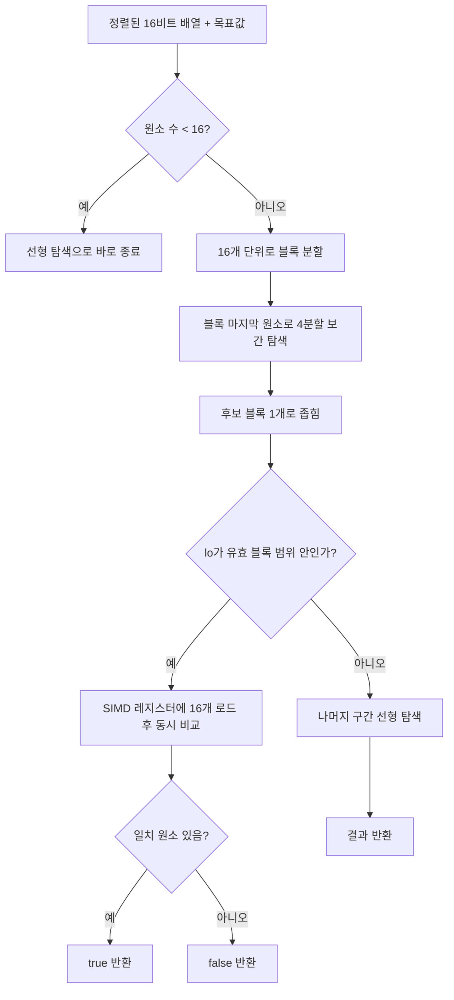

정렬된 배열에서 값을 찾을 때 표준 이진 탐색(`std::binary_search`)보다 빠른 방법이 있다면 믿을 수 있을까. 2026년 4월, 컴퓨터과학 교수이자 SIMD 최적화 연구로 유명한 Daniel Lemire가 바로 그런 알고리즘을 공개했다. 이름은 **SIMD Quad**. Roaring Bitmap 포맷이 실제로 쓰는 16비트 정렬 배열(원소 1개부터 4096개까지)을 대상으로, Intel과 Apple 두 플랫폼 모두에서 예외 없이 표준 이진 탐색을 이겼다. 이 글은 이 알고리즘이 어떤 구조로 설계됐는지, 왜 이진 탐색이 현대 CPU에서 손해를 보는지, 그리고 실제 벤치마크 수치가 무엇을 말해주는지를 코드 수준에서 살펴본다.

## 표준 이진 탐색이 현대 CPU에서 손해를 보는 이유

이진 탐색은 매 반복에서 `mid = (low + high) / 2`를 계산하고, 그 결과로 다음 반복의 `low` 또는 `high`를 갱신한다. 문제는 이 갱신이 직전 반복의 결과에 의존하는 <strong>루프 캐리 종속성(loop-carried dependency)</strong>이라는 점이다. 다음 비교가 무엇을 비교할지는 이전 비교의 결과가 나와야만 알 수 있다. CPU가 분기 예측으로 다음 단계를 미리 추측해볼 수는 있지만, 예측이 틀리면 그 작업은 통째로 버려진다. 결국 이진 탐색은 명령어 수준 병렬성(ILP)을 거의 활용하지 못한 채 순차적인 의존 사슬을 하나씩 따라갈 수밖에 없다.

Lemire는 여기서 두 가지 통찰을 조합했다. 첫째, ARM64와 x64 프로세서는 모두 16비트 정수 8개 이상을 한 번의 명령어로 목표값과 비교할 수 있는 SIMD 명령어를 갖추고 있다 — 그렇다면 이진 탐색처럼 한 번에 원소 하나씩 비교할 이유가 없다. 둘째, 최근 프로세서는 메모리에서 여러 값을 동시에 읽어올 수 있는 메모리 수준 병렬성(MLP)이 뛰어나다 — 그렇다면 배열을 절반씩이 아니라 **4분의 1씩** 좁혀가는 편이, 명령어 수는 조금 늘어나더라도 전체 지연시간에서는 이득일 수 있다. 이 두 통찰이 SIMD Quad의 출발점이다. 이 병렬성 활용 방식은 이 블로그의 이전 글 [벡터화가 빠른 진짜 이유: SIMD 폭이 아니라 병렬성이다](/post/2026-09-06-vectorization-ilp-mlp-not-simd-width/)에서 다룬 "벡터화의 이득은 레지스터 폭이 아니라 ILP·MLP 노출에서 온다"는 결론과 같은 축 위에 있다.

## SIMD Quad의 알고리즘 구조

SIMD Quad는 두 단계로 나뉜다. 먼저 배열을 16개 원소 단위 블록으로 나누고, 각 블록의 마지막 원소를 보간 키로 삼아 **4분할(quaternary) 보간 탐색**으로 목표값이 있을 법한 블록 하나를 빠르게 좁힌다. 후보 블록이 정해지면, 그 16개 원소를 SIMD 레지스터(x64는 SSE2, ARM은 NEON)에 한 번에 로드해 모두 동시에 비교한다. 배열이 16개 미만이면 곧바로 선형 탐색으로 처리하고, 4분할 이후 16개 단위로 나누어떨어지지 않는 나머지 구간도 선형 탐색으로 마무리한다.



핵심은 "한 번에 정확한 값을 찾는 탐색"에서 "블록 하나로 빠르게 좁히고, 그 블록 안에서는 병렬로 검사하는 탐색"으로 문제를 재구성했다는 점이다. 4분할 보간으로 후보를 줄이는 단계는 여전히 순차적이지만, 마지막 16개를 비교하는 단계에서는 종속 사슬 없이 한 번에 결과가 나온다.

## 구현: 실제 코드로 보는 4분할 보간과 SIMD 비교

아래는 Lemire가 벤치마크 저장소에 공개한 `simd_quad` 함수를 옮긴 것이다(원문은 [블로그 부록](https://lemire.me/blog/2026/04/27/you-can-beat-the-binary-search/)과 [GitHub 벤치마크 저장소](https://github.com/lemire/Code-used-on-Daniel-Lemire-s-blog/tree/master/2026/04/26/benchmark)에 있다). 이해를 돕기 위해 한국어 주석만 덧붙였다.

```cpp
// 42jerrykim.github.io에서 더 많은 정보를 확인할 수 있다
#include <cstdint>
#ifdef __ARM_NEON
#include <arm_neon.h>
#else
#include <emmintrin.h>  // SSE2
#endif

// carr: 정렬된 16비트 부호 없는 정수 배열, cardinality: 배열 크기, pos: 찾을 값
bool simd_quad(const uint16_t *carr, int32_t cardinality, uint16_t pos) {
    constexpr int32_t gap = 16;
    // 배열이 16개 미만이면 그냥 선형 탐색
    if (cardinality < gap) {
        for (int32_t j = 0; j < cardinality; j++) {
            if (carr[j] == pos) return true;
        }
        return false;
    }

    int32_t num_blocks = cardinality / gap;
    int32_t base = 0;
    int32_t n = num_blocks;

    // 4분할(quaternary) 보간 탐색: 한 번에 후보 블록 범위를 1/4로 좁힌다
    while (n > 3) {
        int32_t quarter = n >> 2;
        int32_t k1 = carr[(base + quarter + 1) * gap - 1];
        int32_t k2 = carr[(base + 2 * quarter + 1) * gap - 1];
        int32_t k3 = carr[(base + 3 * quarter + 1) * gap - 1];

        int32_t c1 = (k1 < pos);
        int32_t c2 = (k2 < pos);
        int32_t c3 = (k3 < pos);

        base += (c1 + c2 + c3) * quarter;
        n -= 3 * quarter;
    }
    // 후보가 4개 이하로 줄면 이진 탐색으로 마무리
    while (n > 1) {
        int32_t half = n >> 1;
        base = (carr[(base + half + 1) * gap - 1] < pos) ? base + half : base;
        n -= half;
    }
    int32_t lo = (carr[(base + 1) * gap - 1] < pos) ? base + 1 : base;

    if (lo < num_blocks) {
        const uint16_t *blk = carr + lo * gap;
#ifdef __ARM_NEON
        // ARM: NEON으로 16개 원소를 8개씩 두 번에 나눠 동시 비교
        uint16x8_t needle = vdupq_n_u16(pos);
        uint16x8_t v0 = vld1q_u16(blk);
        uint16x8_t v1 = vld1q_u16(blk + 8);
        uint16x8_t hit = vorrq_u16(vceqq_u16(v0, needle), vceqq_u16(v1, needle));
        return vmaxvq_u16(hit) != 0;
#else
        // x64: SSE2로 동일하게 16개를 8개씩 두 번에 나눠 동시 비교
        __m128i needle = _mm_set1_epi16((short)pos);
        __m128i v0 = _mm_loadu_si128((const __m128i *)blk);
        __m128i v1 = _mm_loadu_si128((const __m128i *)(blk + 8));
        __m128i hit = _mm_or_si128(_mm_cmpeq_epi16(v0, needle), _mm_cmpeq_epi16(v1, needle));
        return _mm_movemask_epi8(hit) != 0;
#endif
    }

    // 블록 경계에 걸리지 않는 나머지 구간은 선형 탐색
    for (int32_t j = num_blocks * gap; j < cardinality; j++) {
        uint16_t v = carr[j];
        if (v >= pos) return (v == pos);
    }
    return false;
}
```

`while (n > 3)` 루프가 4분할 보간 탐색이다. 매 반복마다 세 개의 분기점(`quarter`, `2*quarter`, `3*quarter` 지점)을 동시에 계산해 후보 블록 수를 4분의 1로 줄인다. 후보가 4개 이하로 줄면 표준 이진 탐색으로 전환해 정확히 블록 하나를 지목하고, 그 블록의 16개 원소를 SSE2·NEON으로 한 번에 비교한다. 4분할 단계 자체는 여전히 분기를 포함하지만, 저자가 강조하듯 "명령어 수 자체는 제한 요인이 아니다" — 중요한 것은 종속 사슬의 길이를 얼마나 짧게 유지하느냐다.

## 벤치마크: 플랫폼마다 다르게 나타나는 이득

Lemire는 Intel Emerald Rapids(GCC)와 Apple M4(Apple LLVM) 두 시스템에서, 배열 크기 2–4096개 구간마다 10만 개의 정렬 배열을 생성해 각 1000만 회의 멤버십 질의를 콜드 캐시(매 질의마다 다른 배열)와 웜 캐시(같은 배열을 100회씩 연속 질의) 조건으로 측정했다. 결과는 두 플랫폼에서 상반되게 나타났다. Intel 플랫폼에서는 웜 캐시에서 SIMD Quad가 표준 이진 탐색보다 2배 넘게 빨랐고 콜드 캐시에서는 이득이 줄었다. Apple 플랫폼에서는 반대로 콜드 캐시에서 2배 넘는 이득이 나왔고 웜 캐시에서는 이득이 더 작았다. 다만 **모든 측정 조건에서 SIMD Quad가 표준 이진 탐색을 앞섰다**는 점은 두 플랫폼에서 공통이었다.

4분할 보간 자체의 기여도를 따로 떼어보기 위해, 저자는 SIMD 비교는 그대로 두고 4분할 대신 표준 이진 탐색으로 블록을 좁히는 변형(`simd_binary`)도 함께 측정했다. Intel에서는 콜드 캐시의 큰 배열일 때 4분할 쪽이 뚜렷하게 더 빨랐지만, Apple에서는 4분할의 기여가 미미했다. 즉 "SIMD를 쓴 이득"과 "4분할 구조를 쓴 이득"은 서로 다른 요인이고, 플랫폼의 메모리 수준 병렬성 특성에 따라 어느 쪽이 더 크게 작동하는지가 갈린다.

원문은 차트 이미지로만 결과를 보여주는데, 같은 글 댓글에서 독자 Walter가 Apple M1 MacBook Air에서 직접 재현한 실측치(ns/query)를 공개했다. `orlp_lower_bound`는 Orson Peters가 공개한 분기 없는(branchless) 이진 탐색 구현으로, 저자의 원 벤치마크에는 없던 별도 비교 기준선이다.

| 배열 크기 | 모드 | binary_search | simd_binary | simd_quad | orlp_lower_bound(분기없음) |
|---|---|---|---|---|---|
| 64 | cold | 8.074 ns | 4.151 ns | 4.251 ns | 5.948 ns |
| 64 | warm | 7.843 ns | 3.225 ns | 3.730 ns | 5.655 ns |
| 256 | cold | 21.651 ns | 13.970 ns | 9.251 ns | 10.724 ns |
| 256 | warm | 10.081 ns | 4.780 ns | 5.650 ns | 7.064 ns |
| 1024 | cold | 105.724 ns | 48.651 ns | 53.188 ns | 67.511 ns |
| 1024 | warm | 13.250 ns | 7.063 ns | 8.297 ns | 8.851 ns |
| 4096 | cold | 210.640 ns | 97.889 ns | 82.593 ns | 138.318 ns |
| 4096 | warm | 17.811 ns | 11.552 ns | 13.056 ns | 11.357 ns |

*출처: [You can beat the binary search – Daniel Lemire's blog, 댓글(Walter, 2026-04-29)](https://lemire.me/blog/2026/04/27/you-can-beat-the-binary-search/)*

이 표에서 두 가지가 확인된다. 첫째, 4096개 콜드 캐시에서 `simd_quad`(82.593ns)는 `binary_search`(210.640ns)보다 2.55배 빠르다 — 원문이 Apple 플랫폼 콜드 캐시에서 "2배 넘는 이득"이라고 요약한 것과 같은 방향이다. 둘째, 4096개 웜 캐시에서는 오히려 `simd_binary`(11.552ns)가 `simd_quad`(13.056ns)보다 약간 빠르다 — 이는 원문이 말한 "Apple 플랫폼에서는 4분할의 기여가 미미하고 때로는 손해"라는 관찰과 정확히 맞아떨어진다.

## 실전 팁: 자주 하는 오해

벤치마크 수치 하나만 보고 "SIMD Quad가 항상 몇 배 빠르다"는 식으로 단순화하면 실제 워크로드에서 어긋나기 쉽다. 아래 네 가지는 위 벤치마크 결과를 해석할 때 특히 자주 놓치는 지점이다.

1. **"SIMD를 쓰면 무조건 빠르다"는 오해다.** 위 표의 웜 캐시·4096 구간처럼, 4분할 구조를 더한 `simd_quad`가 SIMD만 더한 `simd_binary`보다 오히려 느린 경우가 실측으로 확인된다. SIMD 자체의 이득과 알고리즘 구조 변경의 이득은 서로 다른 요인이며, 플랫폼에 따라 방향이 갈린다.
2. **표준 `std::binary_search`를 기준선으로 삼으면 격차가 과장될 수 있다.** `std::binary_search`는 분기가 있는(branchy) 구현이다. Orson Peters의 분기 없는 이진 탐색([bitwise binary search](https://orlp.net/blog/bitwise-binary-search/))과 비교하면, 위 표의 4096 콜드 기준 `orlp_lower_bound`(138.318ns)와 `simd_quad`(82.593ns)의 격차는 `binary_search` 대비 격차보다 좁다. 스칼라 기준선을 얼마나 잘 최적화했는지에 따라 SIMD 구현의 상대적 이득이 달라 보일 수 있다.
3. **이 알고리즘은 범용 이진 탐색 대체재가 아니다.** 16비트 부호 없는 정수, 최대 4096개 정도의 배열 크기라는 Roaring Bitmap의 실제 사용 패턴에 맞춰 설계됐다. 다른 정수 폭이나 훨씬 큰 배열에 그대로 적용할 수 있다는 보장은 없다.
4. **콜드 캐시와 웜 캐시 결과를 같은 잣대로 읽으면 안 된다.** 같은 알고리즘이라도 캐시 히트 여부에 따라 승자가 바뀐다. 실제 워크로드가 어느 쪽에 가까운지(질의가 같은 배열에 몰리는지, 매번 다른 배열을 스캔하는지)를 먼저 파악해야 벤치마크 수치를 올바르게 해석할 수 있다.

## 평가 기준

이 글을 읽은 뒤에는 다음을 할 수 있어야 한다.

- 표준 이진 탐색이 루프 캐리 종속성 때문에 명령어 수준 병렬성(ILP)을 활용하지 못하는 이유를 설명할 수 있다.
- SIMD Quad의 4분할 보간 탐색 단계와 SIMD 블록 비교 단계가 각각 무엇을 담당하는지 구분해 설명할 수 있다.
- 같은 벤치마크 결과라도 콜드 캐시/웜 캐시, 플랫폼(Intel vs Apple), 비교 기준선(branchy vs branchless)에 따라 다르게 해석해야 하는 이유를 판단할 수 있다.
- 이 알고리즘을 16비트 정수·수천 개 이하 배열이라는 특정 워크로드 밖으로 일반화하면 안 되는 이유를 말할 수 있다.

## 요약

SIMD Quad는 "이진 탐색을 SIMD로 벡터화한다"는 발상이 아니라, 탐색 문제 자체를 "빠르게 후보 블록을 좁히는 4분할 보간 단계"와 "블록 안에서 병렬로 검사하는 SIMD 단계"로 재구성한 설계다. 표준 이진 탐색이 매 반복마다 이전 결과에 의존하는 루프 캐리 종속성에 묶여 있는 반면, SIMD Quad는 마지막 16개 원소 비교에서 이 종속 사슬을 끊는다. Intel과 Apple 두 플랫폼에서 이득의 크기와 원인(SIMD 자체 vs 4분할 구조)은 다르게 나타났지만, 모든 측정 조건에서 표준 이진 탐색을 앞섰다는 결론은 공통이었다. 다만 16비트 정수·최대 4096개라는 Roaring Bitmap 특화 설계이고, 비교 기준선을 분기 없는 이진 탐색으로 바꾸면 격차가 줄어든다는 점은 이 결과를 일반화하기 전에 함께 봐야 할 조건이다.

## 참고 자료

- [You can beat the binary search – Daniel Lemire's blog (2026-04-27)](https://lemire.me/blog/2026/04/27/you-can-beat-the-binary-search/)
- [벤치마크 소스 코드 – Lemire GitHub, Code-used-on-Daniel-Lemire-s-blog](https://github.com/lemire/Code-used-on-Daniel-Lemire-s-blog/tree/master/2026/04/26/benchmark)
- [Bitwise binary search – Orson Peters(orlp.net)](https://orlp.net/blog/bitwise-binary-search/)
- [Eytzinger binary search layout – Algorithmica](https://algorithmica.org/en/eytzinger)
- [벡터화가 빠른 진짜 이유: SIMD 폭이 아니라 병렬성이다 (42jerrykim.github.io)](/post/2026-09-06-vectorization-ilp-mlp-not-simd-width/)
