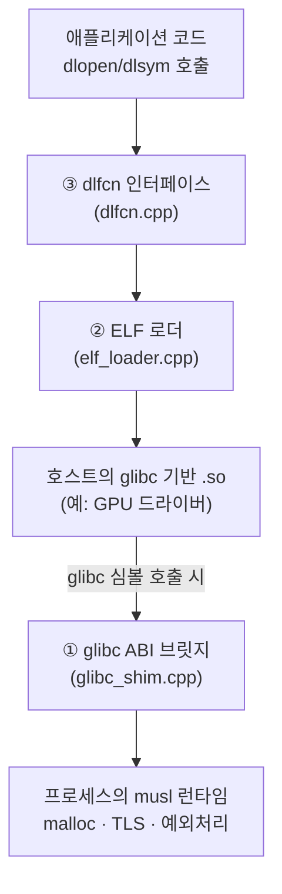

musl로 완전 정적 링크한 실행 파일은 배포가 간단하다 — 의존성이 없으니 컨테이너도 AppImage도 필요 없이 바이너리 하나만 복사하면 어디서든 실행된다. 문제는 GPU 가속이다. NVIDIA·Mesa 드라이버는 이미 호스트에 설치돼 있지만 glibc ABI로 컴파일돼 있어서, musl 프로세스가 그 `.so`를 그냥 `dlopen`하면 프로세스 안에 malloc·TLS(Thread-Local Storage)·예외 처리 방식이 서로 다른 두 런타임이 동시에 존재하게 돼 충돌한다. `pg83/solo`는 이 문제를 "제2의 libc를 프로세스에 두지 않고" 풀겠다고 나선 Linux용 커스텀 ELF 로더다(출처: [pg83/solo GitHub 저장소](https://github.com/pg83/solo)). 이 글은 SoLo가 어떤 구조로 이 문제를 풀었는지, Hacker News·lobste.rs 토론에서 나온 기술적 반론까지 포함해 정리한다.

## 무엇이 문제였는가 — 프로세스 안의 두 런타임

GPU 드라이버(NVIDIA 독점 드라이버, Mesa의 radv·radeonsi 등)는 배포판이 제공하는 glibc 버전에 맞춰 컴파일돼 시스템에 이미 설치돼 있다. musl로 정적 링크한 실행 파일은 이런 glibc 기반 공유 라이브러리를 `dlopen`할 수 없는데, 단순히 심볼이 안 맞아서가 아니라 musl과 glibc가 malloc 구현, TLS 배치 방식, C++ 예외 처리(unwinding) 방식이 서로 다른 별개의 런타임이기 때문이다. 같은 프로세스 안에 두 런타임이 공존하면 스택 언와인딩이나 메모리 할당 시점에 충돌한다. 기존 해법은 컨테이너나 AppImage로 glibc 환경 전체를 함께 배포하는 것이었지만, 이는 "정적 바이너리 하나로 어디서든 실행"이라는 이점을 포기하는 절충이었다.

## 아키텍처 — 3개 계층으로 나눈 해법

SoLo는 이 문제를 세 계층으로 나눠 푼다: ① `dlfcn.cpp`가 표준 `dlopen`/`dlsym` 인터페이스를 그대로 제공하고, ② `elf_loader.cpp`가 호스트의 glibc 기반 `.so`를 직접 프로세스 메모리에 매핑하며, ③ `glibc_shim.cpp`가 그 `.so`가 요구하는 glibc 심볼 호출을 musl 런타임 위의 어댑터로 연결한다(출처: [pg83/solo GitHub 저장소](https://github.com/pg83/solo)). 핵심은 glibc 자체를 프로세스에 로드하지 않는다는 점이다 — "glibc를 실제로 프로세스에 올리는 대신, `malloc@GLIBC_2.2.5` 같은 버전 붙은 심볼을 musl의 동등 기능 위에 ABI 호환되게 얹은 어댑터로 대체한다"는 것이 README의 설명이다(같은 출처).



애플리케이션은 이 구조를 의식할 필요가 없다. 표준 `dlfcn` API만 그대로 호출하면 된다.

```c
#include <dlfcn.h>
#include <stdio.h>

int main(void) {
    // SoLo 환경에서는 이 dlopen 호출이 elf_loader.cpp를 거쳐
    // 호스트의 glibc 기반 Vulkan 드라이버를 musl 프로세스 안으로 매핑한다.
    // 애플리케이션 코드는 표준 dlfcn API만 그대로 본다.
    void *driver = dlopen("libvulkan.so.1", RTLD_NOW);
    if (!driver) {
        fprintf(stderr, "load failed: %s\n", dlerror());
        return 1;
    }
    void *vkCreateInstance = dlsym(driver, "vkCreateInstance");
    printf("vkCreateInstance = %p\n", vkCreateInstance);
    dlclose(driver);
    return 0;
}
```

`elf_loader.cpp`가 실제로 처리하는 작업은 README에 나열돼 있다: "ELF 세그먼트를 매핑하고, `DT_NEEDED`를 따라가 의존 라이브러리를 추적하며, 버전이 붙은 심볼을 해석하고, x86-64 재배치(relocation)를 적용하며, ELF TLS와 TLSDESC를 지원하고, IFUNC를 구체화하며, RELRO를 적용하고, 초기화 루틴을 실행한다"(같은 출처) — 사실상 시스템의 동적 링커(`ld.so`)가 하는 일 대부분을 직접 재구현한 것이다. ELF 세그먼트를 매핑하는 절차 자체는 `<elf.h>`의 표준 프로그램 헤더 구조체로 다음과 같이 나타낼 수 있다.

```c
#include <elf.h>
#include <stdio.h>
#include <stddef.h>

// elf_loader.cpp가 .so 파일을 열 때 가장 먼저 하는 일과 같은 절차:
// 프로그램 헤더에서 PT_LOAD 세그먼트를 찾아 메모리에 매핑할 범위를 계산한다.
void printLoadSegments(const Elf64_Phdr *phdrs, size_t count) {
    for (size_t i = 0; i < count; i++) {
        if (phdrs[i].p_type == PT_LOAD) {
            printf("PT_LOAD: vaddr=0x%lx memsz=0x%lx flags=%u\n",
                   (unsigned long)phdrs[i].p_vaddr,
                   (unsigned long)phdrs[i].p_memsz,
                   phdrs[i].p_flags);
        }
    }
}
```

## TLS 네 가지 모델을 전부 지원하는 이유

ELF는 Thread-Local Storage를 general-dynamic·local-dynamic·initial-exec·local-exec 네 가지 모델로 나눈다. SoLo는 "코드 패치나 래퍼 없이" 네 모델을 전부 지원한다고 밝힌다(출처: [pg83/solo GitHub 저장소](https://github.com/pg83/solo)). general/local-dynamic은 `__tls_get_addr` 호출로, TLSDESC는 커스텀 ABI 리졸버로 처리하고, local-exec는 직접 해석한다. 까다로운 쪽은 initial-exec다 — 이 모델로 선언된 변수는 실행 파일 자체의 static TLS 영역 안에 마련한 16KiB 여유 공간(surplus arena)에 배치되는데, 이 방식이 성립하려면 해당 라이브러리가 **스레드가 생성되기 전에 로드**돼야 한다는 제약이 함께 따라온다(같은 출처). 어떤 모델이 쓰일지는 GCC/Clang의 `tls_model` 속성으로 직접 강제할 수 있다.

```c
// tls_models.c — gcc -O2 -c tls_models.c 로 컴파일 가능
__thread int generalDynamicVar = 0;  // 기본: 바이너리 타입에 따라 컴파일러가 자동 선택

__attribute__((tls_model("initial-exec")))
__thread int initialExecVar = 0;     // 정적 실행 파일에서 흔히 쓰이는 모델: surplus arena에 배치됨

int readBoth(void) {
    return generalDynamicVar + initialExecVar;
}
```

TLS뿐 아니라 C++ 예외도 두 런타임 경계를 넘나든다. "musl 세계에서 던진 예외가 glibc로 컴파일된 프레임을 거쳐 unwind되어 glibc 쪽 catch에 잡히고, 그 반대 방향도 동작하며 양쪽 모두에서 소멸자가 정상 실행된다"는 것이 README의 설명이다(같은 출처). 이는 Itanium C++ ABI의 예외 처리가 애초에 공유 라이브러리 경계를 넘나들도록 설계돼 있다는 점(개별 `.so`가 자신의 언와인드 테이블만 제공하면 됨)을 musl/glibc라는 서로 다른 libc 경계에도 그대로 적용한 것이다.

## 왜 이렇게 설계됐는가

### 문제 상황

정적 바이너리 배포(musl, Go, Rust 등)는 이식성이 큰 장점이지만, GPU 가속처럼 벤더가 glibc ABI로만 배포하는 독점 공유 라이브러리와는 근본적으로 상성이 나빴다. Hacker News 토론에서 okanat은 이 문제의 뿌리를 "glibc·동적 링커(`ld-linux.so`)·GCC·C++ ABI가 서로 얽혀 있고 그 결합 방식이 문서화돼 있지 않다"는 점으로 짚었다 — 여러 런타임이 격리된 심볼 네임스페이스로 공존할 수 있는 Windows와 달리, GNU/Linux 생태계 고유의 설계 문제라는 지적이다(출처: [Hacker News, "Solo" 토론](https://news.ycombinator.com/item?id=49354613)).

### 시도된 대안들

| 대안 | 아이디어 | 왜 충분하지 않았는가 |
|---|---|---|
| 컨테이너 / AppImage | glibc 환경 전체를 바이너리와 함께 배포 | 배포 크기·시작 시간이 늘고, "정적 바이너리 하나"라는 이식성 이점을 사실상 포기하게 됨 |
| 가장 오래된 glibc로 동적 링크 | 지원 대상 중 최소 glibc 버전 기준으로 빌드 | HN에서 danudey가 짚었듯 RHEL7류 구식 빌드 환경을 계속 유지해야 하고, account42의 지적처럼 `DT_HASH` 제거 같은 로더 시맨틱 변화로 예전 가정이 깨짐 |
| LD_PRELOAD 인터포저(`cross-libc-dlopen`) | 호스트 `.so`를 사본으로 재작성해 심볼 버전 요구사항을 우회 | ELF 로더 자체를 재구현하지 않아 glvnd 같은 OpenGL 디스패처 조각이 배포판마다 없는 문제는 별도로 다뤄야 함(출처: [pkgforge-dev/cross-libc-dlopen README](https://github.com/pkgforge-dev/cross-libc-dlopen)) |
| gcompat·Cosmopolitan류 호환 레이어 | musl/다른 런타임 프로세스에 glibc 호환 레이어를 얹음 | SoLo README는 이들과 달리 "듀얼 런타임이 아니라 단일 musl TLS 세계를 유지한다"고 스스로 구분한다(출처: pg83/solo GitHub 저장소) |

### 최종 설계의 핵심 아이디어

"제2의 libc를 프로세스에 로드하지 않는다"는 원칙이 핵심이다. glibc 심볼을 요구하는 드라이버 코드가 있을 때 glibc 런타임 자체를 불러오는 대신, 그 심볼 하나하나를 musl 위에 ABI 호환 어댑터로 얹어 "단일 musl TLS 세계"를 유지한다. lobste.rs에서 anton_samokhvalov는 이 점을 들어 SoLo가 단순한 "detour·Cosmopolitan류 우회"가 아니라 "libc 호환 계층과 자체 dlopen 구현을 결합한" 다른 설계라고 구분했다(출처: [lobste.rs, "Solo: a .so loader for static Linux binaries" 토론](https://lobste.rs/s/dajsxn/solo_so_loader_for_static_linux_binaries)).

### 제약 조건

성능보다 **ABI 정합성**과 **이식성**이 우선순위였다. CI는 x86-64·aarch64 양쪽에서 Debian 최다 설치 패키지 중 2,100개 이상의 호스트 오브젝트 로딩을 검증하고, 현재 Debian 최다 설치 1,000개 패키지 중 약 885개가 검증된 상태다(출처: pg83/solo GitHub 저장소). 실제 배포된 Vulkan 데모는 AMD radv·radeonsi, Intel, NVIDIA GPU에서 Linux 위에, Apple M1에서는 Asahi Linux 위에, 그리고 Android(Termux)와 WSL(Mesa dzn, Direct3D 12 경유)에서도 테스트됐다(출처: [pg83/solo GitHub 저장소](https://github.com/pg83/solo)).

### 만약 이렇게 안 했다면?

SoLo가 없었다면 정적 바이너리로 GPU 가속 기능을 배포하려는 프로젝트는 컨테이너/AppImage로 glibc 환경 전체를 옮기거나(이식성 이점 상실), 지원 대상 중 가장 오래된 glibc 버전에 맞춰 동적 링크하는 수밖에 없었을 것이다 — HN에서 egorfine·danudey가 설명한 "RockyLinux 8이나 RHEL7 같은 구식 환경을 고객이 계속 요구하는" 실무 사례가 후자의 현실적인 비용을 보여준다.

### 남아있는 트레이드오프

가장 날카로운 반론은 HN의 comex가 제기한 **전방 호환성 위험**이다 — glibc가 드라이버가 의존하는 새 심볼을 추가하면, 이미 배포된 SoLo 바이너리는 정적으로 구운 glibc 심볼 어댑터만 갖고 있으므로 그 새 심볼에 접근할 수 없어 재컴파일 없이는 새 드라이버를 지원할 수 없다. lobste.rs의 Cloudef도 비슷한 맥락에서 errno 정의·`dirent` 구조체·표준 입출력 구현이 glibc·musl·bionic마다 미묘하게 달라, 구조체를 경계 너머로 넘길 때 벤더 업데이트가 호환성을 깰 수 있다는 점을 지적했다. 이런 지적에도 불구하고 anton_samokhvalov는 Debian 아카이브의 Mesa/NVIDIA 드라이버를 여러 해에 걸쳐 실제로 로드해본 경험을 근거로 실전에서는 대체로 안정적이었다고 반박했다 — 즉 이론적 위험과 실측 안정성 사이에 아직 합의가 없는 상태다.

## 한계와 검증 상태

README가 명시하는 한계는 세 가지다. 로드는 한 번만 되는 런타임이라 `dlclose()`는 성공을 반환하지만 실제로 이미지를 언로드하지 않고, initial-exec 모델로 선언된 변수는 그 모듈이 로드되기 **이전에** 생성된 스레드에서는 0으로 초기화된 채로 보이며, 아직 구현되지 않은 glibc 호출은 조용히 잘못 동작하는 대신 자기 심볼 이름을 알리며 즉시 abort한다(출처: pg83/solo GitHub 저장소). 라이선스는 MIT다. HN·lobste.rs 토론을 종합하면, SoLo는 "이론적으로 위험하지만 실전에서는 통할 수 있는" 절충으로 받아들여지는 분위기다 — pjmlp가 "패치된 a.out 파일을 재발명한 것"이라고 비판한 반면, cryptonector는 "아무도 안 하려는 일이지만 가능한 일"이라고 평했다.

## 언제 고려할 만한가

정적 바이너리(musl, Go, Rust 등)로 GPU 가속 기능을 배포해야 하는데 대상 환경의 glibc 버전을 통제할 수 없는 경우—오래된 RHEL/CentOS를 쓰는 엔터프라이즈 고객, 또는 배포판이 제각각인 사용자층—라면 검토할 가치가 있다. 반대로 배포 대상이 이미 통제 가능한 단일 환경(자체 관리 서버, 고정된 컨테이너 이미지)이라면 기존 동적 링크나 컨테이너 배포가 더 단순하고 검증된 선택일 수 있다. 현재 2,100개 이상의 호스트 오브젝트로 CI가 검증됐다고는 해도 공식 벤더 지원은 없는 커뮤니티 프로젝트이므로, 도입 전 자신의 실제 드라이버 조합으로 직접 테스트해보는 편이 안전하다.

## 이 글을 읽고 나면 판단할 수 있어야 하는 것

SoLo 같은 접근을 실제로 도입할지 검토하기 전에, 아래 질문에 스스로 답할 수 있는지 확인해보면 이 글의 핵심을 제대로 짚었는지 가늠할 수 있다.

- SoLo가 "제2의 libc를 프로세스에 로드하지 않는다"는 원칙을 왜 택했는지, 컨테이너·AppImage로 glibc 환경 전체를 배포하는 방식과 무엇이 근본적으로 다른지 설명할 수 있는가?
- initial-exec TLS 모델로 선언된 변수가 왜 "스레드가 생성되기 전에 로드돼야" 하는 제약을 갖는지, surplus arena 개념으로 설명할 수 있는가?
- comex가 제기한 전방 호환성 위험이 구체적으로 어떤 시나리오(glibc가 새 심볼을 추가하는 상황)에서 발생하는지 설명할 수 있는가?
- 자신이 배포해야 하는 환경이 "통제 가능한 단일 환경"인지 "다양한 glibc 버전이 섞인 환경"인지에 따라 SoLo·동적 링크·컨테이너 중 어느 쪽이 더 합리적인지 판단 기준을 하나 이상 들 수 있는가?

## 참고 및 출처

- [pg83/solo — GitHub 저장소](https://github.com/pg83/solo)
- [pg83/solo — 최신 릴리스](https://github.com/pg83/solo/releases/latest)
- [Hacker News, "Solo" 토론](https://news.ycombinator.com/item?id=49354613)
- [lobste.rs, "Solo: a .so loader for static Linux binaries" 토론](https://lobste.rs/s/dajsxn/solo_so_loader_for_static_linux_binaries)
- [pkgforge-dev/cross-libc-dlopen — GitHub 저장소](https://github.com/pkgforge-dev/cross-libc-dlopen)
