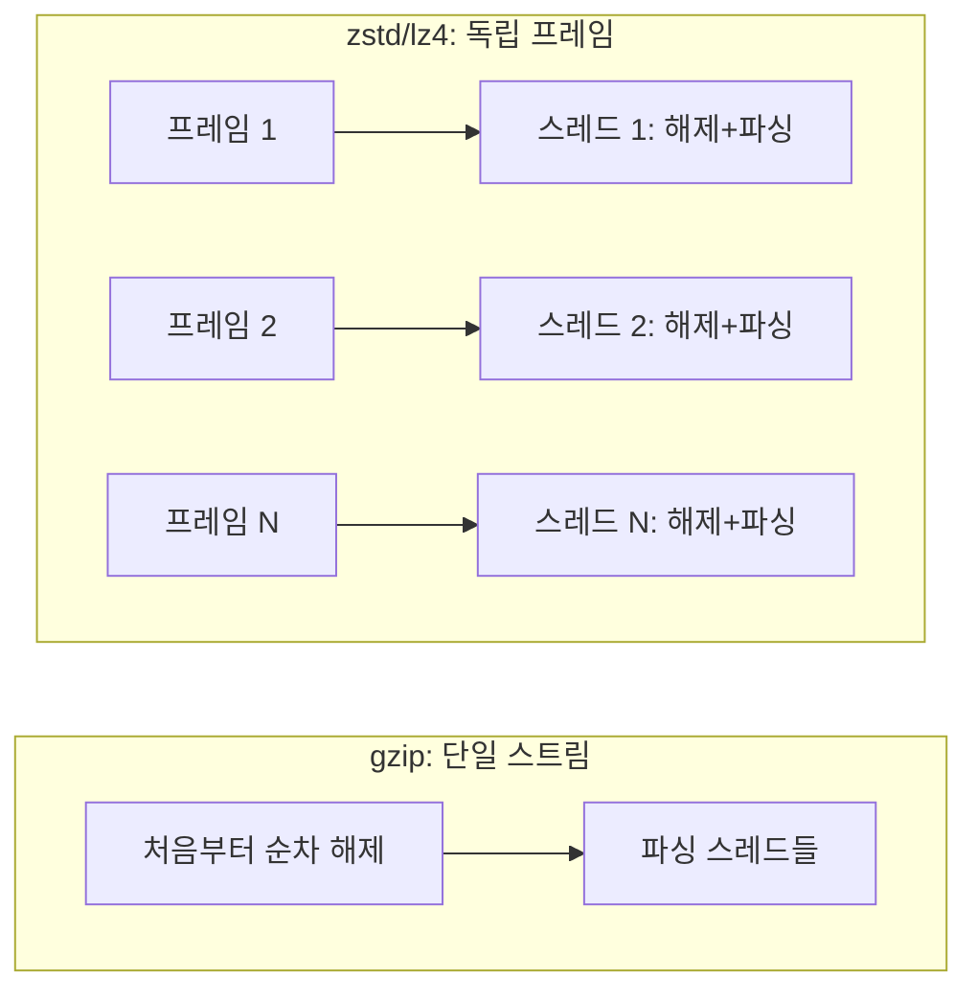

로그·이벤트 데이터는 대개 줄마다 JSON 하나인 NDJSON(JSON Lines)으로 쌓이고, 디스크 절약을 위해 gzip으로 압축된다. 이런 파일을 읽는 병목은 보통 JSON 파싱이라고 생각하지만, simdjson으로 파싱을 충분히 빠르게 만들고 나면 병목은 압축 해제로 옮겨 간다. Daniel Lemire는 2026년 10월 1일 블로그 글에서 압축된 NDJSON을 압축 해제와 파싱을 합쳐 멀티스레드로 처리해, zstd 파일 기준 64스레드에서 40 GB/s를 얻었다고 보고했다(출처: [Parsing compressed JSON at 40 GB/s](https://lemire.me/blog/2026/10/01/parsing-compressed-json-at-40-gb-s/)). 같은 데이터를 gzip으로 두면 64스레드로도 2.5 GB/s였다. 이 글은 이 16배 차이가 어디서 나오는지, 그리고 그 대가가 무엇인지를 정리한다.

## 측정 조건부터 확인하자

수치를 인용하기 전에 조건을 못 박아 둔다. 데이터는 레코드 500만 개, 812 MB짜리 NDJSON이고 Lemire 본인이 "합성된, 매우 반복적인 데이터"라고 설명한다. 하드웨어는 2소켓 Intel Xeon Gold 6548N(Emerald Rapids, 64코어·128스레드), 컴파일러는 GCC 14다(출처: 위 블로그 글). 결과는 다음과 같다.

| 포맷 | 스레드 | 처리량 | 파일 크기 |
|------|--------|--------|-----------|
| gzip | 1 | 약 1.1 GB/s | 56.9 MB |
| gzip | 64 | 2.5 GB/s | 56.9 MB |
| zstd (256 KiB 프레임) | 64 | 40 GB/s | 60.6 MB |
| lz4 (256 KiB 프레임) | 64 | 34 GB/s | 108.5 MB |

원문 비압축 파일은 812.0 MB다. 글의 저자도 "여러분의 데이터는 더 느리게 풀릴 수 있다"고 단서를 달았다. 반복이 많은 합성 데이터는 압축 해제가 유난히 빠르므로, 40 GB/s는 상한에 가까운 숫자로 읽어야 한다. 이 글에서 일반화할 수 있는 것은 절대 수치가 아니라 "gzip 멀티스레드 대비 zstd 프레임 분할이 한 자릿수 이상 앞선다"는 구조적 차이다.

## 왜 gzip은 스레드를 늘려도 빨라지지 않는가

압축 해제를 병렬화하려면 파일을 여러 조각으로 나눠 각 스레드가 자기 조각을 독립적으로 풀 수 있어야 한다. gzip(DEFLATE)은 앞서 나온 데이터를 참조하는 슬라이딩 윈도우 위에서 동작하므로, 스트림 중간에서 시작하면 그 앞의 데이터를 모른 채로는 해석할 수 없다. 그래서 파일 전체가 하나의 연속 스트림인 일반 gzip 파일은 처음부터 순서대로 풀 수밖에 없다. 위 표에서 gzip의 64스레드 처리량이 1스레드의 두 배 남짓에 그친 이유다. 이 경우 스레드는 압축 해제를 나누는 데 쓰이는 것이 아니라, 압축 해제 한 스레드와 파싱 스레드를 파이프라인으로 연결하는 정도의 역할만 한다. 이 구성은 simdjson 데모의 "스트림 기반" 방식에 해당하며, 한 스레드가 풀고 나머지가 큐에서 꺼내 파싱한다(출처: [simdjson_compressed_demo](https://github.com/simdjson/simdjson_compressed_demo)).

## 해법: 독립 프레임으로 쪼개서 압축한다

zstd와 lz4는 파일을 여러 개의 독립 프레임(frame)으로 이어 붙인 형태를 허용한다. 각 프레임은 앞 프레임에 의존하지 않으므로 어느 스레드든 자기 프레임만 있으면 압축 해제를 시작할 수 있다. 실험에서는 압축할 때 입력을 256 KiB 단위로 잘라 프레임 하나씩으로 만들었다. 병렬화에 필요한 정보도 프레임에 있다. Lemire에 따르면 각 프레임은 압축 해제 후 크기와 체크섬을 저장하고, 프레임이 어디서 끝나는지 알려면 몇 개의 블록 헤더만 읽으면 된다(출처: 위 블로그 글). 즉 파일을 한 번 훑어 프레임 경계 목록을 만든 뒤, 스레드들이 프레임을 나눠 가져가 "압축 해제 + 파싱"을 한 덩어리로 처리한다.



## 프레임 경계와 JSON 문서 경계는 다르다

압축 프레임은 바이트 단위로 자르므로, 256 KiB 경계가 JSON 레코드 한가운데에 떨어질 수 있다. 데모는 이 문제를 NDJSON의 성질로 푼다. 문서 안에는 날 줄바꿈이 없으므로, 압축 해제한 버퍼를 마지막 줄바꿈 직후에서 자르고 남은 부분 줄은 다음 청크로 넘긴다(출처: simdjson_compressed_demo). 이렇게 해야 `iterate_many`가 항상 온전한 문서만 받는다. `iterate_many`는 공백으로 구분된 여러 JSON 문서를 스트림으로 처리하는 simdjson API로, 사용법은 아래와 같다(출처: [simdjson iterate_many 문서](https://github.com/simdjson/simdjson/blob/master/doc/iterate_many.md)).

```cpp
#include <iostream>
#include "simdjson.h"
using namespace simdjson;

int main() {
  auto json = R"({ "foo": 1 } { "foo": 2 } { "foo": 3 })"_padded;
  ondemand::parser parser;
  ondemand::document_stream docs = parser.iterate_many(json);
  for (auto doc : docs) {
    std::cout << doc["foo"] << std::endl;  // 1 2 3
  }
}
```

문서에 따르면 `iterate_many`는 파서 객체 하나가 메모리를 한 번만 할당해 재사용하며, 배치 크기는 가장 큰 문서보다 커야 하고 1 MB가 실용적인 지점이다. 스레드는 메인과 워커 최대 두 개를 쓰므로, 64스레드 확장은 `iterate_many` 자체가 아니라 프레임을 스레드별로 나누는 바깥 구조에서 나온다.

## 대가: 압축률이 약 6% 나빠진다

프레임을 작게 자르면 압축기가 볼 수 있는 이전 데이터의 범위가 프레임 안으로 제한되므로 압축률이 떨어진다. 실측으로 zstd 256 KiB 프레임 파일은 60.6 MB로, gzip의 56.9 MB보다 약 6% 크다. 처리량 16배(2.5 → 40 GB/s)를 얻는 데 치르는 값이다. lz4는 속도 쪽으로 더 기운 선택이어서 파일이 108.5 MB로 gzip의 거의 두 배지만 34 GB/s를 낸다. 프레임 크기는 이 트레이드오프의 손잡이다. 더 크게 잡으면 압축률이 개선되는 대신 병렬 단위가 거칠어지고, 더 작게 잡으면 그 반대가 된다. 이 실험은 256 KiB 한 가지 값만 보고하므로 최적점이 어디인지는 이 글의 근거로는 알 수 없다.

## 실전에서 적용할 때의 판단

- **이미 gzip으로 쌓인 대량 데이터**: 파서를 바꾸기 전에 한 번 프레임 분할 zstd로 재압축하는 쪽이 이득이 큰지 따져 본다. 읽는 횟수가 쓰는 횟수보다 훨씬 많은 데이터일수록 유리하다.
- **스토리지가 병목인 경우**: 6% 크기 증가는 무시할 만하지만, lz4처럼 크기가 두 배가 되는 선택은 저장·전송 비용과 맞바꿔야 한다.
- **코어가 적은 환경**: 40 GB/s는 64스레드 서버의 수치다. 스레드가 몇 개뿐이면 이득은 그만큼 줄어든다고 보는 것이 안전하다. 코어 수에 따른 확장 곡선은 원문에 없으므로 직접 측정해야 한다.
- **NDJSON이 아닌 JSON**: 줄 단위로 문서가 끊기지 않는 하나의 거대한 JSON 배열에는 이 경계 처리 방식이 그대로 통하지 않는다.

## 요약

병렬 압축 해제의 열쇠는 코덱의 속도가 아니라 파일이 독립적으로 풀 수 있는 조각으로 나뉘어 있는가였다. gzip 단일 스트림은 이 조건을 만족하지 못해 64스레드에서도 2.5 GB/s에 머물렀고, 256 KiB 독립 프레임으로 만든 zstd는 같은 하드웨어에서 40 GB/s를 냈다. 대가는 gzip 대비 약 6%의 파일 크기 증가였다. 다만 합성·반복 데이터와 2소켓 64코어라는 조건 위의 수치이므로, 자신의 데이터에서 같은 구조를 재현해 보는 것이 먼저다.

## 참고 자료

- [Daniel Lemire, "Parsing compressed JSON at 40 GB/s" (2026-10-01)](https://lemire.me/blog/2026/10/01/parsing-compressed-json-at-40-gb-s/)
- [simdjson/simdjson_compressed_demo](https://github.com/simdjson/simdjson_compressed_demo)
- [simdjson `iterate_many` 문서](https://github.com/simdjson/simdjson/blob/master/doc/iterate_many.md)
