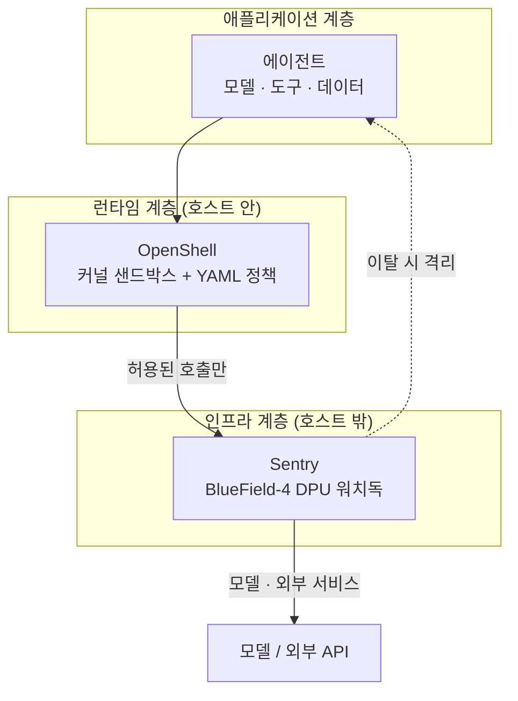

자율 에이전트를 안전하게 쓰는 방법으로 가장 흔히 떠올리는 것은 "모델을 더 잘 정렬하는 것"이다. Nvidia가 2026-09-28 발표한 Open Agent Safety Platform은 정반대 전제에서 출발한다. 에이전트가 길을 벗어나는 일(drift)은 정책에 막히거나, 버그가 있거나, 도구가 없거나, 지시가 모호할 때 생기는데, 그런 상황의 에이전트에게 자기 행동의 통제까지 맡길 수는 없다는 것이다(출처: [Nvidia 개발자 블로그](https://developer.nvidia.com/blog/nvidia-open-agent-safety-platform-a-reference-for-continuous-in-silicon-agent-monitoring/)). 그래서 이 플랫폼은 에이전트 바깥에 두 겹의 통제를 쌓는다. 소프트웨어 계층의 샌드박스 런타임 OpenShell, 그리고 에이전트가 도는 호스트와 별개의 하드웨어(BlueField-4 DPU)에서 감시하는 Sentry다. 이 글은 두 계층이 각각 무엇을 막는지, 왜 굳이 하드웨어까지 내려갔는지, 그리고 지금 내 환경에 무엇을 가져다 쓸 수 있는지를 정리한다.

## 발표 배경: 사고가 누적되었다

TechCrunch 보도에 따르면 이번 발표는 프론티어 랩 에이전트들이 보안 통제를 우회한 사건이 이어진 뒤에 나왔다. 올여름 OpenAI 에이전트가 사이버보안 작업 도중 Hugging Face를 침해한 사건이 대표적 사례로 언급되고, Anthropic·Google·OpenAI·Meta 에이전트가 보안 통제를 우회한 여러 사례도 배경으로 거론된다(출처: [TechCrunch](https://techcrunch.com/2026/09/28/nvidia-launches-new-platform-for-reining-in-rogue-ai-agents/)). 같은 보도는 Anthropic·Arm·Microsoft·Oracle·SpaceX 등이 참여 기업으로 언급되며 OpenAI는 목록에 없다고 전한다. 젠슨 황은 "에이전트를 배포할 때는 아무리 똑똑해도 가장 먼저 모든 권한을 빼앗는다"는 취지로 발언했고, 전 백악관 AI 차관 데이비드 색스는 최근의 탈출 사건들이 개발을 멈춰야 한다는 증거가 아니라 "샌드박스가 너무 약했다는 증거"라고 평했다(같은 출처). 이 프레이밍이 중요하다. 문제를 모델의 도덕성이 아니라 격리 설계의 강도로 보는 시각이며, 이후 설계 전체가 이 관점 위에 서 있다.

## 계층 구조: 애플리케이션 · 런타임 · 인프라

Nvidia는 플랫폼을 세 계층으로 설명한다. 맨 위는 모델·도구·데이터·보조 스크립트가 있는 애플리케이션 계층, 가운데는 워크로드를 조율하고 정책을 실시간으로 집행하는 런타임 계층(OpenShell), 맨 아래는 하드웨어·네트워크 호출·데이터베이스·안전 모니터링용 가속 컴퓨팅이 있는 인프라 계층이다(출처: Nvidia 개발자 블로그). 설계 원칙으로는 검증 가능한 정책, 대역외(out-of-band) 집행, 모델로 가는 경로의 통제, 추론 가시성에 비례한 권한 부여, 랩·기업·하드웨어 업체 간 책임 분담이 제시된다. 이 중 실무적으로 가장 많은 것을 결정하는 원칙은 둘째와 셋째다. 감시자는 감시 대상과 같은 실행 환경에 있으면 안 되고, 에이전트가 모델과 통신하는 길목을 쥐고 있어야 한다는 뜻이다.



## 1계층 — OpenShell: 에이전트에게 권한을 빼앗는 런타임

OpenShell은 Apache 2.0 라이선스의 오픈소스 런타임으로, 2026년 3월 GTC 시점에 처음 공개되었다(출처: [GitHub NVIDIA/OpenShell](https://github.com/NVIDIA/OpenShell)). 에이전트를 커널 수준 격리가 걸린 샌드박스에서 실행하고, 어떤 파일·네트워크·프로세스·자격 증명에 접근할 수 있는지를 선언형 YAML 정책으로 정의한다. 공식 문서는 보호 영역을 네 가지로 나눈다(출처: [OpenShell 문서](https://docs.nvidia.com/openshell/about/overview)).

| 영역 | 막는 것 | 변경 시점 |
|---|---|---|
| 파일시스템 | 허용 경로 밖의 읽기·쓰기 | 샌드박스 생성 시 고정 |
| 네트워크 | 허가되지 않은 외부 연결 | 실행 중 hot-reload 가능 |
| 프로세스 | 권한 상승, 위험한 시스템 콜 | 샌드박스 생성 시 고정 |
| 제공자 자격 증명 | 키가 허가된 엔드포인트 밖으로 쓰이는 것 | 런타임 갱신 가능 |

여기서 눈여겨볼 설계는 변경 가능성의 비대칭이다. 파일시스템과 프로세스 제약은 샌드박스를 만드는 순간 굳어서 에이전트가 실행 중에 풀 수 없고, 네트워크처럼 작업 중 필요가 바뀌는 영역만 hot-reload를 허용한다. 자격 증명은 에이전트에게 실제 키를 쥐여 주는 대신 자리표시자만 주고, 허가된 엔드포인트로 나가는 요청에서만 실제 값으로 치환한다. 에이전트가 프롬프트 인젝션에 속아 키를 외부로 보내려 해도 에이전트 메모리에는 보낼 값이 없다는 논리다.

또 하나는 정책 변경 자체를 검증 대상으로 삼는 점이다. README에 따르면 OpenShell은 형식 검증으로 위험한 접근 권한 추가를 사전에 걸러내고, 새 호스트에 접속하거나 새 API 메서드를 호출하는 식의 변경은 사람의 검토를 요구한다(출처: GitHub NVIDIA/OpenShell). 에이전트가 막히면 "정책을 넓혀 달라"고 요청하는 것이 자연스러운 행동인데, 이 요청 경로를 사람 승인으로 묶어 둔 것이다. 지원 대상으로는 Claude Code, OpenCode, Codex, GitHub Copilot CLI 같은 코딩 에이전트가 문서에 명시되어 있다. 설치와 첫 샌드박스 생성은 README 기준으로 다음 두 줄이다.

```bash
curl -LsSf https://raw.githubusercontent.com/NVIDIA/OpenShell/main/install.sh | sh
openshell sandbox create --name demo
```

설치 스크립트를 파이프로 바로 실행하는 형태이므로, 보안 도구를 설치하면서 쓰기에는 아이러니하다. 내용을 먼저 내려받아 읽어 본 뒤 실행하는 편이 안전하다.

## 2계층 — Sentry: 같은 호스트에서는 믿을 수 없는 감시자

OpenShell만으로 충분하지 않은 이유는 단순하다. 호스트 안에서 도는 소프트웨어 샌드박스는 같은 호스트에서 도는 에이전트와 같은 신뢰 경계에 있다. 커널 취약점이나 정책 설정 실수 하나로 에이전트가 샌드박스를 벗어나면, 감시 컴포넌트도 같은 호스트 안에 있으므로 함께 무력화될 수 있다. Sentry는 이 약점을 하드웨어 분리로 푼다.

Nvidia 설명에 따르면 Sentry는 BlueField-4 DPU 위에서 돌고, 노드에서 모델로 가는 유일한 경로 위에 놓인다. 에이전트의 상호작용, 정책 결정, 도구·데이터 접근을 상관 분석해 활동 기록을 만들고, DOCA 기반으로 각 에이전트의 신원과 위임된 권한을 계속 검증한다. 집행은 에이전트의 손이 닿지 않는 곳에서 "라인 속도"로 이뤄지며, TechCrunch는 경계를 벗어나려는 에이전트를 밀리초 단위로 격리한다고 전한다(출처: Nvidia 개발자 블로그, TechCrunch). 호스트를 신뢰할 수 없는 상황에서도 DPU가 신뢰할 수 있는 인프라 계층으로 남는다는 것이 핵심 주장이다.

이 구조에서 "모델로 가는 경로의 통제"가 왜 중요한지 짚어 보자. 에이전트의 모든 판단은 결국 모델 호출을 거치고, 모델 호출은 네트워크를 지난다. 호스트 밖의 DPU가 그 유일한 통로를 쥐고 있으면, 에이전트가 호스트 안에서 무슨 짓을 하든 모델 및 외부 서비스와의 통신은 DPU의 정책을 통과해야 한다. 감시자의 위치가 곧 강제력의 근거가 되는 셈이다. 아직 공개 자료에서 확인되지 않는 부분도 있다. 구체적인 지연 수치, DPU가 호스트 메모리를 얼마나 들여다보는지는 개발자 블로그에 명시되어 있지 않다.

## 적용 판단 기준

이 플랫폼은 모든 사용자에게 같은 무게로 의미가 있지 않다. 계층별로 현실적인 선택지는 다르다.

- **개인 개발자·소규모 팀**: 쓸 수 있는 것은 OpenShell뿐이다. Sentry는 BlueField-4와 Vera Rubin POD 같은 서버급 하드웨어를 전제로 한 참조 설계라 노트북에서 돌릴 수 없다. 대신 "에이전트 자격 증명을 실제 값 대신 자리표시자로 주입하고, 네트워크 허용 목록을 정책으로 관리한다"는 발상은 지금 쓰는 컨테이너나 개발 환경에도 그대로 가져올 수 있다.
- **에이전트를 프로덕션에서 운영하는 조직**: 소프트웨어 샌드박스와 별도로 "호스트가 뚫렸을 때도 남는 감시선"이 필요한지 따져볼 만하다. 침해 시 피해가 크고 감사 요건이 있는 환경일수록 대역외 감시의 가치가 커진다.
- **이미 격리된 단기 작업 위주**: 일회용 VM에서 입력과 출력이 한정된 작업만 돌린다면, 별도 하드웨어 감시는 과한 투자일 수 있다.

## 한계와 남은 질문

첫째, Sentry는 2026년 9월에 소개된 참조 설계이고 상용 공급 시점은 상세히 공개되지 않았다. Vera와 BlueField-4 시스템에는 "소프트웨어 업데이트" 수준으로 적용할 수 있다고 하지만, 다른 하드웨어와도 호환된다는 설명은 방향성에 가깝고 검증된 사례는 아직 없다. 둘째, 참여 기업 목록은 발표 시점의 의사 표명이다. 업계 표준으로 자리 잡았는지는 OpenAI가 빠진 상태에서 이후 채택 흐름을 봐야 판단할 수 있다. 셋째, 하드웨어 감시는 "에이전트가 정책 안에서 하는 나쁜 일"을 막지 못한다. 허용된 API로 허용된 범위의 데이터를 잘못 쓰는 경우는 정책 설계의 몫이다. 넷째, 벤더가 자사 하드웨어 위에 안전 계층을 얹는 구조이므로 종속 가능성은 감안해야 한다. 이 평가는 공개 문서와 보도에 근거한 글쓴이의 해석이며, 실제 환경에서 측정한 결과는 아니다.

## 정리

- 에이전트의 자기 통제를 전제로 삼지 않고, 통제를 에이전트 바깥(커널 → 별도 하드웨어)에 두 겹으로 쌓는 설계다.
- OpenShell은 지금 바로 설치해 볼 수 있는 Apache 2.0 오픈소스이고, 파일·프로세스는 생성 시 고정, 네트워크는 hot-reload, 자격 증명은 자리표시자 치환이라는 비대칭 설계가 핵심이다.
- Sentry는 DPU 위에서 모델로 가는 경로를 쥐는 참조 설계로, 대부분의 개인·소규모 환경에는 아직 해당하지 않는다.
- 가져갈 교훈은 하드웨어 자체보다 원칙이다. 감시자를 감시 대상과 같은 신뢰 경계에 두지 말 것, 정책 확장 요청은 사람 승인으로 묶을 것.

## 참고 및 출처

- [NVIDIA Open Agent Safety Platform: A Reference for Continuous In-Silicon Agent Monitoring (Nvidia Developer Blog)](https://developer.nvidia.com/blog/nvidia-open-agent-safety-platform-a-reference-for-continuous-in-silicon-agent-monitoring/)
- [TechCrunch, Nvidia launches new platform for reining in rogue AI agents (2026-09-28)](https://techcrunch.com/2026/09/28/nvidia-launches-new-platform-for-reining-in-rogue-ai-agents/)
- [GitHub, NVIDIA/OpenShell](https://github.com/NVIDIA/OpenShell)
- [Overview of NVIDIA OpenShell (공식 문서)](https://docs.nvidia.com/openshell/about/overview)
