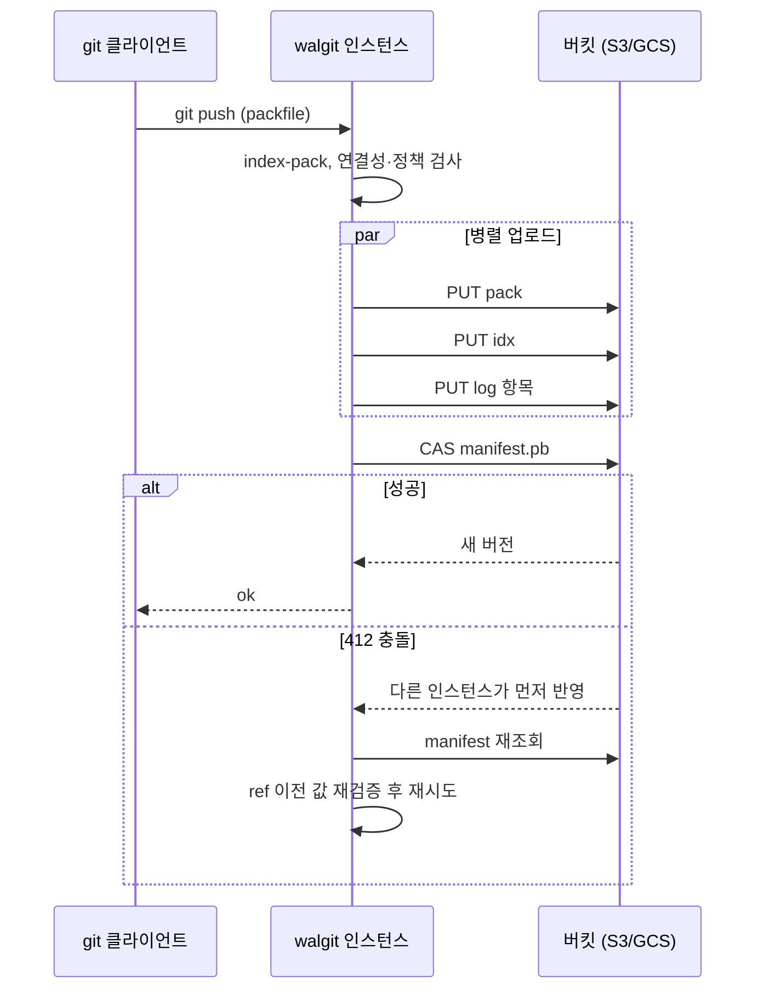

Git 저장소를 호스팅하는 일은 생각보다 어렵다. 단일 서버 앞에 HTTP 데몬을 두면 동작은 하지만, 저장소를 여러 머신에 두려는 순간 가용성·일관성·운영 복잡도 문제가 한꺼번에 나타난다. Shopify CEO Tobi Lütke가 공개한 walgit은 이 문제에 "서버가 아무 상태도 갖지 않고, 저장소는 버킷 안에 있다"는 답을 낸다. README는 스스로를 "오브젝트 스토어 앞에 놓인 바이너리 하나"로 소개하며, 데이터베이스도 리더도 중요한 로컬 상태도 없다고 설명한다(출처: [GitHub tobi/walgit](https://github.com/tobi/walgit)). 이 글은 walgit이 어떤 설계 위에 서 있는지, push와 read가 실제로 어떻게 흘러가는지, 그리고 아직 어디까지 믿을 수 있는지를 정리한다.

## 왜 Git 호스팅은 어려운가: packfile

walgit이 재구현한 원 설계는 Cursor의 Vicent Martí가 2026-08-18에 쓴 「Git at any scale」이다(출처: [Cursor 블로그](https://cursor.com/blog/git-at-any-scale)). 이 글이 지적하는 어려움의 뿌리는 **packfile**이다. Git은 객체를 크기가 작아지도록 압축·delta화해 큰 바이너리 팩에 담고, 팩 안의 객체 배치는 커밋 그래프의 순서와 무관하다. 그래서 어떤 Git 연산이든 수 GB 팩 위를 임의 접근으로 걷게 된다. 로컬 NVMe나 페이지 캐시 위에서는 문제가 없지만 네트워크 파일시스템 위에서는 치명적이다. 같은 글은 GitHub가 초기에 NFS, GFS2, DRBD 같은 분산 파일시스템을 시도하다 모두 한계에 부딪혔다고 서술한다.

이후 업계 표준이 된 해법이 GitHub의 **Spokes**다. 실제 저장소를 로컬 NVMe에 두어 업스트림 `git`이 그대로 일하게 하고, push마다 packfile은 모든 복제본에 팬아웃한 뒤 참조 변경(reference transaction)만 3단계 커밋(3PC)으로 합의한다. 일관성은 강하게 보장되지만 대가가 있다. 저장소가 어느 머신들에 있는지 매핑하는 데이터베이스, 고정된 복제본 집합, 복제본마다 해야 하는 repack 같은 "펫(pet) 서버 무리"를 운영해야 한다.

## Continuity의 전환: 로그가 진실이고 디스크는 캐시다

Cursor의 Continuity는 이 경제성을 뒤집는다. 핵심 원칙은 한 문장이다. **오브젝트 스토리지 안의 write-ahead log(WAL)를 진실의 원천으로 두고, 디스크 위의 모든 저장소를 캐시로 취급한다.**

- push는 WAL 항목으로 S3에 저장되며, 완전히 영속화되기 전에는 클라이언트에 확인(ack)하지 않는다.
- 업로드만으로는 공개되지 않는다. WAL 인덱스 객체가 갱신되어야 보이는데, 이 갱신이 S3의 compare-and-swap(CAS)이다. 선출도 쿼럼도 프라이머리 개념도 필요 없이, 서로 경쟁하는 두 인스턴스 중 하나만 이긴다.
- 읽기는 매번 기대하는 ETag로 조건부 GET을 보낸다. 304(본문 없음)면 최신이므로 곧바로 서비스하고, 200이면 새 WAL 인덱스로 따라잡는다. Cursor는 이 메타데이터 전용 연산이 평균 10ms 미만이라고 쓴다.
- 압축(compaction)은 프라이머리만 수행하고 결과를 WAL에 게시한다. 복제본은 repack하지 않고 이미 만들어진 팩을 내려받는다.

(출처: Cursor 블로그, 위 링크). 결과적으로 "이 저장소는 어느 서버에 있나?"라는 질문이 사라진다. 저장소는 어디에든 있을 수 있고, 없으면 WAL에서 만들어 내면 된다.

## walgit: 같은 설계를 작은 머신에 맞게 다시 쓰다

walgit은 이 설계를 Rust로 구현하되, README가 밝히는 대로 "저장소보다 작은 머신에서 돌릴 수 있도록" 변경을 더했다. 지원 범위는 smart HTTP v0/v2, Git LFS, 웹 UI와 JSON API, 저장소별 push 정책(`policy.json`), WAL을 tail하는 webhook 브리지, S3 호환 스토어(AWS, MinIO, R2, Ceph 등)와 GCS다(출처: [walgit README](https://github.com/tobi/walgit)). 배포는 설정 파일 하나와 `walgit serve` 한 번으로 끝나고, 같은 버킷을 가리키는 머신을 더 띄우면 아무 조율 없이 같은 저장소를 서비스한다. 모든 머신을 꺼도 잃는 것은 캐시의 온기뿐이다.

버킷 안의 저장소는 다음과 같이 구성된다(`repos/<owner>/<repo>/` 아래).

| 객체 | 성격 | 역할 |
|---|---|---|
| `manifest.pb` | 작음, CAS로 재기록 | head 시퀀스, 살아 있는 팩 집합, 체크포인트 포인터, 설정. 선형화 지점 |
| `log/<seq>.pb` | 불변 | PUSH·COMPACT·CHECKPOINT·SETTINGS 항목 |
| `wal/<checksum>.pack` 등 | 불변, 내용 주소 | 팩과 idx·rev·bitmap·commit-graph 부속 파일 |
| `checkpoints/<seq>/` | 불변 | ref 스냅샷과 팩 목록. 콜드 스타트는 "스냅샷 + 꼬리" |
| `leases/` | CAS + TTL | 인스턴스 간 유일한 뮤텍스(예: 압축 담당) |

### push 한 번의 흐름

README 설명을 따라가면 push는 이렇다. receive-pack이 `git index-pack --fix-thin --rev-index`로 팩을 인덱싱하고, 연결성과 정책을 검사한 뒤, 팩·idx·로그 항목을 병렬로 업로드하고, 마지막에 manifest를 CAS한다. CAS가 412로 실패하면 다시 읽어 각 ref의 이전 값을 재검증하고 재시도한다. 같은 인스턴스에서 같은 저장소로 동시에 들어온 push는 하나의 CAS로 묶는다(group commit). 클라이언트는 버킷에 반영된 뒤에야 `ok`를 받는다.

핵심은 CAS 이전의 모든 일이 외부에서 보이지 않고, 이후의 일은 멱등이며 재생 가능하다는 점이다. README는 이를 "manifest CAS가 유일한 커밋 지점"이라는 불변식으로 적어 둔다.

### read와 "서버가 저장소보다 작을 때"

읽기는 manifest 조건부 GET 한 번으로 시작한다. 304면 로컬 사본으로 서비스하고, 200이면 새 항목을 적용한다. "적용"의 깊이는 요청이 필요로 하는 만큼만 달라진다. 광고(advertisement)와 API는 refs 수준(스냅샷 + 로그에서 `packed-refs`만 만들고 팩은 받지 않음)이면 충분하고, 서빙은 이 머신이 담을 수 있는 팩만, repack은 전체를 로컬에 둔다. 여기에 walgit이 추가한 것이 두 가지다. 저장소의 큰 팩이 인스턴스에 아예 들어가지 않을 때 HTTP range 요청으로 읽는 **remote reader**, 그리고 커밋·트리는 로컬에 두고 블롭만 버킷에 남기는 **history pack**이다. 배치(placement)는 추론이 아니라 설정이다. 어떤 저장소의 객체 작업을 어느 호스트가 맡을지 glob으로 지정하고, 모노레포는 SSD가 있는 호스트에 둔다.

## 설계의 비용 모델: 버킷 왕복이 예산이다

이 구조에서 성능을 결정하는 것은 CPU가 아니라 **버킷 왕복(round trip) 횟수**다. walgit 저장소의 `docs/ROUNDTRIPS.md`는 연산별 요청 수를 표로 관리한다. 예를 들어 체크포인트는 "신선도 조건부 GET → refs PUT과 체크포인트 PUT 병렬 → manifest CAS"로 3라운드·4요청, 리스 획득은 GET 후 CAS로 2요청, 설정 게시는 3라운드이며 읽는 쪽 추가 비용은 0이라고 적혀 있다(출처: [ROUNDTRIPS.md](https://raw.githubusercontent.com/tobi/walgit/main/docs/ROUNDTRIPS.md)). README의 불변식 목록에도 "정확한 것만으로는 부족하다. 모든 프로토콜 변경은 버킷 왕복 수로 평가한다"가 들어 있다. 오브젝트 스토리지 위에 시스템을 쌓을 때 어떤 지표를 예산으로 삼아야 하는지를 보여 주는 좋은 사례다.

## git3와 무엇이 다른가

같은 "오브젝트 스토리지 위의 Git" 계열인 git3는 클라이언트가 S3 조건부 쓰기로 ref를 직접 갱신해 서버 프로세스 자체를 없앤다. walgit은 서버를 남기되 그 서버를 상태 없는 캐시로 만든다. 서버를 남기는 이유는 분명하다. 정책 집행(보호된 ref, fast-forward 전용), 인증(token·OIDC), 웹 UI, webhook, 압축·점검 같은 유지보수 루프는 호출하는 쪽이 아니라 상주하는 쪽이 맡아야 하기 때문이다. 어느 쪽이 낫다기보다, 팀에 필요한 것이 "서버 없는 단순함"인지 "서버가 제공하는 기능을 가진 단순한 운영"인지에 따라 갈린다.

## 도입 전에 알아야 할 한계

- **성숙도**: README 자체가 packfile 마이그레이션 문서에서 "보호된 저장소와 보호된 URI 클라이언트, 대형 저장소 성능은 여전히 릴리스 게이트"라고 적고 있다. bundle 런타임도 제거된 상태여서 기존 클라이언트 설정 점검이 필요하다(출처: walgit README).
- **성능 수치**: 프로젝트 소개의 "30GB 클론이 서버에 킬로바이트만 건드린다" 류 주장은 프로젝트 자체 서술이며 제3자 벤치마크로 확인된 바 없다.
- **커뮤니티 평가**: Hacker News 토론에서는 README 문체를 "AI slop"이라 비판하는 의견과, 스타 급증이 기술 완성도보다 저자의 지명도 덕이라는 지적이 함께 나왔다(출처: [Hacker News](https://news.ycombinator.com/item?id=49420598)). 공개 직후라 독립적인 검증이 부족하다.
- **의존성**: 버킷의 조건부 쓰기(CAS)·조건부 GET 의미론이 정확해야 일관성이 성립한다. 호환 스토어를 쓴다면 이 계약부터 확인해야 한다.

## 적용 판단

| 상황 | 판단 |
|---|---|
| 개인·소규모 팀의 셀프호스팅, 저장소 수가 많고 개별 트래픽은 낮음 | 후보. 인스턴스 하나와 버킷 하나로 시작 가능 |
| 에이전트가 수천 개의 작은 저장소를 만들고 버리는 워크로드 | 후보. 유휴 저장소는 디스크에서 사라지고 WAL에서 재생성 |
| 수십 GB 모노레포, 높은 CI 동시 clone | 설계 의도에는 맞으나 현 시점에서는 자체 검증 필수 |
| 엄격한 감사·권한 모델이 이미 GitHub·GitLab에 묶여 있음 | 대체보다 개념 학습용으로 가치 |

이 글에서 가져갈 일반 원칙은 하나다. 상태가 필요한 시스템에서도 "무엇이 진실인가"를 하나의 불변 로그와 하나의 CAS 지점으로 좁히면, 나머지 서버는 일회용이 된다. walgit의 현재 완성도와 별개로, 이 구조는 분산 시스템을 설계할 때 "합의를 직접 구현하는 대신 스토리지의 원자 연산에 위임할 수 있는가"를 묻게 만든다.

## 참고 자료

- [GitHub — tobi/walgit (README)](https://github.com/tobi/walgit)
- [walgit 프로젝트 페이지](http://pages.tobi.lutke.com/walgit/)
- [walgit ROUNDTRIPS.md](https://raw.githubusercontent.com/tobi/walgit/main/docs/ROUNDTRIPS.md)
- [Cursor — Git at any scale (Vicent Martí, 2026-08-18)](https://cursor.com/blog/git-at-any-scale)
- [Hacker News 토론](https://news.ycombinator.com/item?id=49420598)
