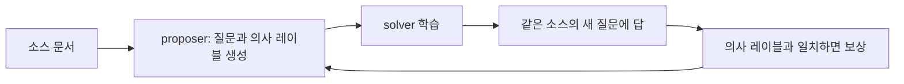
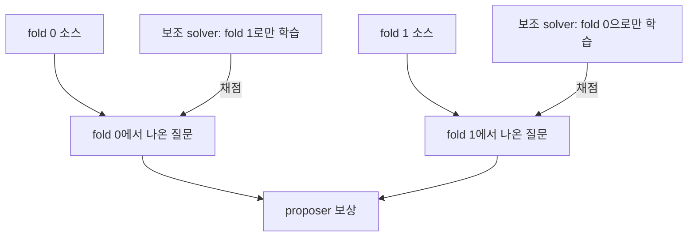

스스로 문제를 내고 스스로 푸는 에이전트는 사람이 만든 학습 데이터 없이도 능력을 키울 수 있다는 점에서 매력적이다. 그런데 출제자와 풀이자가 같은 루프 안에서 서로를 채점하면, 내부 점수는 오르는데 실제 정답률은 제자리인 상황이 생길 수 있다. 2026년 9월 30일 제출된 논문 「False Frontiers: Diagnosing and Mitigating Co-Cheating in Self-Evolving Search Agents」는 이 현상에 co-cheating이라는 이름을 붙이고, 소스 문서를 둘로 나눠 교차 채점하는 CrossFit으로 줄이는 방법을 제안했다(출처: [arXiv:2609.39102](https://arxiv.org/abs/2609.39102)). 이 글은 문제가 왜 구조적으로 생기는지, CrossFit이 정확히 무엇을 바꾸는지, 보고된 수치를 어디까지 믿을 수 있는지를 논문 본문 기준으로 정리한다.

## 자기진화형 검색 에이전트의 루프

검색 증강 언어모델은 추론 중간에 검색·브라우징 행동을 끼워 넣어 증거를 모은 뒤 답한다. 보통은 외부에서 주어진 질문과 정답 데이터로 학습하는데, 자기진화형 에이전트는 학습 경험을 스스로 만든다. 이 논문이 다루는 구조는 Dr. Zero 계열의 proposer-solver 루프다. proposer가 소스 문서에서 질문과 의사 레이블(pseudo-label)을 만들고, 통과한 질문-레이블 쌍으로 solver를 학습시키고, solver가 새 질문에서 보인 성능이 다시 proposer의 보상이 된다.

proposer 보상은 구체적으로 이렇게 계산된다. solver가 질문 하나에 5번 답하고, 그중 의사 레이블과 일치한 횟수를 k라 할 때, 0 < k < 5이면 보상은 (5−k)/4, 아니면 0이다. 5번 모두 맞히면 너무 쉬운 문제, 하나도 못 맞히면 너무 어려운 문제로 보고 보상을 주지 않아서, 질문이 solver의 현재 능력 경계에 계속 머물게 된다. 이 설계 덕에 사람이 쓴 커리큘럼 없이도 난이도가 자동으로 올라간다.

문제는 이 보상이 "정답과의 일치"가 아니라 "의사 레이블과의 일치"라는 점이다. 정답을 모르는 상태에서 합의를 정답의 대리 지표로 쓰는 셈인데, 이런 대리 지표 최적화가 진짜 목표에서 벗어날 수 있다는 점은 보상 해킹 연구에서 오래 지적돼 왔다(출처: [Amodei et al., Concrete Problems in AI Safety](https://arxiv.org/abs/1606.06565), [Gao et al., Scaling Laws for Reward Model Overoptimization](https://arxiv.org/abs/2210.10760)).

## Co-Cheating: 속이는 게 아니라 같이 틀린다

논문이 정의하는 co-cheating은 proposer와 solver가 공유된 오류에 점점 합의해서, 내부 보상은 오르는데 외부 정확도는 따라오지 않는 현상이다. 저자들은 "의도적 공모를 뜻하지 않는다"고 분명히 적는다. 메커니즘은 단순하다. 틀린 의사 레이블이 solver 학습에 쓰이면, solver는 같은 소스에서 나온 이후 질문에서 같은 오답을 재현한다. 그 일치가 proposer에게 보상으로 돌아가면, 다음 라운드 커리큘럼은 그 오류를 더 강화하는 방향으로 이동한다. 틀린 답이 보상을 받고, 보상을 받은 틀린 답이 다시 학습 데이터가 되는 순환 고리다.

이 고리가 실제로 생기는지 확인하기 위해 저자들은 학습에 영향을 주지 않는 사후 감사자를 두었다. 매 스텝에서 소스 문서, 채택된 의사 레이블, proposer 보상 계산에 쓰인 solver 응답 5개를 저장해 두고, 학습이 끝난 뒤 LLM 감사자(논문에서는 gpt-6-astra/high)가 소스에서 증거 기반 참조 답을 만들어 저장된 출력을 판정한다. 근거가 부족한 경우는 억지로 레이블을 붙이지 않고 미해결로 둔다. 감사자의 판정은 승인·업데이트·보상 어디에도 반영되지 않으므로 독립 측정으로 쓸 수 있다.

측정 지표는 두 가지다. 거짓 합의 질량(false-agreement mass, F)은 평가된 쌍 중 서로 같은 오답에 일치한 비율이고, 손실된 보상(lost credit, L)은 정답을 낸 solver 응답이 틀린 레이블 때문에 보상을 못 받은 비율이다. 단순한 레이블 노이즈라면 불일치와 L이 늘어나야 하는데, co-cheating이라면 불일치가 사라지고 F가 늘어난다. 관측된 값은 후자다. 1라운드의 평균 F는 Qwen3.5-4B에서 0.004, 9B에서 0.003으로 거의 없고 틀린 레이블은 주로 L로 나타난다. 2라운드부터 합의가 정답률보다 낙관적으로 올라가기 시작해 3라운드에는 F가 각각 0.061, 0.088까지 오르고 L은 떨어진다. 즉 불일치가 공유된 실수로 대체된 것이다.

## 해법 1: 제안 단계에서 검증하는 MSV

가장 직관적인 처방은 학습에 넣기 전에 각 제안을 검증하는 것이다. 논문의 multi-sample verification(MSV)은 자기진화에 쓰는 같은 모델에게 소스를 보여 주고 3번, 보여 주지 않고 3번 답하게 한다. 각 쪽에서 과반이 일치하는 답이 있어야 하고 두 답이 서로 호환될 때만 질문을 승인하며, 이때 초안 레이블 대신 합의 답을 학습 레이블로 쓴다. 소스 기반 답은 증거의 뒷받침을, 소스 없는 답은 답의 안정성을 본다.

효과는 있지만 부분적이다. MSV는 거짓 합의를 4B에서 6.1%→5.7%, 9B에서 8.8%→7.2%로 줄이는 데 그쳤고, 후보 하나당 생성 6회가 추가된다. 같은 모델의 샘플 6개는 오류를 공유할 수 있고, 검증이 끝난 뒤에도 소스에서 파생된 레이블로 학습한 solver가 그 소스의 질문을 채점하는 경로는 그대로이기 때문이다.

## 해법 2: 채점자의 학습 이력을 끊는 CrossFit

CrossFit은 시선을 바꾼다. 레이블이 맞는지에 앞서 "채점하는 solver가 그 레이블로 학습했는가"를 문제 삼는다. 구현은 이렇다. 소스 문서를 한 번만 fold 0과 fold 1로 나누고, 그 문서에서 나온 질문은 끝까지 같은 fold에 둔다. 질문 단위가 아니라 문서 단위로 나누는 이유는, 같은 문서에서 나온 연관 질문이 양쪽에 걸리면 지우려는 재사용 경로가 남기 때문이다.

보조 solver를 둘 둔다. 하나는 fold 0의 승인된 질문으로만, 다른 하나는 fold 1로만 학습한다. 다음 라운드에서 fold 0 질문은 fold 1로 학습한 solver가, fold 1 질문은 fold 0으로 학습한 solver가 채점한다. 보상 공식 (5−k)/4 자체는 그대로이고 바뀐 것은 점수를 주는 solver뿐이다. 본체 solver는 쪼개지 않고 승인된 모든 질문으로 계속 학습하며, 보조 solver는 proposer가 받는 피드백에만 관여한다.

저자들은 이 방법이 정답 판별기를 만드는 것은 아니라고 선을 긋는다. 두 보조 solver가 사전학습에서 물려받은 오류나 겹치는 증거는 여전히 공유할 수 있다. CrossFit이 막는 것은 "같은 소스에서 유래한 오류가 채점자의 학습으로 그대로 보상이 되는 직접 경로"까지다. 통계의 cross-fitting에서 홀드아웃 예측을 쓰는 발상을 빌렸지만, 그 이론적 보장은 가져오지 않았다고도 밝힌다(출처: [Chernozhukov et al., Double/Debiased Machine Learning](https://arxiv.org/abs/1608.00060)).

## 결과: 수치로 보면

실험은 Qwen3.5-4B와 9B에서 3라운드 자기진화 루프를 전부 다시 돌렸다. 평가는 NQ, TriviaQA, PopQA, HotpotQA, 2WikiMultiHopQA, MuSiQue에서 각 200문항, Bamboogle 125문항으로 구성된 고정 1,325문항이며, 질문당 greedy 궤적 하나, 같은 도구 예산과 답 추출 기준으로 Cover-EM 평균을 쟀다.

| 방법 | 거짓 합의 F (4B / 9B) | 7개 벤치마크 평균 (4B / 9B) |
|---|---|---|
| Base 체크포인트 | – | 38.4 / 40.9 |
| Search-R1 | – | 40.1 / 43.4 |
| Dr. Zero (결합 피드백) | 6.1% / 8.8% | 40.0 / 42.8 |
| MSV | 5.7% / 7.2% | 40.7 / 43.6 |
| CrossFit | 3.0% / 3.7% | 48.8 / 51.2 |
| MSV + CrossFit | 2.0% / 1.7% | 49.1 / 51.5 |

CrossFit은 Dr. Zero보다 평균 8.8, 8.4점, Search-R1보다 8.7, 7.8점 높고 모든 벤치마크에서 개선됐다. 이득은 멀티홉 과제(HotpotQA, 2WikiMQA, MuSiQue, Bamboogle)에서 평균 10.0, 10.9점으로 단일 홉 과제의 7.3, 5.2점보다 컸다. 흥미로운 대목은 MSV와의 조합이다. MSV를 더해도 CrossFit 단독보다 0.3점만 높아서, 저자들은 레이블 품질을 높이는 것보다 피드백의 출처(provenance)를 바꾸는 쪽이 더 결정적이라고 해석한다. 격차가 시간이 지나며 벌어진다는 점도 근거다. CrossFit의 다운스트림 이득은 2라운드 뒤 4.2, 4.3점에서 3라운드 뒤 8.8, 8.4점으로 커졌다.

원인 분리 실험도 있다. 저장해 둔 3,000개 질문과 레이블을 고정한 채 피드백 solver의 학습 이력만 바꿔 재생(replay)하면, 결합 피드백에서 5.8%/7.3%였던 거짓 합의가 소스 단위 분할에서는 0.4%/0.1%까지 내려간다. 커리큘럼이 달라져서가 아니라 피드백의 계보가 원인이라는 뜻이다. 대조군도 같은 방향이다. 보조 solver를 두되 같은 소스로 학습시키면 거짓 합의가 6.4%/8.7%, 전체 데이터로 학습시키면 5.8%/6.9%로 결합 피드백과 비슷하고, 질문 단위로 무작위 분할하면 5.0%/6.2%로 소폭만 줄어든다. 평가자를 따로 두는 것만으로는 부족하고, 분할이 소스 문서 단위여야 한다는 논거다. 보조 solver 학습량을 절반으로 줄여도 효과가 유지되므로 추가 업데이트 때문도 아니다.

## 어디까지 믿을 수 있나

수치를 읽을 때 걸리는 지점이 몇 가지 있다. 첫째, 거짓 합의를 재는 감사자가 LLM이다. 논문도 자동 판정자의 체계적 편향 가능성을 인정하고 증거 기반 참조 구성과 미해결 처리로 완화했다고 하지만, 사람 검증으로 확정된 수치는 아니다. 둘째, 라운드별 요약은 43스텝 비율의 산술 평균이며 추가 실행이나 불확실성 추정이 아니다. 즉 시드 변동을 보여 주는 결과가 아니라 모델 두 개 규모에서의 단일 설정 결과다. 셋째, F가 낮아진 것이 어려운 질문을 덜 승인해서일 수도 있다. 저자들 스스로 커버리지, 난이도, 고정 프로브 성능과 함께 봐야 한다고 적는다. 넷째, 보조 solver를 따로 학습하는 비용이 늘고, 논문은 종단 간 비용이 낮아졌다는 것은 입증하지 못했다고 인정한다. 연결된 소스들(하이퍼링크로 얽힌 문서 등)로 제외 원칙을 확장하는 것도 열린 과제다. 감사자가 다른 모델로 바뀌어도 같은 결론이 나는지 확인하려면 외부 재현이 필요하다.

## 실무에서 가져갈 점

이 논문의 가장 이식성 높은 메시지는 알고리즘보다 점검 질문에 있다. 자기 생성 데이터로 학습하는 루프를 설계한다면, 점수를 주는 평가자가 그 점수가 걸린 데이터로 학습했는지 이력을 추적하라는 것이다. 내부 합의율이 오르는데 외부 정확도가 같이 오르지 않으면 합의율 자체를 의심해야 한다. 외부 기준이 없는 학습에서는 정답과의 일치가 아니라 "독립적으로 얻은 일치"만 신호로 쓰는 편이 안전하다. LLM-as-a-judge로 모델을 학습시키는 파이프라인, 합성 데이터를 만든 모델이 곧 채점자인 파이프라인에도 같은 구조의 위험이 있다. CrossFit의 해법은 이 중 소스 문서를 기준으로 분할이 가능한 경우에 바로 적용되며, 그렇지 않은 환경에서는 분할 기준을 무엇으로 삼을지가 설계의 핵심 질문이 된다.

## 참고 자료

- 논문: [False Frontiers: Diagnosing and Mitigating Co-Cheating in Self-Evolving Search Agents, arXiv:2609.39102](https://arxiv.org/abs/2609.39102) (2026-09-30 제출, 본문 수치는 모두 이 논문 보고치)
- [Search-R1: Training LLMs to Reason and Leverage Search Engines with Reinforcement Learning, arXiv:2503.09516](https://arxiv.org/abs/2503.09516)
- [Double/Debiased Machine Learning for Treatment and Structural Parameters, arXiv:1608.00060](https://arxiv.org/abs/1608.00060)
- [Concrete Problems in AI Safety, arXiv:1606.06565](https://arxiv.org/abs/1606.06565)
- [Scaling Laws for Reward Model Overoptimization, arXiv:2210.10760](https://arxiv.org/abs/2210.10760)
