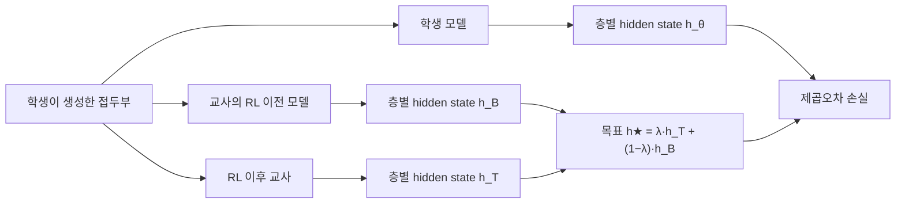

On-policy distillation(OPD)은 학생 모델이 스스로 생성한 궤적 위에서 교사 모델의 출력 분포를 따라가도록 학습시키는 증류 방식이다. 학생이 실제로 마주칠 상태에서 교사의 피드백을 받기 때문에 노출 편향이 줄고, RL로 강화된 교사의 능력을 작은 모델로 옮기는 후처리 단계로 널리 쓰이기 시작했다. 2026년 9월 29일 제출된 논문 「The Teacher Is a Direction, Not a Destination」은 여기서 한 걸음 더 나아가 "교사를 따라 하는 데서 멈추지 말고, 교사가 RL로 움직인 방향을 더 밀어 보자"는 문제를 표현공간(hidden state)에서 풀었다(출처: [arXiv:2609.36484](https://arxiv.org/abs/2609.36484)). 이 글은 출력공간 외삽이 왜 불안정한지, RIDE(RL-Induced Direction Extrapolation)가 그것을 어떻게 우회하는지, 그리고 보고된 수치를 어디까지 믿을 수 있는지를 정리한다.

## 배경: 교사를 넘어서려는 OPD와 그 불안정성

표준 OPD의 목적함수는 학생이 샘플링한 토큰마다 학생과 교사 분포 사이의 KL을 줄이는 것이다. 이를 "교사 대 참조 모델의 로그확률 비율"을 보상으로 삼는 KL 제약 강화학습으로 다시 읽으면, 보상에 곱하는 배율을 1보다 크게 잡는 순간 학생이 교사보다 더 멀리 가도록 유도할 수 있다. 이것이 ExOPD(출력공간 reward extrapolation)의 아이디어이며, 배율이 1보다 크면 학생이 교사의 능력 경계를 넘을 수 있고 참조 모델을 교사의 RL 이전 체크포인트로 바꾸면 보상 신호가 더 정확해진다고 보고됐다(출처: [arXiv:2602.12125](https://arxiv.org/abs/2602.12125)).

그런데 RIDE 논문은 이 출력공간 외삽에 구조적 약점이 두 가지 있다고 지적한다. 하나는 언어모델의 출력층이 표현 변화를 비대칭적으로 감쇠시킨다는 점이다. RL이 hidden state를 크게 바꿔 놓아도 그 변화 중 상당 부분은 unembedding을 지나면서 로짓에 거의 반영되지 않는다. 다른 하나는 로그확률 비율이 샘플링된 토큰에 의존하는 확률적 추정량이라 노이즈가 있고, 외삽 배율이 1에서 멀어질수록 이 노이즈가 증폭된다는 점이다. 논문은 출력공간 외삽에서 조건부 분산이 (λ−1)²에 비례해 커진다고 분석한다(출처: [arXiv:2609.36484 HTML 판](https://arxiv.org/html/2609.36484)).

## RIDE의 핵심: 표현공간 잔차를 외삽한다

RIDE의 출발점은 관찰이다. RL 학습은 베이스 체크포인트 대비 모델의 표현을 층마다 측정 가능한 방향으로 이동시킨다. 그렇다면 그 이동 자체를 학습 신호로 삼을 수 있다. 같은 학생 생성 접두부(prefix)에 대해 고정된 교사 π_T와 그 RL 이전 체크포인트 π_B를 각각 통과시키면 층 l, 위치 t에서 잔차 Δ = h_T − h_B를 얻는다. 이 벡터가 "RL이 이 위치의 이 층에서 표현을 어느 쪽으로 밀었는가"에 해당한다.

학생이 맞추는 목표는 교사 지점에서 멈추지 않고 그 방향으로 더 나아간 점이다. 논문은 목표를 h★ = λ·h_T + (1−λ)·h_B로 정의한다. λ=1이면 교사의 hidden state를 그대로 회귀하는 on-policy representation distillation(OPRD)이 되고, λ>1이면 교사를 지나친 지점이 목표가 된다. 손실은 학생 hidden state와 stop-gradient를 건 목표 사이의 제곱오차이며, 모든 층과 응답의 마지막 2,000개 위치를 지도한다(출처: [arXiv:2609.36484 HTML 판](https://arxiv.org/html/2609.36484)).

이 구성의 이점은 수학적으로 깔끔하게 설명된다. 논문에 따르면 RIDE 목적함수는 잔차를 방향으로 하는 선형 보상 (λ−1)·⟨h−h_T, Δ⟩에 이차 페널티 ½‖h−h_T‖²를 더한 것을 최대화하는 문제와 같다. 출력공간 KL 제약 RL의 표현공간 대응물인 셈이다. 또 목표가 롤아웃이 주어지면 결정적으로 정해지므로 토큰 샘플링에서 오는 조건부 분산이 0이다. 출력공간 외삽이 (λ−1)²로 분산이 커지는 것과 대비되는 지점이다.

## 실험 결과

실험은 네 쌍의 (베이스, RL 교사) 조합에서 수행됐다. R1-Distill-1.5B와 JustRL-DeepSeek-1.5B, Qwen3-4B와 Just-Qwen3-4B, Llama-3.2-3B와 Just-Llama-3.2-3B, Phi-4-mini와 Just-Phi-4-mini다. 학습 프롬프트는 DAPO-Math-17K에서 뽑았고 500 스텝, 시드 3개(14, 42, 2027)로 돌렸다. 평가는 AIME24·AIME25·AIMO에 대한 Avg@16이다.

| 방법 | R1-1.5B | Qwen3-4B | Llama-3.2-3B | Phi-4-mini |
|---|---|---|---|---|
| 교사 | 55.30 | 65.59 | 13.01 | 17.96 |
| OPRD | 54.50 | 62.01 | 10.94 | 17.33 |
| ExOPD (출력공간 외삽) | 49.87 | 48.75 | 6.95 | 12.22 |
| RIDE (λ=1.25) | 56.38 | 66.07 | 13.33 | 18.30 |

*수치는 논문 HTML 판 표를 옮긴 것이며 저자의 자체 실험 결과다.*

표에서 눈에 띄는 것은 두 가지다. 첫째, RIDE만 네 쌍 모두에서 교사를 넘었다. OPRD 대비 격차는 0.97–4.06점이다. 둘째, 같은 λ로 출력공간 외삽(ExOPD)을 적용하면 오히려 OPRD보다 크게 나빠졌다. 이는 "외삽 자체가 나쁜 것이 아니라 어느 공간에서 외삽하느냐가 문제"라는 논문의 주장과 맞아떨어진다. 다만 교사를 넘은 폭은 0.3–1.1점으로 크지 않으므로, 시드 간 분산을 감안하면 "교사에 필적하거나 소폭 상회"로 읽는 편이 정직하다.

λ 민감도도 흥미롭다. R1-Distill-1.5B에서 λ를 키워 가면 성능이 λ=1.25 부근에서 정점을 찍고 λ=2.0에서는 52.4%로 떨어진다. 이 스윕의 절대값은 주 표(56.38)와 평가 설정이 달라 보이므로 값 자체보다 곡선의 모양, 즉 1.35까지는 안정적이고 그 이후 하락한다는 점만 취한다. 반면 ExOPD는 λ=1을 넘으면 급격히 나빠져 λ=2에서 46.2%까지 내려갔다고 보고된다.

## 왜 효과가 나는가: 감쇠와 방향 통제 실험

논문은 두 가지 분석으로 메커니즘을 뒷받침한다. 먼저 출력층 감쇠다. 잔차의 hidden state 에너지 중 79.8%가 가장 약한 512개 head 방향에 실려 있는데, 이 방향들이 중심화된 로짓 에너지에서 차지하는 비중은 30.0%에 그친다. 즉 RL이 바꿔 놓은 표현 변화의 큰 몫이 출력 분포에서는 잘 보이지 않으므로, 로짓 비율에 기대는 출력공간 방법은 이 신호를 덜 활용한다는 설명이다.

더 설득력 있는 것은 방향 통제 실험이다. 같은 노름의 무작위 방향으로 외삽하면 55.04%, 방향을 뒤집으면(λ=0.75) 53.90%, 다른 모델 쌍에서 가져온 잔차를 쓰면 54.75%, 궤적이 어긋난 잔차를 쓰면 55.12%였고, 올바른 잔차를 쓴 RIDE는 56.38%였다. 무작위 방향도 54–55%대를 유지한다는 사실은, 이득의 일부가 "표현공간 회귀로 학습이 안정되는 효과"에서 오고 나머지 약 1.6점이 RL 유도 방향이라는 정보에서 온다는 뜻이다. 이 분해를 모르고 "방향이 전부"라고 읽으면 과장이 된다.

## 한계와 실무 판단

논문이 직접 밝힌 한계는 분명하다. RL 이전 체크포인트와 공유 표현공간이 필요하고, 모든 층에 단일 전역 λ를 쓰며, 수학 추론 벤치마크에서만 평가됐다. 또 학생이 어떤 모델도 실제로 생성한 적 없는 목표를 따라가므로 보정(calibration)과 안전성은 보장되지 않고, 교사를 넘어서 이동하기 때문에 교사의 편향이 증폭될 수 있다(출처: [arXiv:2609.36484 HTML 판](https://arxiv.org/html/2609.36484)). 코드는 저자가 [GitHub 저장소](https://github.com/xixixixixxxx/RIDE)로 공개했다.

실무에서 판단 기준은 이렇게 정리할 수 있다.

| 상황 | 판단 |
|---|---|
| 교사의 RL 이전 체크포인트와 학생의 베이스가 같은 계열이다 | RIDE 적용 가능성이 높다. 층 구조가 맞아야 잔차를 정의할 수 있다 |
| 교사가 API로만 제공되어 hidden state에 접근할 수 없다 | 적용 불가. 출력공간 OPD만 가능하다 |
| 수학·코드처럼 검증 가능한 보상 영역이다 | 논문 검증 범위 안이다 |
| 대화·안전·정렬 도메인이다 | 검증 범위 밖이다. 편향 증폭을 별도로 점검해야 한다 |
| λ를 크게 잡고 싶다 | 1.15–1.35 안팎에서 시작한다. 2.0은 하락이 보고됐다 |

한편 후처리 단계 순서가 성능을 좌우한다는 연구(출처: [arXiv:2609.31900](https://arxiv.org/abs/2609.31900))는 RLVR로 강화된 학생에게 OPD를 얹으면 퇴보할 수 있다고 보고했다. 두 연구는 서로 다른 실험이므로 RIDE가 그 문제를 해결한다고 단정할 수는 없지만, "증류의 전이 축을 어디에 두느냐"가 후처리 설계의 독립된 변수라는 점을 함께 시사한다.

## 정리

RIDE의 기여는 새로운 손실을 발명했다기보다 외삽을 수행하는 좌표계를 바꿨다는 데 있다. 출력층에서 감쇠되고 샘플링 노이즈가 얹히는 로짓 공간 대신, RL이 실제로 움직인 흔적이 선명한 hidden state 공간에서 같은 외삽을 하자 λ에 대한 안정 구간이 넓어졌다. 다만 평가는 수학 추론 네 쌍에 한정되고 교사 초과 폭은 1점 안팎이며 독립 재현도 아직 확인되지 않았다. 따라서 지금 단계에서는 "표현공간 증류가 출력공간 외삽보다 안정적일 수 있다는 유망한 증거" 정도로 받아들이고, 자기 도메인에서 λ 스윕과 방향 통제 실험을 직접 돌려 보는 것이 안전하다.

## 참고 자료

- RIDE 논문: [arXiv:2609.36484](https://arxiv.org/abs/2609.36484), [HTML 판](https://arxiv.org/html/2609.36484)
- 코드: [github.com/xixixixixxxx/RIDE](https://github.com/xixixixixxxx/RIDE)
- ExOPD: [arXiv:2602.12125](https://arxiv.org/abs/2602.12125)
- SFT·RLVR·OPD 순서 연구: [arXiv:2609.31900](https://arxiv.org/abs/2609.31900)
