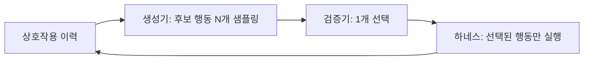

터미널 에이전트는 한 스텝에 명령 하나를 내고, 그 명령은 되돌릴 수 없는 부작용을 남길 수 있다. 같은 모델에게 같은 상황을 여러 번 물으면 서로 다른 명령이 나오는데, 보통은 그중 우연히 걸린 하나가 그대로 실행된다. NVIDIA 연구진이 2026년 9월 30일 공개한 Mid-Harness는 이 지점에 질문을 던진다. 실행 직전에 후보를 여러 개 뽑아 놓고 하나를 골라서 넘기면 에이전트가 더 믿을 만해지는가. 이 글은 논문이 내린 답과 그 조건, 비용 계산, 그리고 읽을 때 주의할 한계를 정리한다. 모든 수치는 저자들의 자체 실험이며, 출처는 논문 하나뿐이다(출처: [arXiv:2609.39982](https://arxiv.org/abs/2609.39982)).

## 두 가지 스케일링 축: 궤적 대 행동

추론 시점 컴퓨트를 늘리는 방법은 터미널 에이전트에서 크게 둘로 나뉜다. 하나는 전체 실행 경로(궤적)를 여러 번 처음부터 돌려 가장 잘 풀린 것을 고르는 방식으로, 논문에서는 Best-of-T로 표기한다. 다른 하나는 매 스텝에서 다음 행동을 여러 후보로 뽑아 검증하는 행동 스케일링이다. 앞의 방식은 환경을 T번 실제로 실행해야 하고 그만큼 부작용과 시간이 든다. 뒤의 방식은 환경을 한 번만 실행하되 스텝마다 검증 비용을 낸다.

Mid-Harness는 후자를 모델과 하네스 "사이"의 독립된 층으로 구현한 것이다. 생성 모델도 하네스도 수정하지 않는다. 같은 상호작용 이력에서 생성기가 N개 후보를 뽑고, 검증기가 하나를 골라, 그 하나만 하네스로 넘어간다.

이 구조의 장점은 기존 에이전트에 덧붙이기 쉽다는 점이다. 단점은 스텝마다 검증기 호출이 끼어들어 지연과 토큰 비용이 늘고, 검증기가 틀리면 좋은 후보를 버릴 수 있다는 점이다. 논문의 실험은 대부분 이 두 힘의 균형을 재는 데 쓰인다.

## 검증기 설계: 무엇이 성능을 갈랐나

논문은 세 가지 검증 방식을 비교한다. 리스트와이즈는 한 번의 호출에서 후보 전체를 보고 하나를 고른다. 포인트와이즈는 후보마다 점수를 매겨 최댓값을 취한다. 페어와이즈는 후보 쌍을 비교해 마진으로 가중한 승률로 순위를 낸다. 후보가 8개면 모든 쌍을 비교하는 데 28번의 호출이 필요하다.

핵심 발견은 하나로 요약된다. 약한 검증기 아래에서는 행동을 더 많이 샘플링해도 이득이 거의 없다. 반대로 강한 검증기는 같은 생성기에서 나온 후보 중 쓸 만한 것을 실제로 골라낸다. 아래 표는 TerminalBench-Lite에서 TMAX-9B(Qwen3.5-9B 기반)를 생성기로 쓴 결과다.

| 설정 | Pass@1 | Pass@3 |
|------|--------|--------|
| 기본 에이전트 | 50.00 | 69.39 |
| 제로샷 리스트와이즈, N=8 | 51.02 | 67.35 |
| 제로샷 페어와이즈, N=8 | 54.76 | 71.43 |
| 증류한 페어와이즈, N=8 | 57.14 | 75.51 |
| GPT-5.6 Sol 리스트와이즈, N=4 | 64.63 | – |
| GPT-5.6 Sol 리스트와이즈, N=8 | 68.03 | – |

두 가지가 눈에 띈다. 생성기가 자기 자신을 검증하는 수준의 제로샷 리스트와이즈는 N을 4에서 8로 늘려도 49.32에서 51.02로 거의 움직이지 않는다. 같은 리스트와이즈라도 검증기를 프런티어 모델로 바꾸면 50.00에서 68.03으로 올라간다. 즉 병목은 후보의 다양성이 아니라 검증 능력이다. 또 논문이 시험한 방식 중에서는 페어와이즈가 가장 좋았다. 다만 비용이 크다. N=8에서 검증기 출력 토큰이 리스트와이즈는 0.6k, 포인트와이즈는 7.0k, 제로샷 페어와이즈는 125.7k로 보고된다. 병렬로 돌리면 지연 증가는 페어와이즈가 약 26.6k 토큰분, 나머지는 최대 1.3k분이다.

## 증류: 강한 검증기를 작은 모델에 옮기기

프런티어 모델을 스텝마다 부르는 것은 현실적이지 않으므로, 저자들은 GPT-5.6 Sol의 페어와이즈 판단을 작은 검증기로 증류했다. 데이터는 244개 TMAX-15k 과제의 732개 궤적에서 모은 페어와이즈 응답 약 11만 7천 건이고, LoRA로 학습하되 검증 때만 활성화한다. 보유한 21개 과제에서 교사 판단과의 일치도는 이렇게 변했다.

| 지표 | 제로샷 | 증류 후 |
|------|--------|---------|
| 점수 MAE | 2.59 | 1.05 |
| 페어와이즈 일치율 | 59.01% | 74.58% |
| 검증 일치율 | 38.52% | 57.79% |

증류 후에도 격차가 남는다는 점은 숫자가 그대로 보여준다. 증류 검증기는 Pass@1 57.14%로 프런티어 검증기의 68.03%에 한참 못 미친다. 일치율은 스텝이 진행될수록 떨어져서, 1–4번째 턴에서 68.13%이던 것이 17–32번째 턴에서는 54.07%다. 긴 과제의 후반부, 즉 맥락이 쌓여 판단이 어려운 구간에서 약해진다는 뜻이다. 교사와 분명히 의견이 갈린 사례의 67.4%는 후보의 의미와 실행 가능성 문제였다고 한다.

## 비용: 궤적을 더 도는 것보다 싼가

실용적으로 중요한 질문은 같은 예산이면 어느 쪽이 나으냐다. 논문의 결과는 다음과 같다. 증류한 Mid-Harness를 N=8로 쓴 Pass@1 57.14%는 Best-of-T에서 T=5일 때와 같고, 참조 가격 기준 토큰 비용은 약 3분의 1이다. 두 방식을 합치면 더 낫다. T=3의 Best-of-T만 쓰면 55.10%인데 증류 Mid-Harness를 얹으면 같은 세 번의 환경 실행으로 66.33%가 되어 11.23%p 오른다. 이 조합은 T=7의 Best-of-T(59.18%)보다도 높으면서 비용은 낮다. 출력을 A/B 판정만으로 줄인 결정 전용 검증을 쓰면 토큰 비용이 20.9%(제로샷)와 24.1%(증류)가량 더 줄어든다. 다만 4B, 27B 모델에서는 결정 전용 방식의 Pass@1이 오히려 낮았다.

여기서 읽을 점은 환경 실행 횟수가 같다는 조건이다. 터미널 환경의 실행은 시간이 들고 부작용이 있어 샌드박스 비용도 따라온다. 그 횟수를 늘리지 않고 이득을 얻는다는 것이 행동 스케일링의 실질적 매력이다.

## 일반화: 모델·벤치마크를 바꿔도 되는가

저자들은 모델 크기와 벤치마크를 바꿔 같은 방향의 결과를 보고한다.

| 대상 | 기본 | 제로샷 | 증류 |
|------|------|--------|------|
| TMAX-4B (TerminalBench-Lite) | 38.78 | 41.50 | 43.88 |
| TMAX-27B (TerminalBench-Lite) | 71.09 | 73.13 | 76.19 |
| TMAX-9B (Terminal-Bench 2.1) | 21.72 | 27.34 | 26.59 |
| TMAX-9B (SWE-bench Verified Mini) | 46.67 | 48.00 | 48.67 |
| TMAX-9B (FeatureBench-Mini) | 1.45 | 5.80 | 7.25 |

제로샷 Mid-Harness는 일곱 개 설정 모두에서 Pass@3를 개선하고 Pass@1은 같거나 좋아졌다고 한다. 그러나 이 표에도 균열이 있다. Terminal-Bench 2.1에서는 증류가 제로샷보다 낫지 않았고, FeatureBench-Mini의 TMAX-9B에서는 증류가 Pass@3를 오히려 낮췄다. 또 FeatureBench-Mini는 23개 과제, SWE-bench Verified Mini는 50개 과제라 표본이 작아서 몇 점의 차이는 과제 한두 개에 좌우될 수 있다.

## 도입을 판단하는 기준

이 논문이 뒷받침하는 판단은 좁고 구체적이다. 첫째, 검증기가 생성기보다 확실히 강하지 않으면 N을 늘리는 것은 비용만 키운다. 자기 검증은 이 논문에서 가장 약한 구성이었다. 둘째, 환경 실행이 비싸고 위험할수록 행동 스케일링이 궤적 스케일링보다 유리하다. 셋째, 증류한 검증기는 프런티어 검증기의 대체재가 아니다. 격차가 남아 있고 긴 과제 후반에서 약해진다. 넷째, 결정 전용 출력으로 비용을 줄이는 것은 작은 모델에서 역효과가 날 수 있으니 규모별로 따로 확인해야 한다.

반대로 이 논문이 말하지 않는 것도 분명하다. 정답 행동 라벨이 없어서 검증의 정확도와 후보 풀이 정답을 포함하는 비율을 직접 측정하지 못했다. 오프라인 진단은 교사와의 일치도이지 행동의 옳고 그름이 아니다. 무엇보다 저자들은 이 연구가 생성된 명령의 안전성을 보장하지 않는다고 명시하고 다른 안전장치를 유지하라고 권한다. 검증기가 "더 나은 행동"을 고르는 것과 "안전한 행동"을 고르는 것은 다른 문제다. 에이전트가 파괴적 명령을 어떻게 막는지는 [DCG: 파괴적 명령 차단기](/post/2026-08-17-dcg-destructive-command-guard/)에서 다뤘으니 함께 보면 좋다. 일관성이라는 다른 각도의 신뢰성 문제는 [IBM의 pass^k 일관성 격차](/post/2026-09-23-ibm-agent-pass-k-consistency-gap/) 글에 정리해 두었다.

## 정리

Mid-Harness가 보여준 것은 "더 많이 뽑으면 낫다"가 아니라 "더 잘 고를 수 있어야 낫다"이다. 같은 9B 생성기에서 검증기만 바꿨을 뿐 Pass@1이 51.02%에서 68.03%까지 벌어졌다. 에이전트 성능을 올릴 때 생성기를 키우는 데만 쓰던 예산의 일부를 검증기에 돌려야 하는지 물어볼 근거가 생긴 셈이다. 다만 단일 논문, 자체 실험, 작은 벤치마크 표본이라는 조건 안에서의 결과이므로, 자신의 하네스에 적용할 때는 같은 방식으로 제로샷과 증류, 그리고 비용을 직접 재 보는 것이 순서다.

## 참고 자료

- Minki Kang 외, "Mid-Harness: Scaling Actions Between Model and Harness for Terminal Agents", arXiv:2609.39982, 2026-09-30: <https://arxiv.org/abs/2609.39982>
- 논문 HTML 본문 (표·절별 수치 확인): <https://arxiv.org/html/2609.39982>
