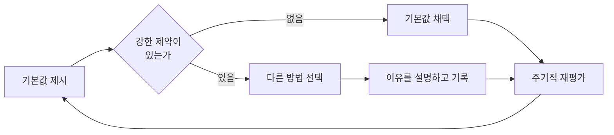

"그건 best practice가 아니잖아요"라는 말은 코드 리뷰에서 대화를 끝내는 카드로 쓰인다. 규칙에 이름이 붙는 순간 "왜 이 상황에도 적용되는가"라는 질문이 사라지기 때문이다. Martin Fowler는 2026년 9월 29일 자신의 Bliki에 올린 짧은 글에서 이 문제를 용어 선택으로 풀어낸다. 같은 종류의 규칙을 "best practice"가 아니라 <strong>sensible default(합리적 기본값)</strong>라고 부르자는 것이다(출처: [Martin Fowler, "Sensible Default"](https://martinfowler.com/bliki/SensibleDefault.html)). 이 글은 그 용어의 정의와 기원, Thoughtworks가 실제로 굴리는 방식, 그리고 팀에 도입할 때 부딪히는 문제를 정리한다.

---

## 정의: 맥락이 덮어쓰지 않는 한 쓰는 관행

Fowler의 정의에서 핵심은 조건절이다. sensible default는 어떤 종류의 작업을 할 때, 맥락이 이를 덮어쓰지 않는 한 사용해야 하는 관행이다. 예시로는 버전 관리 사용, UI 로직과 도메인 로직의 분리, 배포 파이프라인 자동화가 나온다. 모두 대부분의 프로젝트에서 옳지만 "항상 옳다"고 주장하기는 어려운 항목이다. 예를 들어 하루짜리 일회용 스크립트에 배포 파이프라인을 세우는 것은 기본값을 맹목적으로 따르는 쪽에 가깝다.

Fowler가 이 단어를 고른 이유는 "best practice"와의 의도적 대비다. 글에 따르면 best practice는 "언제나 이렇게 해야 한다"는 뉘앙스를 풍기지만, sensible default는 새로운 맥락마다 다시 평가해야 하고 상황이 바뀌면 기각될 수 있다. 같은 관행이라도 어떤 이름으로 부르느냐에 따라 적용자에게 요구되는 태도가 달라진다. 이름이 "최선"이면 적용자는 따르기만 하면 되고, 이름이 "기본값"이면 적용자는 이 기본값이 지금 상황에 맞는지 판단해야 한다.

| 구분 | best practice | sensible default |
|---|---|---|
| 암묵적 주장 | 맥락과 무관하게 최선 | 제약이 없다면 좋은 출발점 |
| 예외 | 예외는 규칙 위반으로 취급 | 예외가 규칙의 일부로 설계됨 |
| 적용자의 역할 | 준수 | 적합성 판단 후 채택 또는 기각 |
| 재평가 | 보통 없음 | 주기적 재평가가 전제 |
| 일탈의 비용 | 변명 | 이유를 설명할 책임 |

## 기원: Bottcher가 Thoughtworks에서 굳힌 용어

Fowler에 따르면 이 용어는 Thoughtworks 안에서 Evan Bottcher가 퍼뜨렸고, 그는 James Ross와의 대화에서 이름을 얻었다. Bottcher의 설명은 글에 인용되어 있다.

> "A sensible default is what we'd expect you to do, the practices to apply, if there are no hard constraints in the environment. Do these practices, or do better, and be prepared to explain why you've chosen some other way."

번역하면, 환경에 강한 제약이 없다면 우리가 기대하는 관행이며, 이를 따르거나 더 나은 방법을 쓰되 다른 길을 택했다면 그 이유를 설명할 준비를 하라는 뜻이다. 이 정의에는 세 가지가 들어 있다. 하나는 "강한 제약이 없다면"이라는 조건이고, 다른 하나는 "더 나은 방법"을 허용하는 개방성이다. 마지막은 일탈에 금지가 아니라 설명 책임을 붙인다는 점이다. 금지도 방임도 아닌 그 중간이 이 개념의 정체다.

Thoughtworks의 팟캐스트 에피소드는 기원을 조금 더 보탠다. 진행자 Rebecca Parsons는 당시 호주 엔지니어링 책임자였던 Bottcher가 팀의 작업 방식을 문서화하기 시작했고, 주로 소프트웨어 딜리버리 관행이었으며, 이것이 여러 나라의 기술 책임자들을 통해 전사로 퍼졌다고 설명한다. 이후 공식 글로벌 실천 커뮤니티(Community of Practice)가 생기면서 제품, 인프라, 디자인, 프로그램 관리 영역으로 확장됐다(출처: [Thoughtworks Technology Podcast, "Sensible defaults", 2024-07-25](https://www.thoughtworks.com/insights/podcasts/technology-podcasts/sensible-defaults-way-think-technology-practices)).

## Thoughtworks는 어떻게 운영하나

Fowler는 Thoughtworks가 이 개념을 적극 활용하며 자사 기본값의 [플레이북](https://www.thoughtworks.com/insights/topic/sensible-defaults)을 공개했다고 적는다. 새 일을 시작할 때 이 기본값을 쓰는 것이 기대되지만, 팀은 그 한계를 이해하고 필요하면 조정해야 한다. 그리고 이 기본값들을 정기적으로 재평가하는 것이 [Thoughtworks Technology Radar](https://www.thoughtworks.com/radar)의 핵심이라고 Fowler는 말한다.

운영 방식의 구체는 Thoughtworks 블로그에 더 자세하다. Yewande Ige가 2024년 9월에 쓴 글에 따르면 기본값은 위에서 내려온 지침이 아니라 글로벌 실천 커뮤니티가 식별하고 큐레이션하며 실무자들의 집단 경험을 반영한다. 선정 기준은 핵심 가치와의 정합성, 실제 효과, 역할 간 협업 기여, 뛰어난 결과로 제시된다. 또한 기본값은 서로 연결되어 있어 한꺼번에 도입할 것이 아니라 하나의 문화로 보아야 한다고 한다. 글의 예로는 제품 팀의 지속적 고객 조사가 디자인 팀의 정기 사용자 테스트로, 다시 QA의 가치 기반 테스트로 이어지는 연쇄가 나온다. 또 고객의 기존 프레임워크나 프로젝트 사정이 다른 것을 요구하면 기본값을 쓰지 않아도 된다고 명시한다(출처: [Thoughtworks, "Better tech decision-making underpinned by sensible defaults"](https://www.thoughtworks.com/insights/blog/technology-strategy/better-tech-decision-making-underpinned-by-sensible-defaults)).

팟캐스트에서 거론된 기본값 예시는 페어 프로그래밍, TDD, 지속적 통합, 코드의 소스 관리 사용, 형식에 그치지 않고 실제로 관리되는 리스크 레지스터 등이다. 흥미로운 대목은 지속적 통합을 "트렁크 기반 개발"이 아니라 "자주, 지속적으로 통합하라"로 서술해 용어가 희석되는 것을 막는다는 설명이다. 같은 에피소드에서 Kief Morris는 best practice가 종종 예외 없는 유일한 정답처럼 제시되는 반면 sensible default는 "왜"를 이해하는 것이 전제라고 대비한다.

## 소프트웨어 팀에 적용하기: Bennett의 접근

Fowler는 같은 주제를 다룬 Steve Bennett의 글을 링크하며, 이것이 James Ross에게 영감을 준 것인지 병행해서 나온 것인지는 모른다고 적는다. Bennett의 [The Power of Sensible Defaults](https://stevebennett.co/posts/the-power-of-sensible-defaults)는 2017년 7월에 쓰였고, 기술 선택에 초점을 맞춘다. 그의 진단은 "각 일에 최적의 도구를 고른다"는 태도가 팀을 서로 다른 언어, 프레임워크, 배포 도구로 파편화시켜 유지보수 부담과 온콜 부담을 키우고, 코드 재사용과 팀 간 인력 이동을 막는다는 것이다.

처방은 팀이 합의한 도구와 관행을 새 프로젝트의 첫 선택지로 삼되, 대안을 고르려면 기본값의 장점에 맞서 정당화하게 하는 것이다. 기본값과 일탈은 Architecture Decision Record(ADR)에 남겨 이유를 추적하고 맥락이 바뀌면 다시 보게 한다. 일탈하는 쪽은 전체 팀을 교육할 계획까지 고려해야 하며, 일탈이 잦다면 기본값 자체를 교체할 신호로 본다. 실험은 혁신 시간이나 비핵심 프로젝트에서 하게 해서 논쟁이 유행이 아닌 경험에 기반하도록 한다. 예시 스택으로는 프런트엔드 React, 웹 서비스 Flask와 Python, 데이터베이스 PostgreSQL을 든다.

Bennett가 제안한 "일탈 빈도"는 쓸모 있는 계기판이다. 기본값이 건강한지 알려면 얼마나 자주 지켜지는가보다 얼마나 자주, 어떤 이유로 어겨지는가를 보면 된다.

## 왜 이 구분이 실무에서 중요한가

세 가지 효과가 있다고 본다. 이 부분은 위 출처들의 내용을 바탕으로 한 필자의 해석이다.

첫째, 의사결정 비용이 줄어든다. 기본값이 있으면 매번 처음부터 논쟁하지 않고, 논쟁이 필요한 곳만 골라 쓸 수 있다. 둘째, 대화의 단위가 바뀐다. "규칙을 어겼다"가 아니라 "기본값과 다른 선택을 했는데 근거가 무엇인가"로 질문이 옮겨 가서 일탈이 숨는 대신 기록된다. 셋째, 규칙이 낡는 속도가 느려진다. 처음부터 재평가를 전제하므로, 도구 생태계가 바뀌었을 때 규칙을 폐기할 명분이 제도 안에 들어 있다.

이는 SOLID 같은 원칙을 맥락 없이 기계적으로 적용하면 과잉 설계가 된다는 오래된 경고와 결이 같다. 원칙이든 관행이든 조건부 도구로 다뤄야 한다는 입장이다. 다만 Fowler의 글은 짧은 정의 글이어서 구체 사례나 반례 분석까지 들어가지는 않는다.

## 도입할 때 흔한 함정

용어를 바꾼다고 문화가 저절로 바뀌지는 않는다. 아래는 위 자료에서 읽어 낼 수 있는 위험을 필자가 정리한 것이다.

| 함정 | 증상 | 완화 방법 |
|---|---|---|
| 이름만 바꾼 best practice | "기본값이니까 따라야지"라는 말이 같은 방식으로 대화를 끝냄 | 일탈 시 필요한 것은 허락이 아니라 설명임을 명시 |
| 근거 없는 목록 | 왜 기본값인지 모르는 채 체크리스트로 소비됨 | 항목마다 "왜"와 "언제 덮어쓰는가"를 함께 기록 |
| 재평가 부재 | 기본값이 몇 년째 그대로 | 정기 검토 주기를 두고 일탈 사례를 입력으로 사용 |
| 한꺼번에 도입 | 기본값 30개를 첫날 요구 | 항목 간 연결을 보고 팀 성숙도에 맞게 단계적으로 |
| 일탈의 낙인 | 사람들이 이유를 말하는 대신 몰래 어김 | 일탈 기록을 비난이 아닌 학습 자료로 취급 |

Thoughtworks 블로그도 이를 도입하려면 기술적 성숙도와 초기 노력, 변화 관리가 필요하다고 인정한다. 효율성이나 출시 속도가 좋아진다는 주장은 그 글의 자체 서술이므로 정량 근거가 제시된 것은 아니라는 점은 감안해서 읽어야 한다.

## 마무리: 팀에 가져갈 질문

- 우리 팀 규칙 중 "best practice"로 불리지만 사실은 기본값인 것은 무엇인가?
- 그 규칙에서 벗어난 최근 사례는 어디에 기록되어 있는가?
- 마지막으로 기본값을 재평가한 때는 언제인가?

Fowler의 글이 던지는 실질적 제안은 한 문장으로 줄일 수 있다. 규칙을 만들 때 예외를 처리하는 방법까지 규칙의 일부로 설계하라는 것이다. 이름을 "기본값"으로 붙이는 것은 그 설계를 선언하는 가장 값싼 방법이다.

## 참고 및 출처

- [Martin Fowler, "Sensible Default" (Bliki, 2026-09-29)](https://martinfowler.com/bliki/SensibleDefault.html)
- [Thoughtworks, Sensible defaults 플레이북 토픽](https://www.thoughtworks.com/insights/topic/sensible-defaults)
- [Thoughtworks, "Better tech decision-making underpinned by sensible defaults" (Yewande Ige, 2024-09-05)](https://www.thoughtworks.com/insights/blog/technology-strategy/better-tech-decision-making-underpinned-by-sensible-defaults)
- [Thoughtworks Technology Podcast, "Sensible defaults" (2024-07-25)](https://www.thoughtworks.com/insights/podcasts/technology-podcasts/sensible-defaults-way-think-technology-practices)
- [Steve Bennett, "The Power of Sensible Defaults" (2017-07-24)](https://stevebennett.co/posts/the-power-of-sensible-defaults)
- [Thoughtworks Technology Radar](https://www.thoughtworks.com/radar)
